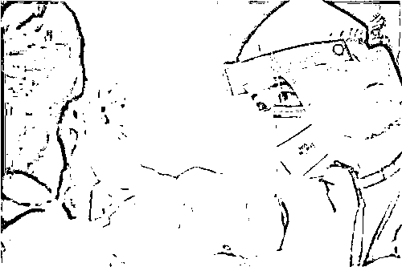

# 无利不起早，广东『赋码代表』翻车了

> 原文：[`mp.weixin.qq.com/s?__biz=MzIyMDYwMTk0Mw==&mid=2247541651&idx=3&sn=59325c3b4e7b04a208b9bdfdf1c7d61d&chksm=97cbe8aba0bc61bdd9801f91ae726ae1ff3343be7d3b8f6ccb36ee27363a80c05deda8e0dae4&scene=27#wechat_redirect`](http://mp.weixin.qq.com/s?__biz=MzIyMDYwMTk0Mw==&mid=2247541651&idx=3&sn=59325c3b4e7b04a208b9bdfdf1c7d61d&chksm=97cbe8aba0bc61bdd9801f91ae726ae1ff3343be7d3b8f6ccb36ee27363a80c05deda8e0dae4&scene=27#wechat_redirect)

近日，广东卫健委一份答复代表建议的函，引发广泛关注。

这位名为刘世兴的代表提出一个奇葩建议，“对未履行疫 情防控个人责任，如核酸应检未检人员、疫 苗未全程接种人员，健康码赋予蓝码管理”。

你说蓝码就蓝码，你是广东新晋“赋码爷”吗，非要把“不听话”的人民管起来（对他们而言，未检测核酸、未接种疫 苗，简直大逆不道）？

好在广东卫健委没有听从你的胡言乱语，对上述人员没有一码赋之，为广东卫健委点个大大的赞。

广东卫健委在回复时称，该委暂不将上述人员纳入蓝码管理，一是目前国家暂无相关政策支持，二是并非全部人群都符合接种条件，三是全国数据并未联网，四是囿于接种政策和不同厂家接种程序变化易造成赋码错误。

其实第一条就足够了，对上述人员赋予蓝码于法无依，属于乱作为行为，侵犯了公民的个人权利，必然引起广东群众的口诛笔伐，你提这样的建议，是给广东人民添堵，给广东卫健委找不自在的吧？

此事一出，大家纷纷在问：这位“戴表”同志是怎么选上的，他到底代表了谁的利益？

有好事者很快就起底，刘世兴为广州市海珠区龙凤街社区卫生服务中心（广州市海珠区龙凤街道疾病预防控制中心）的法定代表人。

据爱企查，该中心注册资本 2,196.75 万元，直接为龙凤街道 19 个社区提供医疗、预防、康复、保健综合服务的基层医院，是一家事业单位性质的医疗机构。

大家别被其事业单位的名头骗了，这种事业单位基本属于自收自支性质，首先它要赚钱，其次才想着为你服务。

广州作为沿海经济发达城市，人口流动频繁，当下如此密集的核酸检测频率，能为这些基层卫生服务中心带来一笔可观的收入，刘大“戴表”提出这项建议的目的，不言自明。

有喜欢杠的撸友就说了，就算“赋码代表”的计策得逞，多收入的钱也进了国库，又进不了刘大“戴表”的口袋，暗黑君你竟然质疑他为人民服务的动机，居心何在？

不妨算上一笔账：按每周 50 万人次的检测量估计，再加上一些 48 小时检测的，一年检测总量大概要超过 3000 万人次，马马虎虎就是数个小目标的收入。

这么大一块收入，随便送给哪家检测公司，人家还不切下一块蛋糕让刘大“戴表”笑纳？就算刘大“戴表”见币不乱，年终的绩效奖，总还是要增厚好大一沓吧？

刘大“戴表”此举，既让辖区疫 苗接种率、核酸检测率非常好看，又能让自己荷包鼓起来，这么赢了又赢直到赢麻了的好事，何乐而不为？说不定，还能提拔到上级医院，弄个副院长当当。

国人苦核酸久矣。

暗黑君所在的小城，要求每周一捅，部分人群每周两捅。暗黑君被捅得不胜其烦，周五“二捅”就偷了个懒，谁成想第二天就被通知到单位，今天只好去补上一捅（被捅的时候，在心里一遍又一遍亲切问候了某些人的十八代祖宗）。

我们这也没有疫 情，至今却已是第 21 轮全员检测了，部分人群已超过 50 次，这种毫无目标的挥霍“子弹”，难道捅了个寂寞？

我国的核酸检测政策，一直是应检尽检、愿检尽检，从未说过要全员必检，那些动辄就拘留“恶意”未检测者的，纯属违法。

7 月 21 日，在国务院联防联控机制新闻发布会上，据中疾控介绍，疫 情发布以后，如果经流行病学调查，综合风险研判，只要感染来源明确、传播链清晰、未发生社区传播，则无需开展全员核酸检测。

当下，刘大“戴表”提出这种建议，上违反国务院的防 疫政策，下违背人民群众的意愿，有关部门是不是应该好好查查，他是否代表了某些厂家的利益？

来源：疾风忍法帖，宾曰语云   作者：风中劲草 one2

](http://mp.weixin.qq.com/s?__biz=Mzg5ODAwNzA5Ng==&mid=2247488098&idx=3&sn=638c5dd62ca652e1a1f2fd5b8420b00f&chksm=c0687b35f71ff223bca5031da035e3ab56f77f3ecfe42e587322e6e0f1302dc4d3e3fb354f18&scene=21#wechat_redirect)

← 向右滑动与灰产圈互动交流 →

