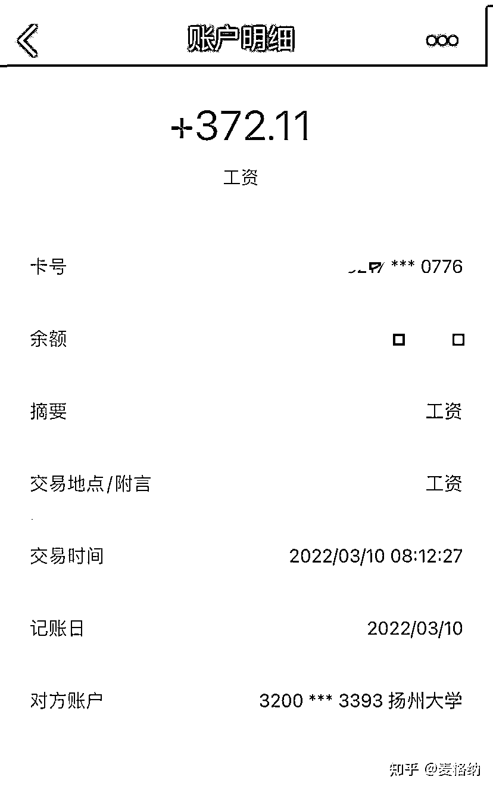
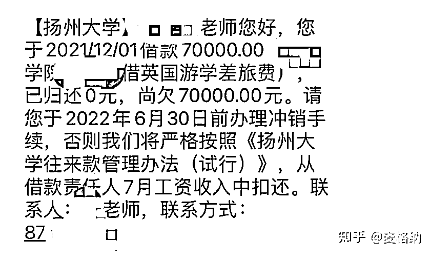

# 清华博士自曝：入职江苏一省部共建大学 5 年，月薪仅 372 元

> 原文：[`mp.weixin.qq.com/s?__biz=MzIyMDYwMTk0Mw==&mid=2247541651&idx=4&sn=cd79a325cd3082a673d724015dacb3ca&chksm=97cbe8aba0bc61bd987547b39fbdb4bcd5b88fa6a7d248bc4351279e3bb2b00b19a9b24f053c&scene=27#wechat_redirect`](http://mp.weixin.qq.com/s?__biz=MzIyMDYwMTk0Mw==&mid=2247541651&idx=4&sn=cd79a325cd3082a673d724015dacb3ca&chksm=97cbe8aba0bc61bd987547b39fbdb4bcd5b88fa6a7d248bc4351279e3bb2b00b19a9b24f053c&scene=27#wechat_redirect)

7 月 22 日，有用户@麦格纳在知乎发文**《高校教师工作 5 年月薪高达 370》**称：自己从**清华大学博士**毕业后，通过校招进入**扬州大学**工作，**入职 5 年后，月薪仅 372 元**。

据其自述，扬州大学不仅招聘许诺的**薪资缩水**，**一起同批入职的博士，前三年不要说办公室，连张办公桌都没有。**

这位青椒申请到政府奖学金到哈佛大学访学深造，**却被校方以“一个并不存在的公章”卡了 2 年不通过**。好不容易去到哈佛访学，校方又是缴押金，还**直接将申请到的江苏省 7 万留学奖学金变成了“借英国留学差旅费”从工资中直接扣**（短信中还把哈佛写成英国的了）。好不容易争取到可以继续在哈佛访学后，又在领导那碰了一鼻子灰……

入职 5 年，这位青椒先后拿到了国家级（社科基金）、省级课题，发表论文 7 篇，核心 3 篇，还出了 4 部书，100 万字以上，**评职称“毫不意外的落选”**，

后有朋友提醒，这位青椒**“才明白领导的深意**。也许，**我抢了有些人的“风头”，让领导觉得“不好驾驭”。**”

7 月 30 日，文章发出一周后，这位青椒再次发文《**关于《高校教师工作 5 年月薪高达 370》的补充说明**》，称扬州大学“一方面，让我尊重的前辈、朋友不断劝我，给我施压；另一方面，我婉拒之后，**网上突然就多了很多人肉、攻击的评论，就差刨我祖坟了**”。

作者表示“发帖的时候，我就想到后果，比如各种威胁。可是，**如果我连死都不怕，你们还有什么可威胁我的？为家人，为以后的孩子！我不要孩子，还不行吗？一个都不生，还不行吗？你们开心就好，继续威胁我或者给我施压吧。**”

**“沉默啊，沉默”，我何尝不曾沉默过？如今，该说的，不该说的，我都说了。**

**全文如下：** 

**高校教师工作 5 年月薪高达 370**

**我 2017 年从清华大学博士毕业，被扬州大学引进，至今工作 5 年。**

清晰记得 2016 年底，扬州大学和江苏省众多高校到清华大学体育馆招聘老师的场面。我特意问询扬州大学的待遇，得到积极回复，比如扬州的房价很低，每平米只有 8000 元，比如学校还给所有引进人才提供三年的免费住房，或者优厚的租房补贴。那个时候，毕竟还是学生，缺乏经验，以为这应该是不错的选择，离家也不远。

2017 年 7 月入职，月薪到手 5800 元。第四个月发现还少了几百元，说是扣的房租。入职前说的三年免费入住，入职后三年缩水成三个月。第二年，我搬了出来。学校还挺守信的，发放租房补贴，每个月 600 元。是的，每月 600 元。600 元能租到什么房子吗？总理都说了，1000 元可能三四线城市租个房都不够月租的。但是，学校领导说能，那就能吧。过了两年，我开始打算买新房，8000 元一平的房子只存在想象之中，其实早在 2016 年都远不止这个价格。然而，学校招人的时候，不管怎么着，先把人招进来再说。

我并非特别上进的人，很多时候，能不“惹事”，就不给院校领导“惹事”。直到最近，我觉得有必要说点什么。因为，我如果不说，估计以后还会有人重蹈覆辙。我写这篇文章，绝非与谁为难，无论是扬大，还是其他院校，希望我们国家的高等教育越办越好。想要越办越好，就要及时发现问题，解决问题，这是我写这篇文章的最大初衷。

**2019 年，我申请到江苏政府留学奖学金，半年 7 万元，到哈佛大学访学深造**。这本来是好事。**后来证明，错就错在我真不该申请出国访学，尤其是哈佛大学这种名校，让扬大的很多领导为难了。他们为什么会为难呢？**

**不知道出于什么原因，2020 年、2021 年，**学校就是拦着，不让我们老师出国**。从哈佛大学到江苏省人民政府，所有程序都走完了，学校却不放人。如果是疫情因素，情有可原。可整整两年时间，扬州并非中高风险区，而且省政府奖学金已经延期一年，只能延期一年。当时，我们还打听到，**很多本校的学生已经派出留学**。我们询问原因，学校却说：“海外疫情严重，我们是为了保护老师！”我们琢磨，难道学生就不用保护？难道其他高校的老师不用保护？我们是人文专业，并非敏感专业。然而，就是各种推诿，让我们去盖章——**学校防疫领导小组的章。事实上，这个公章并不存在，**因为防疫领导小组只是临时组织起来。就这样，我们被一个并不存在的公章卡了脖子，这一卡就是近两年。**

**在 2021 年 12 月 30 日，**奖学金项目失效的前一天**，在签订各种保证书、承诺书之后，我们终于访学。到了哈佛之后，听课、做科研，本以为可以安静下来，借鉴海外汉学家的方式充实我们的研究。现在想来，我还是严重低估了扬大的掌控能力。**

****出国前，扬大虽然声称支持青年教师出国，但是不仅没有一分钱的资助，反而强制我们交钱，每人交了 2 万元，说是出国保证金！这还没完，在 2022 年 3 月，我查了扬大的工资，发现只有 372.11 元！****

****

**我国内每个月还有 8000 多的房贷要还，在美国波士顿这边，一个普通单间的月租都要 1 万元人民币。学校突然就把工资扣到这个地步！辗转问了学校，领导答复，出国的老师都这样，都会扣工资，等你回国再补给你！真的“感激”学校对我们出国访学老师的“高度关怀”！从那个时候，我就开始怀疑，我申请出国访学，错了么？不该到美国访学，更不该费尽千辛万苦来到哈佛大学！**

**说起哈佛大学，肯定有不少值得我们学习的地方，无论是教学上，还是科研上。经过努力，**哈佛这边的团队也提出欢迎扬州大学的师生继续访问、访学。**我把这个消息汇报给学院领导，**结果碰了一鼻子灰**。领导高瞻远瞩，要考虑“国家安全”问题。我当时就很无语，像我们研究中国古代史的，如何会危害国家安全？难道让外国人阅读《史记》《汉书》《明史》就威胁我们的国家安全？后来，**有朋友提醒，我才明白领导的深意。也许，我抢了有些人的“风头”，让领导觉得“不好驾驭”。**本来出于一腔热血，想为学校的发展贡献力量，为扬大师生铺路，结果反而得罪了领导。这事儿整的，真没劲！**

**6 月初，我接到扬大财务处的“关怀”短信，让我**在 6 月 30 日前，必须归还扬大的 7 万元欠款，否则严格按照规定，从我下个月的工资继续扣，直到扣满 7 万为止**。**我明明拿的是 2019 年江苏政府留学奖学金，结果经过扬大的操作，反而成了欠扬大 7 万。****

**继续扣吧，你们开心就好。出国前，就向我要钱；出国后，继续扣钱，扣到月薪高达 370；回国前，还要继续催债！高明啊，实在是高明！**

**我就纳闷，扬大好歹也是省部共建的学校，就这么缺钱吗？不然根本解释不通。如果一个高校，连教师都不尊重、不在乎，还会在乎学生吗？**

**看到扬大官网引用《中国教育报》2022 年 5 月 14 日第 01 版发布的《一所地方高校的重组蝶变》，我赫然发现：“2019 年，江苏省教育厅与扬州市政府达成合作协议，设立 20 亿元专项基金助力扬州大学发展。”20 亿不是小数目，扬大的收入又远非这一个项目，怎么到了教师手中，扣来扣去，月薪就剩 370 了呢？所以，钱呢？都到哪里去了？**

****我们这批博士 2017 年入职，前三年不要说办公室，连张办公桌都没有。**直到这两年才有的办公桌，讲师 12 人共用一间办公室。大学老师虽然学校去的少，总要收作业、批作业吧，就是给学生答疑，总要有个地方。可是三年来，连张办公桌都没有。所以，钱呢？都到哪里去了？**

****前段时间要评职称，毫不意外，我落选了。尽管我入职扬大 5 年来，先后拿到了国家级（社科基金）、省级课题，发表论文 7 篇，核心 3 篇，还出了 4 部书，100 万字以上，多少也做了一些贡献。**结果就是落选，**因为有领导不开心嘛**。他们会提出，根据综合评价，我不够资格，比如没有按照要求参加学校组织的教学比赛且获得二等奖以上等等。教学本来是老师和学生之间的事情，讲的好与坏，反而是领导说了算，而且还成为教师晋升的必要条件。**

**这还不止呢，学校要求讲师评副教授，必须指导本科生毕业论文获评学校优秀论文，而学院领导却规定，不是副教授及以上级别老师指导的学生，就没有资格参评校级优秀论文。所以，这些年来，经常有院领导指导的本科生获评校级优秀论文就不足为奇。可惜了，我今年指导的学生，那么认真，本科生论文都写了三万字，只能降等。谁叫学生的指导老师“出身”不好呢？不服不行。**

**类似的问题本来不想吐槽，自己都觉得无趣。怪只怪自己毕业那会儿如此轻信，仓促签了合同。奉劝还没有找到工作的同学们，长点心吧。相信我的经历应该会回应很多师生的疑惑：比如，为什么高校教师无法专心搞科研，因为你的成果算不算，只有领导部门说了算；比如为什么很多老师没法专心搞好教学，因为教学质量不是老师、学生直观感受的，而是领导决定的。领导说你讲得好，你就是好；领导说你不行，你就不行，尽管领导都不在你的专业。**

**书到用时方恨少，事非经过不知难。**我现在终于明白，为什么有的海外留学生不愿意回国发展。这不仅是待遇高低的问题，也不是说他们就真的不爱国**（像我，还有来哈佛留学、访学的很多身边朋友肯定是坚决愿意回国的），**而是心灰意冷，感受不到学校对人才最基本的尊重。**你就是差一条狗出去办差，都不至于先从它身上拔毛吧。**

**我并非什么悲观主义者，希望总是要有的。正如在 2022 年 6 月的毕业典礼上，扬大校长发表的讲话，“希望大家一起努力”，“续写新的扬大传奇”，“立大志、明大德、成大才、担大任，传校誉于后世，建大业于寰中”。**

## **关于《高校教师工作 5 年月薪高达 370》的补充说明**

****

**我很少使用知乎，也几乎不发帖子。7 月 22 日写了一篇《高校教师工作 5 年月薪高达 370》，很快引发关注，三日内阅读量就破 10 万，现在还在持续传播，这完全出乎我的意料。**

**帖子出来后，我一向敬重的前辈、朋友出于奉命或者自愿的性质，纷纷劝我删帖。这些天来，我思考很多，也非常感谢这些前辈、朋友的垂注。**很多事情如能在校内解决，也不至于发展到这个地步。****

**我 7 月 13 日通过校内渠道，给扬大人事处写信，抄送校长办公室、扬大纪委，可是一直等到 22 日，以上部门没有一个字的回复。有人说，我没和学校沟通。殊不知，入职以来，从学院到人事处、人文社科处、国际合作与交流处、财务处、保卫处、纪委、校长办公室，学校哪个部门我没沟通过？真有用的话，我何必在网上发帖，累积到现在集中爆发？**

**7 月份，扬大评副高职称，全校 100 多人入选。我个人认为，无论是刷学历，还是刷教学、论文、课题以及著作、社会服务等，我基本达到条件。学校要求学历，我本硕博三个学历很差吗，原 985 高校还不够么；学校要求教学评价，网上有一些我执教《古代汉语》的新闻报导和评价，不用我去多说（此事我后来才知情，当时我都不用微博）；学校要求课题，我拿到校级、省级、国家级课题；学校要求论文，我发表 7 篇，核心 3 篇；学校要求著作，我来扬大 5 年，出版著作 4 部（其中 2 部古籍整理是我入职前多年积累的成果，入职后才出版），近 100 万字，最近一部新书的评价似乎也没那么差；学校要求出国经历，我申请 2019 年江苏政府留学奖学金的项目，到世界顶尖名校哈佛大学访学深造……所以，还要我怎样？**

****我所要求的的不过是公道而已。**我非常好奇到底哪些人参与评审，他们的资格何在？这些评审组的成员都是什么学历背景、专业背景、政务背景、学术背景、留学背景等。既然学校说自己“公开、公平、公正”，符合文件、程序、规定，是时候履行自己的承诺了。我当然可以接受落选，但是必须有一个公正的答复。如果我以上列举的条件，学校评职称的时候都选择漠视，或者别有条件，比如讨得领导的欢心、不准提意见等。抱歉，这一点我还真做不到，我不至于靠领导批条去评教授/副教授。**

****职称评审虽然重要，倒还不是最重要的，充其量是导火索，并非我拿出足够勇气发帖的关键因素。**因为早一年评，晚一年评，对我影响也不大。主要是你退一步，他进一步，你不断退，他不断进，直到一步步把你逼到退无可退。和很多人一样，我能不“惹事”，就不“惹事”，疫情之下，大家生活都不容易，谁想做一个“惹事者”？我之所以隐忍到现在才爆发，也和 6 月以来的身体状况有关。6 月初，我感染新冠。此时的新冠负面影响已经没那么严重，重症率极低。身边也有朋友感染，有的三五天就可转阴。算我倒霉，我的情况相对重一些。当时昏睡两天，持续半个多月才转阴。**

****

**就在我感染新冠的时候，学校的“关怀”短信来的真及时！点名道姓让我还钱！还钱的理由让人直接无语，**“借英国游学差旅费”！哈佛大学到底是英国的，还是美国的？**我认为，就是中小学生也不至于搞混吧。可是，堂堂一所高校就用这种“莫须有”的名义来催债！我**明明是 2019 年江苏政府留学奖学金的项目，怎么就欠扬大 7 万元？**如果是江苏省教育厅、省政府没按约定拨款，你去找他们要啊（公示、批件等一应资料俱全）；如果拨款了，干嘛还要我还钱？无论是系统原因，还是个人原因，抑或扬大发展确实缺钱，这肯定是不该发生的事情。何况我当时还在病中，就很无力！**人为刀俎，我为鱼肉。****

****我当时很害怕，因为那段时间很难受，很焦虑，一直不转阴，自我隔离，还感染了一位非常要好的朋友，耽误他的工作进度，这让我内心非常自责。前两天基本都在昏迷状态，大夏天穿厚袜子、两层睡衣、盖两层被子，非常寒冷，呼吸困难，后脑有种炸裂的感觉，也吃不进东西。我想过死亡没有？当然有。之前看到新闻，有国内青年学者来美国访学，结果感染新冠，不幸去世，年仅 32 岁！物伤其类，我当时看到新闻就很难受。普天之下，都是父母所生，那位老师的父母在国内接到消息之后该有多么痛苦。我妈妈也劝我，不要到美国。可是，项目期限延无可延。到哈佛访学的机会确实难得，之前申请耗费大量的时间和精力，又不能说放弃就放弃。就像现在一样，虽然大家都很艰难，我们要发展，总不能断绝和国外的一切往来吧。****

******在美国感染新冠的第三天，我趁着意识相对清醒一些，就开始交代事情。我也不想死，但是，我不知道会发生什么后果，所以我必须做好最坏的准备，在一切都还来得及之前。**我也是第一次带班主任，那个时候，我自己带了四年的毕业班同学正在毕业聚餐，班长让我和大家微信视频。四年之中，有心血，也有感情。可我不能让学生看到我憔悴的样子，只能找个借口推托。发完信息，一时哽咽，继而又不争气地昏睡过去。****

****我现在写这些，倒不是博取同情，因为我现在早就康复，也不需要同情。回想那段时光，确实心有余悸！**学校的很多问题本来不是大问题，当时都该解决，就一直拖着、积累着。病中，我也不指望学校关心。只是蓦然看到这种极不合理的催债信息，谁能想到我当时心里有多崩溃！我不指望你雪中送炭，你何苦让我雪上加霜？到底和我有多大的仇恨？要钱、扣钱，催我还 7 万块钱！******

******发帖一周以来，学校究竟做了什么？**一阴一阳之谓道。一方面，让我尊重的前辈、朋友不断劝我，给我施压；另一方面，我婉拒之后，网上突然就多了很多人肉、攻击的评论，就差刨我祖坟了。我相信，无论何种评论，大家和我的立场高度一致：我们都希望祖国的教育越办越好，而不是越办越差，不是吗？想要越办越好，就需要有不同声音，不是吗？我虽然人微言轻，好歹还是一名老师：**作为一名老师，如果我自己遭遇不公，不敢声张，遇到压力，就趴下了，甚至跪下了，试问，我能教出站着的学生吗？我还有什么脸面站在三尺讲台之上？如果是父母，你们愿意把孩子交给这样的老师吗？如果是学生，你们还愿意尊重这样的老师吗？******

****发帖的时候，我就想到后果，比如各种威胁。可是，**如果我连死都不怕，你们还有什么可威胁我的？为家人，为以后的孩子！我不要孩子，还不行吗？一个都不生，还不行吗？你们开心就好，继续威胁我或者给我施压吧。******

****不得不承认，这些年来，学校确实有所发展，也部分采纳我们老师的意见。比如，有一年，人事处的领导下到学院调查，要大家反映问题。作为青年教师，我像个“愣头青”，提了有关教工餐补的问题。原来，扬大教职工的餐补是每月 220 元，为什么是 220 元？我听闻，每月 30 天，之所以是 220 元，而非 300 元的餐补，是因为当时开会，有学校领导提出：“老师们一周只上五天的课，周六、周日不上课，所以应该给他们再减去周末的八天。”这位领导的建议竟然被采纳了，所以 300 元减去 80 元，就每月发给教职工 220 元的餐补。我直言不讳，要拜见这位领导，为什么会有这么奇怪的想法？为什么对本校的老师如此克扣，周末每天 10 元的餐补都要克扣？要知道，10 元在扬大食堂买个一般的午餐都够呛。这位领导多久没去学校食堂吃饭了？他难道不知道周末，特别是周日晚上，也有老师上公选课的吗？我们中国人开玩笑说，不太喜欢“2”这个数字，结果每个月学校还给老师发“220”的餐补，真是“太有趣”了！我把问题当众提出来之后，有领导脸色不好看：“人家要提问题，意思意思就行了呗，哪像你，还真提！”原来，最 2 的那个人是我。****

****后来，这位人事处的领导竟然真去反映情况。仅仅隔了一个月，扬大几千名教职工的餐补就从 220 元涨到了 330 元！110 元只是小数目，但也是一种进步嘛！至少，出现问题就要改正，这种态度是值的点赞的！教育的目的之一就是改变，学校在改变，大家都会受益，又不是只给我一个人加餐补。****

****话说回来，我这次反映问题，也并非针对扬大，更非针对个人，只是提出问题、解决问题。**帖子之所以广为传播，足以说明其中反映的问题绝非个例。**任何学校想要发展，都离不开青年教师。作为青年教师，这些年来，接二连三遭遇各种令人惊掉下巴的事情，我一直在忍，现在终于没忍住。**公道可能在有些人眼中一文不值，可是在有些人眼中，为了争取公道，宁可舍弃工作、生命。******

****我的要求并不高，均基于我亲历的事实。而且我遇到的问题，以后其他老师依然会遇到，并非为我一人而提。学校的长足发展，绝不会来源于集体的沉默。就算让我删帖，问题不还是没解决吗？即便我不说，以后别人还是会提起。**捂住耳朵，铃铛只会更加响亮，声传千万里。******

****（1）比如出国前向老师要钱的旧规定、旧文件，是否可以考虑取消？2 万元说多不多，说少不少，但是要用 2 万元作为押金，本身不很可笑吗？如果别人真不回国，还会在乎这 2 万元？****

****（2）比如高校教师公派留学、访学，是否可以不扣工资？青年教师成长起来之后，学校本身就是受益者，支持都来不及，干嘛还去扣人家工资？而且 3 月份的月薪扣到只剩 370 元，你们于心何忍，良心不会痛吗？开会的时候信誓旦旦，说是要我们把学校当成自己的家，你们向来都是这么对待自己的家人吗？这得是什么家庭呀！可怕。****

****（3）比如，职称评定出现问题，为什么不去自查自纠，还非得说我条件这不够，那不够，你们一点儿错都没有。我如果条件不够，你们把评审组专家的信息全网公开，再把我的条件和其他评上职称的老师横向对比，结果不就有说服力了吗？事实胜于雄辩，“实践是检验真理的唯一标准”。你们不去解决问题，就来解决提出问题的人。谁在心虚，不言而喻。****

****（4）最简单的一条，你做错了事情，给我造成了伤害，以“借英国游学差旅费”这种“莫须有”的名义让我还债，是不是应该向我道歉？说句“对不起”，有那么难吗？****

******自清华博士毕业后，我怀着一腔热血投身教育事业，“我本将心向明月，奈何明月照沟渠”。作为老师，我们只想好好教书、做科研，被公正对待，有错吗？**如果提意见，就是“异类”，试问，学校该如何发展？无论日后我是留在扬大，还是离开扬大，是继续做老师，还是另谋出路，若干年后，回忆这段往事，我至少都不会为自己争取公道而后悔。****

****“沉默啊，沉默”，我何尝不曾沉默过？如今，该说的，不该说的，我都说了。感谢之前点赞、转发和关心我们高校青椒生存与成长的前辈、朋友和同道，还有那些我教过的、没教过的、见过的、没见过的学生，**他们希望我留下来，想要继续听课，却充分理解我可能选择离开的理由**。****

****转自：科研大匠   来源：知乎@麦格纳，宾曰语云****

************](http://mp.weixin.qq.com/s?__biz=Mzg5ODAwNzA5Ng==&mid=2247488098&idx=3&sn=638c5dd62ca652e1a1f2fd5b8420b00f&chksm=c0687b35f71ff223bca5031da035e3ab56f77f3ecfe42e587322e6e0f1302dc4d3e3fb354f18&scene=21#wechat_redirect)****

****← 向右滑动与灰产圈互动交流 →****

********