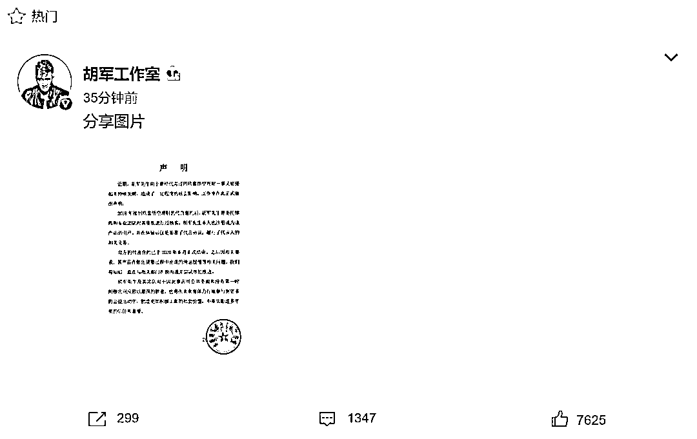
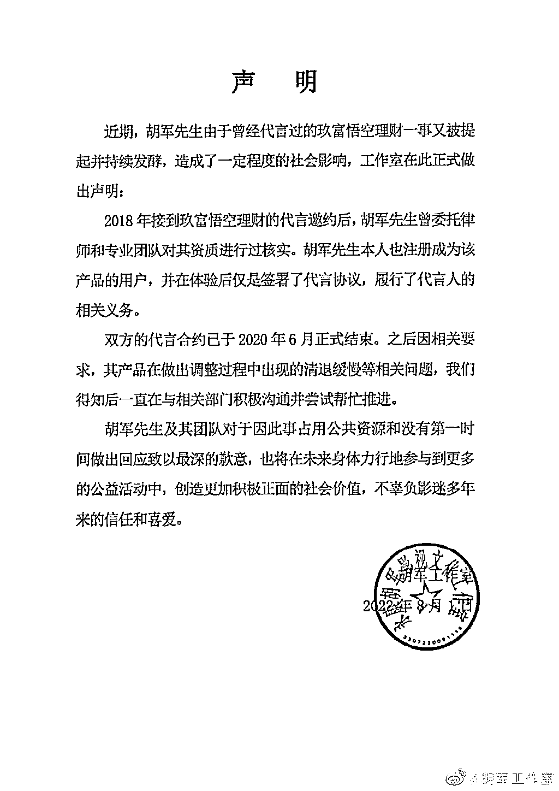
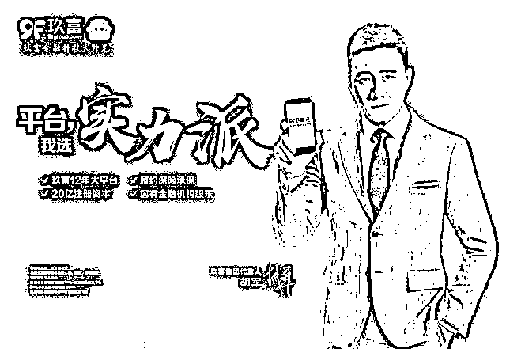
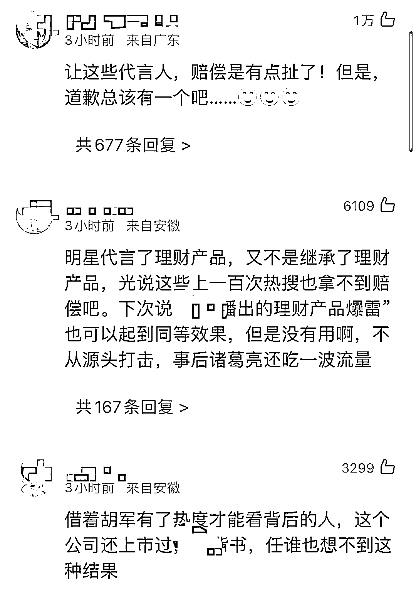
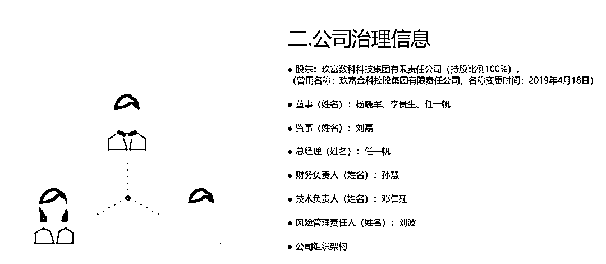
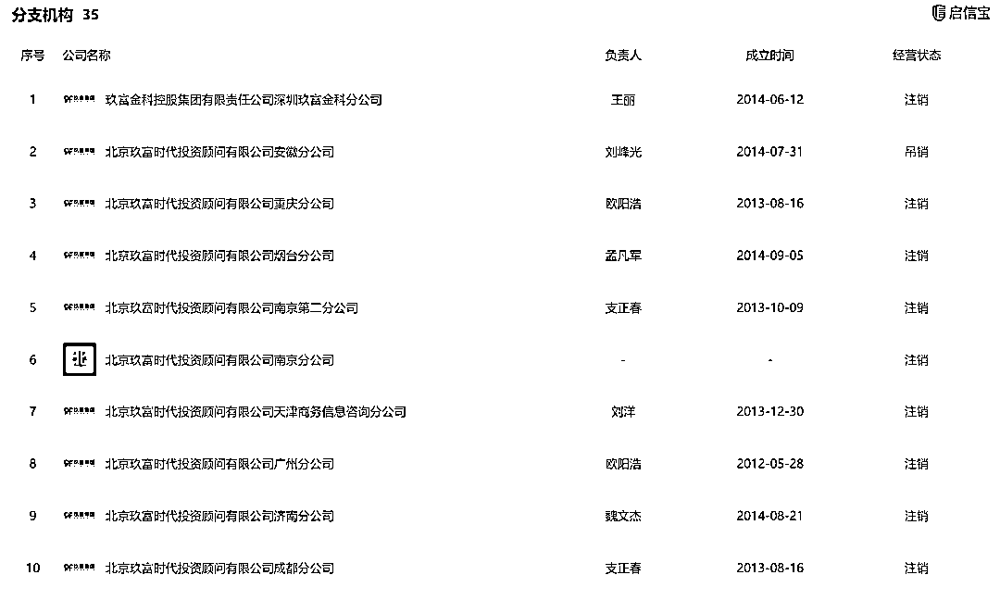
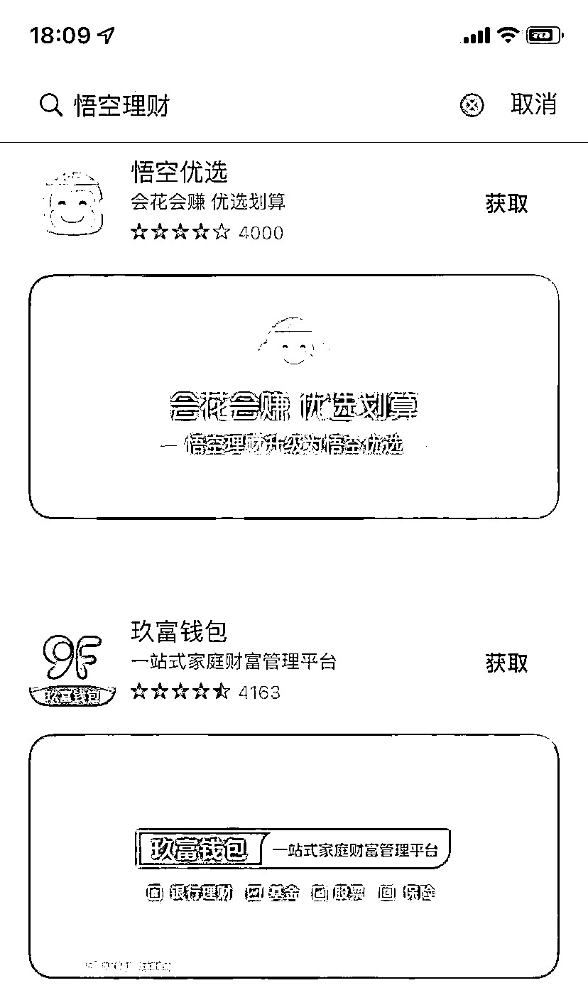
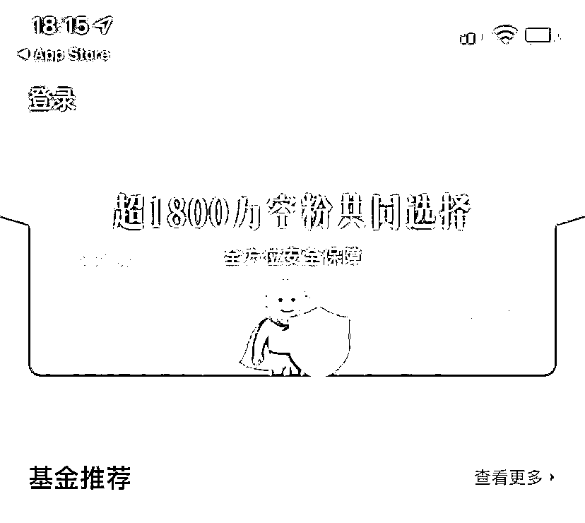
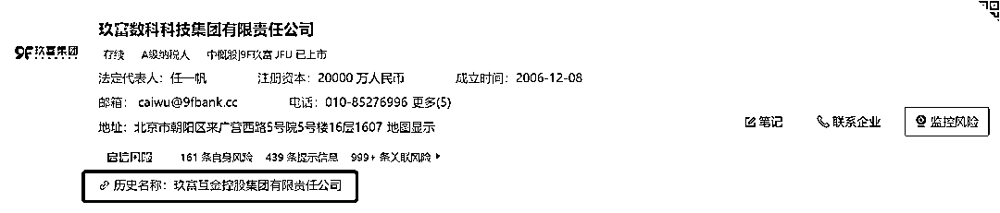
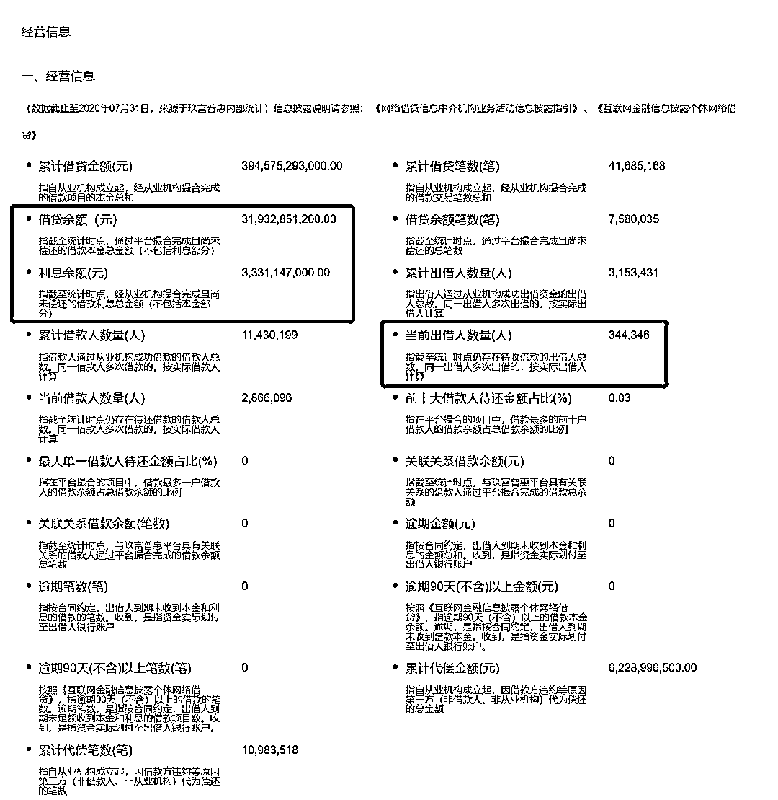

# 胡军代言“翻车”？疑事涉 390 亿元，工作室回应：合约已于两年前结束，一直在与相关部门沟通

> 原文：[`mp.weixin.qq.com/s?__biz=MzIyMDYwMTk0Mw==&mid=2247541651&idx=6&sn=23b3afe1d038d4fc24c83ad28154e487&chksm=97cbe8aba0bc61bd8bde817fd5f5362c7fe8dc89bb6d11ec35e63611b735fa5d43a073e83d3f&scene=27#wechat_redirect`](http://mp.weixin.qq.com/s?__biz=MzIyMDYwMTk0Mw==&mid=2247541651&idx=6&sn=23b3afe1d038d4fc24c83ad28154e487&chksm=97cbe8aba0bc61bd8bde817fd5f5362c7fe8dc89bb6d11ec35e63611b735fa5d43a073e83d3f&scene=27#wechat_redirect)

近日，胡军曾代言的悟空理财“爆雷”一事再度引发关注。据媒体报道，网友称悟空理财涉嫌欺诈。疑似涉及 34 万人，金额高达 390 亿元。

8 月 1 日，胡军工作室官方微博发表声明称：2018 年胡军接到玖富悟空理财的代言邀约后，**曾委托律师和专业团队对其资质进行过核实**。**胡军本人也注册成为该产品的用户**，并在体验后仅是签署了代言协议，履行了代言人的相关义务。**双方的代言合约已于 2020 年 6 月正式结束**。之后因相关要求，其产品在做出调整过程中出现的清退缓慢等相关问题，胡军方面得知后一直在与相关部门积极沟通并尝试帮忙推进。 

**悟空理财 2 年前出现逾期**

据中新经纬，2014 年 9 月，玖富旗下悟空理财正式上线。诱人的回报率帮助玖富吸引了大量客户，首日交易额就突破 100 万元，三天用户数过万。

根据此前悟空理财公开的宣传信息，上线初期悟空理财年化回报率集中在 4%-10%间不等。平台上线首日交易额突破 100 万元，三天用户数过万。

胡军 2018 年出任玖富集团代言人，至今在互联网上依旧有迹可循。在部分宣传稿件中，明确提到胡军在荧屏上的实力派硬汉形象，与玖富集团倡导的“负责、靠谱”的实力派理念完美契合。

图片来源：微博

但就在两年之后，玖富集团出现逾期。有报道称，2020 年就有投资人透露，玖富金融旗下的两款 P2P 产品——“悟空理财”和“玖富钱包”密集出现回款逾期现象，随着越来越多的投资人出来发声维权，玖富集团的问题也逐渐被放大开来。

目前，事情已经过去两年了，用户一直等不到解决方案，只好把矛头对准代言人胡军。不少网友都跑到了胡军的社交账号下面“讨公道”，让胡军给他们一个说法。

在胡军与玖富事件的相关评论区，有用户发问称，是否真正有粉丝因为胡军代言选择玖富，选择购买相关理财产品？对此，也有用户回应称，在同样不知名的平台中，会更倾向于选择有明星代言的机构。

在黑猫投诉平台上，“悟空理财”至今仍有 12344 条相关投诉，不少用户控诉：“通过其 APP 选择通道后回款无进展，原来投进去的本金被转换成了金豆或礼品卡，只能在旗下商场购物，价格一点都不划算。”

据北青报，7 月 31 日，北青报记者以一名投资者的身份拨打“悟空理财”官方联系电话，相关客服人员表示，针对有媒体报道公司跑路的说法，**该客服人员表示公司并未跑路，现在投资者兑现方式主要分为三个通道**，第一种通道是通过金豆商城的金豆购买相关的产品和服务；第二个通道是投资者可以折扣兑付，**通过这种方式投资者可以拿回 10%-30%的本金**；第三种方式是对接相关的投资项目，平台帮电话催收。该客服人员表示，第二和第三种均不能保证能够成功，投资者最好尽快通过积分商城的方式完成兑付。

**“悟空理财”改名“悟空优选”** 

**仍在提供理财服务**

据悟空理财官网显示，该公司为玖富数科科技集团有限责任公司的全资子公司。

据启信宝显示，玖富数科科技集团有限责任公司成立于 2006 年，法定代表人为任一帆，注册资本为 2 亿元，曾于 2019 年纳斯达克上市。该集团旗下 35 家分支机构均已吊注销，但仍控股 9 家企业，间接持股 40 家企业。6 月 30 日，该公司被北京市朝阳区人民法院列为被执行人，执行标的为 17.47 万元，案由系劳动争议。 

8 月 1 日，小编在苹果商店搜索“悟空理财”发现，其中一款叫“悟空优选”的 APP 声称由“悟空理财”升级而来，**其开发者为玖富互金控股有限责任公司**。在业务介绍栏目中，该 APP 声称可以提供基金理财业务，帮助投资者实现零钱理财、中长期投资等多种理财需求，同时还提供生活服务，包括生活缴费、生活美食卡和购物卡等服务。

下载 APP 之后，该 APP 在主页中央位置打出“超 1800 万空粉共同选择，全方位安全保障”的字样，该平台仍然在招揽投资者。

而据启信宝显示，玖富数科科技集团有限责任公司的历史名称为**玖富互金控股有限责任公司。**

据悟空优选官网公布的经营信息显示，截至 2020 年 7 月 31 日，其**借贷余额达到 319 亿元，利息余额 33 亿元**，**出借人数量 34 万人**，但逾期笔数却显示为 0。而该官网的公布经营信息最新只到 2020 年 7 月。 

该公司 2019 年运营报告中表示，当年悟空财富出借人分布最多的省份是广东，之后是江苏、山东、北京、浙江。

据北京商报记者不完全统计，自 2014 年以来，包括黄晓明、范冰冰、张铁林、赵雅芝、郎朗、唐嫣、王宝强、唐国强、董成鹏、汪涵等多位公众人物，都曾因为 P2P 平台代言或者宣传卷入舆论风波中。

在平台爆雷后，部分投资者也将怒火转移到为平台站台的明星身上，并且要求明星“退还代言费”。对于追缴明星代言费，网友齐呼“支持”，有网友表示，“既然代言了就要为自己代言的产品负责任。”还有网友指出，“明星代言不能变诈骗帮凶，接代言赚钱也要有个度。”

在 2021 年 1 月，北京市朝阳区金融纠纷调解中心发布《关于要求 P2P 网贷机构广告代言人配合落实风险化解责任的公告》，称网贷机构为牟取不正当利益，聘请知名演艺人员、公众人物作为广告代言人，利用其影响力吸引投资人购买非法金融产品。上述广告代言人未尽到合理的审查义务，作出不实宣传，对损害结果的发生和扩大存在过错，并负有不可推卸的责任。广告代言人需要对相关问题进行说明，并配合开展网贷平台清退工作，否则将依法追责。

**银保监会亦曾发文对明星代言金融产品的风险进行警示**。

2021 年 4 月 22 日，银保监会发布《关于警惕明星代言金融产品风险的提示》强调，明星等公众人物代言，应当遵守《中华人民共和国广告法》等法律法规，不得为其未使用过的商品或者未接受过的服务作推荐、证明，不得明知或者应知广告虚假仍作推荐、证明。接受代言前，应当查验所代言机构是否具有合法资质，所代言产品和服务是否内容真实、符合监管要求。

另外，已于 2021 年 5 月 1 日实施的《防范和处置非法集资条例》更是规定，**非法集资人、非法集资协助人应当向集资参与人清退集资资金**。清退集资资金来源包括：在非法集资中获得的广告费、代言费、代理费、好处费、返点费、佣金、提成等。

来源：每日经济新闻综合中新经纬、北京商报

](http://mp.weixin.qq.com/s?__biz=Mzg5ODAwNzA5Ng==&mid=2247488098&idx=3&sn=638c5dd62ca652e1a1f2fd5b8420b00f&chksm=c0687b35f71ff223bca5031da035e3ab56f77f3ecfe42e587322e6e0f1302dc4d3e3fb354f18&scene=21#wechat_redirect)

← 向右滑动与灰产圈互动交流 →

