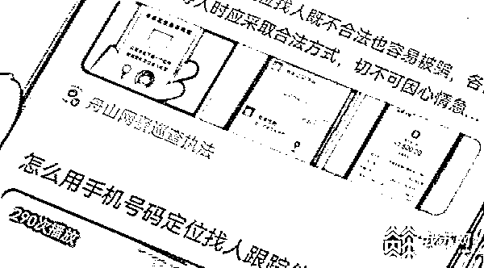

# 诈骗团伙花 2 亿元做广告骗取近 5 亿？警方介绍案情

> 原文：[`mp.weixin.qq.com/s?__biz=MzIyMDYwMTk0Mw==&mid=2247541651&idx=7&sn=e9057f595e9aae5711eb2209938c1e2d&chksm=97cbe8aba0bc61bd4dc81c409d1fcb157ae26baf66f6b009ccdf1f37771fec94e33ccc467689&scene=27#wechat_redirect`](http://mp.weixin.qq.com/s?__biz=MzIyMDYwMTk0Mw==&mid=2247541651&idx=7&sn=e9057f595e9aae5711eb2209938c1e2d&chksm=97cbe8aba0bc61bd4dc81c409d1fcb157ae26baf66f6b009ccdf1f37771fec94e33ccc467689&scene=27#wechat_redirect)

[`mp.weixin.qq.com/mp/readtemplate?t=pages/video_player_tmpl&action=mpvideo&auto=0&vid=wxv_2512049935207612418`](https://mp.weixin.qq.com/mp/readtemplate?t=pages/video_player_tmpl&action=mpvideo&auto=0&vid=wxv_2512049935207612418)

不少市民遇到问题时，都习惯先打开搜索引擎寻求帮助。江苏镇江丹阳的张先生为了寻找联系不上的妻子，也到网上搜索如何定位，结果人没找到，还被骗了 3 万多元。镇江警方展开调查后，发现这些诈骗广告链接是由专业团队来给诈骗团伙“引流”的，用于诈骗的“引流”推广费用高达 2 亿多元。近日，镇江警方公布了这起案件的详情。

去年 3 月份，张先生的妻子因为家庭琐事离家出走了。在妻子离开的两个月里，张先生四处寻找无果，突然想到之前看过电视剧中，有通过手机号码来定位找人的，于是在搜索引擎上输入关键词，点开了推送的广告链接。寻妻心切的张先生下载了广告上的客户端，又根据指令添加了陌生微信号。镇江丹阳市公安局网安大队中队长沈琛介绍，**“注册需要交 2000 元，但张先生注册后并不能立即使用定位功能，对方又称需要再交一笔保密费用。”**

****

折腾了半天，张先生寻妻的事没半点进展，却被忽悠花费了 3 万元。张先生发觉不对劲，到派出所报了警。警方通过技术手段，找出了案件的突破性线索。沈琛介绍，“我们对相关的资金进行了梳理，发现了一个遍布在全国的犯罪团伙，他们专门帮助从事定位和聊天记录查询的诈骗团伙进行广告推广，这个犯罪团伙共有 6 个”。

从去年 5 月份到今年 7 月份，历时 1 年多，丹阳警方先后奔赴 8 省 20 市，打掉了 6 个“引流”诈骗团伙，扣押涉案资金 2000 多万元。沈琛介绍，**“全国各地的受害者大概 200 多个，该类案件的受害金额应该达到了 5 亿元左右。根据我们查实的广告流量资金，大概是 2 亿元左右，也就是诈骗犯在骗到钱以后，将其中最起码三分之一的金额，用在了广告推广上。**”****

****

**今年 30 岁的李某（化名）是其中一名广告业务推广员，案发前，他所在的公司多次对接了诈骗团伙的引流推广业务，短短一年间，公司盈利 60 多万元，李某也获得了 20 万左右的报酬。李某介绍，“我们刚开始做推广的时候，我们会做一些常规的内容，比如旅游、食品等。但是常规的一单只赚个几十块钱，后来有同行说做这种广告推广做一点就可以赚一两百。”沈琛介绍，“骗子设置的关键词都是比较精准的，很多就是查询老公聊天记录、查询老婆聊天记录、查老公位置、查老婆位置。”**

**在巨额利润驱动下，这些广告公司疯狂在各大搜索平台投放引流广告，将受害人引入诈骗陷阱。目前，李某等 67 名嫌疑人因涉嫌帮助信息网络犯罪活动罪被警方依法采取刑事强制措施。镇江丹阳市公安局网安大队副大队长孙杰远介绍，**“查询微信聊天记录和定位他人位置信息，本身就是违法的行为。一些市民在侵犯隐私以后就不敢报警。我们公安机关提醒大家，此类情况是不可以操作的，这种广告大部分也是诈骗分子利用人们的侥幸心理钻的空子。”****

**来源：人民网，央视财经，©中国青年网微信我苏网综合《零距离》记者：刘舒 通讯员：居静** 

******](http://mp.weixin.qq.com/s?__biz=Mzg5ODAwNzA5Ng==&mid=2247488098&idx=3&sn=638c5dd62ca652e1a1f2fd5b8420b00f&chksm=c0687b35f71ff223bca5031da035e3ab56f77f3ecfe42e587322e6e0f1302dc4d3e3fb354f18&scene=21#wechat_redirect)**

**← 向右滑动与灰产圈互动交流 →**

****