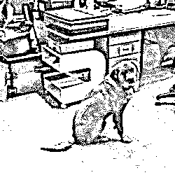
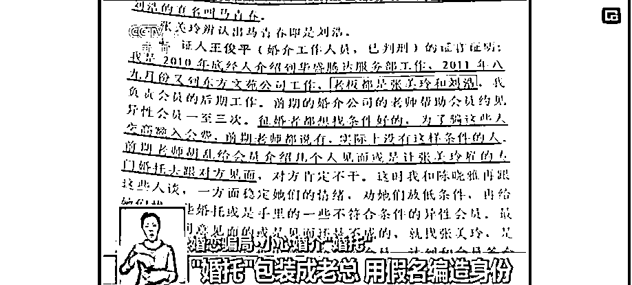

# “飞盘媛”背后，可能藏着灰色产业链

> 原文：[`mp.weixin.qq.com/s?__biz=MzIyMDYwMTk0Mw==&mid=2247541721&idx=2&sn=3048296b116c80091f3fc4f3bec4f42f&chksm=97cbe8e1a0bc61f7dd8b9c7c0a67ff83353b54091459ef6c0dba543c133c86055a99332da6da&scene=27#wechat_redirect`](http://mp.weixin.qq.com/s?__biz=MzIyMDYwMTk0Mw==&mid=2247541721&idx=2&sn=3048296b116c80091f3fc4f3bec4f42f&chksm=97cbe8e1a0bc61f7dd8b9c7c0a67ff83353b54091459ef6c0dba543c133c86055a99332da6da&scene=27#wechat_redirect)

要是在前两年，说起飞盘，大部分人的反应可能会是——

**“啊？飞啥盘？”**

**“逗狗狗的玩具吗？” **

但今年以来，随着飞盘运动大火，在各大社交平台上疯狂刷屏，飞盘运动得以迅速出圈、彻底被大家熟知。

该说不说，这确实是一项不错的健身运动，玩法技术含量不算高，易上手，成本和参与门槛足够低，看上几分钟就能开始玩儿了，比篮球、足球这类规则复杂的运动可简单多了。

但是没过多久，**飞盘运动的口碑渐渐往下走，当打开某书搜索「飞盘运动」时，也渐渐多了一些不对劲**：

△ 某平台搜索“飞盘”关键词下的展示 

虽然存在正经玩飞盘运动的女生。

但是部分玩飞盘小姐姐们的穿搭以及拍照姿势，似乎与运动的汗流满面格格不入。

**比如有的穿着性感，身材火辣。**

△ 某平台搜索“飞盘”关键词下的展示

有的浓妆淡抹，**“紧身低胸衣 + 瑜伽裤”**是标配。

△ 某平台搜索“飞盘”关键词下的展示

她们的运动看上去做了，又好像没有。

因为照片看上去一点不累，也不会出汗。反而更像是在摆拍，然后将美照全网分发，收割流量。

△ 某平台搜索“飞盘”关键词下的展示

“飞盘 5 分钟，拍照两小时”。一番操作下来，网友给这部分人赐名**“飞盘媛 ”**。

但随着“飞盘媛”的爆火，某些不法分子和机构勘透商机，基于女性的**社交需求，开起了飞盘联谊会**。

       

这个联谊会可不是我们认知中的联谊会。

我们可以看一下联谊会的要求：

**男生必须要资产 5000 万以上，女生必须要年轻漂亮高学历。** 

**男生需要验资，女生面试。** 

**参加活动男生需要 6000，女生免费！**

事情发展到这里，已经不是简单的社交类行为了，背后潜藏着一条灰色产业链——**割韭菜的互联网婚介机构。**

有安友就疑惑了——没看出来不对劲呀，看上去只是一场有门槛的相亲局而已。

NONONO，“相亲、社交”只是一个名义和前菜，**其内核还是灰色婚介结构的套路。**

比如，上图写的“身家 5000 万的富豪”就是钩子，婚介机构会员里实际上有这个人吗？大概率是没有的。 

**因为真的身家 5000 万的富豪，通常不缺伴侣也不太会通过婚介机构来寻找伴侣，所谓资产千万的富豪，多是婚介机构的编造。** 

女生参加联谊会虽然写着不收钱，**但组局人收割的是女生们上钩之后的钱。** 

一旦有适龄女性报名，婚介机构会变着法让她一次又一次**地缴纳会费，升级资格**，**从而与资产更丰厚，档次更高的男性约会**，圆了嫁入豪门的梦。

**之前，央视新闻就有曝光婚介机构的灰产链条。**

这些婚介机构收会员，都会设置几档不同的收费标准，从一万到数百万不等的会员费。用户（征婚者）通过缴纳对应的会员费，就可以见到资产从几百万到上亿的这些优质异性。

收了女会员的百万会员费，婚介公司就得按照合同给女方提供 5~10 名身家上亿的男士见面，没有怎么办呢？

**没办法，只****能是婚托上场了**，婚介公司会安排征婚女性和这些经过包装的男性婚托在固定的场所见面。

见面以后，婚介公司的工作人员就为双方引荐，把这个婚托介绍成是房地产公司老总或者是企业集团的负责人。

婚托也**会对自己进行必要的包装**，比如穿名牌西服，戴名牌手表，用名牌手包等。

**当然，这些都是假的，就连婚托用的名字都是假名......**

还有一种说法是，某些不法分子组织的“飞盘运动”局，对女生颜值、三围甚至都有要求，其背后实际上是变相的**“色情交易”**。

不过，「飞盘媛涉及“色情交易”」这一说法尚未有实例说明。

在这里小珊还是倡议大家不要太「望“媛”生义」了，或者将有女性参加的飞盘运动污名化，本文所指的飞盘媛是指靠露肉、作秀博取流量的人，并不是所有玩飞盘的女性。

       

毕竟，玩飞盘跟健身一样，是一种有益身心的运动，也是一种正常的社交行为。

对于靠打擦边球、露肉、作秀赚取流量的人，已经涉及恶意营销，给社会营造了错误的价值导向，必要的时候各平台将用封号、禁言等方式保证健康的内容生态氛围；而对于打着飞盘运动名义实施诈骗的灰产，国家会持续严厉打击。

来源：微信珊瑚安全

](https://mp.weixin.qq.com/s?__biz=Mzg5ODAwNzA5Ng==&mid=2247487973&idx=1&sn=1b62da6f2018402862a5c375e10c355e&chksm=c06878b2f71ff1a4fbe7df4dec626aa7e696154751693bf16f6c6a302ceaa4d1959040c70518&scene=21#wechat_redirect)

← 向右滑动与灰产圈互动交流 →

