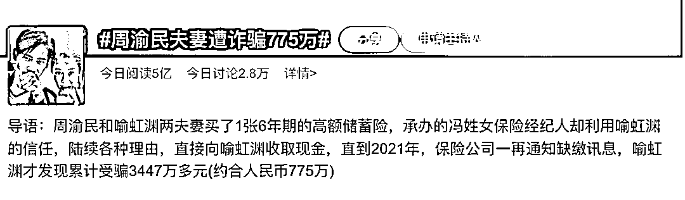
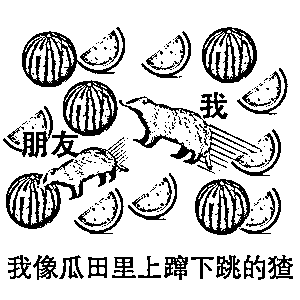
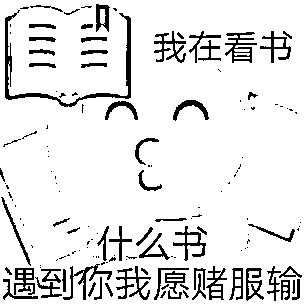

# 扒一下周渝民被骗 775 万背后的产业链

> 原文：[`mp.weixin.qq.com/s?__biz=MzIyMDYwMTk0Mw==&mid=2247541721&idx=3&sn=75e219834164aa9d318d57975265a5f4&chksm=97cbe8e1a0bc61f78e21a8200ae63f5010f3c22f65ef8913341ee60eb45c3515d6f068034623&scene=27#wechat_redirect`](http://mp.weixin.qq.com/s?__biz=MzIyMDYwMTk0Mw==&mid=2247541721&idx=3&sn=75e219834164aa9d318d57975265a5f4&chksm=97cbe8e1a0bc61f78e21a8200ae63f5010f3c22f65ef8913341ee60eb45c3515d6f068034623&scene=27#wechat_redirect)

昨天，周渝民夫妇因买保险被诈骗 775 万的消息冲上热搜，网友们十分震惊，居然是“闺蜜作案”！

*图为微博话题截图*

*小编浅浅捋了一波时间线～便于大家快速吃瓜：*

*2018 年*

*诈骗者冯某（周渝民老婆喻虹渊的闺蜜）利用自己保险经纪人的身份说服周渝民夫妇购买了一款高额储蓄险，每年需要缴纳 684 万余台币（折合人民币 153 万元）。*

*2019 年 5-6 月*

*第 2 次缴纳保费时，冯某找借口要求喻虹渊以现金的方式缴纳保费，再由她转交给保险公司。出于对朋友的信任，喻虹渊签署了委托书。*

*2020 年 4 月*

*喻虹渊又转了 684 万余元到好友冯某的账户上，委托她缴纳第 3 期保费。*

*2020 年 8 月*

*冯某以提前缴纳第 5、6 期保费，期满可获得优惠折扣 347 万台币为由，收走 1200 多万台币现金。*

*2021 年*

*喻虹渊接到保险公司的催缴通知，冯某还继续骗称是公司账务系统出了问题，接着又收走第 4 期保费。*

*2022 年 4 月*

*周渝民夫妇发现事情不对劲，他们询问了冯某，但对方也没有给出合理的解释。于是，两人做了紧急报警处理。*

***四年期间****，周渝****民夫妇总共被诈骗 3447 万台币，合计人民币 775 万元。*** 

**

*吃完了整个瓜，我们可以发现，周渝民夫妻被诈骗不仅仅是“熟人诈骗”这么简单，里面还存在着社会中常见的一种诈骗形式：**保险诈骗**。*

***一类是保险内部员工“违法操作”，对投保人的保费进行诈骗、截留、侵占。**他们往往利用伪造公司公章等手段，获取客户信任，再谎称公司有新的保险产品，使用“名额有限，先到先得”的营销话术，刺激客户购买；最后以优惠返利为借口诱骗客户提前缴纳保费。*

**

***另一类，是与保险相关的网络诈骗，常见的主要有 4 种套路：***

*****01   ****冒充保险公司人员诈骗*****

***这一类诈骗犯往往会冒充保险公司工作人员，打着让你补充保险材料或者加速理赔的旗号，降低你的防范心理，从而诱骗你去银行 ATM 机进行操作，诱导你输入发送的验证码（实为转账金额），转走你的账户资金。***

*****02   ****冒充公检法诈骗*****

***谎称发现有人利用你的保险消费者身份信息在外地办理了社保卡，购买了违禁药品，触犯了国家法律法规。之后，以“帮助你”的名义，冒充公安机关诱骗你将资金转移至所谓的“公安机关账户”保存，。***

*****03   ****“退保理财”骗局*****

***骗子冒充保险机构工作人员，向消费者推荐更高收益的虚假保险理财产品，诱导保险消费者把之前已经购买的保险产品办理退保或保单质押贷款后，进行诈骗。***

*****04   ****虚假网站骗局*****

***骗子冒充保险公司工作人员，以周年回馈客户等理由，诱骗你点击假冒的“官方网站”投保缴费等。***

***不得不说，骗子套路深，投保要谨慎。**针对保险诈骗，守哥有几点建议想分享给大家：*****

***1、**花时间了解一些保险知识，选择正规的保险公司和投保渠道。**比如，“金融管理部门明令禁止‘代缴保费’”、“保费都是由专业精算师进行计算得出的，不存在提前缴纳就有优惠的情况”等。***

******

***2、**购买保险时，需要核查保险经纪人或代理人的身份，和其所在机构电话确认。**在中国大陆，投保人只要根据保险经纪人的姓名或工号，就可以进入保险公司或银保监会网站查询，或拨打保险公司客户服务电话核实相关展业号是否存在，对应的姓名是否一致，对保险营销员的真实身份和诚信记录进行了解。***

***3、**购买保险后，主动核实保单真实性，拒绝以任何借口让你主动打钱、线上购买等操作。**及时找保险公司官方进行核对，一切以官方消息为准。***

***来源：大 R 说安全***

*********](https://mp.weixin.qq.com/s?__biz=Mzg5ODAwNzA5Ng==&mid=2247487973&idx=1&sn=1b62da6f2018402862a5c375e10c355e&chksm=c06878b2f71ff1a4fbe7df4dec626aa7e696154751693bf16f6c6a302ceaa4d1959040c70518&scene=21#wechat_redirect)***

***← 向右滑动与灰产圈互动交流 →***

******