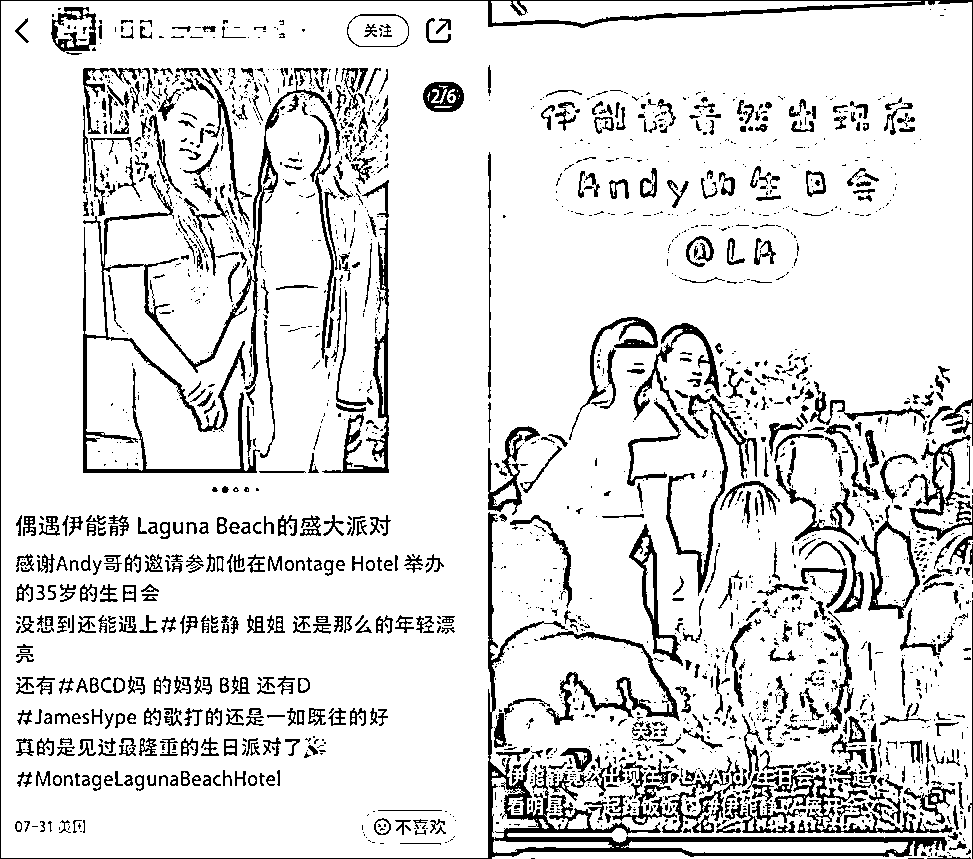
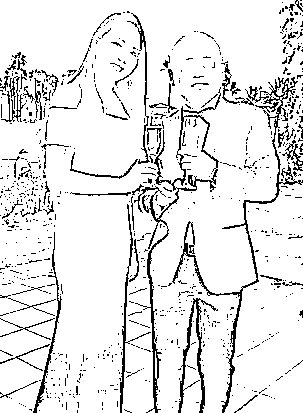
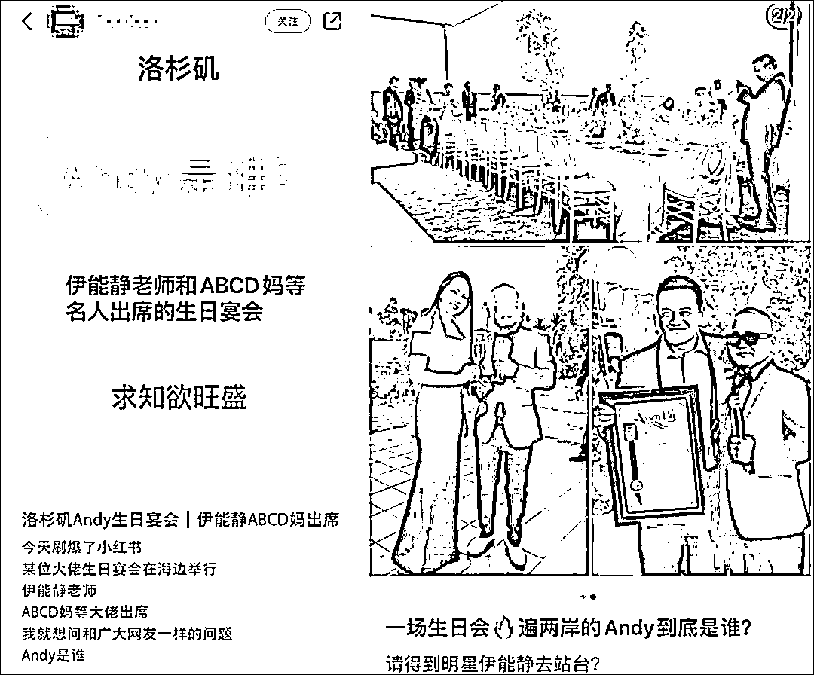
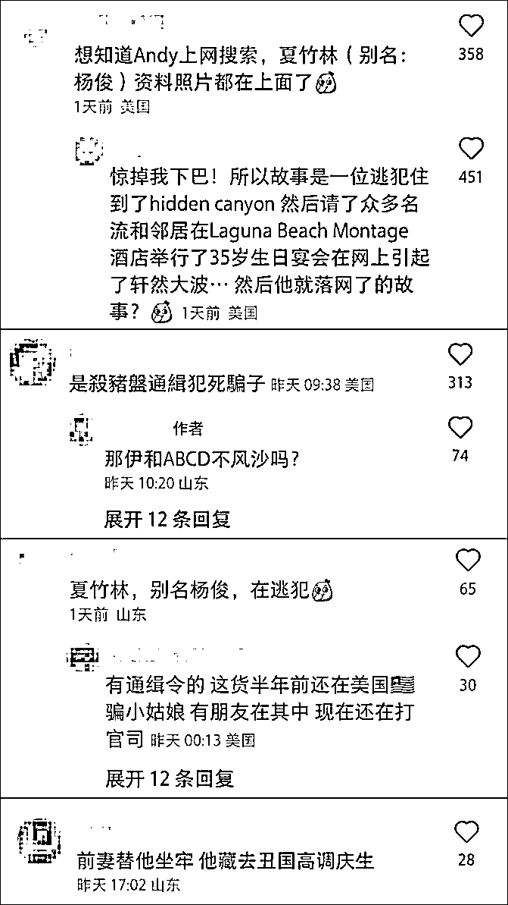
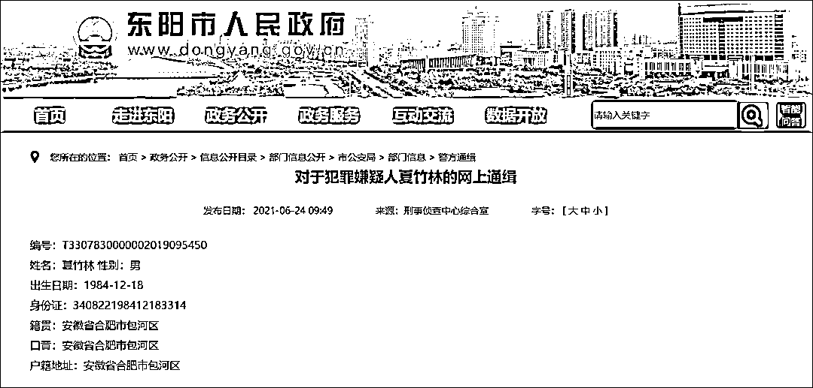
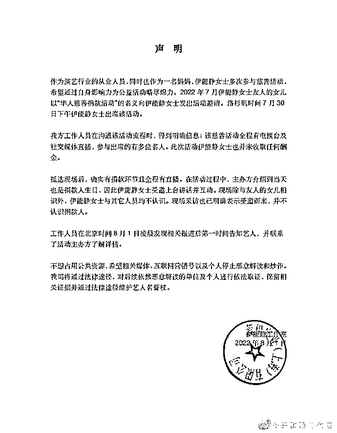

# 通缉犯夏竹林等人通过虚拟币诈骗了 3.38 亿，隐匿海外！

> 原文：[`mp.weixin.qq.com/s?__biz=MzIyMDYwMTk0Mw==&mid=2247541721&idx=4&sn=b1e469f35f8ea70dc33f533682fb1a05&chksm=97cbe8e1a0bc61f798b3041d07ecc1f249bee9a7881b4e22316a3733bcbbab9be8ae69775d75&scene=27#wechat_redirect`](http://mp.weixin.qq.com/s?__biz=MzIyMDYwMTk0Mw==&mid=2247541721&idx=4&sn=b1e469f35f8ea70dc33f533682fb1a05&chksm=97cbe8e1a0bc61f798b3041d07ecc1f249bee9a7881b4e22316a3733bcbbab9be8ae69775d75&scene=27#wechat_redirect)

日前，有网友爆料称，中国台湾女歌手、演员伊能静在美国参加了“华人富豪”Andy 的生日宴，而这位 Andy 则被起底疑似是在逃通缉犯夏竹林。中国经营网 2020 年底曾报道称，**夏竹林等人涉嫌通过虚拟币诈骗他人超过 5000 万元美元（约合人民币 3.38 亿元），之后隐匿于海外**，而目前在浙江省东阳市政府网站仍有针对夏竹林的通缉信息。

对于外界争议，8 月 1 日，伊能静工作室发布声明回应，但并未说明 Andy 的身份。据声明称，伊能静此次出席活动是因其友人的女儿以“华人慈善捐款活动”的名义邀请她，伊能静并未收取任何酬金。现场除了友人女儿，**伊能静不认识任何人**，工作人员已联系主办方了解详情，对于恶意解读行为将依法取证。

7 月 31 日，陆续有网友在社交平台晒出照片或视频，表示在洛杉矶参加“华人富豪”Andy 的盛大生日宴会时遇到女星伊能静，伊能静与生日宴主角 Andy 的合照也流出。

这让不少网友开始好奇 Andy 的身份，发出“Andy 到底是谁”的疑问。

而随后，就有眼尖的网友指出，这位 Andy 疑似是夏竹林，别名杨俊，是一名在逃诈骗犯。

公开资料显示，夏竹林（化名：杨俊）生于 1984 年，安徽合肥人。中国经营网 2020 年 12 月 22 日曾报道称，2019 年 8 月，达观控股有限公司法人代表胡菲因涉嫌“诈骗罪”被东阳市公安局拘留，2020 年 8 月，她因“掩饰、隐瞒犯罪所得罪”被东阳市检察院移交法院起诉。然而，达观控股有限公司的实际控制人是胡菲的前夫夏竹林。记者从检察院起诉书上获悉，**夏竹林等人涉嫌通过虚拟币诈骗他人超过 5000 万元美元。**夏竹林将 2014 万元人民币转账给胡菲，后者用于购置房产，而夏竹林隐匿于海外。 

另据东阳市人民检察院 2021 年 10 月 15 日公布的法律文书，2018 年 5 月始，夏竹林为实施数字货币诈骗犯罪，设立公司招募人员，逐步形成了以夏竹林为首，以何燕、张海明、胡萍、杨晓梅、余成城等人为骨干的犯罪集团。该犯罪集团在夏竹林的组织和领导下，以投资数字货币可以获取高额回报为诱饵，骗取客户投资入金，后将入金瓜分实施诈骗。

该犯罪集团总部设达观控股有限公司，旗下有安徽网智星文化传媒有限公司、位于马来西亚吉隆坡的星球国际数字资产金融科技有限公司、位于深圳的深圳澳斯卡财经科技有限公司。其中，2018 年 6 月，夏竹林成立深圳澳斯卡财经科技有限公司，研发第一款数字货币诈骗软件 SIE （后更名 BTUE），2018 年 8 月上线。后公司陆续开发了 CFEX、LKF、GDbit、CCMEX 等平台，实施诈骗活动。2019 年 4 月中旬，深圳澳斯卡解散。该犯罪集团为逃避打击，逐步将财务、技术、运营、招商等关键部门人员转移至韩国、马来西亚等地继续实施诈骗活动。2019 年 6 月，东阳市公安局立案侦查，后赴安徽、四川、广东、上海等地陆续抓获该犯罪集团涉案人员。

经查，2018 年 8 月至 2018 年 12 月，SIE 平台诈骗数额为 8678167USDT 币（泰达币，是一种将加密货币与法定货币美元挂钩的虚拟货币）。2019 年 1 月至 2019 年 2 月，CFEX 平台诈骗数额为 15035971USDT 币。2019 年 3 月至 2019 年 6 月，LKF 平台累计入金 17970474 USDT 币，累计出金 162452USDT，诈骗数额为 17808022USDT 币。2019 年 6 月至 2019 年 8 月 1 日，GDbit 平台累计入金 13636044USDT 币，累计出金 170793USDT 币，诈骗数额为 13465251USDT 币。

目前，东阳市政府网站仍有对隐匿海外的夏竹林的通缉信息。

而随着“伊能静出席诈骗犯夏竹林生日宴会”的争议越来越大，伊能静工作室于 8 月 1 日发布声明就此事作出回应，但并未说明 Andy 的身份。

声明称，2022 年 7 月伊能静友人的女儿以“华人慈善捐款活动”的名义向伊能静发出活动邀请，洛杉矶时间 7 月 30 日下午伊能静出席该活动。伊能静工作室的工作人员在沟通该活动流程时，得到明确信息：该慈善活动全程有电视台及社交媒体直播，参与出席的有多位名人。此次活动伊能静也并未收取任何酬金。

声明继续称，伊能静抵达现场后，确实有捐款环节且全程有直播。在活动过程中，主办方介绍到当天也是捐款人生日，因此伊能静受邀上台讲话并互动。现场除与友人的女儿相识外，**伊能静与其他人员均不认识。**现场采访也已明确表示受邀而来，并不认识捐款人。

声明还称，工作人员在北京时间 8 月 1 日凌晨发现相关报道后第一时间告知艺人，并联系了活动主办方了解详情。声明最后称，工作室希望相关方停止恶意解读和炒作，将通过法律途径，对后续依然恶意解读的单位及个人进行依法取证，保留相关证据并通过法律途径维护伊能静名誉权。

在工作室发布声明的几分钟内，伊能静也在微博转发了这一声明，并发了一个“双手合十”的表情符号。

来源：观察者网，利箭在行动

](https://mp.weixin.qq.com/s?__biz=Mzg5ODAwNzA5Ng==&mid=2247487973&idx=1&sn=1b62da6f2018402862a5c375e10c355e&chksm=c06878b2f71ff1a4fbe7df4dec626aa7e696154751693bf16f6c6a302ceaa4d1959040c70518&scene=21#wechat_redirect)

← 向右滑动与灰产圈互动交流 →

