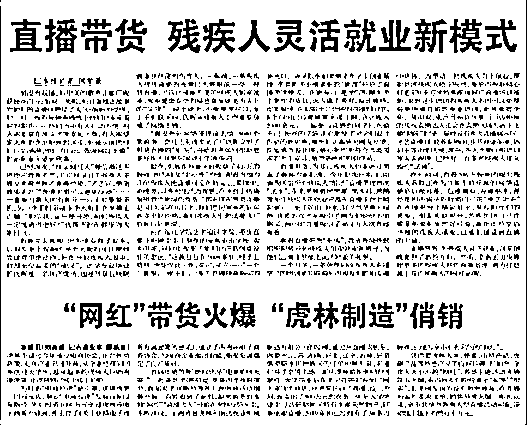

# 有人建议二舅去直播，残疾人的直播世界到底怎么样？

> 原文：[`mp.weixin.qq.com/s?__biz=MzIyMDYwMTk0Mw==&mid=2247541721&idx=5&sn=954e0ad2742a49808a9149a77866e940&chksm=97cbe8e1a0bc61f73a611db9c3f7d288175a1438d3d6b6360923080b3d37dd57d08f29cc9697&scene=27#wechat_redirect`](http://mp.weixin.qq.com/s?__biz=MzIyMDYwMTk0Mw==&mid=2247541721&idx=5&sn=954e0ad2742a49808a9149a77866e940&chksm=97cbe8e1a0bc61f73a611db9c3f7d288175a1438d3d6b6360923080b3d37dd57d08f29cc9697&scene=27#wechat_redirect)

他，天才少年的开端，却被赤脚医生打针致残；后半辈子一瘸一拐，却靠着木工手艺为生依旧乐观。他是短视频《回村三天，二舅治好了我的精神内耗》里乐观的二舅。（目前已经下架）这个 66 岁的老头儿，一度火遍全网，热搜高挂，赞美的高歌和怀疑的流言扑面而来。有人为二舅悲苦的人生感动到流泪，他们为二舅出谋划策改变生活：“**做直播呀二舅！**”也有很多人会下意识地“反感”直播行为，“不要侮辱二舅！”。但事实上，**在今天，直播，的确成为残疾人的一门出路。****01****新时代新出路**据中国残联统计的数据显示，目前我国各类**残疾人总数已达 8500 万**，其中仍有**1500 万以上残疾人生活在国家级贫困线以下**，占贫困人口总数的 12%以上。随着社会变化，适合残疾人的工作有一部分还在萎缩，但幸好直播的出现也让他们有机会“被看见”。搜索关键词“**残疾人直播**”，跳出来事例宣传十分正能量。助残公益协会助力残疾人就业，帮助残疾人们电商创业转型，不少地方都有免费的残疾人电商直播职业技能培训班开办。（黑龙江日报）因为身体上的各种缺陷，导致残疾人无法进入正常的工作环境，网络直播成了非常适合他们的新平台。这不仅是教给他们一种谋生的技能，更重要的是带给他们一种价值感，“**正常人能做的工作，我们也能做到**”，这种尊重和平等的满足感也能让他们获得快乐。（图源杭州市“星星杯”大赛）不止如此，打开抖音平台，自发搞直播的残疾人其实也挺多。这些无法正常工作养活自己的人，发现网络视频平台可以成为他们重要的谋生工具。比如点进“全家残疾人”的抖音首页，她说“**一家四口人，三个残疾**”，生活真的沉重压抑又悲苦。但幸好有直播平台，她在平台分享自己的生活，有笑有泪，坚强面对。**直播的打赏也成了一家人重要的经济支柱。**对于普通人而言，互联网改变生活；对于残疾人而言，互联网颠覆生活。不得不说，残障人士通过直播平台进行直播或是带货，在一定程度上来说是一种十分良性的新时代就业。它让残疾人突破了很多束缚，“看到”了更大的世界，同样被世界“看到”。**02****“残疾”作噱头**渐渐地，有人发现“残疾”是一种“商机。”不少居心叵测的人利用残障人士的身体缺陷、悲惨身世当作博取网友同情和金钱的手段。前段时间六盘水的小敏事件给人极大的震撼。29 岁的小敏和丈夫生活在贵州六盘水，已生育三女一子，就为了生出儿子。儿子出生后，小敏罹患癌症，网传婆家不给钱看病，并把她撵出门。无依无靠的小敏只能在外租房，通过在网上直播抗癌生活，靠着网友的打赏维持生活。随后，小敏的老公将她“接回去照顾”，**时不时拍个视频卖惨，说自己照顾妻子多辛苦，骗取网友们的打赏。**小敏不堪病痛折磨，近期的视频中显示卧病在床的小敏已骨瘦如柴、眼神无光、完全脱相。在一次直播中，有网友发现**小敏身上已经溃烂出拳头大的血洞，里面满是蠕动的蛆。**对此，小敏的丈夫发视频回复质疑，说都怪自己“两天没注意”。网友随即报警，救护车去的时候，小敏艰难地说了一声：“**叫我死吧！**”后续消息是，六盘水水城区政府发布公告称，政府高度关注此事，目前已组织专家对其全力救治。目前，这个短视频账号已被清空，系统显示违规。小敏身上的蛆洞让人不寒而栗，他丈夫矢口否认，在直播中假装情谊浓浓的样子更让人恐惧。小敏被病痛折磨失去了反抗能力，那么**那些本就弱势的残疾人在直播又是何种境遇？**去年湖南，23 岁的精神残疾女孩小辉因外形特别，被各路短视频网红主播看中，并带走做直播。她被称为“海公主”，和一名男性主播“十二少”上演“浪漫爱情”。后来经过当地警方的调查，**小辉 11 岁被确诊为精神分裂症，被鉴定为二级精神残疾。**她时常离家出走，找上她的主播早就看出了小辉“不正常”，但他们不是伸出援助之手，或者联系相关部门帮助小辉回家，而是看**到了小辉身上的“商机”**。被恶作剧式秃头露丑，在多次直播中被摸隐私部位，在严重伤害身体健康的情况下被安排大量喝酒、喝酸奶，直至被送进 ICU……为了博眼球、赚流量，恶俗主播明明知道小辉患有精神分裂症，却公然猥亵甚至虐待她，无视她的尊严和身体权利。不只是利用残疾人做低俗直播必须叫停，残疾人的生存状况问题其实也被重视着。今年我国其实出台了多项新政策切实保障了残疾人们的各项权益，假如我们被一个人以“残疾”为由吸引目光，那么我们应该考虑的是：我是不是因为他的魅力、才华、思想……而愿意为他付费，而不单单是同情。**03****科技是把双刃剑**在如今这个网络信息科技发达的时代，有一种风气在弥漫。部分人的思维逻辑已经从**得病就去看病，变成得病先去直播**，博取眼球获得打赏，在某种程度上我们好像越活越倒退。高速飞驰的科技几乎没有改变这些残障人士的生存状态，反而变成了一部分人的谋利工具。小辉和小敏的遭遇都让人痛心。他们不是唯一一位被诱骗强迫进行低俗直播的弱势群体。仍有无数弱势人群，因为自身精神和能力等原因，无法将受到的压迫申诉。他们可能是残障人士、可能是年迈的老人、甚至可能是心智未全的孩童。在巨大的利益面前，利用弱势群体，将他们拿来肆意摆弄，用博人眼球甚至低俗的行为获取看客的关注。这类人的可耻行径根本不需要“打赏”，他们成了依附网络生存的寄生虫。也正是因为这类人的存在，让网络乌烟瘴气，让人们对“直播行为”越发反感。很多人认为“直播”已经成为贬义词，但科技的发展从来不是为了恶人得意，

那些努力接受新事物、积极参与走进直播的残疾人，难道不值得我们赞叹一句敬佩？

在这个全民皆可直播的时代，我们要欣赏学会欣赏“才华”，而不是“同情”。

](https://mp.weixin.qq.com/s?__biz=Mzg5ODAwNzA5Ng==&mid=2247487973&idx=1&sn=1b62da6f2018402862a5c375e10c355e&chksm=c06878b2f71ff1a4fbe7df4dec626aa7e696154751693bf16f6c6a302ceaa4d1959040c70518&scene=21#wechat_redirect)

← 向右滑动与灰产圈互动交流 →

