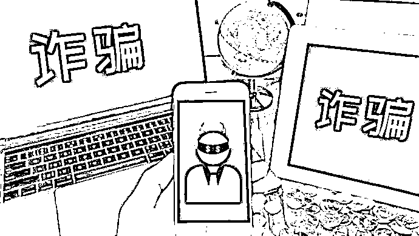

# 被骗的钱为什么很难追回来？这里的水到底有多深？

> 原文：[`mp.weixin.qq.com/s?__biz=MzIyMDYwMTk0Mw==&mid=2247541721&idx=6&sn=e7b62577395b025ad1210a7c8365f80f&chksm=97cbe8e1a0bc61f75493f9cc8c849641bb624004ace2621c822face224f347a5f4509903ce06&scene=27#wechat_redirect`](http://mp.weixin.qq.com/s?__biz=MzIyMDYwMTk0Mw==&mid=2247541721&idx=6&sn=e7b62577395b025ad1210a7c8365f80f&chksm=97cbe8e1a0bc61f75493f9cc8c849641bb624004ace2621c822face224f347a5f4509903ce06&scene=27#wechat_redirect)

**经常有受害人问：**

“*我被骗了 XX 钱，怎么能追回来？”*

*“骗我的人抓得到吗？”*

*“顺着网络查怎么就查不到人呢？”*

*“有银行卡、电话、网站信息，为何躲在背后的人，就是抓不到呢？”*

**01**

****为什么骗子很难抓到？****

**很多人认为，无论骗子采取什么样的欺骗手段，他收取钱款的银行卡都是实名的，怎么就抓不到呢？事实上，诈骗分子熟练掌握反侦察技能，善用各种伪装，隐去一切可能会曝光自己身份的痕迹。** ****[`mp.weixin.qq.com/mp/readtemplate?t=pages/video_player_tmpl&action=mpvideo&auto=0&vid=wxv_1426202517377040386`](https://mp.weixin.qq.com/mp/readtemplate?t=pages/video_player_tmpl&action=mpvideo&auto=0&vid=wxv_1426202517377040386)**** 

****（视频转自：西瓜视频。作者：蛋哥扯蛋）****

******第 1 层：地理伪装******

****骗子往往身居国外，目前根据不少地区警察追踪到的信息显示，大部分诈骗团伙的落脚点都在东南亚，东南亚已经成为亚洲“诈骗基地”。****

****即使能查到骗子所在地也很难实施抓捕，因为跨国抓捕的难度很大、流程也很复杂。********雪上加霜的是，如果这种犯罪被当地国家认可或者不予严厉打击甚至有的国家还予以保护的情况下，就产生了这种犯罪生存的土壤，相关犯罪打击就更加困难**。******

********

******第 2 层：虚拟电话伪装******

****诈骗分子打电话使用的往往是虚拟号码或者使用网络改号器后的虚拟号码，这些虚拟号码往往没有与真实的身份信息绑定在一起，根本无法透过虚拟号码追踪到真实的身份信息。************

******第 3 层：身份伪装******

****通过微信、QQ、APP 等方式诈骗的，骗子也往往不会使用自己的真实身份信息，很难对应到实际的人。****

****诈骗分子经常使用假的身份证注册登记，这里的“假”并不是指证件是假的，这些身份证都是真的，但不是犯罪分子自己的，而是通过黑市等非法手段获取。****

****大量被盗、或者丢失的真实身份信息在网络黑市被公然叫卖，诈骗分子通过非法渠道获取别人的身份信息来隐匿自己的真实身份信息。所以即使查到了身份信息，也可能并不是犯罪分子本人。**** 

******** 

******第 4 层：收款渠道伪装******

****骗子使用的银行卡往往都不是自己身份信息办理的银行卡，而是从社会上以付费方式收来的银行卡。即使通过这些银行卡抓到了人，也并非是真正的诈骗犯罪嫌疑人，真正的犯罪分子还在继续逍遥法外。****

********

******02******

********为什么被骗的钱很难追回来？********

******七星锤想不少人应该也会有这样的疑问：”既然骗子已经被抓了，被骗的钱为什么追不回来？******

******因为犯罪分子会通过各种渠道和手段将被骗的钱快速洗白、转走，即使抓到了犯罪分子，钱可能已经早被转移了。****** ******[`mp.weixin.qq.com/mp/readtemplate?t=pages/video_player_tmpl&action=mpvideo&auto=0&vid=wxv_1426290371839049730`](https://mp.weixin.qq.com/mp/readtemplate?t=pages/video_player_tmpl&action=mpvideo&auto=0&vid=wxv_1426290371839049730)****** 

******（视频转自：西瓜视频。作者：蛋哥扯蛋）******

********一、专业化的洗钱诈骗集团********

******专业洗钱集团主要服务于各类诈骗团伙，他们用最短的时间，将其他诈骗同行骗来的钱取出来，并用合法途径返还。将银行卡上的一串串数字变成能装在口袋里的真金白银。集团各个层级的人兢兢业业、分工合作、随时响应，形成了一张无形却又强大的蜘蛛网，只要一有资金触网，立即就会在这张网络的作用下消失得无影无踪。******

********诈骗洗钱集团内部分工极其精细，一般分为五个层级。**第一层称为“声佬”，专门负责打电话、发信息、邮寄等工作；第二层称为“接数佬”，负责连接“声佬”和下一层；第三层称为“刷机佬”，顾名思义就是负责刷 POS 机，把钱刷到网上结算中心去；第四层是“卡佬”，负责提供各种银行卡，分别自己转移；第五层就是“取款仔”，专门负责取钱，可以自己去取，也可以付费叫别人去取。******

************

******层级纪律严明。**五个层级职责明确，纪律严明。跨级之间相互不认识也无联系，每个层级只能跟上一层对接，决不能也无法越级与上上层联系。**这样，即使“取款仔”被抓，一般也很难问出上一级的人是谁、在哪，更无法抓到上上一层，最高层级风险很小。******

******多路出击分散资金。比如“声佬”骗到 20 万，可以叫“接数佬”A 处理 10 万，“接数佬”B 处理十万；“接数佬”A 又可以叫“刷机佬”A 处理五万，叫“刷机佬”B 处理五万；“刷机佬”A 又可以叫“卡佬”A 处理贰万五，叫“卡佬”B 处理贰万五；“卡佬”A 又可以叫“取款仔”A 取一万，叫“取款仔”B 取一万五。******

********二、错综复杂的“子孙账户”********

******“子孙账户”通俗点解释就是，诈骗犯在收到骗款后，会对骗款进行拆分，通过银行账户和第三方支付平台进行 N+1 次的分散转账，之后再通过“车手”取现。钱款一旦进入到这一步，想要证明资金来源和冻结账户就难了。****** 

************ 

******如果诈骗分子想更安全一点，则会找“水房”处理。水房就是专门用来洗白赃款的新型犯罪窝点。一般“水房”都服务于多个诈骗团伙，洗白速度快，且最终款项大多都会流向海外账户，难以被追讨。******

********三、难以追踪的虚拟货币********

******诈骗分子在获得骗款时，第一时间需要做的事情就是安全地将所获赃款洗白。随着虚拟货币的火热，犯罪分子会通过购买比特币这类虚拟货币进行洗钱，因为虚拟货币匿名性、难追踪，犯罪分子可以快速、安全的让脏款成功变身，并完美躲避法律的制裁。******************

******从上文我们可以知道，涉及到诈骗犯罪活动中的银行卡、电话、身份信息、网站信息等可能都是假的，这就为办案民警增加了案件侦办难度和挑战。而通过各种渠道和手段快速将诈骗所得进行洗白，这就使得即使抓住了诈骗分子，被骗的资金也可能难以追回或者全数追回。****** 

******所以保护好自己“钱袋子”的最好方法，与其寄希望相关案件的侦破，更要提高防骗意识，防患于未然。******

******来源：熊猫反诈******

******************](https://mp.weixin.qq.com/s?__biz=Mzg5ODAwNzA5Ng==&mid=2247487973&idx=1&sn=1b62da6f2018402862a5c375e10c355e&chksm=c06878b2f71ff1a4fbe7df4dec626aa7e696154751693bf16f6c6a302ceaa4d1959040c70518&scene=21#wechat_redirect)******

******← 向右滑动与灰产圈互动交流 →******

************