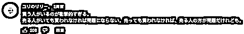

# 女大学生“新型性交易”曝光，卖沾唾液和口红的口罩挣钱！还接受特别订制

> 原文：[`mp.weixin.qq.com/s?__biz=MzIyMDYwMTk0Mw==&mid=2247541767&idx=1&sn=3e794e9c28c903ccb8ea00bd18c74ee7&chksm=97cbef3fa0bc662966ef90288647fdc9535c010511e49dc8fcc2d1ced0a15d7a4e347756bf91&scene=27#wechat_redirect`](http://mp.weixin.qq.com/s?__biz=MzIyMDYwMTk0Mw==&mid=2247541767&idx=1&sn=3e794e9c28c903ccb8ea00bd18c74ee7&chksm=97cbef3fa0bc662966ef90288647fdc9535c010511e49dc8fcc2d1ced0a15d7a4e347756bf91&scene=27#wechat_redirect)

大千世界，每天都在刷新着人们的认知。

二手平台惊现“原味内衣裤”生意，恋物癖高价收买，直白了说就是一定要穿过的。

而且越是穿了没洗的，越脏越是宝贝。

人有小众需求，是可以被理解的。

但最近看到的一则新闻，着实让我惊掉下巴并有些气愤。

如今疫情持续期间，佩戴口罩更是成为日常。

一般来说，戴一次性口罩，都是用完随手就扔了。

可没想到在日本，原味口罩正在疯狂售卖。

**价格是 1500 日元（约合人民币 78 元）花样繁多，可单买，可选套餐，甚至还可接受特别订制。**

**如果口罩上的口水、口红和粉底堆积的越脏越厚，售卖则越高。**

听起来似乎有点不可思议，

听说跟内衣一样，口罩也能卖，我震惊了。

卖内衣，穿需要一定的时间，内衣的成本也相对更高。而口罩的话，成本低廉，每天都戴，戴了一天就能卖，这可比卖内衣高效多了。”

普通人平常嫌弃的点，在“原味市场”上，竟然变成了最受欢迎的卖点。

紧要关头，谁给他们的胆子？ 

**在这条见不得光的交易链中，**

**未知的，只有你不敢想象的。**

02

在某社交网站上，搜索“原味口罩”几个关键字，便能出现好多“出售二手口罩”的相关帖子。

> **卖原味口罩的人，多为 18-25 岁的女生。**
> 
> “**因为手头缺钱，所以出售用过的口罩。**

在她们分享出来的照片中，能看出这些口罩上沾满了口红和粉底液。

光是隔着屏幕，都好像能闻到这些沾满化学物质和分泌物的罩布上散发出的异味。

放在生活中，可能早被丢掉垃圾桶里集中处理。

**但这儿，这些脏兮兮的口罩标价为 1000 日元左右，折合人民币大约为 50 元，包邮。**

根据口罩上遗留物的种类，佩戴时间，价格会不同。

**“这是戴过 2 天的口罩。**

口罩被化妆弄脏了，介意的人请注意。

价格是 1500 日元（约合人民币 78 元）~”

**“这都是戴过 3 天以上的口罩"。**

口罩上面沾了口红，感觉色色的。

这 3 个口罩，1500 日元包邮。

还可选择特别订制沾了唾液、尿液的口罩。”

有些女生如果愿意将自己戴着口罩的照片连同发出来，就能卖更高的价钱。

并且制定出了专业明确的价格表：

口罩沾满化妆品加 300 日元，有戴口罩的照片加 300 到 500 日元，连续戴过两天及以上，最高可加 1000 日元。

甚至出现了支持全系残留物定制的价目表，

**粘痰、尿液，在这里也是加分的条件之一。**

相信大多数人看到这里，感受都和这位网友差不多：

但这些卖口罩的女生们，并没觉得有什么不妥，甚至还会有种骄傲和满足感。

疫情期间，打工的收入为零，需要寻找其他赚钱的方法。

用过的口罩，反正都是白白丢掉，居然能卖钱，真的不错。

卖了两单后，我就拿钱去买化妆品了。

口罩不同于内衣内裤这种私密性强的物品，在贩卖原味的行列中，还有一些庆幸：

**匿名发货的话，反正也不知道是谁在卖，介意卖原味内衣的话，那么卖原味口罩，自己倒是可以接受。**

**至于感染的危险性？那是购买者的责任吧。”**

如果对方有需求，还可以当面交易。

在记者采访时，有位女大学生就直接从脸上摘掉戴了许久的口罩，熟练的装进袋子里，递上去。

**这两枚口罩共售 2000 日元，折合人民币 100 元。**

只需要两分钟，就能挣到打工一天的钱。

何乐而不为？

03

有需求，就会有市场。

从释放欲望的角度来说，贩卖原味似乎算不上滔天大错。

一个愿打一个愿挨而已。

但欲望是无止境的。

看到这样的事情，很多见多识广的日本网友也是震惊了，

“就算变态如我，也无法接受别人用过的口罩。"

“我根本想都不会想要一个用过的口罩啊。

卖家和买家都好古怪，这件事中最让我惊讶的是，他们都知道这事的怪异还继续。”

“居然有人买也太吓人了。如果有人卖这种玩意，那没有人买也说得过去，那样卖东西的人有问题。”

“这些原味口罩，真的就是卖家本人用过的吗？

怎么证明呢？

可能是路边或垃圾桶里捡回来的口罩。

作为买家来说，没考虑过这种可能嘛。”

“就不担心感染的危险性？

时代真是变了……”

“虽然我能理解，人与人之间价值观的差别是超乎想象的。

看来我还是太天真了……”

但抛开这些，从理性分析，贩卖二手口罩到底是不是违法？

至少在中国，是行不通的。

**根据《中华人民共和国价格法》规定，**

**利用其它手段哄抬价格，推动商品价格过快、过高上涨的行为，都可以对商家做出罚款的行政处罚。**

个人行为也是同样。

其实，无论是二手内衣还是二手口罩，终究目的还是去满足那些“性缺乏”的人。

说它是一种间接性交易，也不为过。

**今天就可能成为用“原味口罩”赚钱的人，**

**那明天，如果环境更糟糕。**

在更大的诱惑面前，她们会不会跨过底线去做更过分的事？

如何满足自己的欲望和癖好，是个人道德感和价值观的事。

**法律只有标准，没有同情心。**

**没有一个人置身事外。**

**这些潜在的危害，和每个人息息相关。**

来源：话痨 幸福小酒馆

](http://mp.weixin.qq.com/s?__biz=Mzg5ODAwNzA5Ng==&mid=2247488098&idx=3&sn=638c5dd62ca652e1a1f2fd5b8420b00f&chksm=c0687b35f71ff223bca5031da035e3ab56f77f3ecfe42e587322e6e0f1302dc4d3e3fb354f18&scene=21#wechat_redirect)

← 向右滑动与灰产圈互动交流 →

