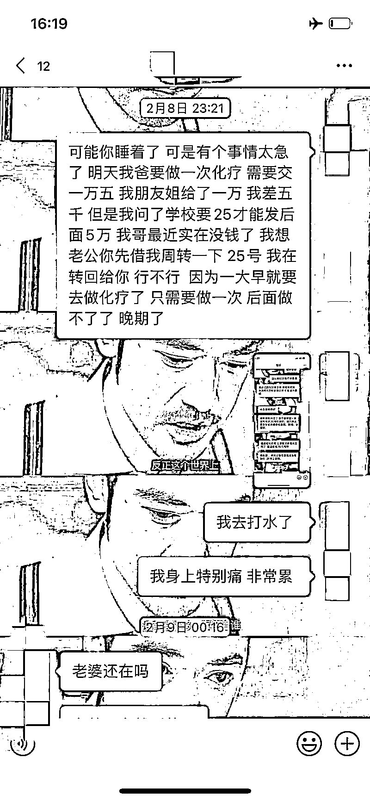
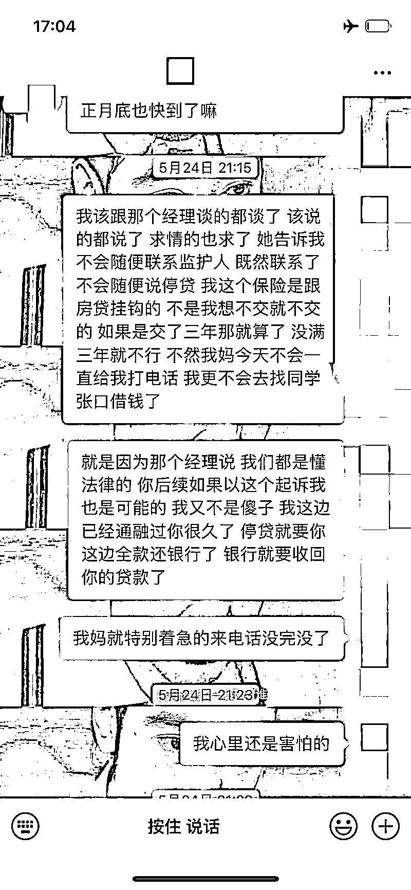
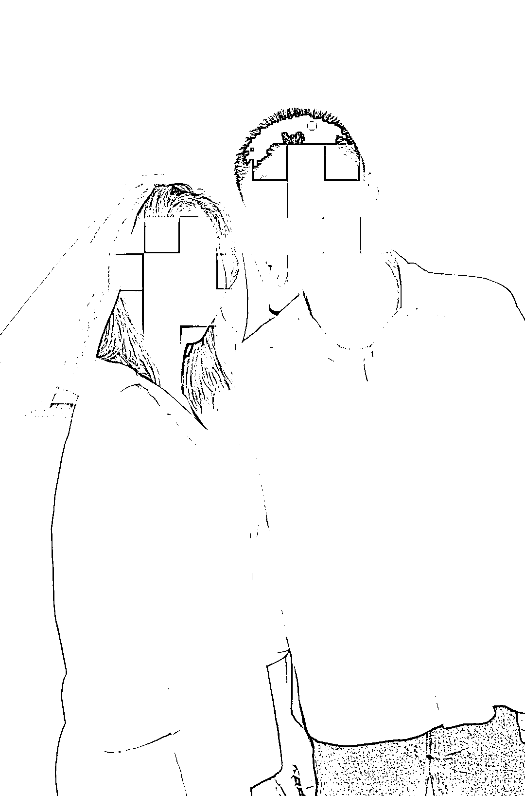

# 29 岁已婚女同时交往 18 名男子！有人还为她卖了房…

> 原文：[`mp.weixin.qq.com/s?__biz=MzIyMDYwMTk0Mw==&mid=2247541767&idx=5&sn=69481a7b4991c5b9b9028cc62f44f5cc&chksm=97cbef3fa0bc66290d9bb04daa3b98ab68eeb7bd3d9f965b904b82b55d773f7215db6bbf23d6&scene=27#wechat_redirect`](http://mp.weixin.qq.com/s?__biz=MzIyMDYwMTk0Mw==&mid=2247541767&idx=5&sn=69481a7b4991c5b9b9028cc62f44f5cc&chksm=97cbef3fa0bc66290d9bb04daa3b98ab68eeb7bd3d9f965b904b82b55d773f7215db6bbf23d6&scene=27#wechat_redirect)

为维持所谓的“高品质”生活

**一隐婚女子游走于多名单身男子之间**

**最多时**

**曾同时与 18 名男子保持暧昧关系**

**并与其中 4 人发展成为男女朋友**

而待感情升温、谈婚论嫁之时

各种借钱套路便接踵而来

……

近日

上海普陀警方侦破一起婚恋诈骗案件

**涉案金额高达 200 余万元**

今年 7 月初，市民王华（化名）来到普陀公安分局真如派出所报案，他被前女友伍某诈骗了近 90 万元。2013 年初，爱好摄影的王华结识了兼职模特伍某，经过一段时间的接触，两人于 2017 年发展成为男女朋友。随着感情逐步升温，伍某甚至提出与王华一起去拍结婚照、选购婚房，并开始憧憬两人未来的美好生活。

就在两人你侬我侬之时，伍某说她家突发变故，父亲得了重病需要 10 万元治疗。早已把伍某视作未来妻子的王华毫不犹豫地将钱转了过去。

而在接下去的几年里，伍某时不时地以弟弟结婚购买婚房缺钱、表哥被公安机关处理需要交纳保释金、继承养父母遗产缴税等理由，向王华先后累计借款近 90 万元，王华为此还背负了不少网贷。

微信聊天截图（警方供图）

2021 年下半年，王华偶然发现伍某在与自己交往期间同时与另一男子李方（化名）在交往，便向伍某讨要说法。**王华发现伍某对自己之前的诸多借钱理由都无法自圆其说，甚至伍某在与其交往之前便已结婚，并与丈夫曾某育有一子。**而之前那位被公安机关处理过的表哥，则是伍某偷偷用丈夫曾某的手机编造出来的。

2021 年下半年，王华偶然发现伍某在与自己交往期间同时与另一男子李方（化名）在交往，便向伍某讨要说法。**王华发现伍某对自己之前的诸多借钱理由都无法自圆其说，甚至伍某在与其交往之前便已结婚，并与丈夫曾某育有一子。**而之前那位被公安机关处理过的表哥，则是伍某偷偷用丈夫曾某的手机编造出来的。

警方根据王华提供的线索，结合现场走访，发现李方也被伍某以同样的套路“借”走 100 余万元，李方为借款给伍某还将自己唯一的住房变卖。进一步深入调查，民警竟又找到了与伍某明确关系的另两位“男友”，其中一人已被其“借”走了近 10 万元，而另一人则刚刚开始被“套路”，还未借款。在掌握了一定证据后，民警在平凉路某小区内将伍某抓获。

到案后，伍某如实向民警供述了自己多次虚构借款事实向 3 名男友诈骗钱财的犯罪事实。

**原来，伍某于 2012 年来沪打工时了认识了曾某，2014 年 10 月，刚满 21 岁的伍某与曾某结婚。**婚后，不满足于平淡的生活和收入，年轻的伍某开始兼职做起了平面模特，并开始申请网贷，购买奢侈品包、名牌化妆品，频繁出入豪华饭店，过起了自以为的高品质生活。但每月都保持着还贷、借贷的状态，时间一长，入不敷出的伍某发现自己渐渐难以支持下去。

由于在兼职模特期间，伍某始终以单身自居，身边一直不乏追求者。**于是，伍某动起了歪脑筋，从这些追求者中物色条件不错的单身男子，并自称“奔着结婚为目的”与多人谈起了恋爱。**

在此期间，伍某虚构多种理由向“男友”们“借款”，事实上，“借”来的钱全部被其用来偿还网贷以及继续维持高品质生活。

因根本无法兑现结婚的承诺，伍某考虑过向王华等人归还部分“借款”，便不停物色新男友，企图拆东墙补西墙。据伍某交代，最高峰时，她曾同时与 18 名男子保持着暧昧联系。

伍某与“男友”的结婚照（警方供图）

目前，犯罪嫌疑人伍某因涉嫌诈骗罪已被普陀警方依法采取刑事强制措施，案件正在进一步侦办中。

来源：海南特区报，利箭在行动

](http://mp.weixin.qq.com/s?__biz=Mzg5ODAwNzA5Ng==&mid=2247488098&idx=3&sn=638c5dd62ca652e1a1f2fd5b8420b00f&chksm=c0687b35f71ff223bca5031da035e3ab56f77f3ecfe42e587322e6e0f1302dc4d3e3fb354f18&scene=21#wechat_redirect)

← 向右滑动与灰产圈互动交流 →

