# 活久见！面对面被骗走一个亿！

> 原文：[`mp.weixin.qq.com/s?__biz=MzIyMDYwMTk0Mw==&mid=2247541767&idx=6&sn=5a2f1cc74f3ca3eb869cd2ea25ebf77c&chksm=97cbef3fa0bc662944e85b60ac1a3901dbafda0da372f5fa55245c1f1c31bd529e440254be72&scene=27#wechat_redirect`](http://mp.weixin.qq.com/s?__biz=MzIyMDYwMTk0Mw==&mid=2247541767&idx=6&sn=5a2f1cc74f3ca3eb869cd2ea25ebf77c&chksm=97cbef3fa0bc662944e85b60ac1a3901dbafda0da372f5fa55245c1f1c31bd529e440254be72&scene=27#wechat_redirect)

为了增加彼此信任 

保证交易安全与顺畅

许多公司在签约前

会要求对方显示资金实力

这就是传说中的“亮资”

但有人竟然利用了这样的验资手段

炮制了一起连环谜局

**金蝉脱壳**

1 月 24 日下午 2 点多

有人报警称

在黄浦区北京东路的一家公司里

被人诈骗了一个亿

一亿元人民币的拆借资金

说好 3 小时原路返还

但没过半小时

就在眼皮子底下被人转走

报案人吴先生郁闷不已

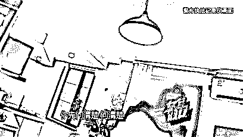

更让吴先生诧异的是

屋子里原本还有一名女子

不知何时离开了

而且对于这名女子

其他人似乎都讳莫如深

**明修栈道**

消失的陈姓女子到底是谁

还要从 2021 年年底开始说起

12 月的一天

专营亮资中介的薛理

接到了一个电话

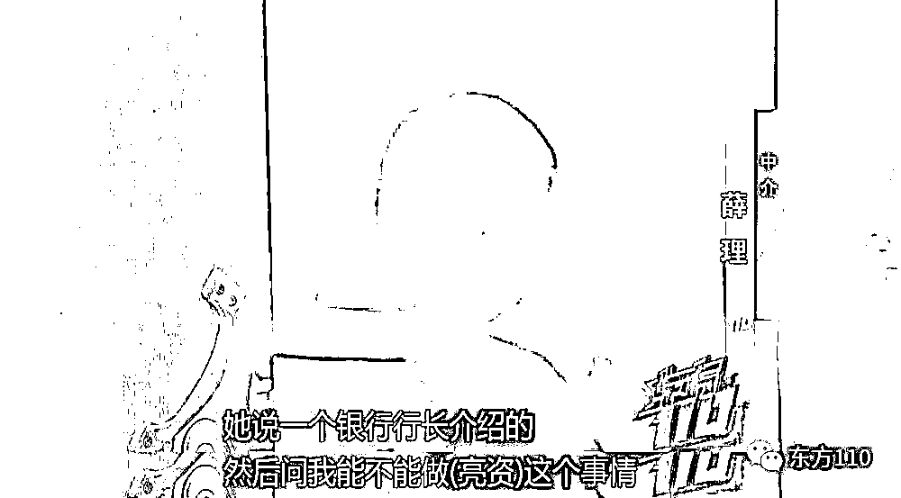

打来电话的正是陈姓女子

她仰仗着所谓的熟人关系

透露她所在的赛琦霞贸易公司

即将要和一家福建公司做一笔大买卖

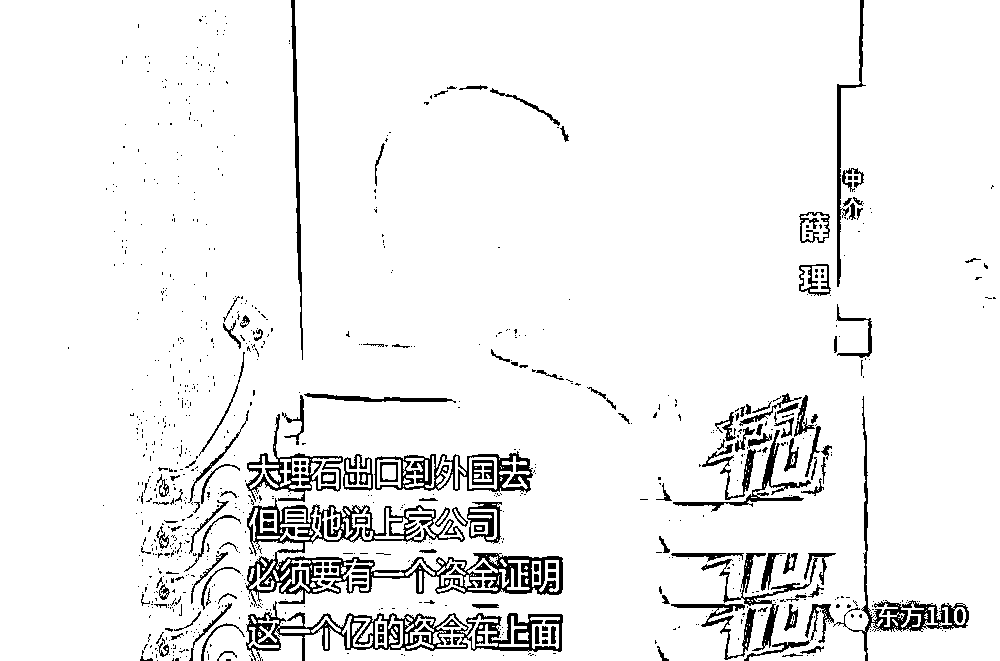

要做成这笔合约七亿的生意

就必须先亮资一亿元

薛理辗转找到了吴先生公司

三方最后谈妥

一个亿资金可以拆借

拆借时间 3 小时

拆借费用 22 万元

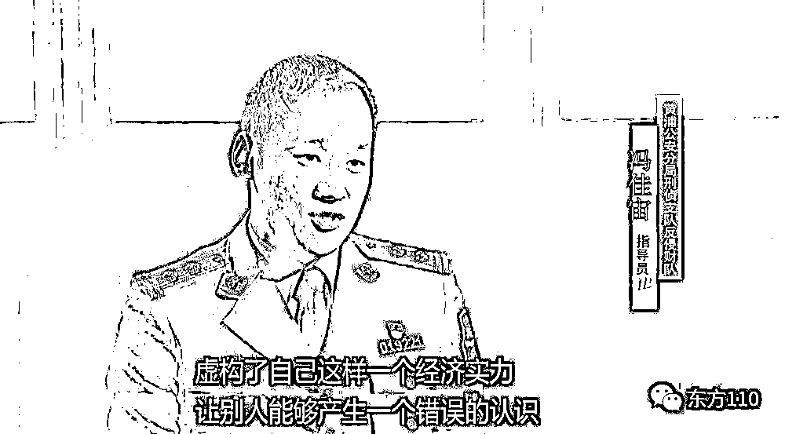

2022 年 1 月 22 日

双方就在赛绮霞公司的办公室里

签定了一份“借款暨担保合同”

吴先生公司工作很是细致

对整个签约过程专门进行了录像

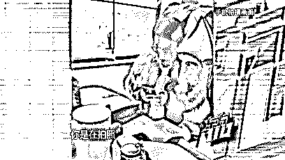

对于录像

画面左侧的陈姓女子颇有反感

但或许因为箭在弦上

她最后还是留下了身份信息

署名陈辉华

**暗度陈仓**

对任何人来说

一个亿的资金绝不是一笔小数目

吴先生公司为什么愿意拆借呢

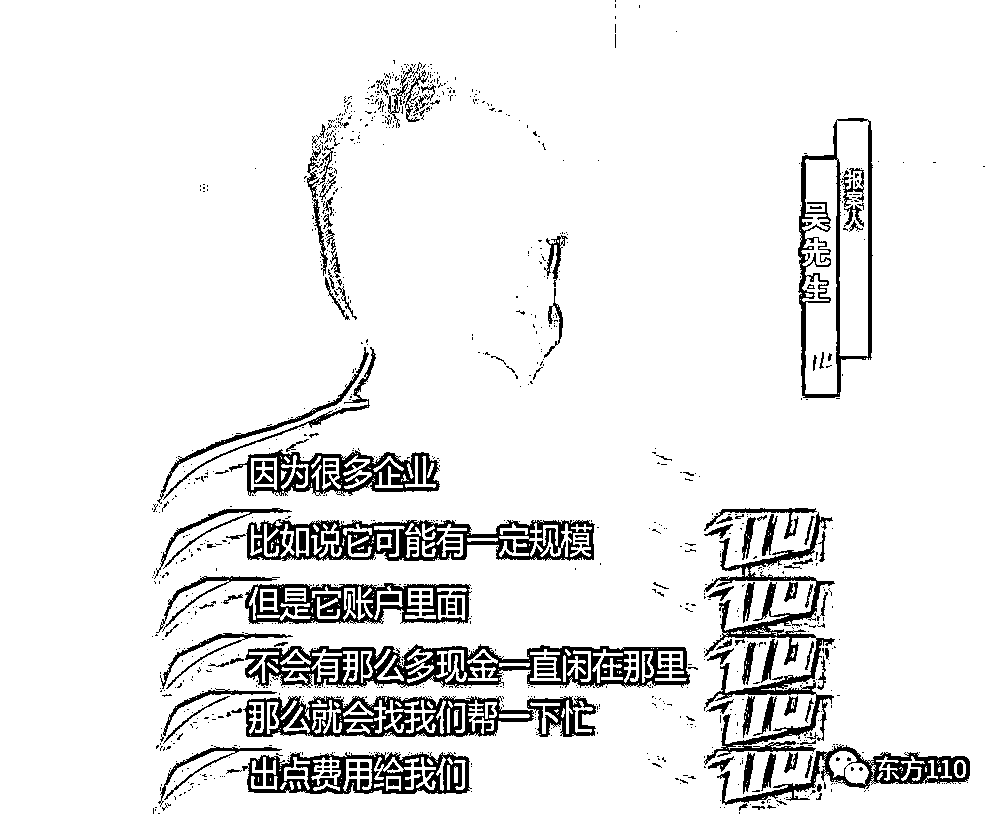

生意场上

“多个朋友多条路”

“帮别人就是帮自己”

在吴先生公司看来

如果能确保资金本身安全

时间短、回报快的资金拆借

何乐而不为

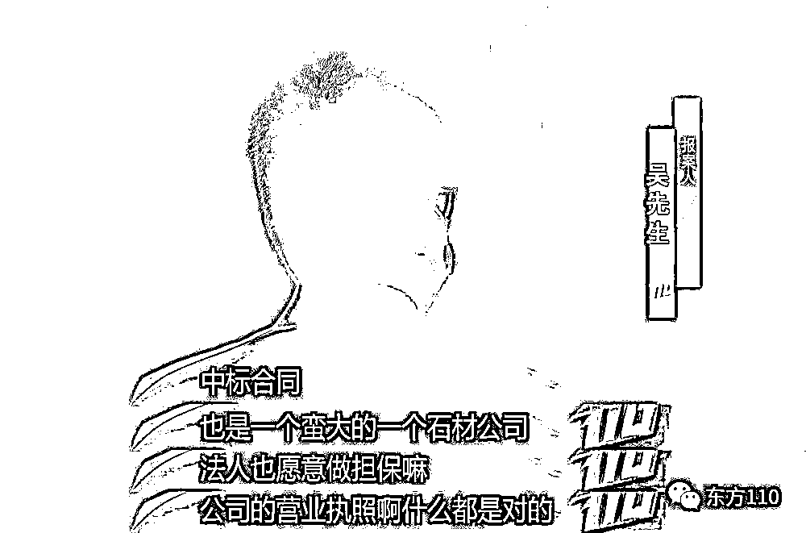

公司风投调查报告显示

赛绮霞公司经营正常

也没有任何黑历史

为了再上一把安全锁

吴先生公司还要求对方

在自己指定的银行开一个新账户

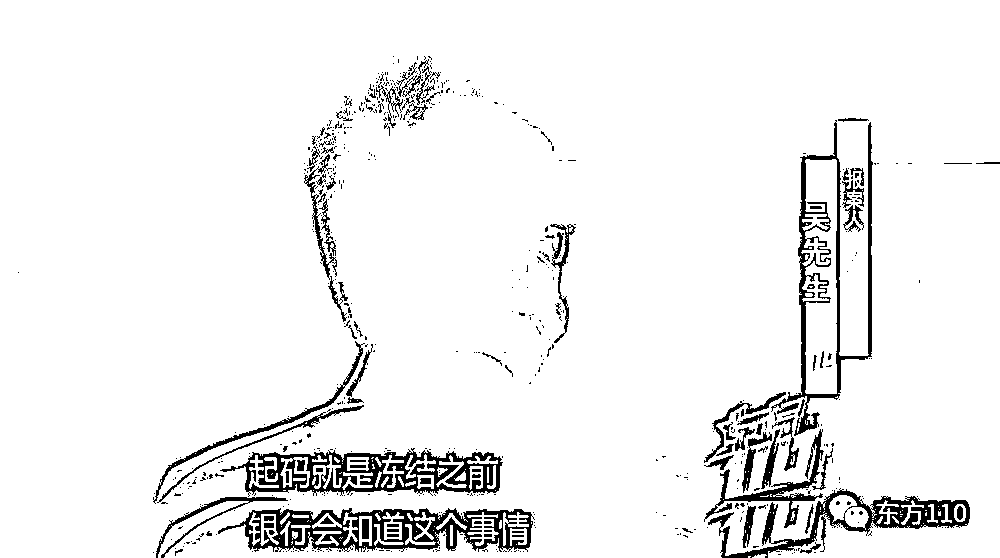

*①熟人买卖比较靠谱*

*②公司执照真实、经营正常*

*③对方法人愿意承担所有责任*

*④转账在指定银行账户上操作*

在吴先生公司看来

所有风险都在可控中

于是

1 月 24 日下午 1 点

吴先生亲自来到签约现场

由他按照约定向福建公司亮资

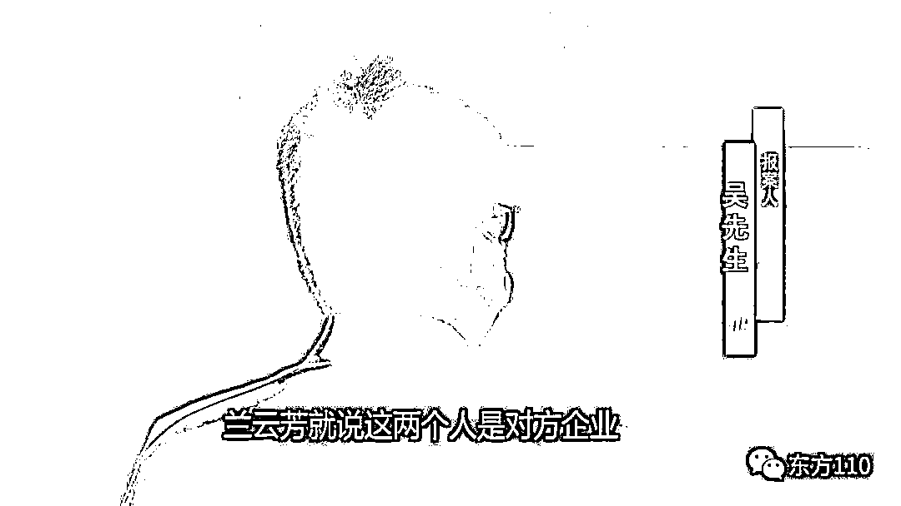

但谁都没想到

所有貌似万无一失的筹划

最后竟然彻底失算了

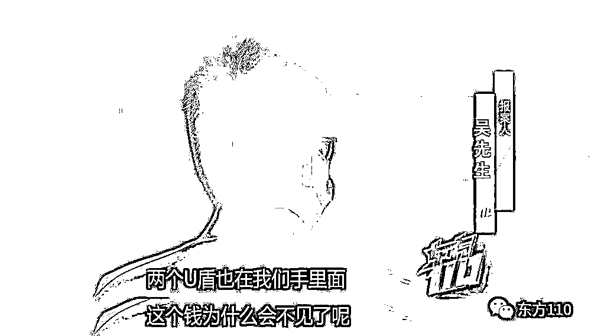

**张机设阱**

随着警方的介入调查

这个巨大的阴谋被逐步揭开

*新近注册的空壳公司*

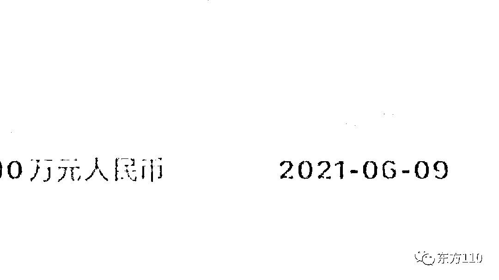

*游手好闲的公司法人*

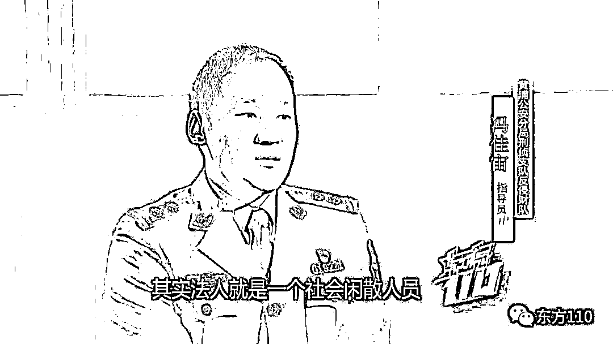

*临时租下的办公场地*

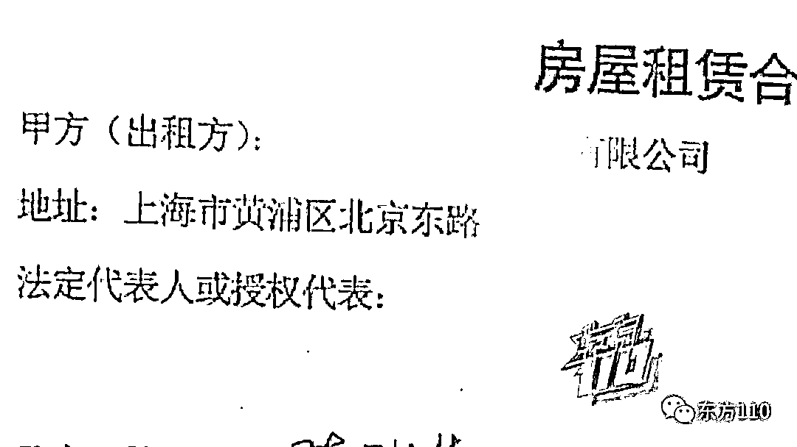

赛绮霞公司疑点重重

至关重要的是

留在现场的中标书以及合同

都是刻意伪造的

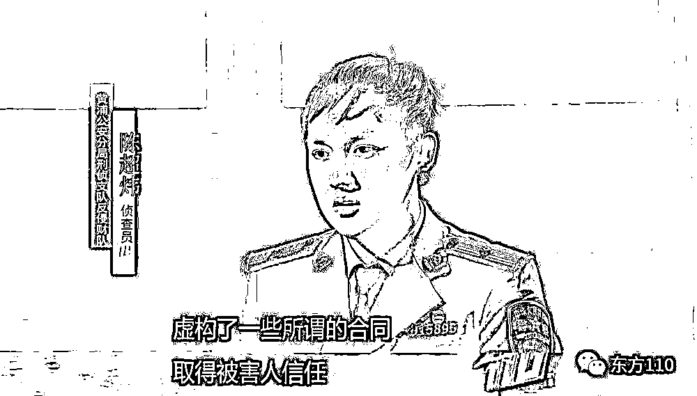

面对警方查实的铁证

所谓福建公司的员工只能坦白交代

承认是有人花钱

雇请他们来演戏的

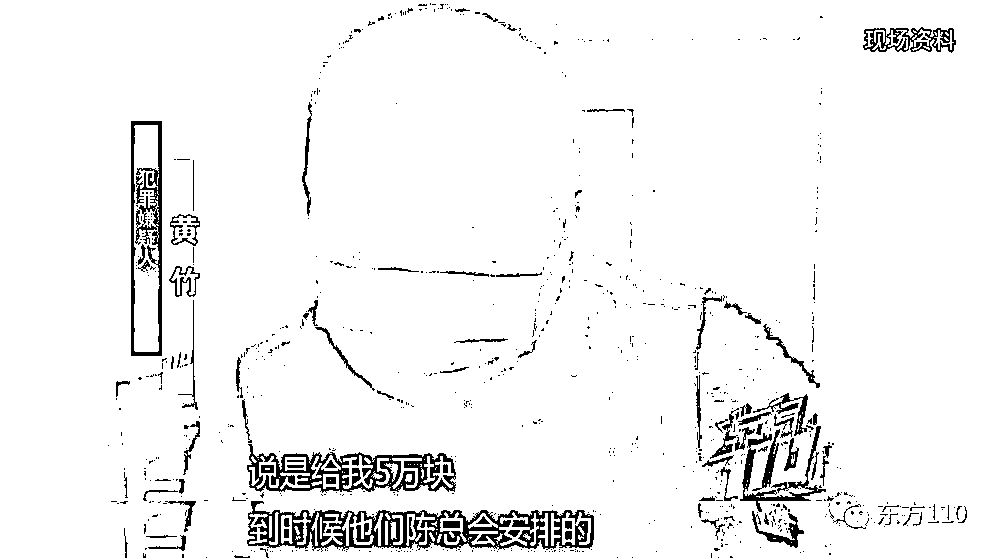

**瞒天过海**

经过调查

陈姓女子根本不叫陈辉华

真名陈莺

今年 50 岁

在一家小型娱乐场所任职

担任赛绮霞公司法人的兰云芳

正是她搭识多年的小姐妹

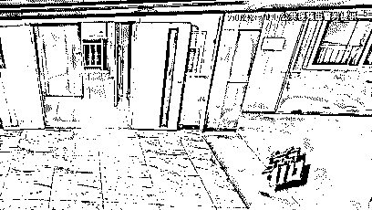

狡猾的陈莺

为了甩掉警方的追踪

可谓动足了脑筋

离开现场后

只见她换了装

先后去了静安、长宁、闵行

漫无目的兜了很大一个圈子

最后才回到了黄浦区的一家五星级酒店

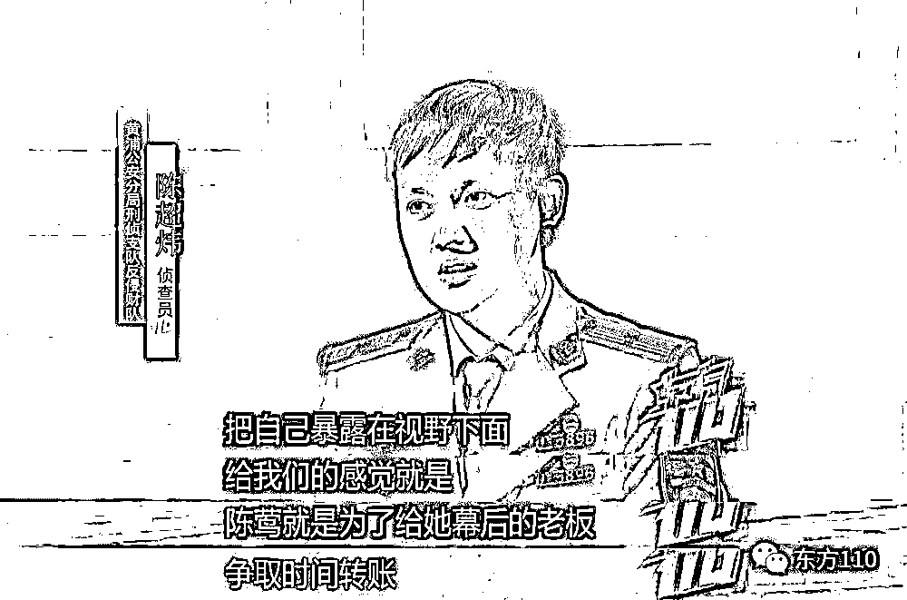

陈莺的行为看似老道

其实欲盖弥彰

警方由此产生了深深的疑问

在陈莺的背后

操纵着一切的老板

到底会是什么人呢

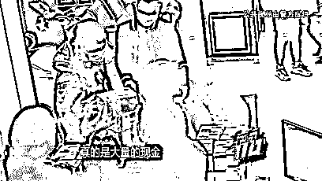

根据警方调查

赃款最终流向了一名男子

此人叫林福

户籍就在福建省福州市

难道这个林福就是隐匿幕后的“黑手”吗

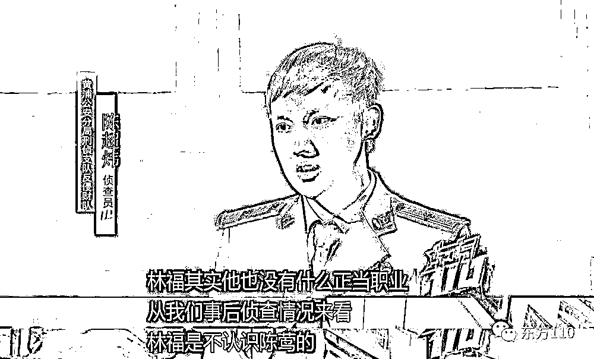

如果说林福就是幕后老板

他为什么又不认识陈莺呢

这里面

还有着怎样迂回曲折的故事

欲知详情

敬请收看今晚 7:15

新闻综合频道播出的《东方 110》

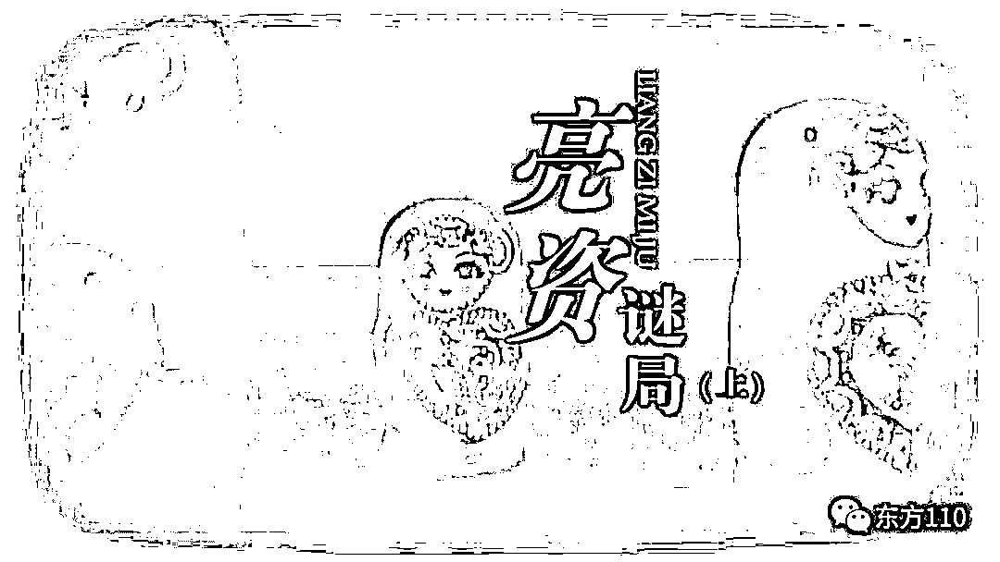

来源：东方 110，利箭在行动

](http://mp.weixin.qq.com/s?__biz=Mzg5ODAwNzA5Ng==&mid=2247488098&idx=3&sn=638c5dd62ca652e1a1f2fd5b8420b00f&chksm=c0687b35f71ff223bca5031da035e3ab56f77f3ecfe42e587322e6e0f1302dc4d3e3fb354f18&scene=21#wechat_redirect)

← 向右滑动与灰产圈互动交流 →

