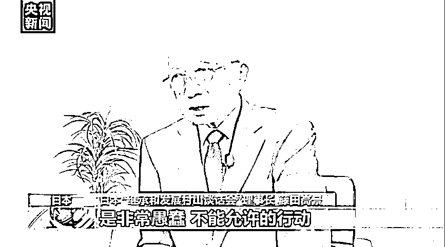

# 佩洛西窜访台湾，被多国政府发声明谴责

> 原文：[`mp.weixin.qq.com/s?__biz=MzIyMDYwMTk0Mw==&mid=2247541767&idx=7&sn=cb31733ab572d3e7fcd30af74347f190&chksm=97cbef3fa0bc6629641331c4e9596f5c490cada1f8b75c75d09de3c4e1ad8a834baf43232538&scene=27#wechat_redirect`](http://mp.weixin.qq.com/s?__biz=MzIyMDYwMTk0Mw==&mid=2247541767&idx=7&sn=cb31733ab572d3e7fcd30af74347f190&chksm=97cbef3fa0bc6629641331c4e9596f5c490cada1f8b75c75d09de3c4e1ad8a834baf43232538&scene=27#wechat_redirect)

据央视新闻，8 月 2 日，美国国会众议长佩洛西不顾中方强烈反对和严正交涉，窜访中国台湾地区。多国政府发表声明对此表示强烈谴责，并重申支持一个中国原则。

图片来源：视觉中国（资料图）

**多国政府发表声明**

**谴责佩洛西窜台**

**俄外交部声明：台湾问题纯属中国内政**

俄罗斯外交部当地时间 8 月 2 日发表声明表示，俄罗斯视佩洛西窜访台湾为公然挑衅。**台湾问题纯属中国内政，中方有权在台湾问题上采取必要措施，维护国家主权和领土完整**。

俄罗斯外交部表示，俄方原则立场是一贯的，即世界上只有一个中国，台湾是中国领土不可分割的一部分，中华人民共和国政府是代表全中国的唯一合法政府。

俄罗斯总统新闻秘书佩斯科夫也向媒体表示，**俄罗斯在台湾问题上同中国保持团结一致**。俄方尊重中国的主权和领土完整。

**巴基斯坦重申坚定奉行一个中国政策**

巴基斯坦外交部 8 月 2 日就佩洛西窜访中国台湾地区发声，**重申坚定奉行一个中国政策，坚定支持中国的主权和领土完整**。

**伊朗外交部发言人谴责美方干涉中国内政**

伊朗外交部发言人卡纳尼当地时间 8 月 2 日表示，尊重各国的主权是《联合国宪章》的基本原则之一，他警告美国作为联合国的一员，**不要做出任何损害他国主权和领土完整的行为**。卡纳尼表示，**伊朗坚持一个中国原则**。近期美国官员干涉中国内政和严重侵犯中国主权和领土完整的行为，是美国对全球不同地区和国家实施干预的又一个例子，这种行为只会导致局势紧张和争端加剧。

**朝鲜外务省强烈谴责佩洛西窜访台湾**

当地时间 8 月 3 日，朝鲜外务省发言人就佩洛西窜访中国台湾地区答记者问时表示，中国已多次表明坚决反对佩洛西窜访台湾的立场，必须对此采取坚决有力措施，并主张由此造成的一切后果完全由美国负责。当前情况表明，**美国无耻的内政干涉行为和蓄意的政治军事挑衅是破坏地区和平与安全的祸根**。**台湾是中国不可分割的一部分，台湾问题属于中国内政**。针对外部势力公然干涉本国内政、破坏领土完整的行为，**采取有力措施予以坚决应对和反制是主权国家的应有权利**。

**古巴外交部：坚定支持一个中国原则**

古巴外交部当地时间 8 月 2 日发表声明，重申坚定支持一个中国原则，承认台湾是中国领土不可分割的一部分。声明说，古巴外交部坚决反对任何旨在损害中国主权和领土完整的行为，谴责干涉中国内政的行径。声明称，美国及其盟国在台湾海峡的挑衅政策和军事存在，以及军事勾连、对台军售等行为破坏区域及国际和平与安全，直接导致台海紧张局势升级，古方对此表示关切。

**委内瑞拉外交部重申坚定支持一个中国原则**

当地时间 8 月 2 日，委内瑞拉外交部在社交媒体上发文称，**佩洛西窜访中国台湾地区是直接的挑衅行为，严重威胁了中国的主权和领土完整，委内瑞拉重申坚定支持一个中国原则**。

**叙利亚外交部声明称完全支持中方立场**

当地时间 8 月 2 日，叙利亚外交部发表公开声明，**强烈谴责佩洛西窜访中国台湾地区**。声明说，这是与国际法不相符的敌对行径，也是美国持续在亚太和世界其他地区制造紧张局势的不负责任行径，严重威胁世界和平与安宁，并为本已敏感脆弱的全球局势增添动荡不安。

叙利亚重申将全力支持中方反对外部势力干涉内政。**叙利亚坚持一个中国原则，完全支持中方反对佩洛西窜访台湾的立场，支持中方为捍卫国家主权和领土完整采取一切措施和行动**。

**巴勒斯坦重申支持一个中国原则**

据巴勒斯坦官方通讯社瓦法通讯社报道，巴勒斯坦当地时间 8 月 2 日重申其**一贯支持中华人民共和国主权和领土完整，充分尊重一个中国原则**。巴勒斯坦呼吁停止任何违背一个中国原则的行动，同时肯定中国捍卫其主权、安全和发展利益的权利。

**尼加拉瓜外交部强烈谴责佩洛西窜访台湾**

当地时间 8 月 2 日，尼加拉瓜外交部长蒙卡达发表声明表示，**尼加拉瓜政府强烈谴责美国众议长佩洛西窜访中国台湾地区**。声明指出，实现祖国完整统一是中华民族全体人民的共同愿望和责任，人民意志不可挑战，时代潮流不可逆转。尼加拉瓜政府完全支持中国政府和人民在台湾问题上的立场和表态，支持中方坚定不移地捍卫国家主权和领土完整。声明强调，任何国家、力量和个人都不应低估中国政府和人民捍卫主权和领土完整的坚定决心和能力。

此外，柬埔寨等国也反对美国侵犯中国主权的行径，重申坚持一个中国原则。

**多国人士谴责佩洛西窜台**

据央视新闻，对于美国国会众议院议长佩洛西 8 月 2 日窜访中国台湾地区，多国人士严正指出，佩洛西到中国台湾地区活动挑战一个中国原则是徒劳无益的，世界始终支持一个中国原则。佩洛西此举严重破坏了国际法和国际关系基本准则。

当地时间 2 日，日本“继承和发展村山谈话会”理事长藤田高景接受中央广播电视总台记者采访时表示，美国在台湾问题上制造事端是不负责任的，一个中国原则是公认的国际关系准则。

**日本“继承和发展村山谈话会”理事长 藤田高景：**美国自尼克松总统时代就承认台湾是中国的一部分，允许国会众议院议长这样的重要政要窜访中国台湾地区是对中国的挑衅，只会加剧亚洲的紧张局势，**是非常愚蠢、不能允许的行为**。

**尼加拉瓜国际问题专家 马努埃尔·埃斯皮诺萨：**我认为美国政府的这一行为是非常不负责任的，也是非常鲁莽的。这是对和平与国际法的挑衅，对各国和平共处的挑衅。基于当前情况，我认为美国此举既挑衅了全球安全，也没有做到像《联合国宪章》要求的那样，推动维护国际和平局势。

巴西主流媒体“巴西 247”新闻网站负责人莱昂纳多·阿图奇接受总台记者采访时表示，美国国会众议院议长窜访中国台湾地区的行径，公然违反了中美三个联合公报，违反国际法、对世界和平造成威胁。

委内瑞拉国际关系专家、亚洲政治研究员胡安·迪亚兹·费列尔博士表示，美国的挑衅行为与民主党在中期选举的前景不明朗有关系，也是为了转移国内通胀高企、经济衰退的矛盾。

**委内瑞拉国际关系专家 胡安·迪亚兹·费列尔：**美国的经济现状很糟糕，正在经历衰退和严重的通胀，汽油价格上涨，激起强烈不满，总统的民调结果也很不好。面对这些情况，让人不禁想到，**美国需要的就是做出挑衅，转移美国人民对于政府自己造成的问题的关注**。

**多国政党坚决反对**

**佩洛西窜台**

据央视新闻，8 月 3 日，世界多国政党通过多种方式向中共中央对外联络部表示，坚决反对美国国会众议长佩洛西窜访中国台湾地区，认为此举严重侵犯中国主权和领土完整，破坏台海和平稳定。各方重申坚持一个中国原则，呼吁美方立即停止干涉中国内政。

俄罗斯共产党中央第一副主席、俄国家杜马第一副主席梅利尼科夫表示，佩洛西窜访台湾地区是对中国的公然挑衅，违背中美两国政府达成的一系列协议，是美方破坏全球局势稳定的又一例证。俄共坚定支持中国人民为维护国家主权和领土完整所作努力。

巴基斯坦农工党书记处发表声明，对佩洛西窜访台湾地区表示严重关切，认为美国干涉中国内政的行径不可接受，呼吁美方切实遵守中美三个联合公报，尊重中国实现国家统一的努力。

埃及共产党表示，强烈谴责佩洛西窜访台湾地区，全力支持一个中国原则，相信中国共产党有智慧有能力取得胜利，挫败美国的阴险图谋。

巴西共产党主席桑托斯表示，佩洛西窜访台湾地区，公然违背美方在中美三个联合公报中所作承诺。台湾自古以来是中国不可分割的一部分，坚决反对美国威胁世界和平。

尼泊尔、孟加拉国、南非、阿根廷、匈牙利、葡萄牙、西班牙等 40 多个国家的 60 多个政党也纷纷对佩洛西窜访台湾地区表示坚决反对。

来源：每日经济新闻综合自央视新闻

](http://mp.weixin.qq.com/s?__biz=Mzg5ODAwNzA5Ng==&mid=2247488098&idx=3&sn=638c5dd62ca652e1a1f2fd5b8420b00f&chksm=c0687b35f71ff223bca5031da035e3ab56f77f3ecfe42e587322e6e0f1302dc4d3e3fb354f18&scene=21#wechat_redirect)

← 向右滑动与灰产圈互动交流 →

