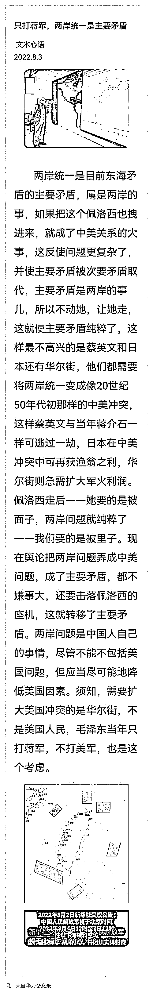

# "只打蒋军"

> 原文：[`mp.weixin.qq.com/s?__biz=MzIyMDYwMTk0Mw==&mid=2247541767&idx=8&sn=ed14afa72b660bd090513cac3f57abe8&chksm=97cbef3fa0bc6629833d1c8e8ac687a6f536617e82cead4c286a026775feea601888f251a0ff&scene=27#wechat_redirect`](http://mp.weixin.qq.com/s?__biz=MzIyMDYwMTk0Mw==&mid=2247541767&idx=8&sn=ed14afa72b660bd090513cac3f57abe8&chksm=97cbef3fa0bc6629833d1c8e8ac687a6f536617e82cead4c286a026775feea601888f251a0ff&scene=27#wechat_redirect)

文 观察者网专栏作者 张文木

北京航空航天大学战略问题研究中心教授

两岸统一是目前东海矛盾的主要矛盾，属是两岸的事，如果把这个佩洛西也拽进来，就成了中美关系的大事，这反使问题更复杂了，并使主要矛盾被次要矛盾取代，主要矛盾是两岸的事儿，所以不动她，让她走，这就使主要矛盾纯粹了，这样最不高兴的是蔡英文和日本还有华尔街，他们都需要将两岸统一变成像 20 世纪 50 年代初那样的中美冲突，这样蔡英文与当年蒋介石一样可逃过一劫，日本在中美冲突中可再获渔翁之利，华尔街则急需扩大军火利润。

佩洛西走后一一她要的是被面子，两岸问题就纯粹了——我们要的是被里子。现在舆论把两岸问题弄成中美问题，成了主要矛盾，都不嫌事大，还要击落佩洛西的座机，这就转移了主要矛盾。

两岸问题是中国人自己的事情，尽管不能不包括美国问题，但应当尽可能地降低美国因素。

须知，需要扩大美国冲突的是华尔街，不是美国人民，毛泽东当年只打蒋军，不打美军，也是这个个考虑。

来源：观察者网](http://mp.weixin.qq.com/s?__biz=Mzg5ODAwNzA5Ng==&mid=2247488098&idx=3&sn=638c5dd62ca652e1a1f2fd5b8420b00f&chksm=c0687b35f71ff223bca5031da035e3ab56f77f3ecfe42e587322e6e0f1302dc4d3e3fb354f18&scene=21#wechat_redirect)

← 向右滑动与灰产圈互动交流 →

