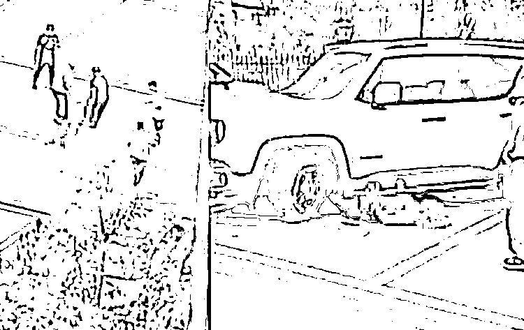
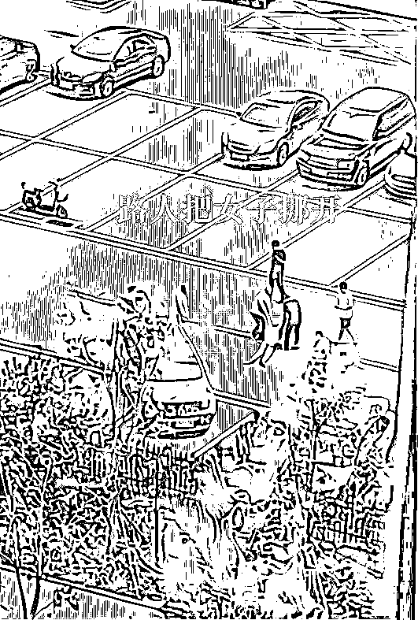

# 唐山事件女子身亡！监控细节惹怒全网！知情人透露动机原因…

> 原文：[`mp.weixin.qq.com/s?__biz=MzIyMDYwMTk0Mw==&mid=2247541804&idx=1&sn=22d69b88b79a69adb939b7417cf7a521&chksm=97cbef14a0bc6602c202d219482d80aae6df4fa97a61a31e3a7af57db461d04d8ebf32233c2b&scene=27#wechat_redirect`](http://mp.weixin.qq.com/s?__biz=MzIyMDYwMTk0Mw==&mid=2247541804&idx=1&sn=22d69b88b79a69adb939b7417cf7a521&chksm=97cbef14a0bc6602c202d219482d80aae6df4fa97a61a31e3a7af57db461d04d8ebf32233c2b&scene=27#wechat_redirect)

又是唐山！
**8 月 2 日，唐山再曝杀人案！**距 6 月份唐山打人事件才过去一个多月，又有人顶风作案！并且这次事件更为恐怖，极度残忍！！！********

********男子驾车反复碾压女友致死…********

[`mp.weixin.qq.com/mp/readtemplate?t=pages/video_player_tmpl&action=mpvideo&auto=0&vid=wxv_2514182135633641472`](https://mp.weixin.qq.com/mp/readtemplate?t=pages/video_player_tmpl&action=mpvideo&auto=0&vid=wxv_2514182135633641472)

视频来源：澎湃新闻

2022 年 8 月 2 日 11 点 50 分左右，唐山某游泳馆门前，停了许多私家车，

其中一辆白色私家车格外显眼， 

**一名男子驾车先是将一名穿着短袖的金发女子撞倒在地上，**

女子被撞倒后双手拼尽全力地抵住车身，

嘴里还不停发出嘶吼声，喊声中充满恐惧和绝望。

女子失去了意识躺倒在地，

随后，现场几名男子连忙走上前去，

**将这名女子从白车旁拖走，想要通过这种方式躲避行凶者。**

****

然而，此时的施暴者男方已经陷入疯狂之中，

**突然发动车辆，猛地朝女子冲了过去，完全无视路人的阻止，**

尽管女子背后停着一排车，但是男子依然毫不犹豫地连人带车撞了上去。

在撞击一次之后，又再次启动车辆，绕一个圈之后再次撞击，

**随后又在停车场内绕圈，多次碾压女子后驾车离去。**

路人很想施救，但是白车内的男子就好似发疯了一般，旁边的人都恐惧地大叫。

**女子在送医之前已经遭受了多次碾压，最终抢救无效，不幸离世。**

事件曝光后，火速爆榜。

短短几个小时就达到了惊人的 7 亿阅读量！

“撞倒”、“碾压”、“逃离”、“女友”，这些词语串联起来让人窒息。

真的难以想象日光之下竟会发生如此恶劣，如此可怕的事情。

**事发 3 小时左右，公安机关将嫌犯张某抓获归案。张某与被害人王某为情侣关系。**

有知情人士表示，女方为游泳馆的工作人员，

**男子多次来到游泳馆与其纠缠，此前她被男子在游泳馆打过好几次。**

男子原本是有家庭的，为了和女方在一起，选择离婚抛妻弃子，

因为是过错方，男子将财产都留给了前妻和孩子，

本想跟女友王某追逐纯粹的爱情，没想到女友在他离婚后，**因为他没有房子，也没有多少钱，对他越来越冷淡。****更让他无法接受的是，女友又跟别人好上了，**男子在游泳馆打她的时候说她嫌自己没钱才劈腿，女友矢口否认，说是曾经的热情已经没有了。**没想到此次的讨论直接让男方疯狂起来，一定要致女子于死地。**这只是知情人透露的细节，具体细节还是要以官方调查结果为准。**不过即便是女方存在一些欺骗，男方的行为就合适吗？**化解矛盾纠纷难道只能通过这种极端的方式？难道就必须弄得鱼死网破？在表姐看来，这名女子完全罪不致死吧，**这名男子的行为不仅毁掉了女子以及她的家庭，同时也毁掉了自己的家庭。**

对此网友们也是纷纷表示：

“在男女感情的事情上不要纠缠，到你纠缠的时候，这男人已经不值得你花一分钟了。”

“这得是多大的仇恨啊！奉劝恋爱中和正准备恋爱的情侣们，一定要慎重交往！”

********

**男女关系，不是犯罪的保护伞**

前几天，广东汕头市，同样有一名女子在深夜被一个白衣壮汉当街暴打。

视频中，一个白衣壮汉对女子多次扯头、暴摔、扇脸、抽打，还想开车碾压！

[`mp.weixin.qq.com/mp/readtemplate?t=pages/video_player_tmpl&action=mpvideo&auto=0&vid=wxv_2504990956640059392`](https://mp.weixin.qq.com/mp/readtemplate?t=pages/video_player_tmpl&action=mpvideo&auto=0&vid=wxv_2504990956640059392)

所幸最后千钧一发之间，车上下来一个女孩拼命阻止了他。

在女孩的大声阻止下，该男才驾车逃离。

现场画面，惨不忍睹。

汕头警方发布通报，该男王某星，与被打女子刘某利系夫妻关系，因琐事发生口角，于是对她大打出手。目前警方已对王某星实施拘留。

仅因为发生口角，就要将自己的妻子置于死地。

而且招招致命，残忍血腥，殴打完后还想驱车碾压。

其行事之嚣张，暴行之凶狠，手段之残忍，令人震怖！

**按照暴行的恶劣程度来看，这属于赤裸裸的谋杀！**

**这已不是简简单单的“家暴”一词就能概述的！**

根据《中华人民共和国刑法》第二十三条规定：

> 已经着手实行犯罪，由于犯罪分子意志以外的原因而未得逞的，是犯罪未遂。对于未遂犯，可以比照既遂犯从轻或者减轻处罚。

所以，即使后来有人阻止施暴，导致王某星未能得逞，他也构成故意杀人未遂！

**行径如此恶劣，绝不能因夫妻关系大事化小，小事化了！**

**必须依法严惩暴力犯罪！**

写在最后

近年来，暴力侵害女性的事件多的让人痛心。

前有唐山打人事件，后有女子被丈夫暴打，现在又有女性被当街碾压致死。

每一次这些侵害女性、侵害弱势群体的事件曝光，都引起人们强烈愤怒和恐慌。

而每一次侵害案发生后，受害者有罪的观点也甚嚣尘上。

**人们总习惯于在悲剧中，揪出或凭空捏造出受害者的“弱点”，掷以最残忍的谴责。**

**“她肯定出轨了。”**

“一个巴掌拍不响。”

然而这些言论似乎忘记了，无论有什么样的情感纠纷，都不能成为伤害和杀人的借口！

亲密关系，不该是暴力的遮羞布和挡箭牌。

情感纠纷，也绝非罪犯的免死金牌、尚方宝剑。

**用“关系”弱化行为，本身就是对法律的一种轻怠！**

**无论有何前因，都必须坚持对暴力犯罪零容忍！**

在预防犯罪方面，严惩一次犯罪者，比教育一万次受害者学会保护自己要有用的多。

**唯有依法严惩罪犯和恶行，才能真正遏制暴力犯罪。**

**唯有建立和完善法律法规，才是对女孩最好的保护。**

来源： 不二表姐、拾言君

](http://mp.weixin.qq.com/s?__biz=Mzg5ODAwNzA5Ng==&mid=2247488098&idx=3&sn=638c5dd62ca652e1a1f2fd5b8420b00f&chksm=c0687b35f71ff223bca5031da035e3ab56f77f3ecfe42e587322e6e0f1302dc4d3e3fb354f18&scene=21#wechat_redirect)

← 向右滑动与灰产圈互动交流 →

