# 今天七夕，我们请台湾看烟花

> 原文：[`mp.weixin.qq.com/s?__biz=MzIyMDYwMTk0Mw==&mid=2247541804&idx=2&sn=bf2fc487dbab553d9d9caffdc049d108&chksm=97cbef14a0bc66020b665019ae8ef7eb387325037e11c08cd44f3d6b92b2b21ecb0d986b9646&scene=27#wechat_redirect`](http://mp.weixin.qq.com/s?__biz=MzIyMDYwMTk0Mw==&mid=2247541804&idx=2&sn=bf2fc487dbab553d9d9caffdc049d108&chksm=97cbef14a0bc66020b665019ae8ef7eb387325037e11c08cd44f3d6b92b2b21ecb0d986b9646&scene=27#wechat_redirect)

好了，开始今天的内容。 

今天是中国传统佳节七夕，海峡对岸是我们的台湾同胞啊。

大家都是炎黄子孙，身上流淌着华夏血液。

所以，值此佳节之际，从今天中午 12 点开始，**我们就请海峡对岸的台湾同胞们，近距离看了一场烟花秀。**

[`mp.weixin.qq.com/mp/readtemplate?t=pages/video_player_tmpl&action=mpvideo&auto=0&vid=wxv_2516914384028631041`](https://mp.weixin.qq.com/mp/readtemplate?t=pages/video_player_tmpl&action=mpvideo&auto=0&vid=wxv_2516914384028631041)

这是央视军事官方发布的视频。

很快，就有民众用手机拍摄了远程火箭弹发射的实时画面。

[`mp.weixin.qq.com/mp/readtemplate?t=pages/video_player_tmpl&action=mpvideo&auto=0&vid=wxv_2516918579037274113`](https://mp.weixin.qq.com/mp/readtemplate?t=pages/video_player_tmpl&action=mpvideo&auto=0&vid=wxv_2516918579037274113)

值得注意的是，这次我们的导弹直接从台湾岛上空划过，最后落在了台湾以东的海域。

在这么多年的历史上，这还是第一次。

导弹直接就从头顶划过，今天，能从头顶划过，明天，保不准就会有一两颗导弹失灵，偏离既定轨道，落在台湾岛上。

**毕竟，军事演习嘛，总是允许有一点误差的，对吧。**

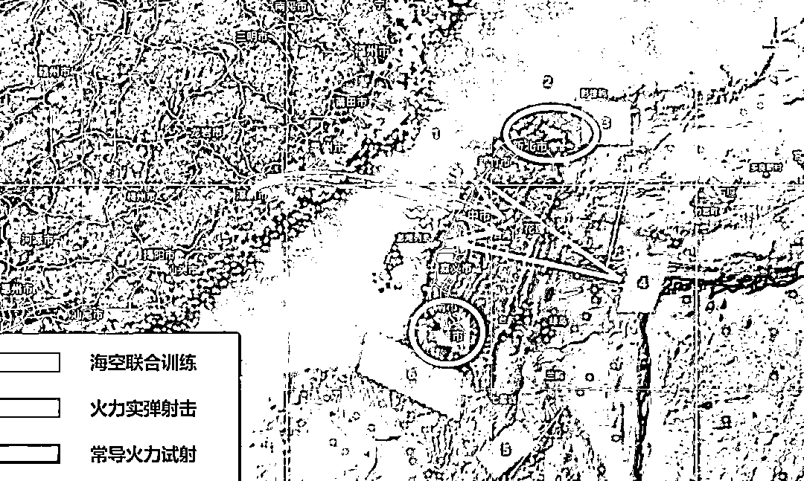

看到这，很多网友们都有疑问了，这一次，咱们打的是什么导弹呢，猜一猜？

好了，别猜了，就是我们常说的“东风快递”。

我是怎么知道的呢？因为这是人家台湾军方发言人自己讲的。

8 月 4 日下午 3 点，台湾军方发言人孙立方召开记者会，证实了解放军于今天下午 1 点 56 分起，向台湾岛东北部及西南部周边海域，发射多枚“东风”系列弹道导弹。

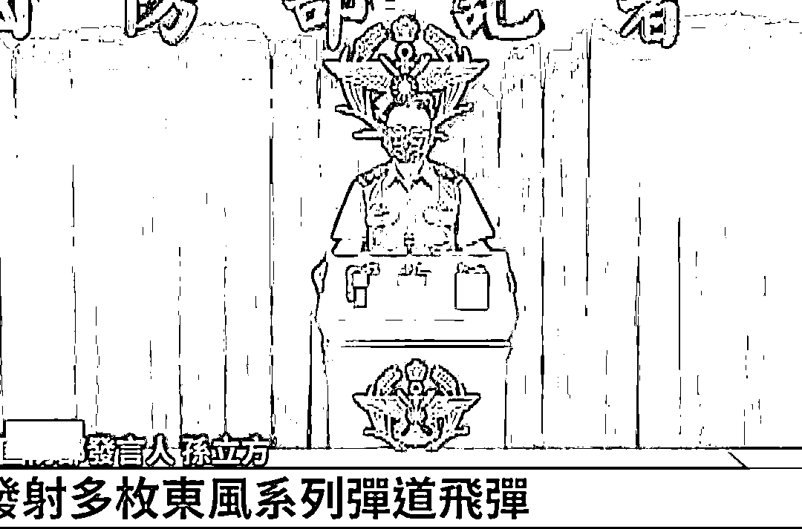

这还没完。

**在介绍完具体情况后，台湾军方的发言人，还对我们的这种行为，表示了强烈的谴责。**

我把他们“xx 部”给打码了。

不知道怎么的，看到这条新闻，我咋这么想笑呢。

**以前总是我们谴责别人，现在终于被别人给谴责一回了，这滋味，比喝下一瓶冰镇可乐都要爽。**

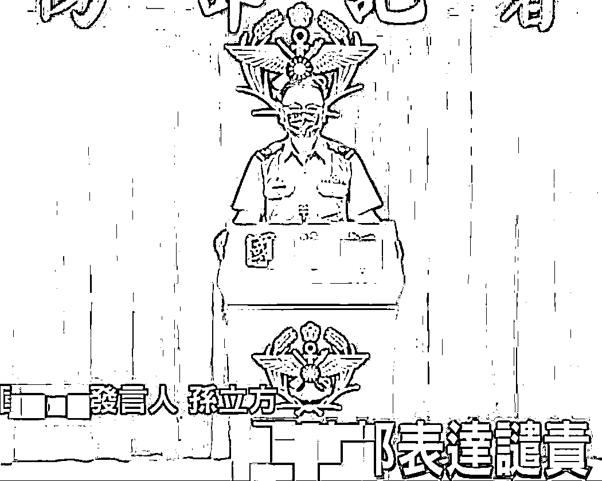

很快，就有媒体披露出了，我们这次打的是东风-15B。

在这，我就给大家简单的科普一下。

首先，东风-15B 是我军的短程固体弹道导弹，在 1999 年国庆阅兵首次亮相。

它的前身是东风-15，早在 90 代就大量装备了，96 年台海危机的时候也露过面。

东风-15B 的射程在 800-900 公里，和咱们现在最新款的东风 17 高超音速导弹那是根本不能比的，属于上个世纪的产品，比较落后了。

**不过嘛，看这距离也知道了，我军在这个距离上需要打击的目标不太多，东风-15B 基本算是为湾湾量身定制的。**

**至于，东风 17 嘛，那还是留给美国人吧。**

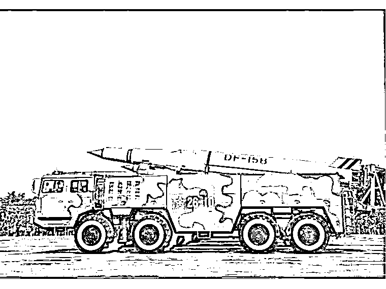

当然，大家也别觉得上个世纪的产品就有多落后了。

落后，只是相对于我们自己来说。

其实，放眼全世界，现在能研发这种弹道导弹的国家只有 15 个，而且，对于大多数国家来说，他们能造东风-15B 就算是天花板了，你要是造出来，周边国家都得叫你一声大哥的存在。

**但是，这个导弹目前在我国的定位大概相当于…普桑。**

**也就是，这款车，基本上在市面上绝迹了，老古董一样的存在。**

而我们现在最先进的东风-17，它拥有 2000 公里的射程，并且能高超音速滑翔变轨，拦截东风-17 目前在世界上还属于未解之谜。

当然了，看到这肯定有杠精要说了，你就算这导弹再落后，也不能乱用啊，军事演习，打打火箭炮就行了，现在火箭炮射程不也有几百公里吗？

好家伙，这直接拿东风快递去炸鱼，简直就是在浪费纳税人的钱！

听到这种说法，我在呵呵一笑的同时，也想告诉这些杠精们：

**目前的情况是，打东风-15B 这个导弹属于清库存，因为再不打过几年就退役处理了，不打白不打，与其让它退役，倒还不如送给海峡对岸的台湾同胞们，让他们听个响，看场烟花表演不香吗？**

四舍五入下来，咱们约等于没花钱。

所以啊，从清库存的角度上来说，咱们还得感谢老巫婆呢，不然咱们也没理由在这里狂刷火箭不是？ 

**台湾的老铁们，快来刷一波 666。**

**因为明天还有，后天，大后天你们都有烟花秀能看。** 

而且，现在根据台湾媒体报道，台“航港局”今日中午发布航船布告，为“解放军于台湾周边海域进行军演海域因应措施”，称“新增东部海域一处演习区域”，呼吁船只注意航行以策安全，演习时间也从 7 日延长至 8 日 10 时。

意思就是，咱们之前军演地点不是 6 处吗，台湾媒体报道我们增加到 7 处了，而且，还要再延长一天时间。

当然，咱们解放军现在还没有正式发布公告回应呢。

**毕竟嘛，咱们在自己家的海里炸炸鱼，延长就延长了，我中央的决定，还需要提前告知你一个台湾省政府吗？简直是在搞笑呢。** 

[`mp.weixin.qq.com/mp/readtemplate?t=pages/video_player_tmpl&action=mpvideo&auto=0&vid=wxv_2516914949085265922`](https://mp.weixin.qq.com/mp/readtemplate?t=pages/video_player_tmpl&action=mpvideo&auto=0&vid=wxv_2516914949085265922)

这次军演还在继续，关于详细信息，网上有其他博主都谈过了，我们也将继续关注。 

台湾那边的反应我倒是不再怎么在乎，他们还能怎么样啊，抗议抗议，严正抗议，外加一个谴责啊，还能玩出花来吗？

这一次，我倒是格外关注日本的反应。

为什么呢？

**因为咱们这次台海大军演的区域，火力已经覆盖日本到了所谓专属经济区，可日本这次却不敢抗议。**

**日本人虽然表示不满，但也只是在口头上表示关切。**

**并且，在佩洛西访台一事上，日方回应称“无法发表评论”，同时还呼吁中方和平解决台海局势中的任何问题。**

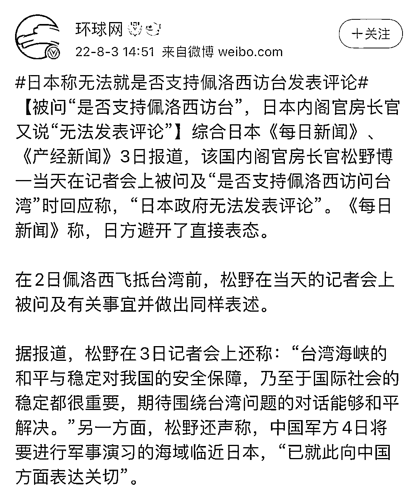

看到这，我都有点懵了。

这还是那个高呼着“台湾有事，就是日本有事”，“不惜一切代价要保卫台湾”的日本吗？

难道，就因为安倍死了，你们就这么怂，这么软了？

**要知道，日本在台湾问题上，一直以来的立场都是非常非常强硬的。** 

**为什么呢？因为台湾海峡关系到他们的命脉，是日本的生命线。**

前几天我在文章里谈过，不过后来因为标题的问题，文章被下架了，大家如果不嫌烦，我就再说一次。

首先，台湾最值钱的东西是什么？是台积电吗？

不，台湾最值钱的是地理位置。

**台湾和大陆之间相隔的那道台湾海峡，才是重中之重。**

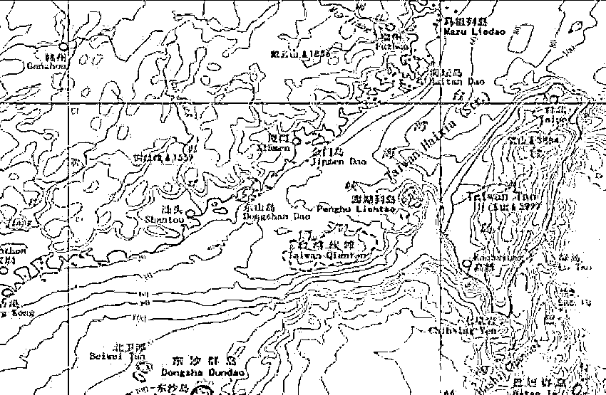

从地理位置上来说，台湾海峡是南海和太平洋的一部分，也是东海和西太平洋的一部分。

由于台湾海峡在东海和南海之间，所以，台湾海峡是沟通东亚前往东南亚甚至欧洲的黄金水道。

**从人类发明轮船，开展航海贸易开始，台湾海峡就是世界上非常重要的贸易水道之一，对于亚洲，乃至太平洋的地缘政治上，地位举足轻重。**

对于东亚国家来说，想要开展航海贸易，有两个地方可以走，一个是去北美，另一个就是去欧洲和东南亚。

而如果要去欧洲和东南亚，那么不可避免的，就要经过一条极其重要的世界航线，那就是——西太平洋航线。

可是，刚才也介绍过台湾海峡的地理位置，它正好就扼守西太平洋中段，是西太平洋航线上最最重要的枢纽。

据统计，每年经过西太平洋航线通过的船舶在 8 万艘以上，而这 8 万艘里面，绝大部分又是日本和韩国这两个东亚国家。

**于是，西太平洋航线和台湾海峡，就成了这两个国家去东南亚，去中东，去欧洲和非洲的必经之地。**

**这也就成了日本和韩国，海上运输的生命线。**

**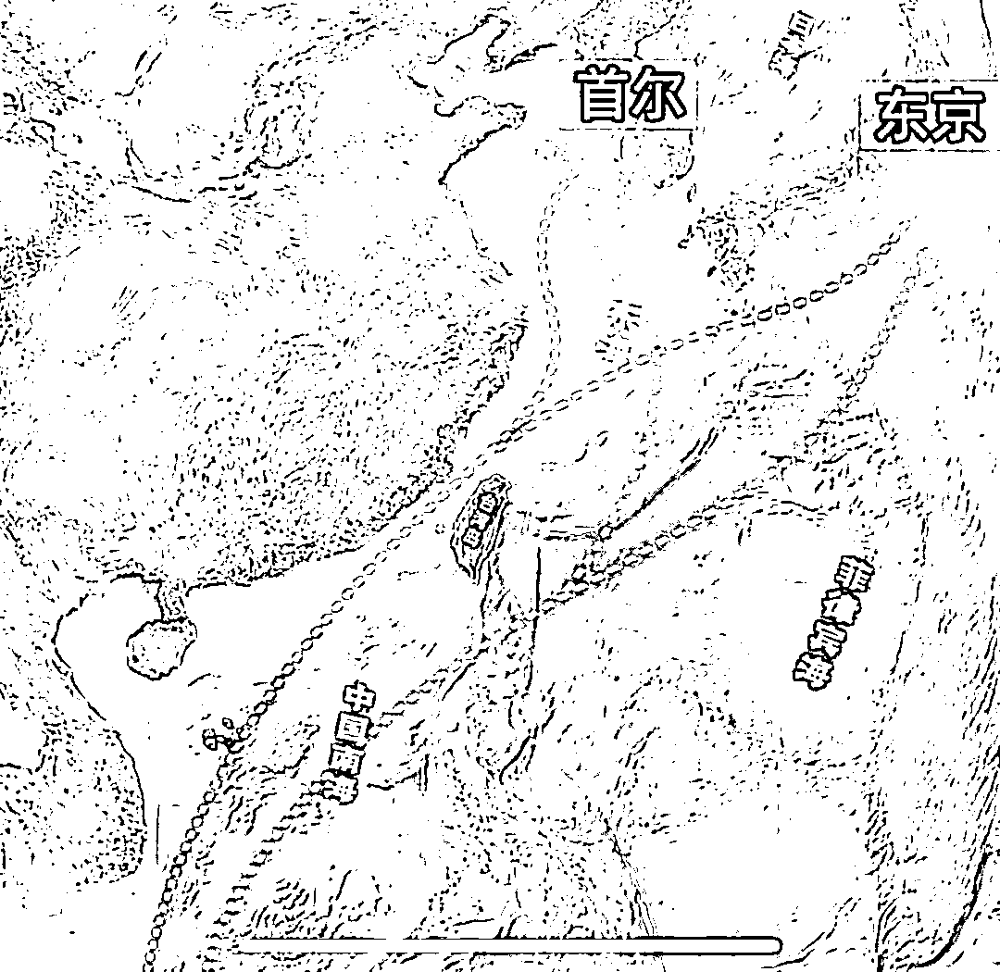**

**如图中所示。**

**大家可以看到，西太平洋航线有两条路，一条是经过台湾海峡，我用蓝色标注，另外一条是经过菲律宾海，绕行过来的，用黄色标注。**

****绝大多数的商船都会选择走蓝色那条线，经过台湾海峡。****

**为什么呢？**

**原因有两个。**

**1，台湾海峡由东北向西南的走向，全长大约 370 公里，北边比较窄，南边比较宽，北口大概是 200 公里，南口是 410 公里，平均宽度是 180 公里，并且海峡里面最深的地方是 70 米。**

**台湾海峡洋流平稳，就算遭遇了台风等恶劣天气，也可以及时的进港避风。**

**可是黄色那条线，绕道从菲律宾海走，那就不一样了。**

**从图中可以看出来，那边是深色的，那里是深海，海相非常不稳定，海面风浪很大，有台风，洋流等等，非常难以捉摸。**

****所以，从安全角度考虑，从蓝线走，经过台湾海峡是最好的选择。****

**2，从商业角度来说，明显可以看出来，从黄线走，要比从蓝线走，路程更远。**

**如果不走台湾海峡，从菲律宾海绕行的话，行不行？**

****当然可以，只不过，成本会增加 25%。****

**在国际贸易中，增加 10%都会受不了，更何况是 25%？**

**这对于极度依赖进口的日本来说，海运成本增加 25%，那你想想，通胀得增加多少？**

****如果，每一次都从菲律宾海绕行，那么很快日本的经济不堪重负，迅速就会崩溃。****

****所以，为了安全和节约运输成本的考虑，大多数船只就只能从台湾海峡进出。****

**注意这个词“只能”，什么叫只能呢？**

**按照汉语词典的解释，只能够、只可以，唯一能够，带有一种不可替代的意思。**

**前面咱们也提到过了，台湾海峡，是日本和韩国去东南亚，去中东，去欧洲和非洲的必经之地。**

**韩国对我们中国威胁并不大，别看他们整天叫嚷的那么凶，但在历史上，高丽是我们天朝的附属国，直到清朝末年，大清还有在朝鲜半岛驻军的传统，袁世凯当年就担任过朝鲜驻军的总指挥，还传出他和高丽王妃的绯闻，当然这都是题外话了。**

**而在亚洲，对我们威胁最大的是谁啊？**

****只有一个国家，日本。****

****至今，日本仍然把我们当作假想敌，一直对我们虎视眈眈。****

****不怕贼偷，那你怕不怕贼惦记呢？****

****一会日本学校，一会文化渗透的，你受得了吗？****

****而且，在****近代史上，日本也是给我们国家造成最沉痛伤害的国家，没有之一。****

**不过实际上，日本却是一个岛国，资源匮乏，需要依赖大量的进口。**

**因为他是岛国，铁路运势就不可能了，而飞机运输的话，第一成本太高，第二运送的货物量太少，远远比不上海运的巨大优势。**

****所以，日本对于海上运输极度的依赖。****

****从波斯湾，经过印度洋，马六甲海峡，再经过中国南海，再过台湾海峡，最后到日本。****

****就是我刚才所标注出来的蓝线。****

****这一条航线，就是日本的生命线。****

**有 70%的石油都是从这条线到日本的。而日本的产成品，很大程度也是从这条线路进行输出的。**

**另外，日本每年还有 75%的货运量要经过台湾海峡。**

**所以，台湾海峡就成了日本经济繁荣和发展的关键。**

**在战争的时候，也关系到东亚地区的胜败存亡，尤其是日本。**

****如果台湾海峡被封锁，这条航线就没了，等于切断了日本的经济大动脉，日本经济短期内就会迅速的崩溃掉。****

**日本人清楚这一点吗？当然很清楚了。** 

**所以，从一百三十年前，他们就这么干了。**

**学过历史，我们都知道，近代中日力量对比发生根本性的逆转，源自于一场战争，中日甲午战争。** 

**甲午战败后，日本从此崛起，而中国则一蹶不振，大大加重了我们的民族危机。**

**这场仗，我们输掉了两样最关键的东西，也是可以遏制日本的最重要筹码。**

**一是海军，二，就是台湾，或者是说台湾海峡。**

****甲午战败后，最直接的就是****北洋水师的覆灭，让日本人可以纵横我们国家上万里的海岸线，他们可以选择在任何一个地点登陆。****

**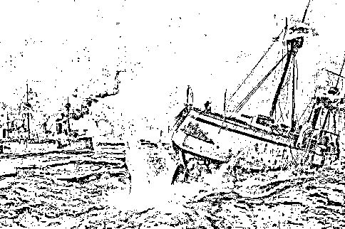**

**抗战的时候，七七卢沟桥事变爆发，战争明明在北方爆发，卢沟桥在宛平城的西边啊。**

**可为什么，日本人没有选择从北平，一直打到山东，再南下进攻江浙，而是开辟了第二战场，从上海打起来，爆发八一三淞沪抗战呢？**

**原因很简单嘛，上海作为当时远东最大的工商业城市，而且，当时江浙一带又是中国经济的命脉，日本人想着通过占领江浙，从而达到他们“三个月灭亡中国”的妄想。**

****当然，还有一个原因，就是因为我们海军没了，他们可以在我们数万里的海岸线上，选择任何一个地方登陆。****

**如果当时的国民政府首府在广州，那日本人也照样可以在广州登陆，这也是同样的道理。**

**所以，海防建设，海军建设，至关重要，我们为什么要一直大力发展海军，这就是原因。**

**其次，还有一个重要的影响，甲午战败后，我们在历史课本里都学过，签订了马关条约。**

**马关条约的主要内容是：**

**1，朝鲜完全“自主”，实际上即承认日本对朝鲜的控制。**

****2，割让我国辽东半岛、台湾省、澎湖列岛等地，**后来，在三国干涉下，辽东半岛由清廷以 3000 万两白银的代价“赎回”。**

**3，赔款白银 2 亿两。**

**4，允许日本资本家在中国通商口岸设立各种工厂；开放沙市、重庆、苏州、杭州为通商口岸。**

****这里面的最重要的，就是丢掉了台湾和澎湖列岛。****

**从而我们彻底失去了可以去遏制日本经济和贸易的筹码。**

**以史为鉴，可以知兴替。**

**所以，看到这你明白了吧？**

****世界上最不希望看到台湾统一的国家，就是日本，没有之一。****

****一个分裂的中国，一个独立的台湾，对日本，那可是有大大的好处。****

**一旦中国完成了统一，那么台湾海峡的通行权完全就由我们说了算了。**

**等于，我们就扼住了日本的咽喉和命脉，他们的一举一动都必须要看中国的眼色行事。**

**所以，这也就解释了台湾岛上有很多亲日势力，李登辉甚至还给自己起了一个日本名字岩里政男，这就是原因。**

**台独分子们知道，日本为了自己的经济安全，一定会全力支持他们的。**

****所以，在安倍遇刺身亡后，那帮台独分子们如丧考妣啊，当天晚上，他们就在台北 101 大厦上面打出了悼念安倍晋三的标语。****

**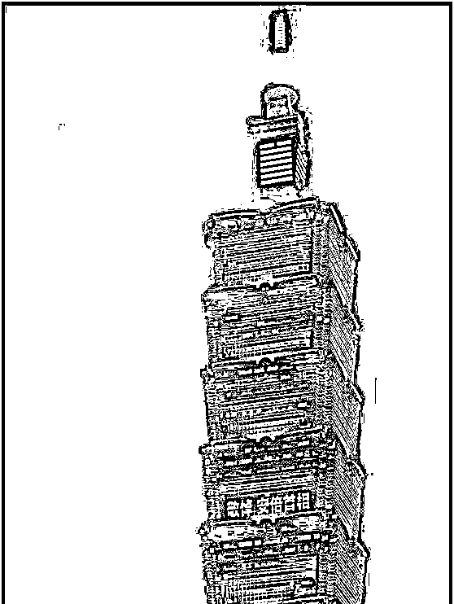**

**当然，这都是过去式了。** 

**因为在以前啊，我们和台湾虽然没有明说，但我们相互之间都有默契的，大家都遵守所谓的海峡中线。**

**虽然，大家谁也没有承认，可心里面都默认的，我们解放军也从来没有越过海峡中线，更别提什么导弹飞过台湾上空了。**

**这在以前，根本都是想都不敢想的。**

****想想看，连海峡中线都不过去，咱们又怎么去封锁台湾海峡呢？****

****所以，之前日本人支持台独，这还有用。****

****可谁也没想到，这一次，佩洛西居然帮了一个大忙。****

****这一次，佩洛西窜访台湾是吧，面子给他们美国人拿到了，在外网上各种嘲讽啊，欺负的我们都抬不起头了。****

**都笑话我们的红线一退再退，最后变成了欢迎佩洛西去台湾的红地毯。**

**你说气人不气人？**

**没事，气人归气人，面子不是给你老美拿到了吗？**

****行啊，里子你得给我留下。****

****本来啊，我们想要封锁台湾海峡，那是很难实现的，你没有理由，师出无名啊。****

****现在好了，佩洛西正好给了我们这么一个“理由”，那我们可就笑纳了。****

**看看我们这次军演的地点，再看一次。** 

**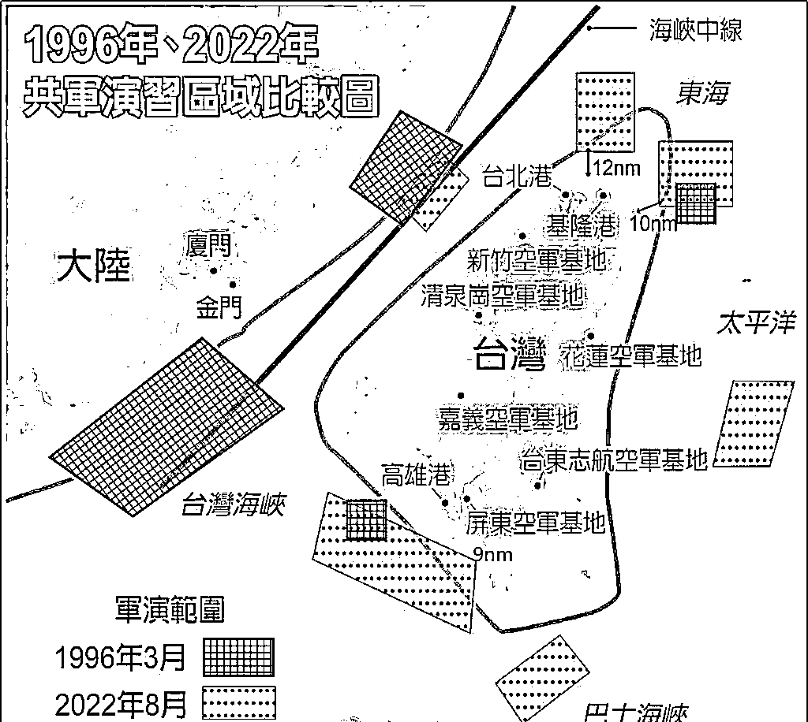**

**看到了吧，什么海峡中线啊，直接就过去了。**

**我们这次军演的位置，直接就把台湾岛周边给锁的死死的。**

****台湾周边 18 条国际航线都被切断了。****

**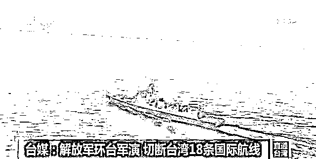**

****绝大多数人只看到了台湾被围困，可是你们想过没有，这可是国际航线啊，不是台湾一家走的，日本人也走啊。**** 

****本来，只要支持台湾独立，日本觉得这样就能保住台湾海峡，保住自己这条生命线。****

****可这下好了，现在佩洛西这么一搅和，咱们环台军演，直接就把你整个台湾海峡该封锁了。****

**最近几天，因为在军演嘛，炮弹无眼，日本商船想走，只能绕行啊，走黄色那条线，从菲律宾海远远的绕行。**

**这还只是一次军演啊，如果咱们隔三差五就来这么一波，日本人还怎么办啊？**

****想要 75%的货运量吗，70%的石油要不要？****

****想要吗，行啊，那就给我老实一点，别再去参拜什么靖国神社，要不然，我们分分钟制裁你们。****

****今天台湾海峡演习一下，禁止所有商船驶入。****

****哦，对了，你们日本可以从菲律宾海绕行对吧，不过最后不是还要经过南海吗？****

****不好意思，南海也要演习，想走？从印尼南边绕吧。****

**这一招下去，日本直接就崩溃了。**

**什么美国，什么印太战略，到时候，全都灰飞烟灭。**

**因为现在，日本人的生命线，已经被我们给牢牢的攥在手上了。** 

****之前，我写文章的时候，只是想着咱们统一台湾了，才能封锁台湾海峡，捏死小日本。****

****可没想到，佩洛西这一次神助攻，居然让我们提前完成目标了。。。****

**所以，这次为什么日本会这么软，连抗议都没了，只是口头上表示关切。**

**还重申了一个中国立场，希望我们能和平解决台湾问题。**

**这就是原因啊。**

**你什么时候见过日本人对我们说话这么客气的，不是说台湾有事就是日本有事吗，怎么不嚷嚷了？**

**现在，我们台海军演，要不，你们自卫队派两艘船过来助助威，帮帮台湾？**

****当你的饭碗在我手里，我说砸就砸的时候，你还怎么硬气啊？****

****所以，这一次台海军演意义重大，不仅在七夕节这天请台湾人看了一场东风烟花秀，还顺便把小日本给捏住了。****

**一举两得。**

**还有，在这里我要表扬一个高德地图。**

**人家已经把中线变外海了，看看，我们的海岸线又往右移动了几百公里。**

****高德好样的。****

**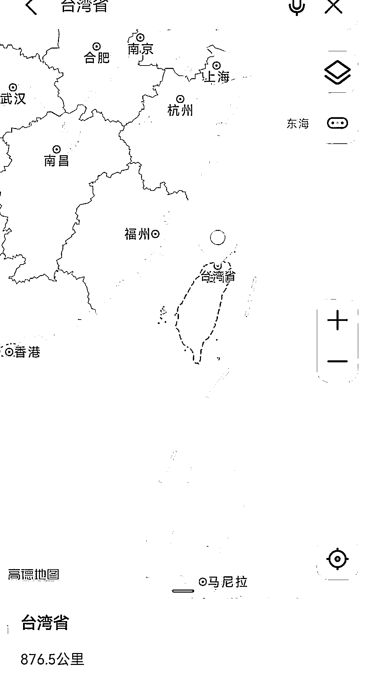**

****最后，相信国家，国家是每一个个体，是 14 亿中国人意志的集中体现，只要我们都万众一心，团结起来，还有什么难关是过不去的？****

****现在，政治上我们怎么做，军事怎么做，其实和普通老百姓关系都不是很大。****

****和我们关系最大的是什么？****

****是精神上。****

****我们首先要解决的就是士气问题，千万不要因为这一次的事情失望，当你明白我们收获了什么之后，希望你能鼓起信心。****

****这一百多年来，我们受过多少屈辱啊，还在乎多这一个吗？****

****只要最后能收回台湾，受这点苦，挨这点骂，又算什么呢？****

**还有啊。**

**别看那帮人今天闹得欢，小心以后拉清单。**

****兔子:“没事,都给你们记小本本上了。”****

**来源：每日怡见**

****

**](http://mp.weixin.qq.com/s?__biz=Mzg5ODAwNzA5Ng==&mid=2247488098&idx=3&sn=638c5dd62ca652e1a1f2fd5b8420b00f&chksm=c0687b35f71ff223bca5031da035e3ab56f77f3ecfe42e587322e6e0f1302dc4d3e3fb354f18&scene=21#wechat_redirect)**

**← 向右滑动与灰产圈互动交流 →**

****