# “台湾省地图”上热搜，你找到自己的家乡菜了吗？

> 原文：[`mp.weixin.qq.com/s?__biz=MzIyMDYwMTk0Mw==&mid=2247541844&idx=3&sn=332a34ff5de1f5bf47f35c04af6ae495&chksm=97cbef6ca0bc667ad79afd2a22c9dc7351c6330ba227cd0089fcad65ceb84506e08b660a4b40&scene=27#wechat_redirect`](http://mp.weixin.qq.com/s?__biz=MzIyMDYwMTk0Mw==&mid=2247541844&idx=3&sn=332a34ff5de1f5bf47f35c04af6ae495&chksm=97cbef6ca0bc667ad79afd2a22c9dc7351c6330ba227cd0089fcad65ceb84506e08b660a4b40&scene=27#wechat_redirect)

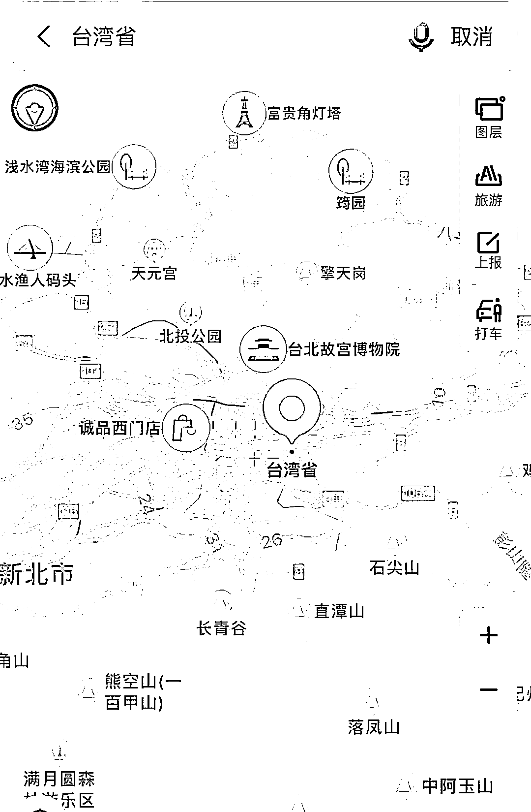

▲某地图软件截图

今日，不少网友发现，在地图软件搜索台湾省，可查看到其每条街道。随即，该话题也冲上热搜。 

有趣的是，网友发现，台北市不少街道用大陆城市命名。例如，重庆北路、南京东路、敦化北路、福州街、南昌路、哈密街……

地图上，不仅能看到街道名称，还能清晰的看到红绿灯、便利店和各种美食餐厅。

于是，网友们的画风逐渐走偏了…… 

他们开始在地图上搜寻起家乡美食：

*   **山东** 

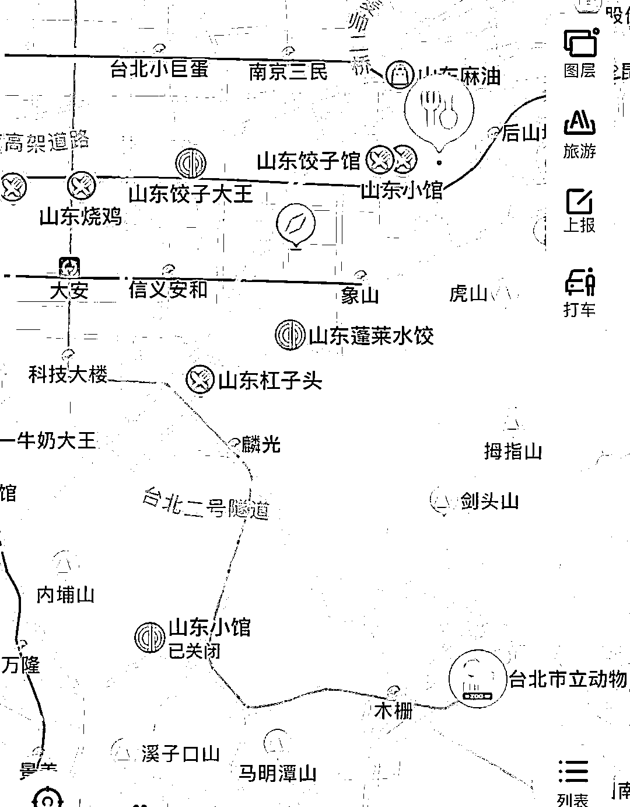

*   **陕西** 

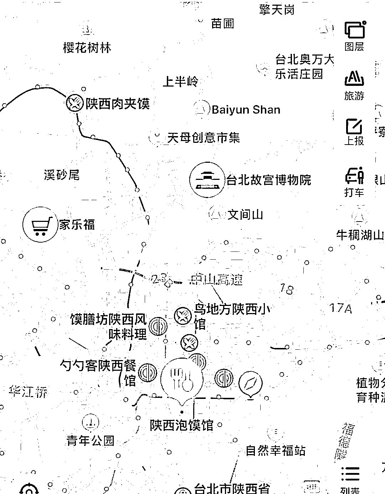

*   **桂林** 

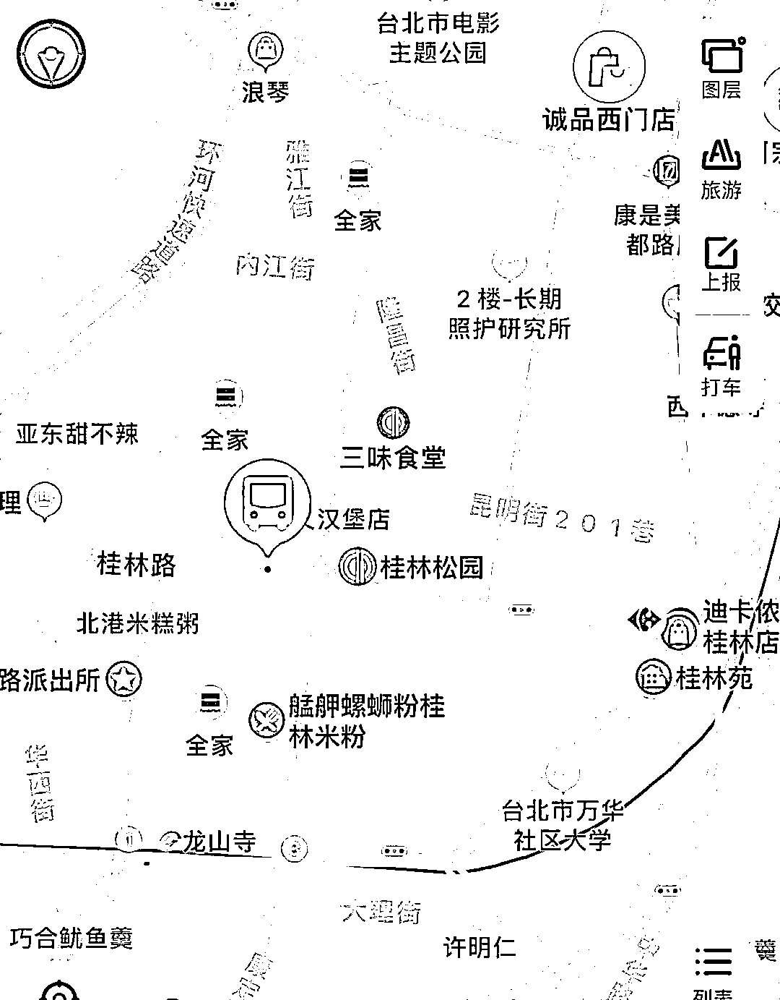

*   **重庆** 

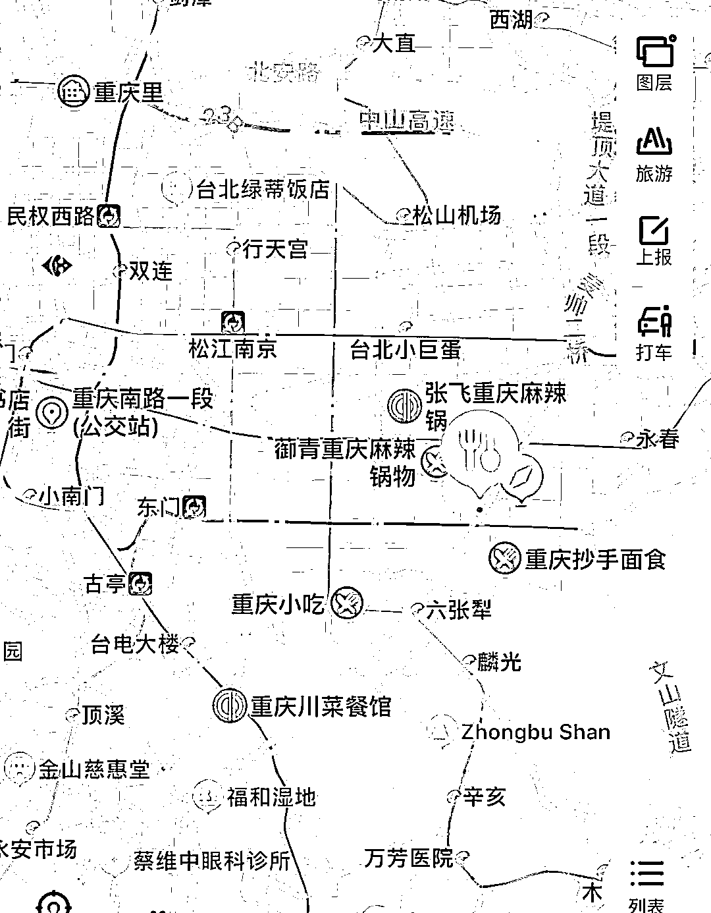

*   **成都** 

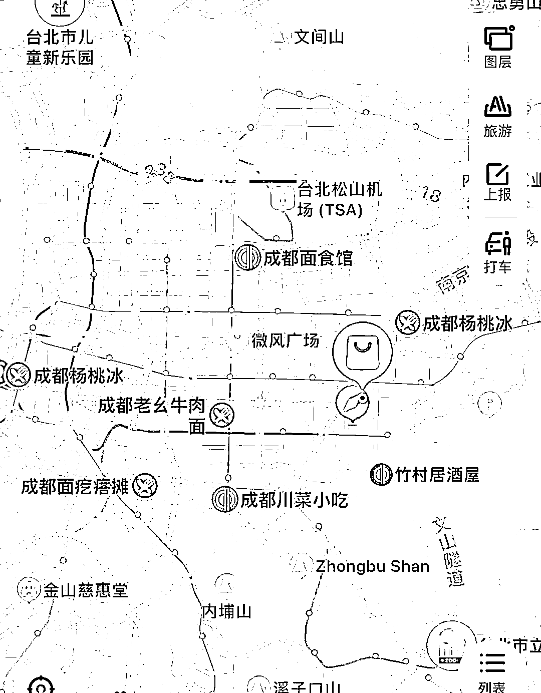

*   **湖南** 

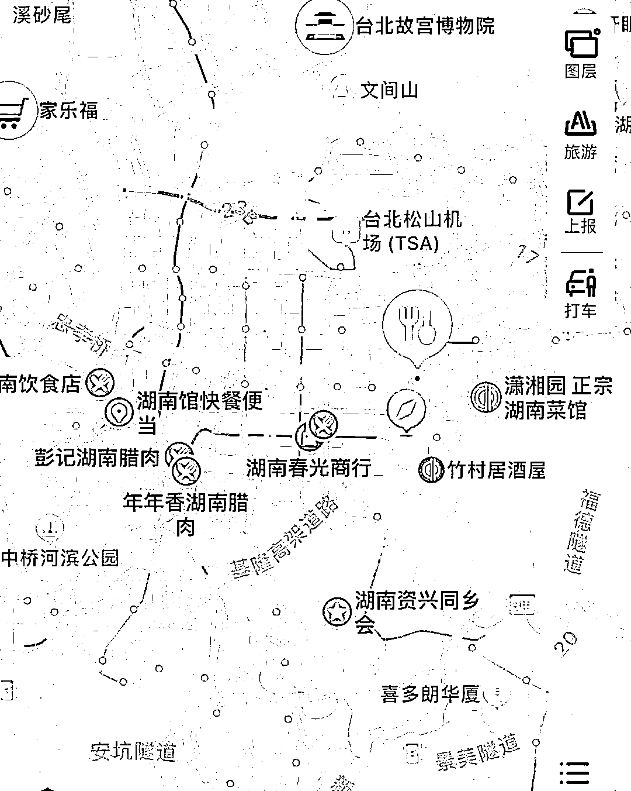

*   **广东** 

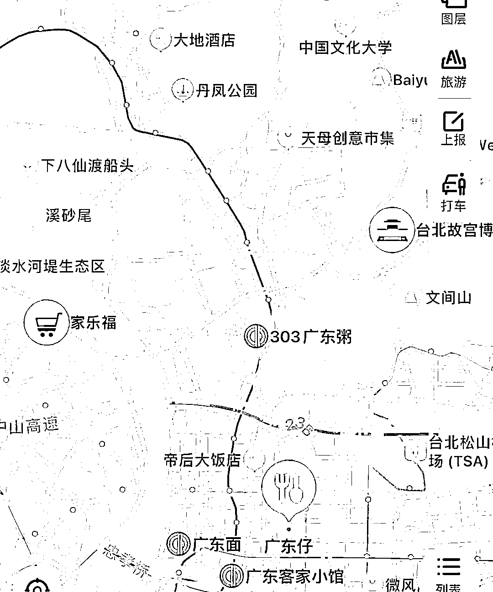

*   **上海** 

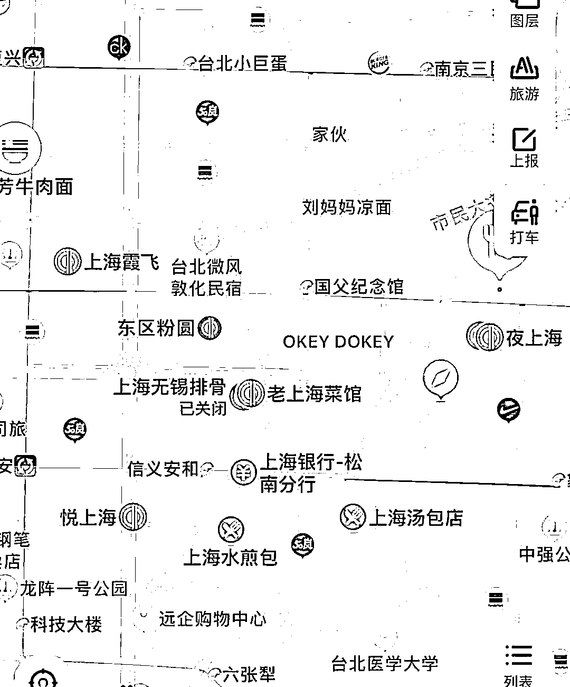

还有网友开始大胆畅想：

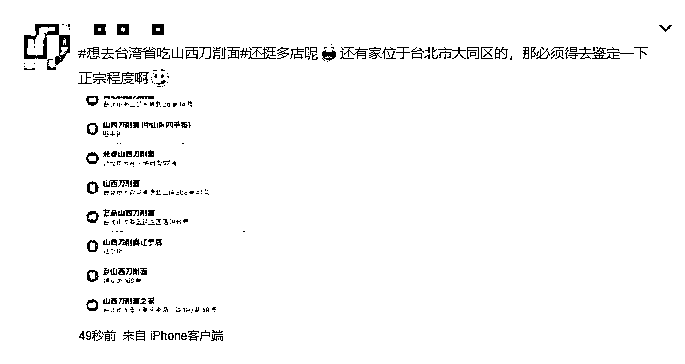

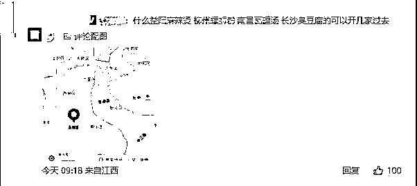

你在台湾省的街道里，找到你家乡的美食了吗？ 

来源：新京报

](http://mp.weixin.qq.com/s?__biz=Mzg5ODAwNzA5Ng==&mid=2247488098&idx=3&sn=638c5dd62ca652e1a1f2fd5b8420b00f&chksm=c0687b35f71ff223bca5031da035e3ab56f77f3ecfe42e587322e6e0f1302dc4d3e3fb354f18&scene=21#wechat_redirect)

← 向右滑动与灰产圈互动交流 →

