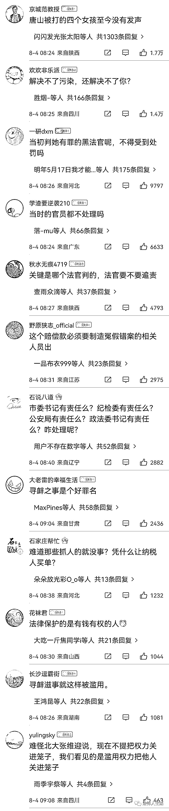

# 陕西女工程师帮村民举报污染成“涉恶势力”头目，获刑后检察院又撤诉

> 原文：[`mp.weixin.qq.com/s?__biz=MzIyMDYwMTk0Mw==&mid=2247541844&idx=4&sn=5620bc4215363506a077c91bcd46a436&chksm=97cbef6ca0bc667a8d9bd206ecbef5dd2c5c197ed4c77904ea877e677fcb8b901d461299b97b&scene=27#wechat_redirect`](http://mp.weixin.qq.com/s?__biz=MzIyMDYwMTk0Mw==&mid=2247541844&idx=4&sn=5620bc4215363506a077c91bcd46a436&chksm=97cbef6ca0bc667a8d9bd206ecbef5dd2c5c197ed4c77904ea877e677fcb8b901d461299b97b&scene=27#wechat_redirect)

举报家乡污染问题 10 年，2018 年 9 月 17 日，陕西女工程师李思侠因涉嫌寻衅滋事罪被警方刑拘。

此后，她成为当地“首起涉恶势力”头目。

[`v.qq.com/iframe/preview.html?width=500&height=375&auto=0&vid=d0980mo3oqz`](https://v.qq.com/iframe/preview.html?width=500&height=375&auto=0&vid=d0980mo3oqz)

经当地多次开庭，2020 年 6 月 16 日，在羁押 21 个月后，李思侠被取保。

8 月 3 日，上游新闻记者从李思侠家属处获悉，李思侠申请的国家赔偿已被当地法院受理。同样被当地法院受理了国家赔偿的，还有李思侠案的另一名当事人。

▲2019 年 2 月 27 日，一审休息期间的李思侠。

李思侠家属告诉上游新闻记者，李思侠提出包括侵犯人身自由赔偿、侵犯生命健康权赔偿、精神损害抚慰金、赔偿经济损失共计 242 万余元。

“我们是按照 8 小时劳动时间乘以 3 倍计算的人身自由赔偿……对她来说，每天 24 小时都是一种煎熬。”李思侠家属告诉上游新闻记者。

另一名当事人提出的国家赔偿共计 101 万余元。

除此之外，二人还请求，当地相关部门在权威媒体和政府网站道歉，恢复名誉，以消除错案带来的负面影响。

“没有人愿意用五百万、一千万的所谓高额赔偿，去换取一年的自由。” 

李思侠的家属告诉上游新闻记者，太低的赔偿金无法体现正义的价值，无法抚慰创伤，更不利于防范冤案的再次发生。

今年 59 岁的李思侠是陕西省安康市石泉县城关镇双喜村人，作为村里第一位大学生，退休前，她曾是陕西一家国企的工程师。

2008 年，入驻双喜村的两家石料加工厂，开始影响当地村民的生活，也改变着李思侠的命运。

当地村民说，由于运送石料的卡车毁坏村道，还污染当地的耕地和环境。不知如何维权的村民，找到了已经在西安定居多年的李思侠。

此后，李思侠参与其中，和村民一起开启了与石料厂将近 10 年的抗争。在部分村民口中，李思侠是“为民请愿的环保卫士”。

2018 年 9 月，李思侠被石泉警方带走。此后，当地街头出现通报，她成为当地“首起涉恶势力”的头目。

■ 家人手机里的李思侠被捕前照片。摄影 | 上游新闻记者 沈度 

2018 年 9 月 17 日，李思侠因涉嫌寻衅滋事罪被刑拘。

2019 年 2 月 27 日，石泉县法院官方微信发布《重磅：石泉县首例涉恶案件今天开庭》。

检方起诉书显示，从 2013 年起，李思侠通过网络发帖、上访举报等方式，不断反映当地石料厂无证开采、损毁道路、污染环境，并且代理村民向石料厂索赔。

同年 9 月 30 日，李思侠被批捕。随后，此案另两名嫌疑人魏智波和张海成，也因涉嫌寻衅滋事罪被石泉警方刑拘。

公诉机关认为，李思侠等人的举报存在夸大和诽谤，设限宽墩导致村民出行不便，在换届选举中“以维护村道、防止权力旁落为由，煽动村民为魏智波投票”，三人共同犯罪部分已涉嫌恶势力犯罪。

此外，检方列举李思侠的 7 项罪名中，还包括向村民索要“跑路费”、拒不退还 1 万元征地款等个人犯罪行为。

2019 年 6 月 13 日，一审法院判决，李思侠纠集他人寻衅滋事行为“不属于恶势力犯罪”。

但因犯寻衅滋事罪，判处李思侠有期徒刑二年零六个月，张海成、魏智波以同样罪名分别获刑一年二个月、十一个月。

对此，李思侠等人不服判决提出上诉。

该案二审经安康市中级人民法院两次开庭审理后，2020 年 6 月 16 日，李思侠被取保候审。

7 月 28 日，安康市中院认为，原审判决认定事实不清，证据不足，且在案件审理中违反法律规定的诉讼程序。撤销一审刑事判决，返回石泉县人民法院重新审判。

同年 8 月 14 日，石泉县法院准许检察院撤回对李思侠等 3 人的起诉。

一天后，石泉县检察院对李思侠等人作出不起诉决定。这意味着，李思侠无罪，并可申请国家赔偿。

[`v.qq.com/iframe/preview.html?width=500&height=375&auto=0&vid=g3137tymwgq`](https://v.qq.com/iframe/preview.html?width=500&height=375&auto=0&vid=g3137tymwgq)

**来源：法律人生路，上游新闻，宾曰语云 记者贾晨、微博评论**

](http://mp.weixin.qq.com/s?__biz=Mzg5ODAwNzA5Ng==&mid=2247488098&idx=3&sn=638c5dd62ca652e1a1f2fd5b8420b00f&chksm=c0687b35f71ff223bca5031da035e3ab56f77f3ecfe42e587322e6e0f1302dc4d3e3fb354f18&scene=21#wechat_redirect)

← 向右滑动与灰产圈互动交流 →

