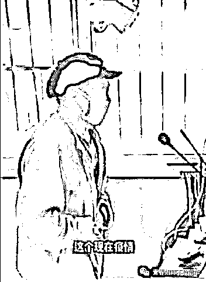
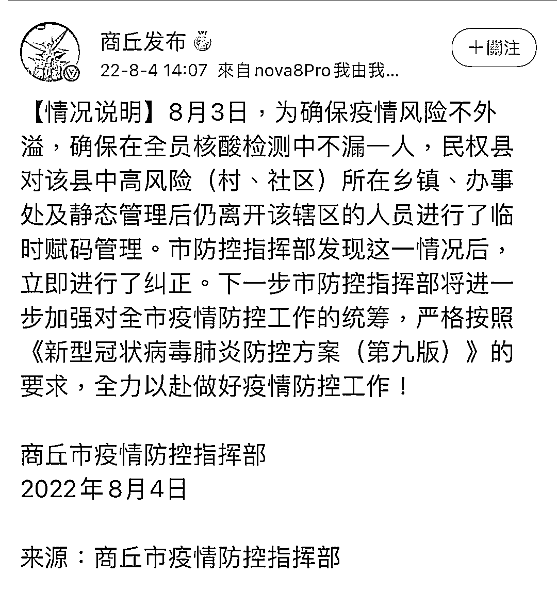
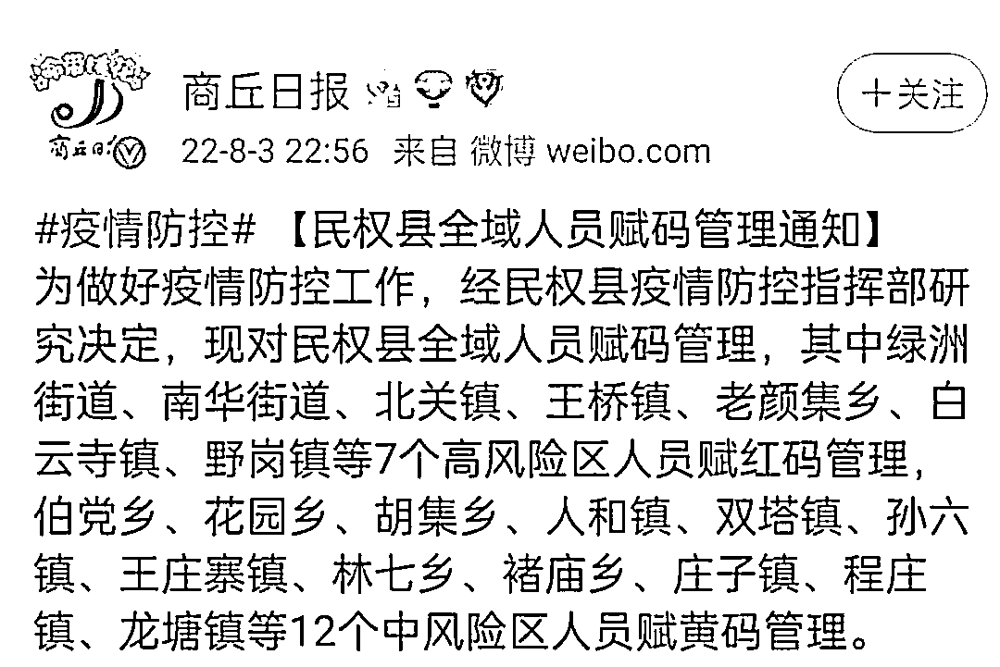

# 商丘一老农下地打药被要求用大喇叭做 10 遍检讨，村民外出买奶粉被劝返

> 原文：[`mp.weixin.qq.com/s?__biz=MzIyMDYwMTk0Mw==&mid=2247541844&idx=5&sn=f917072509eb7c8870eecc7d8ef78e28&chksm=97cbef6ca0bc667ae1c1cbe56f3566c2e22b1849c2398a767970506a3e5d30af730f7734d860&scene=27#wechat_redirect`](http://mp.weixin.qq.com/s?__biz=MzIyMDYwMTk0Mw==&mid=2247541844&idx=5&sn=f917072509eb7c8870eecc7d8ef78e28&chksm=97cbef6ca0bc667ae1c1cbe56f3566c2e22b1849c2398a767970506a3e5d30af730f7734d860&scene=27#wechat_redirect)

8 月 2 日，河南宁陵县一老人下地打药，被防疫人员抓到，被要求用大喇叭做 10 遍检讨。当地还有一位村民外出买奶粉，被劝返。

据天目新闻报道，3 日下午，宁陵县政府一位工作人员表示，由于当地新冠肺炎确诊病例源头仍不清晰，8 月 1 日县里紧急实行全域静默管理，除一线防疫人员外，其他人一概不能进出，“可能没有兼顾到很多方面，但也是为大家安全考虑。”

该工作人员告诉天目新闻记者，村民对静默管理接受程度不是很高，所以村里防疫人员采用一些比较简单粗暴的方法，做法是错误的，已经对相关防疫人员不当行为进行批评教育，“但是出发点是好的，并不是说不让农民下地，而是疫情情况下，应当首先保障个人健康安全。”

[`v.qq.com/iframe/preview.html?width=500&height=375&auto=0&vid=p335010mpxs`](https://v.qq.com/iframe/preview.html?width=500&height=375&auto=0&vid=p335010mpxs)

这么热的天，病毒户外能活？

农时不等人，灌浆不浇水，收成矮一截。

婴儿吃不上奶粉，又能吃什么呢？

**防疫期间下地干活被要求检讨非首例**

唐山一老农用喇叭向全村检讨

5 月初，唐山迁安一位老农在疫情防控期间着急下地干活，被当地巡察人员看到并加以批评。老农用大喇叭向全村村民自我批评道歉，称疫情很严重，自己对目前形势有点麻痹。“唐山硬核防疫不许下地种地”随后以一种黑色幽默的叙事登上热搜。

视频截图

5 月 2 日晚，迁安市新冠肺炎疫情防控工作总指挥部办公室发布情况通告，为坚决阻断新冠疫情传播途径，切断疫情传播链条，保障人民群众身体健康和生命安全，全市自 4 月 17 日 24 时全域实施严格封控管理。

目前，正值春耕生产和疫情防控工作关键节点，个别村居没有落实好统筹疫情防控和春耕生产工作，存在不当劝阻行为，管控措施简单、过度，没有用心用情用力做好群众工作，造成不良影响。

发现问题后，有关部门立即进行调查整改。下一步，我们将继续坚持人民至上、生命至上、科学防范的原则，待疫情解封后，第一时间组织技术人员，多种方式指导春耕生产，扎实推进疫情防控工作，有序恢复农业生产。

**农业农村部等 11 部门：严禁以防疫为由不让农民下地种田**

6 月 1 日，农业农村部、国家发改委等 11 个部门联合印发《统筹新冠肺炎疫情防控和“菜篮子”产品保供稳价工作指南》，严禁以防疫为由不让农民下地种田。

指南明确，新冠肺炎疫情常态化防控条件下“菜篮子”产品保供稳价工作要统一指挥、属地负责，落实市长负责制。防控措施不得简单化、“一刀切”、层层加码，严禁以疫情防控为由，擅自设卡拦截、随意断路封村，不让农民下地种田、限制农机通行作业、限制“菜篮子”产品运输、分销、配送，影响“菜篮子”产品市场稳定。

“商丘发布”微博消息，8 月 4 日，商丘市疫情防控指挥部发布情况说明。8 月 3 日，为确保疫情风险不外溢，确保在全员核酸检测中不漏一人，民权县对该县中高风险（村、社区）所在乡镇、办事处及静态管理后仍离开该辖区的人员进行了临时赋码管理。市防控指挥部发现这一情况后，立即进行了纠正。下一步市防控指挥部将进一步加强对全市疫情防控工作的统筹，严格按照《新型冠状病毒肺炎防控方案（第九版）》的要求，全力以赴做好疫情防控工作。

据商丘日报消息，8 月 3 日晚间，商丘市民权县发出“全域人员赋码管理通知”，决定对全域人员赋码管理，其中绿洲街道、南华街道、北关镇、王桥镇、老颜集乡、白云寺镇、野岗镇等 7 个高风险区人员赋红码管理，伯党乡、花园乡、胡集乡、人和镇、双塔镇、孙六镇、王庄寨镇、林七乡、褚庙乡、庄子镇、程庄镇、龙塘镇等 12 个中风险区人员赋黄码管理。

来源：天目新闻，商丘发布，青春如诗不负韶华，宾曰语云

](http://mp.weixin.qq.com/s?__biz=Mzg5ODAwNzA5Ng==&mid=2247488098&idx=3&sn=638c5dd62ca652e1a1f2fd5b8420b00f&chksm=c0687b35f71ff223bca5031da035e3ab56f77f3ecfe42e587322e6e0f1302dc4d3e3fb354f18&scene=21#wechat_redirect)

← 向右滑动与灰产圈互动交流 →

