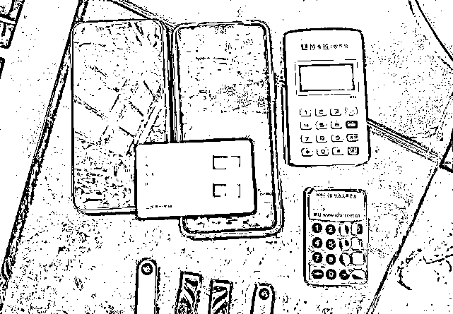

# 500 余万条个人信息从快递站泄露！

> 原文：[`mp.weixin.qq.com/s?__biz=MzIyMDYwMTk0Mw==&mid=2247541844&idx=6&sn=868b58d24de007f38fb059e87ea1aea2&chksm=97cbef6ca0bc667a2f54e15804d1665e407cb07ae1f339f41b04d725ec7bf9b694feb2caf674&scene=27#wechat_redirect`](http://mp.weixin.qq.com/s?__biz=MzIyMDYwMTk0Mw==&mid=2247541844&idx=6&sn=868b58d24de007f38fb059e87ea1aea2&chksm=97cbef6ca0bc667a2f54e15804d1665e407cb07ae1f339f41b04d725ec7bf9b694feb2caf674&scene=27#wechat_redirect)

一旦发生

涉及快递、购物方面的骗局

人们的第一反应就是

经过不断科普

大家也渐渐开始知道

一张“快递面单”可能起底

很多重要隐私

身份证 手机号 家庭住址

而从快递面单生成到快递送到手上 

再到快递盒被随意丢弃

各个环节都可能被骗子盯上

这些快递面单被大量收集

放在网上明码标价批量售卖

这些还只是常规操作

但你有见过直接抄底一整家“云仓”

大规模窃取个人信息的吗？

近期余姚市公安局破获了

**一起利用木马软件盗取**

**快递****始发云仓快递面单信息案**

打掉了一条新型

侵犯公民个人信息的黑灰产业链

****

快递始发云仓引起警方怀疑

今年 4 月

余姚市发生多起冒充物流

网购客服退款赔偿类电诈案件

余姚警方在对这些受害人

电话回访时发现

多数的受害人提到

他们的快递都曾

停留在**一快递始发云仓**

民警对该快递始发云仓进行调查后

发现一个重要线索

仓库内的公共视频显示

神秘男深夜翻墙安装木马程序

今年 3 月份

曾有一名神秘男子

在深夜翻墙进入过仓库

**并对该仓库内一台专门打印**

**快递面单的电脑动了手脚**

经侦查民警发现

这个用来打印面单的电脑

**被人安装了木马程序**

这种木马软件原本应用于企业管理

被犯罪嫌疑人篡改软件功能后

通过植入到打印快递面单的电脑中

便会在电脑后台

将打印信息实时发送出去

以此来窃取快递面单信息

**快递面单黑灰产业链条浮出水面**

综合相关线索后

警方对有重大嫌疑的马某实施抓捕

当场缴获带有同款木马程序的 U 盘

通过对现场证据的分析研判

警方快速掌握了**马某上家****鲍某**

和**提供技术支持的高某**的身份

随着落网人员的增加

又一上线谢某也浮出了水面

警方逐渐梳理出了

**隐藏在背后的快递面单黑灰产业链**

****

****技术护航 犯罪组织架构完整****

**在该犯罪组织中**

**这些快递面单信息被称为**“料”****

**像马某这样负责去各个快递始发云仓**

**非法安装木马软件的被称为**“马仔”****

**在神不知鬼不觉的情况下**

**对这些快递始发云仓的电脑下手**

**安装特定的木马程序**

**接着就是**专业技术人员**“登场”**

**他们为木马程序提供技术支持和保障**

**当那些电脑被植入特定的木马程序后**

**经过处理的快递面单信息**

**就会全部传输到**“分包商”**手中**

**然后再由其筛选汇总整理后**

**传输到上一级的**“料商”**手中**

**最终公民信息就会经过**“料商”****

**转卖给诈骗团伙**

****明码标价 背后是庞大利益链****

**** 

**据嫌疑人交代**

**快递单面主要依据**新鲜度**和**类别**标价**

**价格最高的是单品类的**实时面单****

**多为当天新鲜“出炉” 还未签收的**

**常见的单品有母婴 化妆品 服装等**

**另外一种是**历史面单 **一般不限时间**

**但价值会大打折扣**

**平均下来一般一张快递面单**

**“马仔”会以**1-2 元**的价格卖出**

**然后上家会层层加价**

**最后以**5.5-7 元**的价格**

**卖到境外**“料商”**手中**

****

****集中收网 抓获嫌疑人 35 名****

**** 

**今年 5 月**

**在掌握大量线索和证据后**

**余姚警方开展了抓捕行动**

**先后赴全国**9 省 20 市****

**共抓获嫌疑人**35 名****

**缴获手机**100 余部** 电脑**30 余台****

**** 

**警方查证从 2021 年 11 月至今**

**该犯罪组织已非法买卖**

**快递面单信息**500 余万条****

**涉案资金达**3000 余万元****

**已有**27 人**因涉嫌侵犯公民个人信息罪**

**帮助信息网络犯罪活动罪及诈骗罪**

**被警方依法采取刑事强制措施**

**案件正在进一步侦办中**

**** 

****反诈君想说****

****利用木马软件****

****窃取快递面单的作案手段****

****目前在社会上还比较少见****

****但因其隐蔽性强的特点****

****对公民个人身份信息泄漏的危害巨大****

****快递业需引起高度重视****

****平时应加强企业管理****

****落实专人对行业电脑进行监管****

****设置锁屏密 ****

****定期使用专业查杀软件进行查杀****

****来源：余姚公安，南通反诈****

********

****](http://mp.weixin.qq.com/s?__biz=Mzg5ODAwNzA5Ng==&mid=2247488098&idx=3&sn=638c5dd62ca652e1a1f2fd5b8420b00f&chksm=c0687b35f71ff223bca5031da035e3ab56f77f3ecfe42e587322e6e0f1302dc4d3e3fb354f18&scene=21#wechat_redirect)****

****← 向右滑动与灰产圈互动交流 →****

********