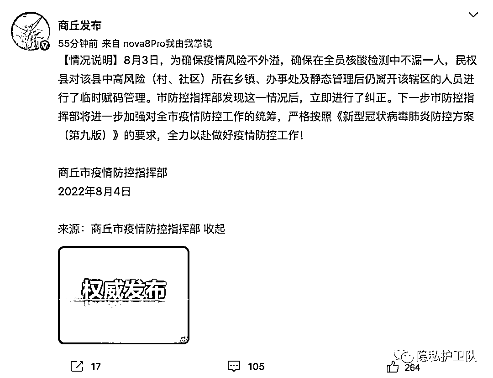
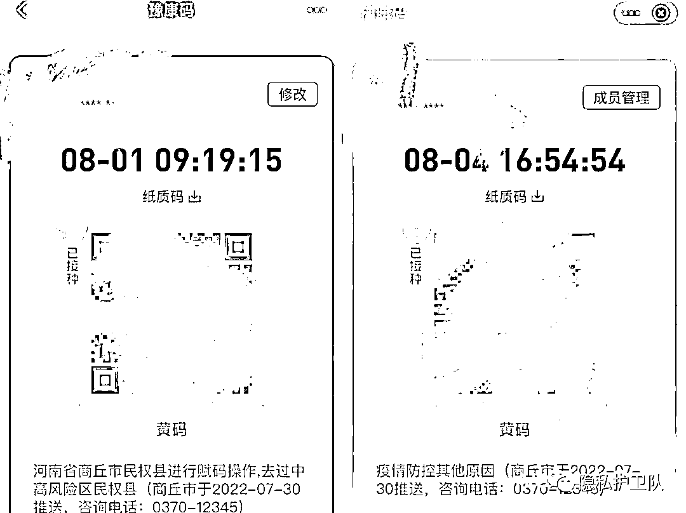

# 河南民权县对全域居民赋码后：有人转绿，有人离开后仍为黄码

> 原文：[`mp.weixin.qq.com/s?__biz=MzIyMDYwMTk0Mw==&mid=2247542007&idx=3&sn=54f01b202000cfcb4653ea9ec7eaf4a2&chksm=97cbefcfa0bc66d9fd98bb29c35f44c75379a8225af6e6309613c0bc5e6eff4608b5450c863c&scene=27#wechat_redirect`](http://mp.weixin.qq.com/s?__biz=MzIyMDYwMTk0Mw==&mid=2247542007&idx=3&sn=54f01b202000cfcb4653ea9ec7eaf4a2&chksm=97cbefcfa0bc66d9fd98bb29c35f44c75379a8225af6e6309613c0bc5e6eff4608b5450c863c&scene=27#wechat_redirect)

最近三天，民权县多名居民经历了健康码“绿-红-绿”的转变。 

文：孙朝

8 月 3 日，河南商丘民权县的一则通知引发关注：对民权县全域人员赋码管理。其中绿洲街道、南华街道、北关镇等 7 个高风险区人员赋红码管理，伯党乡、花园乡、程庄镇等 12 个中风险区人员赋黄码管理。

根据 7 月 31 日民权县发布的通知，被赋码的情形还包括：对 7 月 20 日以来进入民权县域停留 4 小时以上，目前已离开民权县域人员赋黄码管理等四种情形。

通知一出，引发热议。对此，8 月 4 日，河南商丘疫情防控指挥部发文称，商丘市防控指挥部发现这一情况后，立即进行了纠正。

图源@商丘发布

8 月 4 日下午，民权县绿洲街道人民路的一名餐饮店老板告诉南都记者，8 月 2 日及之前健康码均为绿码，昨日健康码变成红码，目前健康码又变回了绿码，具体什么时间以及为什么变码不太清楚。最近十天一直待在家里，希望能够早日开店上班。

程庄镇的一名居民告诉南都记者，自己的健康码也在三天内经历了“绿-红-绿”的转变，目前健康码已经变绿。从 25 号开始静默一直在家，期间并未外出，也从未联系过官方解除红码，健康码“自动变绿了”。

多名网友称，自己曾因去过民权县而被赋红码，至今仍未变回绿码，影响到了工作和生活。

郑州居民李华告诉南都记者，自己曾在 7 月 12 日乘坐高铁时路过民权县，期间并没有下车。7 月 30 日发现自己被赋黄码，至今健康码仍为黄码。

根据她提供的健康码截图，8 月 1 日，豫康码下方的黄码原因处写道“民权县进行赋码操作，去过中高风险区民权县”。8 月 4 日，其黄码原因变为“疫情防控其他原因”。

李华的“黄码”。受访者供图。

8 月 4 日，南都记者多次拨打商丘市市民服务热线，均处于占线状态。

民权县的此轮疫情始于 7 月 25 日。

当日，民权县出现两例无症状感染者，随后全县保持静默状态，暂停各类聚集性活动，全县实行临时交通管制。截至发稿，民权县已静默 10 天。根据河南省卫健委通报，8 月 3 日 0—24 时，商丘市民权县新增本土无症状感染者 35 例。

根据国务院疫情风险查询平台了解到，截至 8 月 4 日 16 时，民权县有 18 个高风险地区，8 个低风险地区。值得注意的是，这些中高风险地区均以村（小区）级单位划定。

根据《新型冠状病毒肺炎防控方案（第九版）》，高风险区原则上以居住小区（村）为单位划定，可根据流调研判结果调整风险区域范围。中风险区为病例和无症状感染者停留和活动一定时间，且可能具有疫情传播风险的工作地和活动地等区域。

根据民权县 8 月 3 日的通知，中高风险区的划分单位为乡、镇、街道，并未提及村（小区）级单位。这也意味着，相较于国务院疫情风险查询平台所公布的中高风险区，民权县在通知中划分的中高风险区范围更广。

国家卫生健康委疾控局副局长雷正龙曾在 6 月 24 日国务院联防联控机制新闻发布会上提出，各地根据不同疫情风险等级对相关人员进行精准赋码，不得“一刀切”“码上加码”。

北京大学法学院教授、宪法与行政法研究中心主任王锡锌曾在接受南都记者采访时表示，疫情防控首先需要强大的社会动员能力。如果一些地方为了方便管理等短期利益，而打破法治的原则和底线，那么当真正需要社会动员凝聚社会力量的成本将变得非常高昂。

“应尽可能避免一刀切，尽可能避免为追求形式上的效率而忽视公民的合理诉求，否则很容易造成政府公信力的下降。”北京大学法学院教授沈岿曾说道。

自从健康码变黄后，李华曾多次联系疫情防控部门，电话未能打通。她只希望健康码尽快由黄转绿，“早点上班，别再被扣工资了”。

（根据受访者要求，李华为化名。）

来源：隐私护卫队

](http://mp.weixin.qq.com/s?__biz=Mzg5ODAwNzA5Ng==&mid=2247488098&idx=3&sn=638c5dd62ca652e1a1f2fd5b8420b00f&chksm=c0687b35f71ff223bca5031da035e3ab56f77f3ecfe42e587322e6e0f1302dc4d3e3fb354f18&scene=21#wechat_redirect)

← 向右滑动与灰产圈互动交流 →

