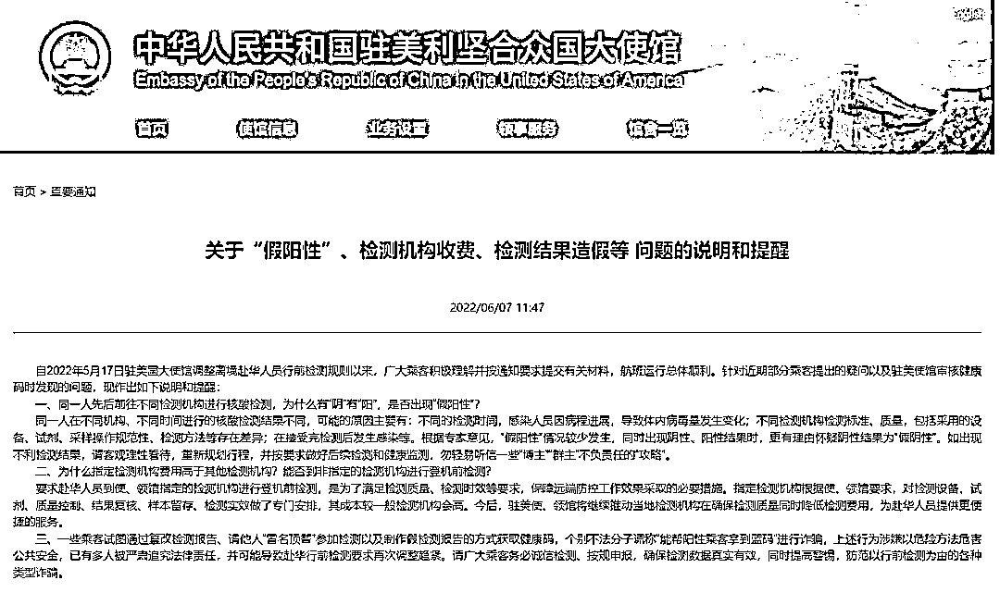
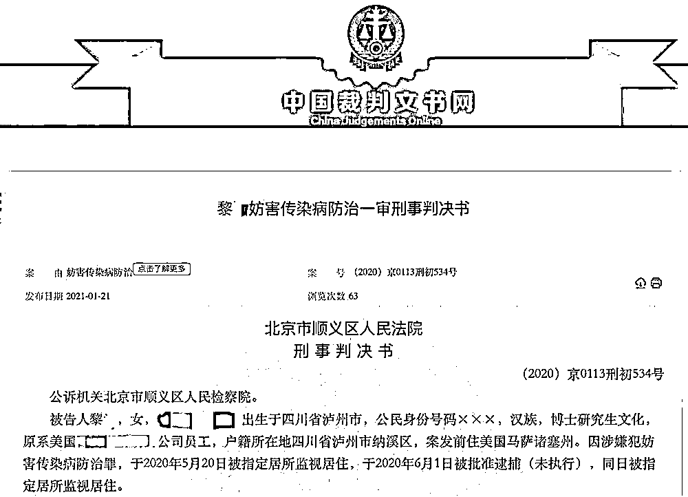
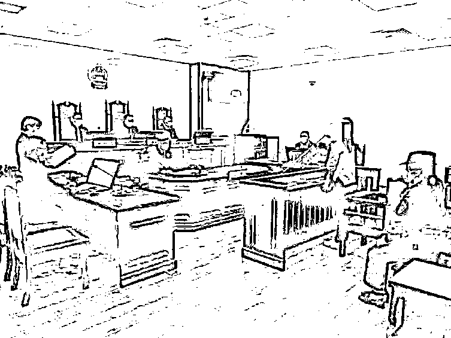
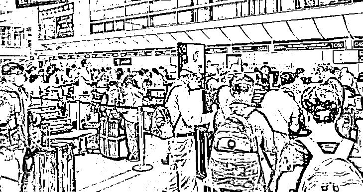
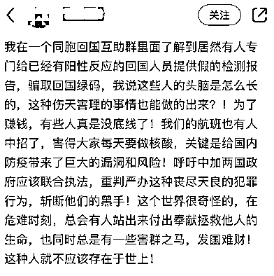
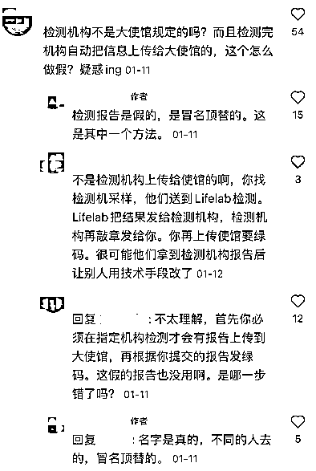
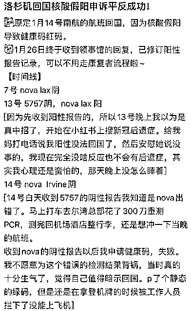
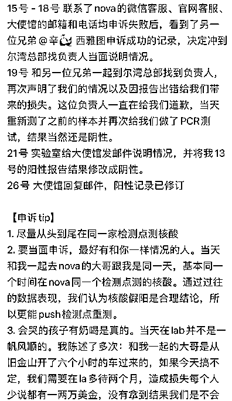
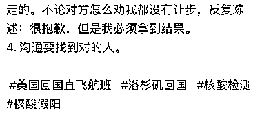
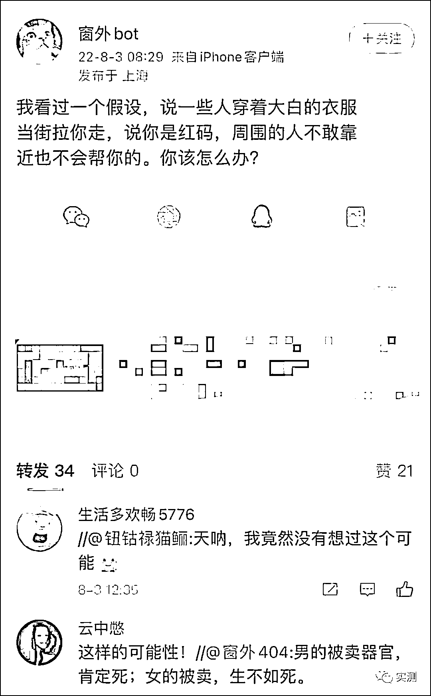

# 突发！大批华人核酸检测报告造假，赴华航班大面积熔断！

> 原文：[`mp.weixin.qq.com/s?__biz=MzIyMDYwMTk0Mw==&mid=2247542007&idx=5&sn=b48d26d1a5aa5c6d163288ed1ae0d643&chksm=97cbefcfa0bc66d9427c05f8738f615b4bb78b17da55a5bd063e1e9b0f174787da7bb547a8c0&scene=27#wechat_redirect`](http://mp.weixin.qq.com/s?__biz=MzIyMDYwMTk0Mw==&mid=2247542007&idx=5&sn=b48d26d1a5aa5c6d163288ed1ae0d643&chksm=97cbefcfa0bc66d9427c05f8738f615b4bb78b17da55a5bd063e1e9b0f174787da7bb547a8c0&scene=27#wechat_redirect)

7 月开始，回国不再强制要求乘客在指定实验室做检测，本以为能方便近期回国的海外同胞，但随之而来的是回国航班发现大量确诊病例，导致一连串的航班大熔断，尤其是中美航班，使得回国之路再添难度。

自检测新政开始以来，美联航很快被熔断十几趟航班。而航班熔断的原因一部分是由于国际近期感染病例增加，**还有一部分原因是一些旅客在登机前篡改新冠检测结果来获得登机许可**。而结果就是回国后被查出阳性，导致后续航班大熔断。

**核酸检测造假**

对于想要回国的同胞来说，拿到阴性核酸检测报告才是踏上回国航班的通行证。

截图来源：中华人民共和国驻美利坚合众国大使馆 

但是，很多人对于核酸检测有着一些疑问，例如，为何同一人先后前往不同检测机构进行核酸检测，结果却有“阴”有“阳”，是不是出现了假阳性？中国驻美大使馆对此说明为：1.不同检测时间，感染人员因病程进展，导致体内病毒量发生变化。2\. 不同检测机构检测标准、质量、设备、试剂等存在差异。3.在接受完检测后发生感染等因素。

专家表示“假阳性”情况较少发生，同时出现阴性、阳性结果时，更有理由怀疑阴性结果为“假阴性”。

使馆建议大家当出现不利检测结果，请客观理性看待，重新规划行程，并按要求做好后续检测和健康监测，勿轻易听信一些“博主”“群主”不负责任的“攻略”。

然而，还是有很多急于搭乘回国航班的乘客，由于核酸检测结果不理想，一些人会选择造假核酸检测的结果。

大使馆也指出一些乘客试图通过篡改检测报告、请他人“冒名顶替”参加检测以及制作假检测报告的方式获取健康码，甚至个别不法分子还谎称能帮阳性乘客拿到蓝码进行诈骗。

**在此提醒近期有回国计划的留学生，务必诚信检测、按规申报，确保检测数据真实有效，同时也要提高警惕，以防受骗。**

要知道，伪造新冠检测报告的后果是非常严重，甚至还有可能触犯《刑法》。千万不要为了一时便利，而触犯法律，还有可能连累后续航班的正常执飞。

中国驻美使领馆放宽检测机构的限制，本来是好事，却被一些人钻空子修改检测报告，实在令人气愤。

根据中国法律，伪造新冠检测报告违反《治安管理处罚法》，如果造成疫情扩散，还可能触犯《刑法》中的 “妨害传染病防治罪”等。

这种案例不是没有过。

在新冠疫情早期，在波士顿某大型企业任职的黎某，明知道自己出现症状，在检测结果未出之际，通过登机前服用退烧药来降低体温，骗过体温检测。

回国后还大肆渲染自己爱国并谴责美国不把新冠当回事。

结果遭到人肉，她的一系列造假行为被曝光，最终，黎某被判刑一年。

如此一来，黎某不仅丢了高薪的工作，就连绿卡也可能因为触犯刑法等行为而不保。

除此以外，在 2020 年 9 月 12 日，当事人邱某明知自己感染新冠，篡改检测报告骗取了绿码，从菲律宾首都马尼拉入境上海，也被判刑一年。

一名知情人士表示，核酸检测报告造假，一直是一大顽疾，有些人明知自己的核酸报告是阳性的，也要想尽办法改成“阴性”。其中有人就是在登机前做了两次检测，一次阳性一次阴性，他就把阳性的改成阴性也顺利登机回国了，但回国后集中检测就露馅了。

有加拿大的网友在今年初就发贴揭发了核酸报告造假现象：

该网友说，检测的时候，名字是真的，但是不同的人去现场检测，冒名顶替： 

另据早前报道，自今年 7 月 1 日起，中领馆不再指定检测实验室，回国的人员可以自行选择符合资质的实验就可以。

这虽然方便了回国华人网友的检测，但是这也给一些人看到了漏洞，也让检测结果更易被篡改。自此后，美联航很快被熔断十几趟航班，就是因为一些人钻了漏洞，把阳性结果修改为阴性，骗得顺利登机。

但是，目前厦航、南航仍建议乘客前往指定实验室做检测，个别航空公司甚至要求实验室把报告直接提供给航司，避免乘客私自修改检测报告。但是中国国航已经不再要求指定检测实验机构。

**假阳性“平反”**

回国的网友，面临的另一个困惑就是“假阳性”无法登机的问题。有洛杉矶的网友现身说法，把自己给假阳性“平反”的全过程记录下来，分享给众多网友：

这位网友是原订于今年 1 月 14 日的南航回国的，但是因为假阳性问题，导致了健康码变红。因回国急切，他还曾经 PS 了一个静态绿码，想蒙混过关，结果在机场拿登机牌时被拦下了。

这名网友最后找了实验室申诉，重新做 PCR 测试，幸运通过，终于给“假阳性”平反了，于 1 月 26 日获得中领馆修订了阳性报告，耗时 12 天。

**熔断更新**

7 月 11 日入境的国航 CA988 航班（洛杉矶至天津）自 8 月 8 日起，继续暂停该航班运行 4 班

7 月 13 日入境的国航 CA770 航班（洛杉矶至深圳）确诊新冠肺炎旅客 9 例！自 8 月 8 日起，暂停该航班运行 2 班！

洛杉矶出发至广州的南航 CZ328 也取消了 8 月 8 日和 8 月 15 日的航班。

旧金山出发至上海的美联航 UA857，熔断日期为 7 月 29 日、7 月 30 日、8 月 3 日、8 月 5 日、8 月 7 日、8 月 12 日、8 月 14 日；

西雅图出发至上海的达美航空 DL287 自 7 月 25 日起，暂停运行 2 班。

来源：实测，环雅三河总校

](http://mp.weixin.qq.com/s?__biz=Mzg5ODAwNzA5Ng==&mid=2247488098&idx=3&sn=638c5dd62ca652e1a1f2fd5b8420b00f&chksm=c0687b35f71ff223bca5031da035e3ab56f77f3ecfe42e587322e6e0f1302dc4d3e3fb354f18&scene=21#wechat_redirect)

← 向右滑动与灰产圈互动交流 →

