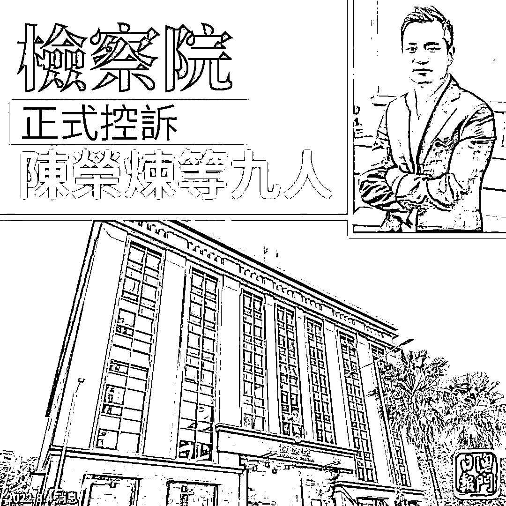
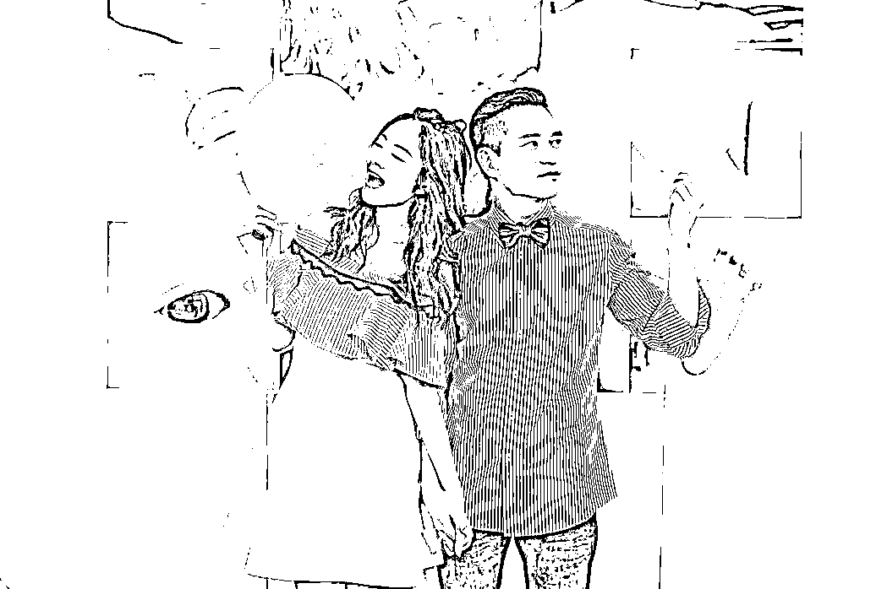
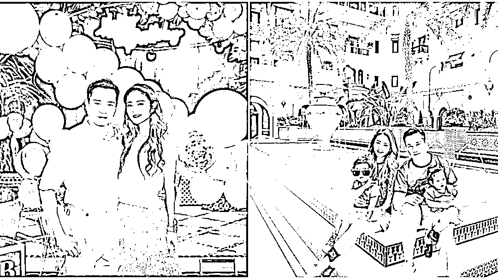
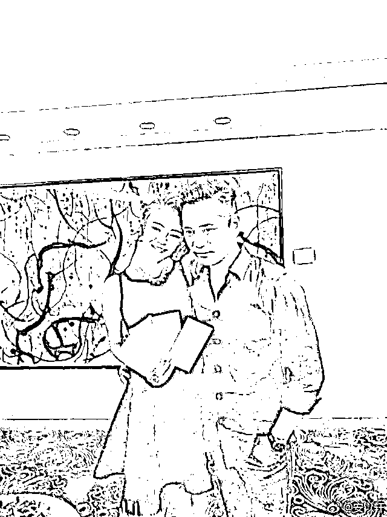

# 涉 6800 亿大案，安以轩老公被正式起诉

> 原文：[`mp.weixin.qq.com/s?__biz=MzIyMDYwMTk0Mw==&mid=2247542007&idx=6&sn=3b8d9bc149cf597e86148038371ddd72&chksm=97cbefcfa0bc66d9a5b41f3f0e2bb9c91c5b9e432336004b1ea2fdf3f52e1a41de2d2e7a8598&scene=27#wechat_redirect`](http://mp.weixin.qq.com/s?__biz=MzIyMDYwMTk0Mw==&mid=2247542007&idx=6&sn=3b8d9bc149cf597e86148038371ddd72&chksm=97cbefcfa0bc66d9a5b41f3f0e2bb9c91c5b9e432336004b1ea2fdf3f52e1a41de2d2e7a8598&scene=27#wechat_redirect)

据微信公号“澳门日报”8 月 4 日消息，有消息指出，澳门检察院已完成艺人安以轩丈夫、前德晋集团行政总裁兼澳门励骏主席陈荣炼的控诉书，正式提出控诉。

今年 1 月底，继太阳城集团创办人周焯华被捕后，陈荣炼被拘捕并羁押。“香港 01”8 月 5 日报道称，陈荣炼数罪合并，最高可判处 20 年刑期。

图源：微信公号“澳门日报”

今年 1 月底，陈荣炼被以不法经营赌博移送检察院处理。检察院其后公布初步案情，指陈荣炼与周焯华的犯罪团伙共同经营不法赌博及清洗黑钱。

据报道，澳门检察院近日已完成对陈荣炼等 9 人的侦查，提出控诉，并开始通知相关人士，据知控诉内容与周案如出一辙。

而周焯华涉嫌创立不法经营赌博集团、诈骗、在许可地方内不法进行赌博、清洗黑钱罪名的案件，将在下月 2 日开审。此前，据澳门日报消息，周焯华被控告不法经营赌博、相当巨额诈骗、犯罪集团等，共计 286 项罪名。据葡文澳门电台报道， 当中涉及非法投注的金额超过 8000 亿港元（约 6800 亿人民币）。

据“香港 01”报道，消息称陈荣炼至少涉嫌 3 项罪名，疑似触犯“执行黑社会组织的领导或指挥职务罪”，最高可处 15 年徒刑，加上赌博、洗钱、拒绝配合调查等罪，数罪合并可能会超过 20 年。

安以轩（左）和老公陈荣炼，图自台媒“联合报”

公开资料显示，陈荣炼于 2007 年成立德晋集团，长期位居澳门四大博彩中介人之列，市占率仅次于太阳城。其业务主要于澳门为相应娱乐场贵宾厅引入贵宾客户，后扩展至涉及综合娱乐、地产等行业。

陈荣炼还是澳门励骏创建的大股东，并出任公司联席主席、行政总裁兼执行董事。年报显示，截至 2021 年底，陈荣炼通过直接和间接持股澳门励骏共 33.19%的股份，其中绝大部分是在 2020 年 9 月至 11 月期间增持获得。截至发稿，澳门励骏尚未在联交所发布陈荣炼被控诉相关公告。

澳门励骏也主要从事娱乐场博彩行业，旗下两项核心物业分别是位于澳门半岛中心地带的澳门置地广场酒店，以及海滨综合设施澳门渔人码头。

天眼查 App 显示，陈荣炼除了在澳门励骏创建有限公司担任联席主席兼行政总裁、执行董事外，在内地还关联 6 家公司，其中 4 家为存续或在业状态，包括厦门龙鑫储运有限公司、联鑫（福建）房地产开发建设有限公司、万地鑫（福建）房地产开发有限公司、珠海市德晋电子科技有限公司，陈荣炼均担任董事、执行董事等高管职位，同时还担任珠海市德晋电子科技有限公司法定代表人，该公司系德晋集团有限公司全资子公司。

值得一提的是，2020 年 5 月至 8 月，陈荣炼相继退出内地多家公司法定代表人及高管职位，包括珠海德晋文化传播有限公司、珠海市德新广告有限公司、上海德栩贸易有限公司等。

图源：“香港 01”

台湾艺人安以轩自从 2017 年与陈荣炼结婚后，不时会在社交平台上晒出富裕生活。

据台媒“联合报”报道，2021 年底，陈荣炼在大陆被起诉，起诉书提到德晋集团涉嫌在大陆境内开设赌场，并入股分红，接着又在大陆设立非法赌博网站，并提供网址和电子投票账号，总金额高达 2.1 亿元人民币。当时安以轩的经纪公司仅对外表示“谢谢关心，艺人私事不回应。”

安以轩 38 岁生日时收到老公陈荣炼送的一条钻石项链，估计价值至少 1500 万港元。“香港 01”转自微博@安以轩

据“香港 01”8 月 5 日报道，在陈荣炼被捕后，安以轩已悄悄净空微博，只留下个人和孩子动态，已无夫妻合影，因此有婚变传闻。但安以轩方面对此没有正面回应。

来源：观察者网

](http://mp.weixin.qq.com/s?__biz=Mzg5ODAwNzA5Ng==&mid=2247488098&idx=3&sn=638c5dd62ca652e1a1f2fd5b8420b00f&chksm=c0687b35f71ff223bca5031da035e3ab56f77f3ecfe42e587322e6e0f1302dc4d3e3fb354f18&scene=21#wechat_redirect)

← 向右滑动与灰产圈互动交流 →

