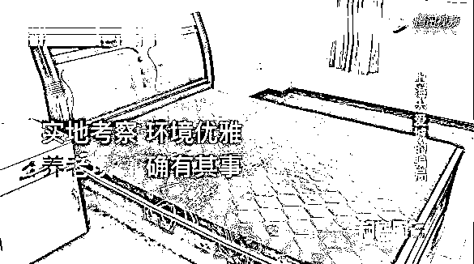

# 5.2 亿棺材本血本无归：上海老人逃过股市，躲过 P2P，没躲过上海大爱城！

> 原文：[`mp.weixin.qq.com/s?__biz=MzIyMDYwMTk0Mw==&mid=2247542007&idx=8&sn=0172134fe46eec42b1299438a41da808&chksm=97cbefcfa0bc66d984d8e55fd33e2693b3cac6f2ee96f0a5f7dfb0e299586a7f94929813c411&scene=27#wechat_redirect`](http://mp.weixin.qq.com/s?__biz=MzIyMDYwMTk0Mw==&mid=2247542007&idx=8&sn=0172134fe46eec42b1299438a41da808&chksm=97cbefcfa0bc66d984d8e55fd33e2693b3cac6f2ee96f0a5f7dfb0e299586a7f94929813c411&scene=27#wechat_redirect)

近 5.2 亿养老的钱被骗了

上当人数接近 2000 人

平均每个人被骗了 20 多万元

其实上海大爱城的骗局并不复杂

派业务员在老年人常出没的地方

如公园、车站、中山医院

发传单用低价游来吸引老人参加旅行团！

像上海周边三天两夜游

一般怎么也要小 1000 元

而她们只要 368 元！

这对老年人是非常大的诱惑！

还有上海本地“莘马泰”一日游

而且，服务还特别好。

一般的旅游团，就一个导游。

但是“上海大爱城”的旅游团，

除了导游外，还有 6-8 名工作人员。

鞍前马后，嘘寒问暖。

无事献殷勤，非奸即盗。 

在第二天，老人放松警惕后，

他们就开始讲课

宣传所谓的“候鸟式养老”理念，

怂恿老人们投资，

购买会员资格。

旅游中向老人播放短片，

视频中的人叫陈威洋，

“上海大爱城”负责人，

目前已被松江警方控制。

然后这帮金牌销售就上场了！ 

一口叔叔一口阿姨！ 

忽悠老阿姨爷叔投资

“你看一个床位才 10 万元，还有 10%的高额利息

投资 20 万以上，年利息还可以提升到 15%

如果暂时不住，可交给公司代为管理

出租他人使用，每月将租金返还购买人”

如果还不上当，

再带你们去实地看看

不仅可以住上海养老院

还可以住外地！！

亲眼看过后，

老人都深信不疑 

销售会说：不签的话下个月要涨价了之类

吓的老人赶紧签掉合同！

被骗的老人

他们大多瞒着子女，

自己安排养老。

83 岁的马先生，

上世纪 60 年代的大学生，

退休后回到上海。 

他不想劳烦子女，

花了 20 万在“上海大爱城”投资了两个床位，

以便生活不能自理后住进去。

听到老人说“墓地也买不了了”

小阿姨真的心酸的想哭出来……

林阿姨喜欢旅游，

因为“上海大爱城”要会员制旅游，

她和婆婆投了 47 万

杨阿姨因为家庭内部矛盾，躲到养老院。

住了 3 年。

也投资了 20 万。

赵先生瞒着子女，

将名下一套房子卖掉，

在“上海”大爱城投资了 210 万。

   2018 年，“上海大爱城”暴雷，

近 2000 位老人，

投资的 5.2 亿血本无归。

可笑的是，连自己的员工都被公司洗脑投资！

抵押了房子，为公司垫钱投资 300 万！

上海松江和青浦同时侦办案件，

将涉案人员全部捉拿归案。

骗老人的时候，你怎么没想呢？

更加让人引起警惕的是

上海大爱城模式 不止这一家

检察官说仅仅在青浦本地就还有 2-3 家

崩盘也只是时间问题

**阿姨爷叔们，要警惕啊！！！**

来源：实测

](http://mp.weixin.qq.com/s?__biz=Mzg5ODAwNzA5Ng==&mid=2247488098&idx=3&sn=638c5dd62ca652e1a1f2fd5b8420b00f&chksm=c0687b35f71ff223bca5031da035e3ab56f77f3ecfe42e587322e6e0f1302dc4d3e3fb354f18&scene=21#wechat_redirect)

← 向右滑动与灰产圈互动交流 →

# 原文：[`mp.weixin.qq.com/s?__biz=MzIyMDYwMTk0Mw==&mid=2247542059&idx=1&sn=ececbaf025f3746a2865ec1626242954&chksm=97cbee13a0bc67056ee10f4e689660999eb59deecc8dd4519e9fdcd2aead96df9658b1dddb84&scene=27#wechat_redirect`](http://mp.weixin.qq.com/s?__biz=MzIyMDYwMTk0Mw==&mid=2247542059&idx=1&sn=ececbaf025f3746a2865ec1626242954&chksm=97cbee13a0bc67056ee10f4e689660999eb59deecc8dd4519e9fdcd2aead96df9658b1dddb84&scene=27#wechat_redirect)