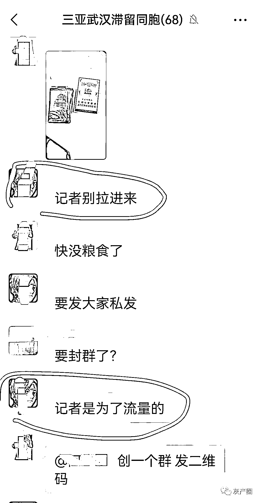
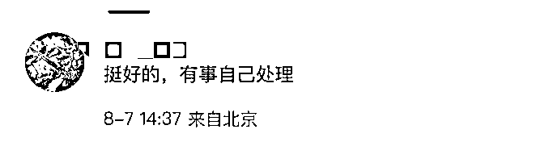
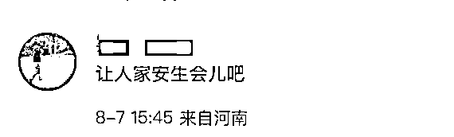
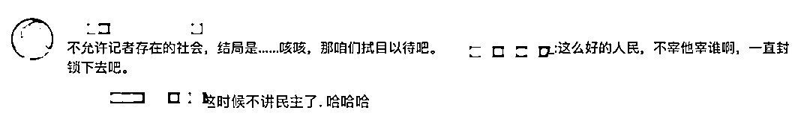
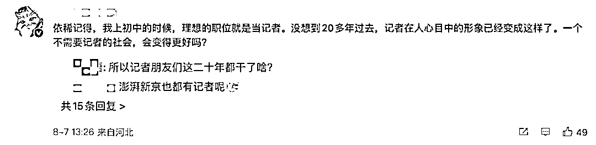
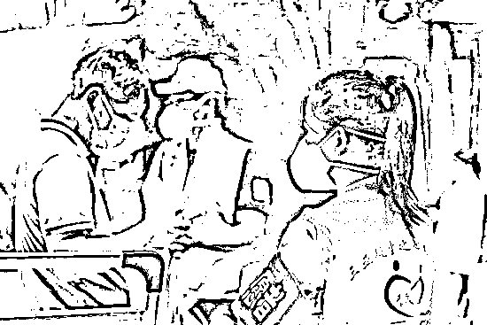
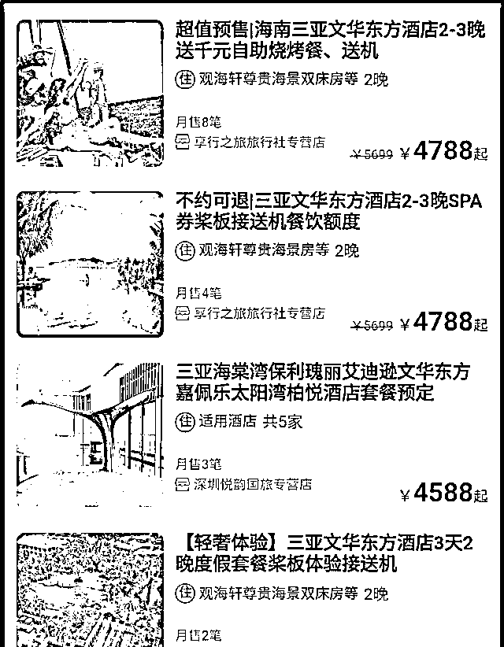
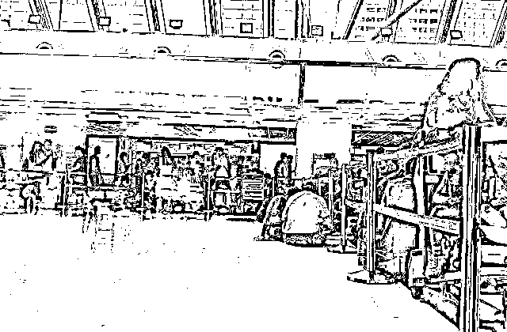
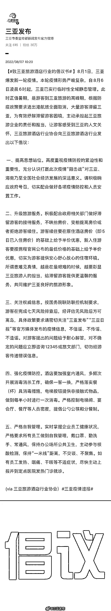

# 滞留三亚的人，禁止记者入群

> 原文：[`mp.weixin.qq.com/s?__biz=MzIyMDYwMTk0Mw==&mid=2247542059&idx=3&sn=1b579f23bf5edcfcba67a6f20722f65e&chksm=97cbee13a0bc6705e8c73ca1f1867b40d9bd10c2738ad0a950c48bfd1f22e3e71929436b5a1d&scene=27#wechat_redirect`](http://mp.weixin.qq.com/s?__biz=MzIyMDYwMTk0Mw==&mid=2247542059&idx=3&sn=1b579f23bf5edcfcba67a6f20722f65e&chksm=97cbee13a0bc6705e8c73ca1f1867b40d9bd10c2738ad0a950c48bfd1f22e3e71929436b5a1d&scene=27#wechat_redirect)

“记者别拉进来。”

8 月 6 日，网传截图显示，在一个三亚滞留自救微信群里，当一名记者被拉进群后，有人发出了这样的倡议。同时这名群友还补充道：“记者是为了流量”。

有意思的是，在这名群友发出警惕的同时，还有人表示“快没粮食了”。快没粮了还要防记者？对此网友议论纷纷...

有网友表示，“相信祖国，配合防疫最重要。”“警惕性高是对的”

同时有网友认为“挺好的，有事自己处理”。“让人家安生会儿吧”。也有网友表示忧虑：不允许记者存在的社会.....还有网友回忆起曾经的记者形象.... 

[`mp.weixin.qq.com/mp/readtemplate?t=pages/video_player_tmpl&action=mpvideo&auto=0&vid=wxv_2521070380074418178`](https://mp.weixin.qq.com/mp/readtemplate?t=pages/video_player_tmpl&action=mpvideo&auto=0&vid=wxv_2521070380074418178)

8 月 5 日夜间，三亚市新冠肺炎疫情防控工作指挥部发布通告：自 8 月 6 日凌晨 6 时起，全市实行临时性全域静态管理，除保障社会基本运行服务、疫情防控和紧急特殊情况外，全市范围限制人员流动，暂停城市公共交通，恢复时间另行通告。

三亚副市长何世刚接受媒体采访时表示，截至当日，还有 8 万多名游客在三亚，在这个艰难时刻，三亚作为旅游城市，更要对这些游客有更多的关心，并做好相关服务。据 8 月 6 日下午海南省新冠疫情防控新闻发布会最新通报，目前三亚市内约有 3.2 万人滞留在酒店。

8 月 7 日凌晨，据三亚发布官微消息：2022 年 8 月 6 日 12~24 时，三亚市新增 160 例确诊病例（其中 15 例为无症状感染者转归）、125 例无症状感染者。8 月 1 日 0 时至 8 月 6 日 24 时，累计发现确诊病例 615 例、无症状感染者 213 例。

为此，记者联系了几位滞留三亚的游客，了解他们的生活现状。

****滞留于别墅酒店****

“我们十多人再住 7 天，恐怕花费不少。”来自四川的曾丽（化名）告诉九派新闻，她与亲属一行来到三亚度假，入住文华东方酒店，如今在酒店隔离，每日单间房费约为 2500 元。

记者在某旅行平台上看到，文华东方为临海别墅式酒店，居住 2 晚的预定价格最低为 4788 元。其中，“嘉佩乐 聆海阁园景房单订房含双早”价格为每晚 4588 元。

▎某旅行平台的文华东方酒店价格

曾丽注意到，**酒店的半价优惠基于门市价。**

本来“数着日子”订酒店的曾丽一行人滞留于酒店。“尽管价格打了五折，价格仍旧远高于淡季。”曾丽告诉记者，酒店内的自助烧烤 780 元一位，如果中餐靠点餐解决，十多人每天的住宿、餐饮花费不小。

“目前，酒店安排了核酸检测点，三天两检，两次检测间隔需超过 24 小时。”曾丽期盼着早日返回四川。

****三亚当地医院设置了 24 小时检测点****

来自湖北武汉的李婕（化名）和朋友带着两位小孩，于 8 月初来到三亚旅游。“当时被告知需要 48 小时核酸才能离开。”原计划 8 月 6 日返程武汉的李婕被告知接连两趟航班取消，如今滞留于三亚市天涯区的某民宿。

此次来到三亚游玩，李婕选择了价格为每晚 500 元的民宿，当看到滞留游客可半价续住酒店时，她却被告知民宿不在优惠范围内。**民宿老板表示，民宿不属于酒店，不在补贴范围内。**

8 月 6 日下午，三亚市召开新闻发布会，会上介绍：自 2022 年 8 月 6 日凌晨 6 时起实行临时性全域静态管理，酒店为游客提供半价优惠的续住服务。游客在完成 7 天风险排查（即 7 天内第 1、2、3、5、7 天核酸检测阴性）后，经评估后可离岛。

根据相关规定，离开三亚市需要 48 小时内两次核酸阴性的证明，且两次核酸检测阴性报告时间需间隔≥24 小时。李婕告诉记者，三亚当地医院设置了 24 小时检测点，供市民核酸检测。

****机场工作人员忙得抬不起头****

来自山东青岛何窦（化名）8 月 2 日来到三亚度假，一家四人刚落地就看到“三亚通报 1 例阳性”的新闻，可何窦并未选择返程。“8 月 2 日转机 6 小时抵达三亚，而且订了比较贵的酒店，心想来都来了，玩几天再走。”何窦告诉记者，“我们那个区一直低风险地区，加上核酸检测结果出的慢，中途想返程，未能成行。”

▎8 月 6 日上午的三亚机场

8 月 6 日凌晨，何窦瞧见“全城静默”的新闻，便和丈夫带着两个孩子一起赶赴机场。据何窦回忆，当天上午的三亚机场，“好多带孩子的，全部席地而坐。”机场入口的工作人员忙着检查健康码、核酸，忙得抬不起头。

令何窦感到遗憾的是，其全家 8 月 6 日上午赶到机场，将当日晚间 6 时 05 分的航班改签至中午 12 时的，在办理值机时系统关闭，且手机系统显示无机票可改签。见到机场人群拥挤，害怕感染给孩子的何窦于中午离开机场，前往亚龙湾的酒店。

另一位来自上海的游客表示，其在 8 月 6 日上午 11 时登上飞机，在机舱内滞留 2 小时后得知航班取消；下午 4 点半，同行游客全部乘坐巴车抵达三亚湾，入住免费食宿的酒店。

“希望能早日解封，早点回家！”采访最后，何窦如是说。

**三亚旅游酒店行业协会倡议：******不变相涨房价****

此次三亚疫情形势严峻复杂，自 8 月 6 日凌晨 6 时起，三亚已实行临时性全域静态管理，三亚旅游酒店行业协会向三亚旅游酒店行业发出倡议：做好滞留旅客接待，不变相涨房价。以下为倡议全文： 

▎图源：@三亚发布

来源：九派新闻、@三亚发布、凤凰网、传媒见闻、宾曰语云

](http://mp.weixin.qq.com/s?__biz=Mzg5ODAwNzA5Ng==&mid=2247488098&idx=3&sn=638c5dd62ca652e1a1f2fd5b8420b00f&chksm=c0687b35f71ff223bca5031da035e3ab56f77f3ecfe42e587322e6e0f1302dc4d3e3fb354f18&scene=21#wechat_redirect)

← 向右滑动与灰产圈互动交流 →

