# 多名“世界冠军”疑遭官方打假

> 原文：[`mp.weixin.qq.com/s?__biz=MzIyMDYwMTk0Mw==&mid=2247542059&idx=5&sn=e2c804c44dede22188afdb5cc2d5b5b2&chksm=97cbee13a0bc67052619b6829fe4452fb3aa523c1abc1ead93fe658be031e8d294e58df4f628&scene=27#wechat_redirect`](http://mp.weixin.qq.com/s?__biz=MzIyMDYwMTk0Mw==&mid=2247542059&idx=5&sn=e2c804c44dede22188afdb5cc2d5b5b2&chksm=97cbee13a0bc67052619b6829fe4452fb3aa523c1abc1ead93fe658be031e8d294e58df4f628&scene=27#wechat_redirect)

8 月 1 日，中国体操协会突然发布了一份奥运冠军及世界冠军名单，涵盖体操项目、蹦床项目和艺术体操项目，其中明确提及，**截至目前，中国艺术体操奥运冠军和世界冠军的数量均为零。**

这篇文章的发布，疑似在对近期冒出的多位“艺术体操世界冠军”进行“打假”。连日来，部分经纪组织利用这些所谓的“世界冠军”开展商业活动，引发关注。

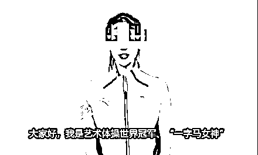

8 月 1 日，中国体操协会官方微信公众号和官方微博同时发布《中国体操、蹦床、艺术体操项目奥运冠军及世界冠军名单》，**标题中强调，这是截止到 2022 年 8 月 1 日的最新数据。**

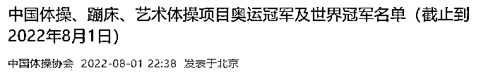

名单显示，**艺术体操项目在奥运及世界冠军项目上颗粒无收。**并明确说明：中国艺术体操奥运冠军指在奥运会上获得金牌的运动员；中国艺术体操世界冠军指在世界艺术体操锦标赛、世界运动会上获得金牌的运动员。

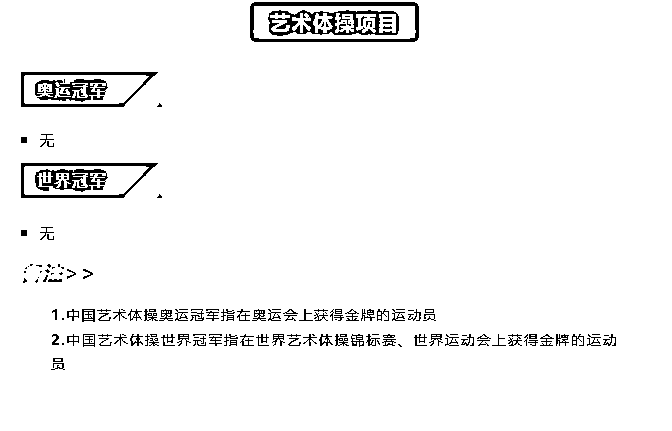

这份声明，被外界视为是对近期冒出的许多打着“艺术体操世界冠军代言/推荐”等名号进行宣传的商业活动的回应。

近来，网络上流传着各种“最美冠军团”的“打包代言”图片。比如，7 月 7 日，一位认证为“明星经纪人”及某文化发展有限公司执行董事的微博用户发布了一则“最美冠军团 2022 助力品牌腾飞”的宣传图，图片中出现了五位“艺术体操世界冠军”。

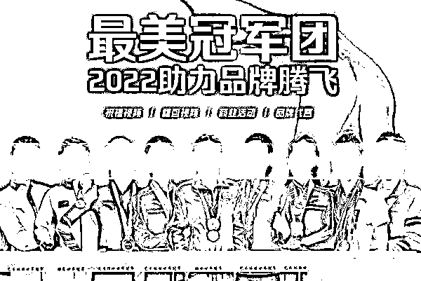

图片称，这些“世界冠军”可以承接祝福视频、翻包视频（向粉丝展示自己的包内有什么，引出要推荐的产品）、商业活动和品牌代言等业务。

**图片中的五人均为前艺术体操国家队队员，**她们中有人曾获得过全国艺术体操比赛的冠军，有人曾与队友获得过亚洲锦标赛的冠军，还有人获得过某个国际邀请赛的单项冠军，或与队友一起获得过艺术体操世界杯某站集体单项的冠军，**但都并非中国体操协会认可的“世界冠军”。**

而连日来，这些面孔频繁出现在网上流传的所谓“艺术体操世界冠军”担任某品牌“形象大使”的广告图片中。

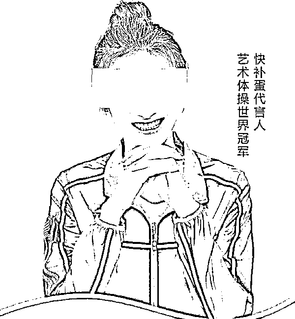

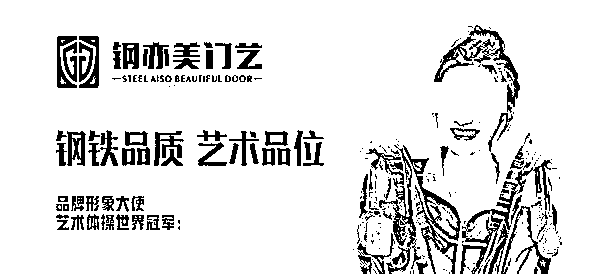

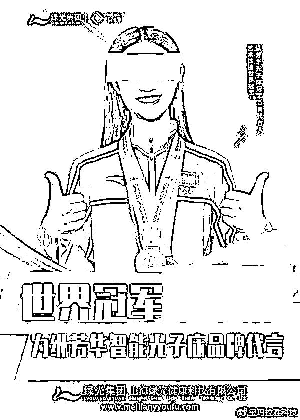

其中有人还出席了线下的商业活动，现场拉起了印有“世界冠军”名号的横幅。

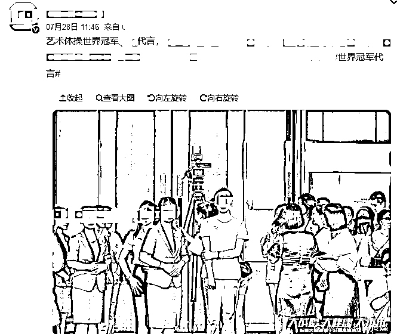

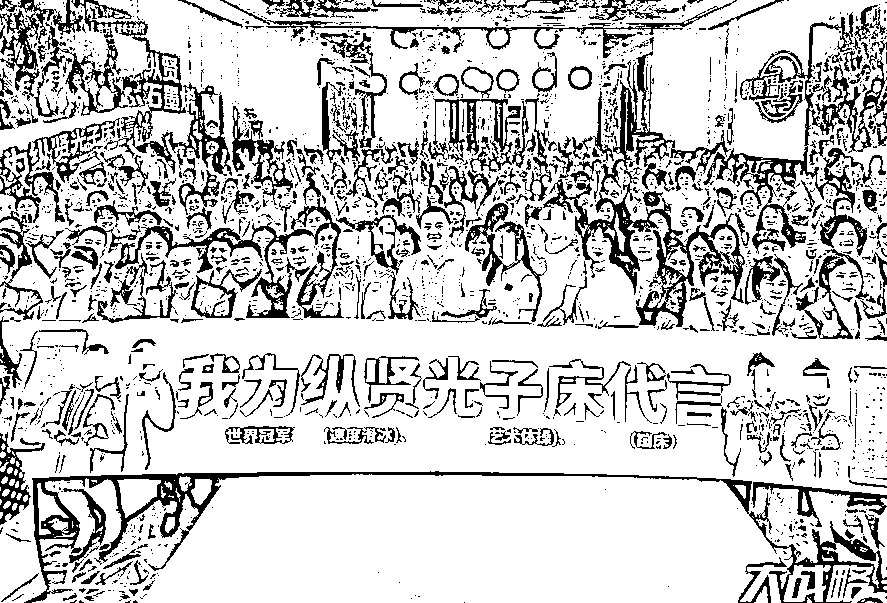

在一位微博粉丝超过 30 万、曾获得过艺术体操世界杯某站集体单项冠军的前中国艺术体操运动员的主页，能看到其曾发布带“艺术体操世界冠军”名号的图片及“世界冠军”话题的广告内容。

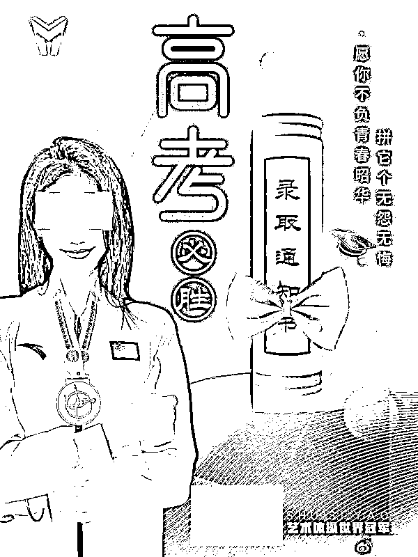

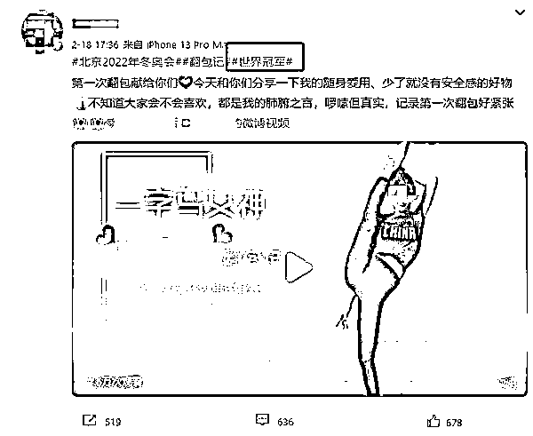

在其工作室发布的视频中，她在宣传某品牌时也自称“艺术体操世界冠军”。

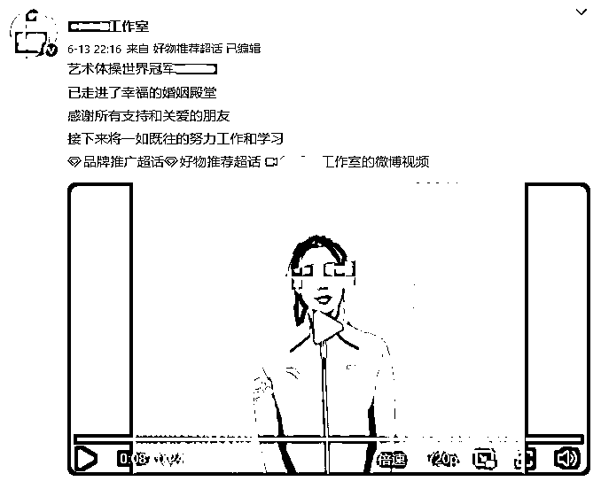

此外，这位前国家队队员曾于今年 6 月点赞了两则将其称为“艺术体操世界冠军”的商业合作内容。

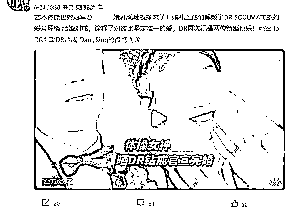

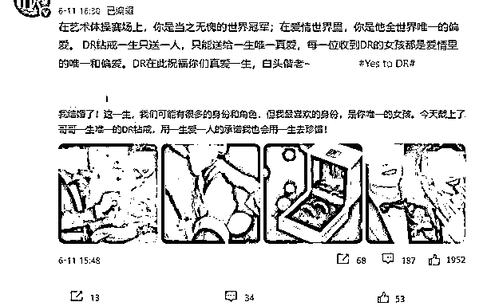

如今，中国体操协会发布最新名单，明确目前为止中国没有任何艺术体操奥运冠军和世界冠军，**疑似对这些打着“世界冠军”名号开展商业活动的行为作出回应。**

来源：观察者网，新闻晨报，利箭在行动

](http://mp.weixin.qq.com/s?__biz=Mzg5ODAwNzA5Ng==&mid=2247488098&idx=3&sn=638c5dd62ca652e1a1f2fd5b8420b00f&chksm=c0687b35f71ff223bca5031da035e3ab56f77f3ecfe42e587322e6e0f1302dc4d3e3fb354f18&scene=21#wechat_redirect)

← 向右滑动与灰产圈互动交流 →

