# “无人认领”行李箱竟成盲盒网上开卖，有人开出奢侈品……

> 原文：[`mp.weixin.qq.com/s?__biz=MzIyMDYwMTk0Mw==&mid=2247542059&idx=6&sn=61e147087bcb7eb8d16f16e651975b52&chksm=97cbee13a0bc67057f64b2cdbd5c2a5edd2d4cd5551a3d7d9ed7adfd9093c45400b0622a0137&scene=27#wechat_redirect`](http://mp.weixin.qq.com/s?__biz=MzIyMDYwMTk0Mw==&mid=2247542059&idx=6&sn=61e147087bcb7eb8d16f16e651975b52&chksm=97cbee13a0bc67057f64b2cdbd5c2a5edd2d4cd5551a3d7d9ed7adfd9093c45400b0622a0137&scene=27#wechat_redirect)

未知的惊喜总让人充满期待

近年来，各式各样的盲盒

颇受年轻人欢迎

但你听说过

“无人认领行李箱盲盒”吗？

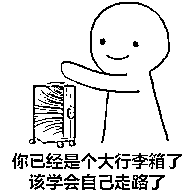

近日，某社交平台上出现了不少以“开无人认领行李箱盲盒”为主题的视频。视频制作者表示，这些行李箱有的是长期滞留在机场、火车站无人领取的；有的是租客抵押给房主的；还有说是从学校流转出来的学生不要的行李箱。它们大多从某闲置物品交易平台上淘来，价格从几十到上千元不等。

视频中，**有人从行李箱中“淘出”了二手衣服，有人“淘出”了手机、化妆品甚至奢侈品牌项链。**盲盒价值差距巨大，吸引了网友围观。

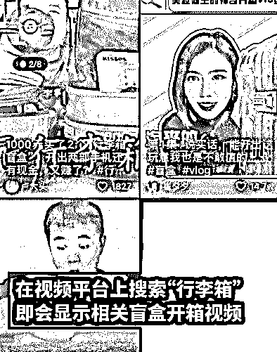

那么问题来了

这些行李箱真的“无人认领”吗？

开箱一时爽，但真的没问题吗？

**机场无人认领行李箱，真的能买到？**

7 月 30 日，在某网站上，一个博主的开箱视频引发关注。视频中，这位博主表示自己花 1000 块钱，买了一只在机场长时间无人来领取的行李箱，卖家称因为行李箱带密码锁，因此从未被打开，也不知道里面到底装着什么。

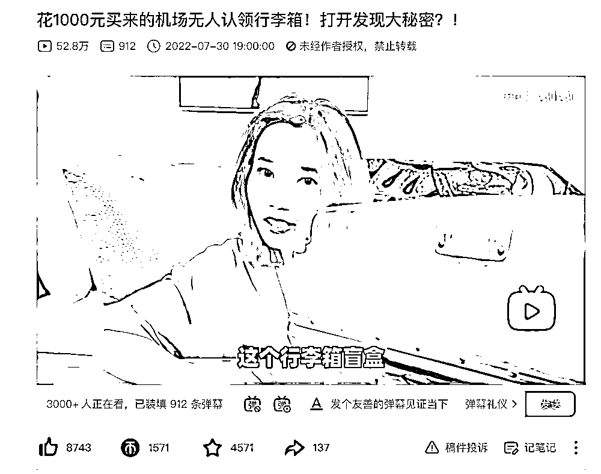

视频截图

经过一系列操作，博主在箱子里发现了许多女生衣物，还有书本、化妆品、一只相机包和一张存储卡。但最夺人眼球的，**是箱子里一条疑似某奢侈品牌的项链，总价值高达人民币四万多元****。**

如此“物超所值”的盲盒，也让网友们议论纷纷——

“项链是真的还是假的？这也太赚了吧！”

“如果是真的，把这箱子丢了的人心得有多大，还是已经有钱到丢了也无所谓了？”

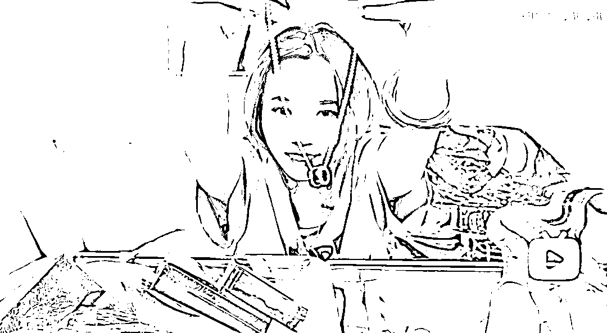

视频截图

更多网友则对行李箱的来源和转卖的合法性产生怀疑——

“我不明白这个东西为什么可以卖，这难道不是别人的隐私吗？”

“话说即使真的是过了几个月没人要的行李，机场有权卖吗？卖了的钱归谁呢？”

可以看到，视频中的这个行李箱上挂有标牌，写着托运日期为 2022 年 6 月 27 日，来自义乌机场站。而博主展示的拍摄时间是 7 月 21 日。一个月左右在机场无人认领的行李箱，就能流转到二手市场上进行出售吗？

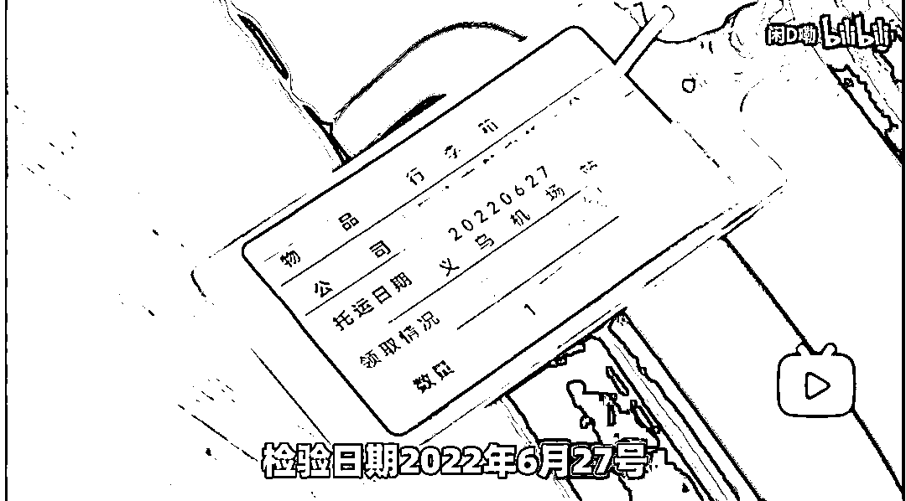

视频截图

“我们只是接受站点，滞留的（无人认领的）行李一般保存 7 天，超过 7 天就会退回旅客的始发站。”义乌机场地勤保障部负责到达行李业务的工作人员说。义乌机场工作人员强调，机场不会随便处理旅客行李箱，更不会直接进行买卖。

**而关于“无人认领物品”保管时间的长短，每个机场都有不同的规定。**

上海某机场的失物招领处工作人员表示，如果物品是充电宝的话，保管时间一般只有一周；普通物品保管时间是半年；贵重物品如电脑、手机、相机等的时间是一年。如果超过时期，仍然无人认领，就会交给其他部门“处理”。但至于具体怎么处理，工作人员表示并不清楚。

工作人员表示，机场失物招领只负责在机场内发现的遗留物，如果是托运中出现的问题，需要联系航空公司，每个航空公司也有自己的失物招领处。

“（无人认领）托运行李基本上是会放进仓库的。一般来说，半年到一年期间是不会逾期的。超过多年仍然无人领取的话，一般会交给其他相关部门处理。”某航空公司热线工作人员说。

热线工作人员解释，多年无人领取的失物一般会被视作“遗弃”，航司会交给一些特殊的公司处理，这些公司是否会进行拍卖或出售，就不是航司能控制的了。但可以肯定的是，**国内航空公司不会直接拍卖、转卖无人认领的旅客行李。**

12306 工作人员对铁路失物招领情况回复，一般保管时长最多为 180 天，逾期后通常销毁处理。

那么充斥在社交平台上的

“无人认领行李箱”

到底是哪来的呢？

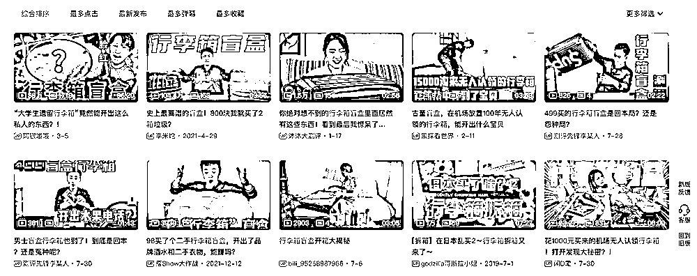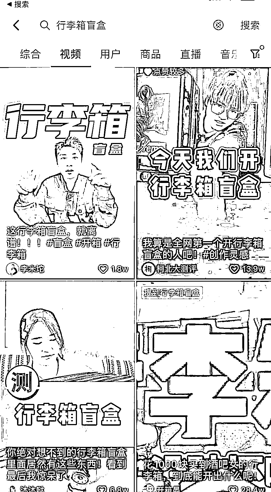

视频截图

**行李箱盲盒走红，卖家表示“能担保还给提成”？**

大多 “无人认领行李箱盲盒”都出自某知名闲置物品交易平台，其中的一位卖家说，“都是来自大学校园的，有的学生出去实习，（疫情关系）回不去就不要了。现在学生有钱的很，放心购买，我们目前没有一个差评。”**对于里面的私人物品是否会涉及法律问题，卖家表示自己已经卖了半年多了，没有任何问题，并称会给“担保”。**

此外，这位卖家还表示“网上的视频都是假的”，尤其一些高档物品，都是视频拍摄者自己放进去“炒作”的。

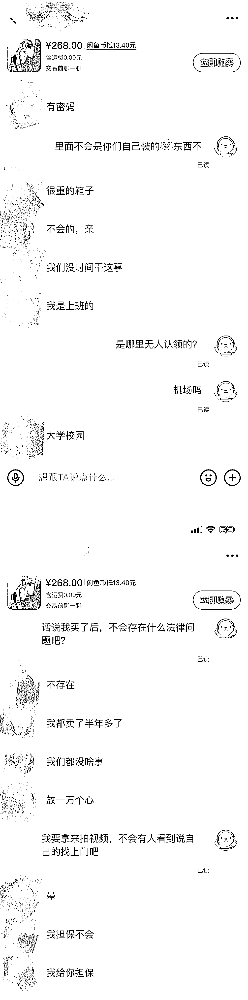

记者与一位卖家的聊天记录截图

另一位卖家则称自己的“商品”主要来自机场、短租公寓抵押，还有一些是公司重建留下的。对于货源来路，卖家表示自己也只是“货代”。

除了货物来源不明外，这些行李箱盲盒的广告中都包含一些关键词**，比如“女学生行李箱”“女租客行李”等等，并配上模糊的女性照片。另外还会用诱导性的语言暗示能“开出好物”****。**

该交易平台的网友评价中，箱子里大多是二手衣物和废弃杂物，能开出奢侈品的人寥寥无几。

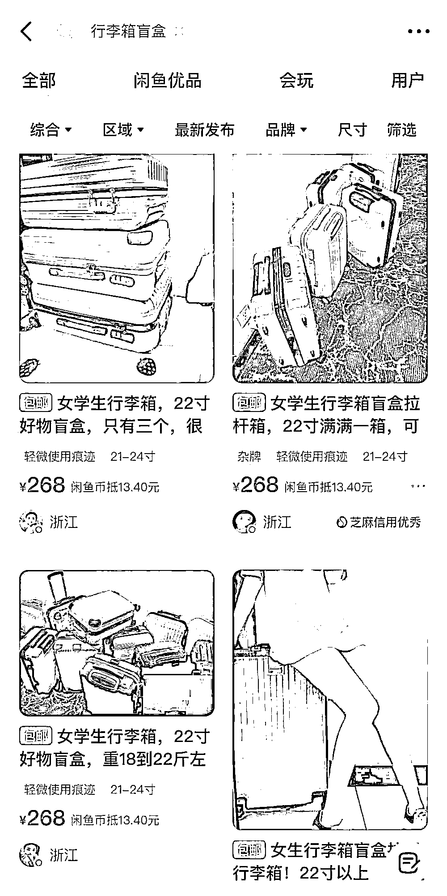

平台截图

**有主物有权追回，“伪行李箱盲盒”涉嫌欺骗**

“无人认领的行李箱”能被随便处理吗？

未经同意就在交易平台上出售

是否侵犯了物品原主人的权益？

对此，有律师认为，从法律角度看，买卖无人认领的行李箱盲盒的行为属于违法行为。

律师指出，从物权角度来看，在航空公司办理托运的行李显然是有所有权人的，**在未经所有权人同意或授权的情况下出售其行李箱，损害了所有权人的合法权益。**

根据民法典规定：“拾得遗失物，应当返还权利人。拾得人应当及时通知权利人领取，或者送交公安等有关部门。”“不知道权利人的，应当及时发布招领公告。”“遗失物自发布招领公告之日起一年内无人认领的，归国家所有。”

不过机场、航司均表示，由于仓库空间和人力有限，行李箱无人认领时间过长，通常会交给第三方处理。那么第三方公司擅自将行李箱进行出售，是否存在问题？

“如果第三方公司在没有经过所有者授权或追认的情况下，把东西处理掉了，那么也存在侵犯他人所有权的问题，行李的所有权人既可以向航空公司问责，也可以向第三方公司问责。”律师说。

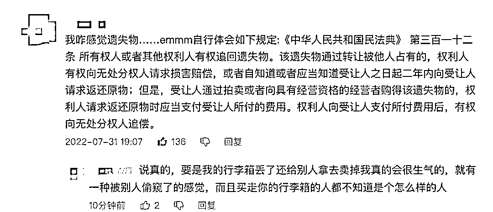

网友们对“无人认领行李箱盲盒”行为的质疑

“机场无人认领行李箱”让人大跌眼镜，那租客因交不出房租抵押给房东的“行李箱盲盒”呢？

律师表示，“法律角度上来讲，在租客不能支付房租的情况下，房东留置租客部分财产的行为，是一种法定的担保物权，但房东不能直接变卖留置物，还是需要经过法定程序。”

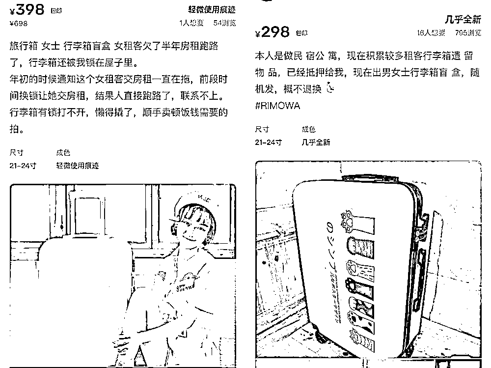

这些“行李箱盲盒”据说是租客抵押给房东的

当然“无人认领行李箱”本身的真实性也仍然存疑。不少网友认为这其实只是商家的炒作和噱头，利用消费者猎奇和“占便宜”的心理，销售二手垃圾。

对此，律师指出，如果是人为制造的“无人认领”的行李箱，以盲盒形式出售，那么消费者购买后落差很大的话，商家就涉嫌欺骗，消费者可以寻求消协的帮助。

来源：法治网，中央政法委长安剑 ，监制：卢刚：责编：赵岑 校对：张慧

](http://mp.weixin.qq.com/s?__biz=Mzg5ODAwNzA5Ng==&mid=2247488098&idx=3&sn=638c5dd62ca652e1a1f2fd5b8420b00f&chksm=c0687b35f71ff223bca5031da035e3ab56f77f3ecfe42e587322e6e0f1302dc4d3e3fb354f18&scene=21#wechat_redirect)

← 向右滑动与灰产圈互动交流 →

