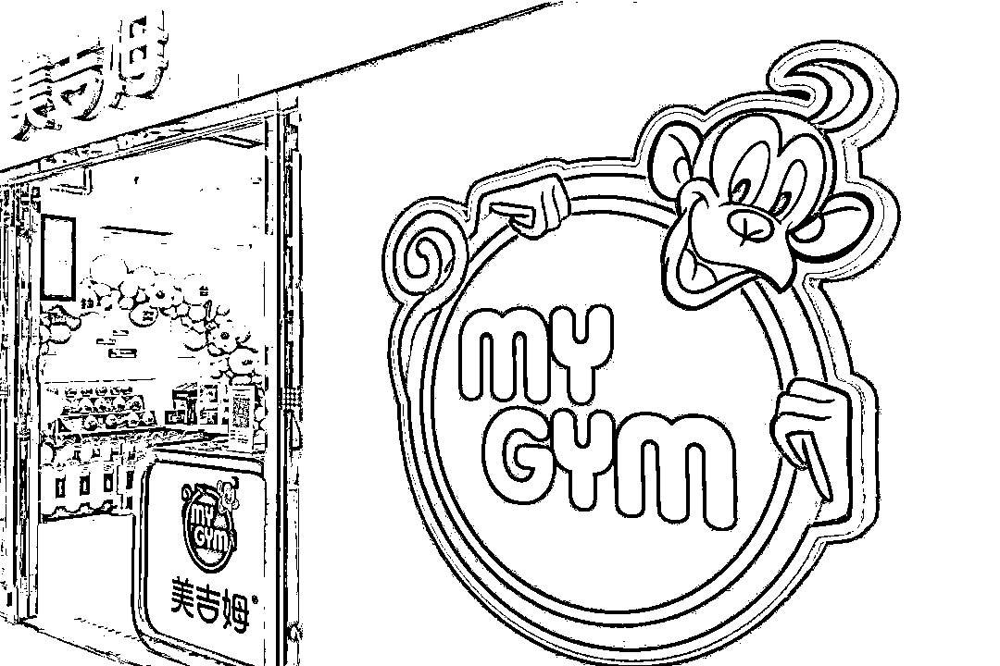

# 多家门店被曝关闭，有的店公众号注销...这家知名早教机构怎么了？

> 原文：[`mp.weixin.qq.com/s?__biz=MzIyMDYwMTk0Mw==&mid=2247542059&idx=7&sn=d2ca18594e7d0dad61b7df968594d9c7&chksm=97cbee13a0bc6705240705d3f808e460caed1b7bd0874c254980e1953e9f83b65c44c624b470&scene=27#wechat_redirect`](http://mp.weixin.qq.com/s?__biz=MzIyMDYwMTk0Mw==&mid=2247542059&idx=7&sn=d2ca18594e7d0dad61b7df968594d9c7&chksm=97cbee13a0bc6705240705d3f808e460caed1b7bd0874c254980e1953e9f83b65c44c624b470&scene=27#wechat_redirect)

9 个课时被清零，门店公众号突然注销，在排课群询问老师始终无人回复……近日，在美吉姆静安大融城店为孩子报了早教课的家长们不免担心起来。

**上海美吉姆两家门店被曝关店**

据新闻晨报，最近，上海不少家长反映知名早教品牌“美吉姆”黄浦日月光店、静安大融城店都出现了关店现象。

在美吉姆静安大融城店为孩子报课的原女士意外发现，孩子的 9 个课时突然被清零，原本一直关注的门店公众号也注销了，她在排课群询问对接老师，始终无人回复。一位美吉姆静安大融城门店排课老师表示，之所以还没复课，是因为没有收到主管部门的的复课通知。原女士反映自己课时被清零的情况，该老师随后帮忙恢复了课时，**对于公众号注销的情况，该老师表示应该是市场部门的调整**。 

事实上，不止美吉姆静安大融城店的家长感到焦虑，还有家长反映，美吉姆黄浦区日月光中心店也已关闭。

据看看新闻，上海市民马女士说，她的孩子在美吉姆国际儿童发展中心，黄浦日月光店上早教课，**总计充值 96 节课，价值 16300 元，目前仅上 34 节课。不过近期**，该门店排课老师忽然告知家长，由于门店与商场续约问题，需要关闭，不过家长可去其它门店上课。但由于路程较远，马女士要求退费处理。马女士说：“说了两个方案，一个可以转中心，另外由于是加盟店，可以转其它品牌早教上课，因为我不同意，后续 7 月 17 日，12345 联系到黄浦区市场监管局，告知我说，已经沟通好了一个退费方案。” 

按照对方提供的退费方案，**如果要退剩余课程 70%的费用，仅能在复工后 6 到 12 个月内给到家长**；而选择复工后一个月内退款的，就只能拿到剩余价值的 30%。马女士称：“我觉得不应该由我承担剩余 30%费用，而且这个周期太长了，要 12 个月，我担心后期他们不会履行这个退费方案。”

图片来源：视觉中国（图中门店与文中并非一家）

据静安区市场监督管理局回应，美吉姆静安大融城店目前停止经营，该公司负责人无法联系，已对该公司进行限制变更注销监控。

据新闻晨报，8 月 3 日，对于家长们的一些担忧，美吉姆总部公关部门工作人员回复记者称，美吉姆上海中心运营正常，并且已做好了复课前的各项准备，待收到政府相关部门发布的复课通知后，就可以复课了。

对于美吉姆黄浦区日月光中心店的情况，工作人员表示，经核实，是因为该中心已和商场的租约到期了，门店在 7 月份就已经通知了会员。她解释说，**因为这两家门店都是刚刚发生变动，内部信息的传达有一定滞后性，因此还没来得及在官网做信息调整**。

对于美吉姆静安大融城中心店的情况，对于“目前停止经营，负责人无法联系”一事，工作人员回应：截至目前，**教培类机构还在等待政府复课通知，我们会敦促该中心负责人尽快联系市场监督局跟进处理**，早日撤除这个‘限制变更注销监控’。”

**福州美吉姆多家门店宣告闭店**

据海峡都市报，8 月 1 日，福州多位家长报料称，位于福州的美吉姆国际儿童早教中心多家门店突然宣告闭店，剩余课时费用在上百元至上万元不等，不知后续应该如何处理。

福州市民曹女士说，今年 6 月 2 日，她在其他宝妈的推荐下，通过美吉姆国际儿童早教中心的优惠推广链接，花费 298 元报了 10 节课程，并选择在离家比较近的仓山万达门店上课。由于时间一直不合适，她还没有带孩子去上过课，没想到门店突然关门了。“闭店后，当时对接的老师和机构公开电话便都联系不上了。”曹女士说。

 除了仓山万达门店，在美吉姆台江区东百元洪城店报了课程的市民曾女士，也发现门店大门紧闭，联系不上工作人员。

去年 6 月，市民陈女士在东二环泰禾门店花费 11999 元购买了 60 节早教课程，赠 6 节免费课程。陈女士说，今年 6 月，由于个人原因要前往别的城市，便向东二环泰禾门店提出将剩余约 43 节课程的费用转至美吉姆国际儿童早教中心位于其他城市的门店，但东二环泰禾门店迟迟未能提供转课手续，导致其他门店无法接收，**目前门店关闭，同样联系不上工作人员**。

 8 月 1 日 17 时，记者在东泰禾门店和东百元洪城门店的家长维权群内看到，群内人数分别为 400 余人和 200 余人，其中东二环泰禾门店的报课情况登记表中，登记的家长已超百人。

**加盟模式是美吉姆经营的重要一环**

7 月，美吉姆(002621.SZ)发布公告，2022 年上半年归属于上市公司股东的净利润亏损预计为 2500 万元-3500 万元，上年同期为盈利 3309.37 万元；营业收入预计为 7000 万元-1 亿元，上年同期为营收 1.75 亿元。

对于业绩变动原因，公告显示，2022 年上半年国内部分地区出现疫情反复，处于相应地区的美吉姆早教门店阶段性暂停线下授课，公司早教业务相关营业收入和营业利润下降，导致归属于上市公司股东的净利润相应减少；同时，公司自 2021 年 11 月 26 日暂停履行《业务托管协议》，此报告期不再收取上述《业务托管协议》相关托管费；另外，公司于 2021 年 12 月完成出售子公司北京楷德教育咨询有限公司 100%股权，此报告期合并范围不再包括北京楷德教育咨询有限公司。

此外，美吉姆同日公告称，收到公司董事关静东提交的书面辞职报告。关静东由于个人原因，辞去公司董事及专门委员会职务，辞职后不再担任公司其他职务。

8 月 2 日，美吉姆公告称，**公司于 8 月 1 日收到公司独立董事李阳、独立董事尹月提交的书面辞职报告**。其中，李阳因连续担任大连美吉姆教育科技股份有限公司独立董事即将届满六年，自即日起申请辞去公司独立董事、审计委员会委员、提名委员会委员、薪酬考核委员会委员职务。辞职后将不再在公司担任任何职务。尹月则因个人原因申请辞去公司独立董事职务，一并辞去公司董事会提名委员会委员职务。

资料显示，美吉姆是一家以早教为主营业务的上市公司。2018 年 11 月，三垒股份正式收购早教品牌美吉姆，2019 年 4 月正式更名为“美吉姆”。

商业模式上，美吉姆采取直营和加盟并重的模式，主要收入和盈利来自于向加盟商收取的品牌授权费、加盟费、技术与系统服务费、产品销售收入以及直营中心的经营收入。2021 年年报显示，截至报告期末，**美吉姆在全国范围内共开设了 562 家美吉姆和小吉姆中心，净增长率 1.3％**。

加盟模式是美吉姆经营的重要一环。美吉姆表示，加盟模式可以借助合作方资源快速抢占市场，并通过连锁经营降低运营成本和经营风险，获得规模效益。

不过，美吉姆也意识到加盟模式的不足。为了确保加盟店的质量，美吉姆制定了严格的加盟商筛选标准，对加盟商准入资质进行严格把控，从资金实力、资金信用、社会资源、专业能力、管理水平等方面进行全面考察。

但值得注意的是，据多家媒体报道，去年重庆、温州、杭州、绵阳、台州等多地曾出现过美吉姆加盟商疑似跑路的新闻。

来源：每日经济新闻综合海峡都市报、新闻晨报、看看新闻、公开资料等

](http://mp.weixin.qq.com/s?__biz=Mzg5ODAwNzA5Ng==&mid=2247488098&idx=3&sn=638c5dd62ca652e1a1f2fd5b8420b00f&chksm=c0687b35f71ff223bca5031da035e3ab56f77f3ecfe42e587322e6e0f1302dc4d3e3fb354f18&scene=21#wechat_redirect)

← 向右滑动与灰产圈互动交流 →

