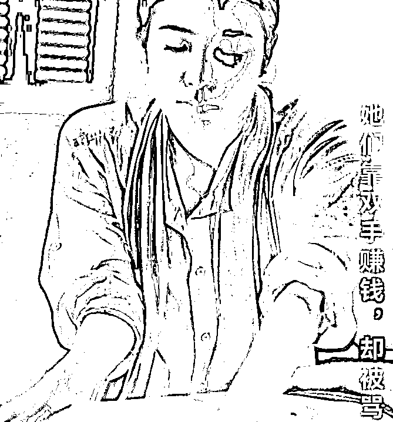
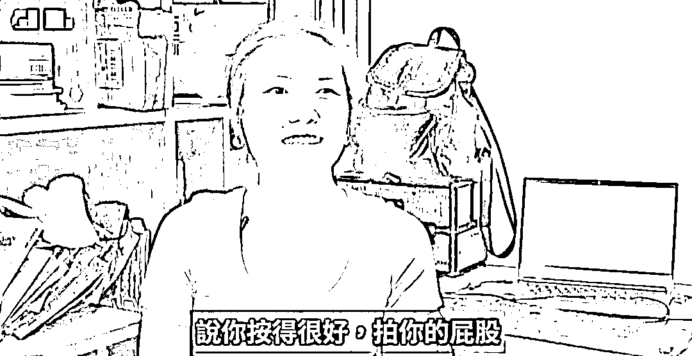
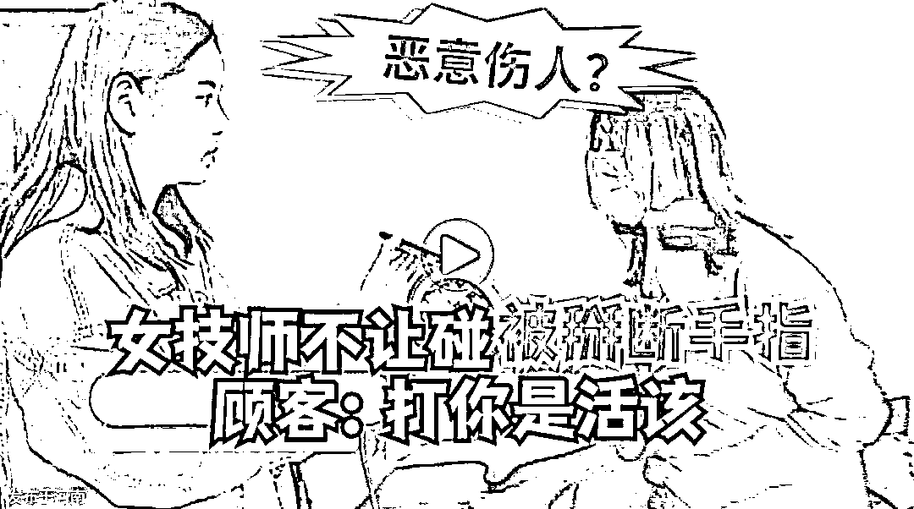
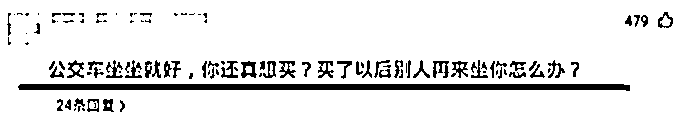
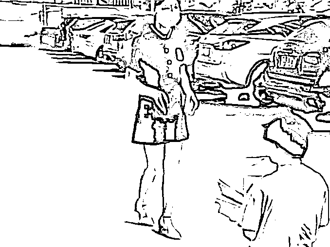
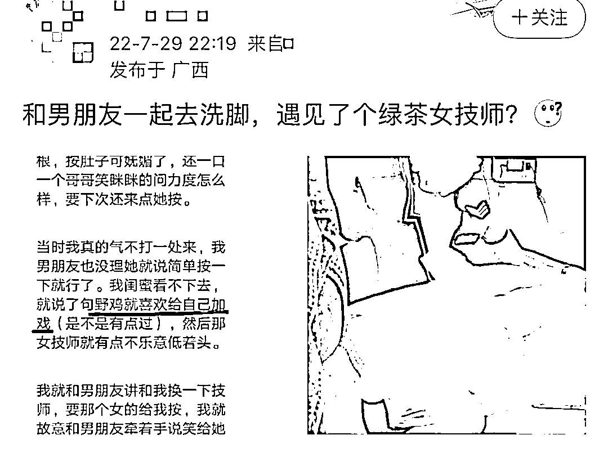
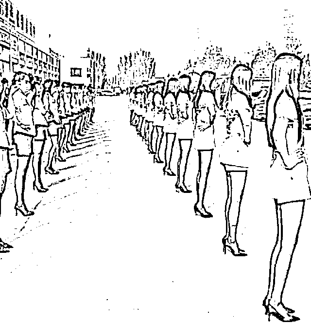
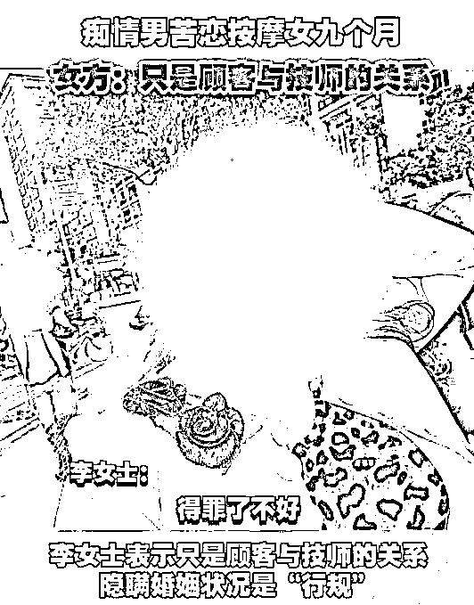
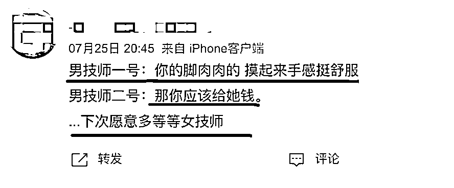

# 按摩店女技师：别再劝我“从良”

> 原文：[`mp.weixin.qq.com/s?__biz=MzIyMDYwMTk0Mw==&mid=2247542109&idx=1&sn=c0a1b03a32636a9e8cad3db83929f7ae&chksm=97cbee65a0bc67736f84e1551cb9f079e39065ef9090b4cc99216eb08c2e5ea02e2fcf6aca4c&scene=27#wechat_redirect`](http://mp.weixin.qq.com/s?__biz=MzIyMDYwMTk0Mw==&mid=2247542109&idx=1&sn=c0a1b03a32636a9e8cad3db83929f7ae&chksm=97cbee65a0bc67736f84e1551cb9f079e39065ef9090b4cc99216eb08c2e5ea02e2fcf6aca4c&scene=27#wechat_redirect)

# 

提起「女技师」，你会想到什么？ 

是深夜里一抹粉色灯光？是一个妩媚女子含情脉脉的暗示？

**人们对「女技师」的印象，总是与情欲密切相关。**

可事实却与此相差甚远。

大部分女性技师，从未打算出卖色相，仅依靠双手与汗水来换取微薄的收入。

而这份辛勤换来的却是，**社会的歧视、亲友的嘲讽、数不尽的性骚扰……**

**甚至，她们遭到性侵后举报罪犯，还会被对方污蔑「嫌钱少」。**

****

****

****按摩行业，是女性受侵害的重灾区****

**据北京妇女热线统计，我国约有 70%的女性遭受过职场性骚扰。**

**而在按摩行业中，性骚扰几乎成了一种常态。**

**我之前采访过的盲人化妆师肖佳，曾是一名按摩技师。她说，学会应对不同形式的性骚扰，已成为女技师们必备的生存技能。**

**肖佳说，经常会有一些男性客人，在按摩过程中对女性技师上下其手。**

****有时，他们会假装不小心用腿蹬一下技师的胸部。****

****有时，他们会谎称自己小腹酸痛，把技师的手慢慢引向自己的下体。****

**甚至还有些人，在按摩的过程中表现得非常规矩，完全看不出骚扰的迹象。**

**直到服务结束后，他们会借着感谢的名义，冷不丁地拍一把技师的屁股，再扬长而去。**

****

****「我被当作动物一样对待」**河南郑州一家足疗店的女技师这样说。**

**李女士是一位资深按摩师，从业多年来，她没有与任何客人发生过冲突。**

**直到那天，她和另外两位同事一起，为三个男客人提供按摩服务。**

**然而，服务项目结束后，两位同事早早离开了房间，她却被单独留下「加钟」。**

**出于良好的职业素养，她没有思索太多，而是聚精会神地为客人踩背。**

****这时，坐在一旁的两位男性，将他们粗糙的手掌伸向了她的大腿根部。****

**李女士当即要求客人停手，并严肃地告知，在踩背时打扰技师非常危险。**

**可她明确的拒绝并没有得到应有尊重，反而挨了一记重重的耳光。**

**他们三人围住李女士，一边嘲讽她装清高，一边粗暴地将手伸向了她的胸部。**

**因为李女士拼命挣扎，三人没能得逞。在恼羞成怒下，他们掰断了李女士的三根手指来泄愤。**

**临走还朝着李女士骂道：**「碰都不让碰，活该。」****

****

**女技师≈色情从业者，这是一直长期扎根在人们心中的偏见。**

**在日常生活中，它很少会引起人们的重视与反思。**

****而在性犯罪行为中，这种偏见却成了施暴者逍遥法外的通行证。****

**广东深圳曾发生过一起女技师遭性侵，反被污蔑是「卖淫女」的案例。**

**一名 43 岁的中年男子陈某，在某平台预约了上门按摩服务，女技师小刘接到了这个订单。**

**在服务过程中，**陈某用手机播放了一部不雅视频，同时用言语对小刘进行挑逗。****

**受到惊吓的小刘立即警告陈某，如果再继续这种行为，她有权终止服务并且离开。**

**谁知陈某竟然一把将小刘按倒在身下，恶狠狠地威胁到：**你敢反抗，我就杀了你。****

**对小刘一番凌辱后，陈某还在微信上给小刘转账 200 元，并威胁她收下。**

****最具讽刺意味的是，正是这 200 元，差点让陈某成功脱罪。****

****

**陈某在派出所辩称，200 元是付给小刘的嫖资，是小刘嫌钱少才举报他强奸。**

**不知该庆幸还是心痛，因为在工作中经常遇到骚扰，小刘总是随身携带一部旧手机。**

**这部手机的录音功能记录下了她遭遇性侵的全过程，因此才将陈某送进了监狱。**

**这不禁让人感到后怕。**

**如果小刘没有携带录音设备，如果她在受侵犯时没能及时开启录音……**

****她该如何证明自己是受害者，而不是性工作者？****

**如果她的职业是教师、医生、律师，施暴者所谓的「性交易纠纷」，会不会不攻自破？**

****歧视，才是将这些女性引入困境的幕后推手。****

********

******性骚扰的背后，是歧视******

****如果你现在上网搜索关键词「娶技师」，就能看到上百万条令人匪夷所思的言论。****

****一群刻苦学习的按摩技术，勤勤恳恳工作赚钱的女性，被贴上了「下贱」的标签。****

****这不仅意味着她们要承受来自社会，毫无根据的唾骂。****

******更意味着在两性关系当中，她们要被看作一种「廉价商品」般的存在。******

********

****这样的心理，让本该平等的两个性别，逐渐开始倾斜。****

****江苏一家洗浴中心的停车场，一位刚下班的女生被一名男子拦截。****

****女生是一位按摩技师，这名男子是她曾服务过的一位客人。****

****而这位客人毫无征兆地出现在她下班的路上，并且手捧着鲜花，单膝下跪向女生求婚。****

****女生礼貌地向对方表示了感谢，同时声明自己对他没有男女之间的感情。****

****但这名男子却不依不饶，还当众冲着这位女生大声吼道：****

******「我不嫌弃你！嫁给我吧！」******

******「以后我养你，你就不用再去伺候别人了！」******

****尽管男子的身体跪在地上，但言语之间尽是居高临下的傲慢。****

****仿佛女生正在从事着某种不光彩的工作，而自己就是带她上岸「从良」的绝世英雄。****

****女生感觉到了这种冒犯，只丢下一句质问「我的职业怎么了？」就转身走开。****

********

****不仅仅是男性，有些女性也存在对技师的歧视。**** 

****今年 7 月 29 日，微博上某大 V 收到一个投稿——和男朋友一起去洗脚，遇见了个绿茶技师？****

****据这位女生叙述，她与男朋友一起去足疗时，发现给男朋友做按摩的女技师衣着非常凸显身材。****

****加上这位女技师将其男友称呼为「哥哥」，她认为这名女技师有意勾引男友。****

******先是闺蜜骂了这位女技师「野鸡」，这位女生又打翻洗脚盆，朝女技师的肚子上踹了一脚。******

****这在评论区引发了一场激烈争论。****

********

****绝大多数人认为，女生对所技师实施的语言凌辱、暴力行为完全不可理喻。****

****「如果技师小姐姐懂法，她能告到你倾家荡产。」****

****但也有人认为，女技师的衣着打扮、言行举止，确实带有一定的暗示意味。****

******这名女生对技师的歧视，其实来源于一种被刻意制造的「误解」。******

****这似乎揭露出了一个真相——商家在基层从业者身上，长期进行着一种隐形剥削。****

********

******是谁在制造“有色眼镜”？******

****短裙、黑丝、低胸衣、高跟鞋，这是大部分女性技师工作的标配装扮。****

******可这样的工作装，在工作过程中不仅不会提供更多便利，反而会增加劳动者的身体负担。******

****反观男性技师，一套宽松的西装、一双合适的皮鞋，就是全部的工作行头。****

****还有些中低档的按摩馆，男性技师只需要穿着 T 恤和拖鞋就能随时来上班。****

****而女性技师，却仍然要被严格要求「凸显曲线」的着装。****

****甚至各大招聘平台，「女性技师」的岗位要求标签中，排名第一的不是相关工作经验。****

****而是长相漂亮、身材好、会聊天…****

********

****受法律约束，大部分商家们提供的按摩服务本身完全合法。****

****为了增强竞争力，他们开始在女性技师的身体上做文章。****

****比如，要求她们穿上性感的工作服、要求她们隐瞒婚姻状态、要求她们称呼顾客「哥哥」。****

****然而与这种要求相对的是，按摩店并不会与技师们签订劳动合同。****

****也就是说，双方并不是雇佣关系，而是合作关系。****

****技师不是工人，而是商人，最最弱势的那种。****

******没有五险一金，没有可维权的途径，做着最辛苦的工作，承受着最脏的骂名……******

****职业歧视的背后，其实仍然是性别歧视。****

********

****这似乎陷入了一个死局：只要女性还有被剥削的价值，就难以逃脱被剥削的宿命。****

******难道只有女性不再从事按摩行业，才能保证我们的身体、尊严不受侵犯吗？******

****当然不。****

****据《2015 年新蓝领女性就业报告》显示，在“新蓝领”女性薪酬收入榜中，按摩技师以月入 6214 元居榜首。****

****这样的收入，足以让一些遭遇生活变故的女性，重新燃起对生活希望。****

******伤害女性的并不是这个职业本身，错的也不是她们的选择。******

******歧视造就的网，商家逐利的贪欲，却在把她们拉向危险的边缘。******

****人们对技师的暧昧想象，离不开对男性凝视的迎合，这也正是按摩行业的财富密码。****

****长久以来，男性消费群体，是按摩养生馆的主力军。****

****但现在，情况也在改变。****

****随着职业女性的增加，经济独立的女性正在也成为按摩消费的中流砥柱。****

****不少女性消费者，也更倾向选择与自己相同性别的女技师。****

********

****这不仅是一种经济上的价值互换，更是一重安全保障，和一种相互支持。****

****你的每一次消费，都可以成为一次表态，一次投票，塑造我们期待的新世界。****

******当然，仅凭消费，未必能置换更大的话语权，带来歧视的消除和平权的实现。******

******但至少我们可以先摘下这幅本不该存在的有色眼镜。******

****来源：女孩别怕（ID：nvhaibiepa)，不惑先生作者：田静****

********

****](http://mp.weixin.qq.com/s?__biz=Mzg5ODAwNzA5Ng==&mid=2247488098&idx=3&sn=638c5dd62ca652e1a1f2fd5b8420b00f&chksm=c0687b35f71ff223bca5031da035e3ab56f77f3ecfe42e587322e6e0f1302dc4d3e3fb354f18&scene=21#wechat_redirect)****

****← 向右滑动与灰产圈互动交流 →****

********