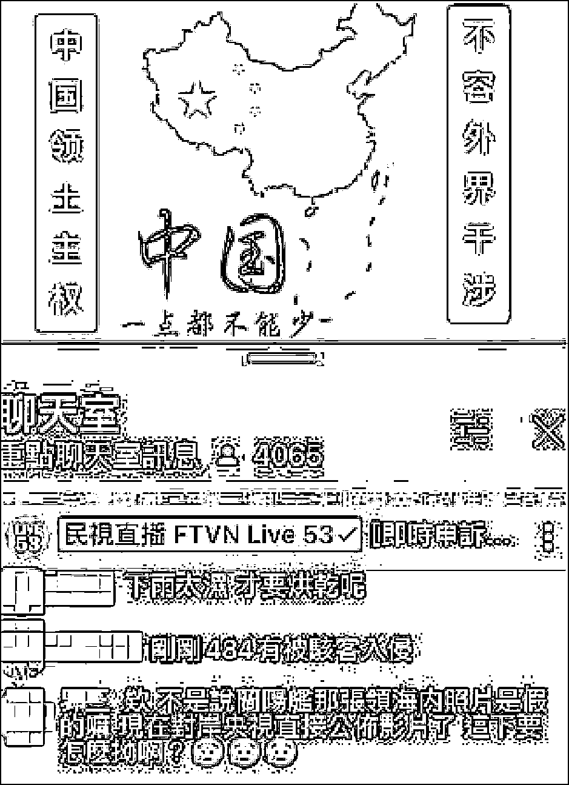
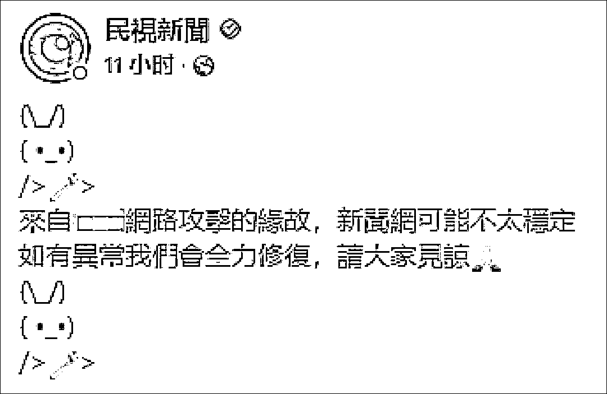

# 台湾绿媒直播中，突然放起了《我和我的祖国》

> 原文：[`mp.weixin.qq.com/s?__biz=MzIyMDYwMTk0Mw==&mid=2247542109&idx=5&sn=f5a9987c42d92aef45876df2a0d3f2f5&chksm=97cbee65a0bc67732a9c97e07d032b6079b0210cfe963b457a7553c49eb66df327d190df8339&scene=27#wechat_redirect`](http://mp.weixin.qq.com/s?__biz=MzIyMDYwMTk0Mw==&mid=2247542109&idx=5&sn=f5a9987c42d92aef45876df2a0d3f2f5&chksm=97cbee65a0bc67732a9c97e07d032b6079b0210cfe963b457a7553c49eb66df327d190df8339&scene=27#wechat_redirect)

据台媒报道，8 月 6 日晚，岛内知名绿媒“民视新闻”在油管平台直播期间，画面突然切换为中国地图，并配文“中国领土主权，不容外界干涉”“中国一点都不能少”，背景音乐也被改为播放《我和我的祖国》。

<mpvideosnap class="js_uneditable custom_select_card channels_iframe videosnap_video_iframe" data-pluginname="videosnap" data-id="export/UzFfAgtgekIEAQAAAAAABvw4qjoIkwAAAAstQy6ubaLX4KHWvLEZgBPE1KNsHW0PZ_qCzNPgMIunTkzhIfv_I1kAQxBXD9VE" data-url="https://findermp.video.qq.com/251/20304/stodownload?encfilekey=rjD5jyTuFrIpZ2ibE8T7YmwgiahniaXswqz0IBF6trN3MxO9CQ7bXE3COPZic6K6tgyhqOdL63N0AHqAPDvgHYmZ4ILYcSFSqahhaXnNvscmtTBlu1rrCUdGYw&amp;adaptivelytrans=0&amp;bizid=1023&amp;dotrans=0&amp;hy=SH&amp;idx=1&amp;m=&amp;scene=0&amp;token=AxricY7RBHdVLeqg6oDEE7w2vENgXpAwwzrzRicjGUcho3QZw6jDYbGLJXMG5hXAdctht0F0lmN7A" data-headimgurl="http://wx.qlogo.cn/finderhead/ibq4aVwOt6HNqrr8OD3sCviaytF3B8TqCwHicxsuIanAJo/0" data-username="v2_060000231003b20faec8c6e48a1acbd3ce04ef33b077a1e41d0d3794ed88ea537878dbe65910@finder" data-nickname="灰产圈+" data-desc="#台湾民视新闻播放我和我的祖国#【绿媒“民视新闻”直播信号被黑客攻击，滚动播放“中国一点都不能少”】据台媒报道，台湾知名绿媒“民视新闻”网络直播在 6 日晚间遭黑客入侵，原画面被换为“中国一点都不能少”，并加上音乐《我和我的祖国》，时间约维持 3 分钟。对此，民视回应证实“讯源主机被黑客入侵”，发现之后已立刻进行处理@灰产圈+ " data-nonceid="1695489416699653430" data-type="video" data-width="544" data-height="960"></mpvideosnap>

有网友录制的现场视频显示，前述画面持续了数分钟后才恢复，引起直播间的围观网友们的一阵惊呼。

据报道，在此期间，直播画面中还先后打出了“民意不可违，玩火必自焚”“愿以吾辈之青春，捍卫盛世之中华”“寄意寒星荃不察，我以我血荐轩辕”等口号。

6 日晚些时候，“民视新闻”发布声明证实此事，称电视播出状况均正常，仅有网络播出受到影响，主因是讯源主机被黑客入侵，造成在油管直播中播出的内容与电视频道内容不同。

“今天（8/6）晚间 20:52 收到通知，20:54 即移除置入视频，讯源恢复正常。”

“民视新闻”直播画面出现异常时，直播间网友聊天截图

7 日凌晨，“民视新闻”在其脸书账号发文宣称，网络攻击来源为大陆地区，可能会出现网络不稳定情况，会全力修复异常。

不少岛内网友了解此事后，不免哭笑不得，对台湾地区的网络安全感到担忧。

也有人认为，这说到底也是绿媒咎由自取，从某种意义上也体现出绿营不堪一击，“这就是扫把昌（民进党当局“行政院长”苏贞昌）说的，平时训练有素？”

 来源：观察者网

](http://mp.weixin.qq.com/s?__biz=Mzg5ODAwNzA5Ng==&mid=2247488098&idx=3&sn=638c5dd62ca652e1a1f2fd5b8420b00f&chksm=c0687b35f71ff223bca5031da035e3ab56f77f3ecfe42e587322e6e0f1302dc4d3e3fb354f18&scene=21#wechat_redirect)

← 向右滑动与灰产圈互动交流 →

