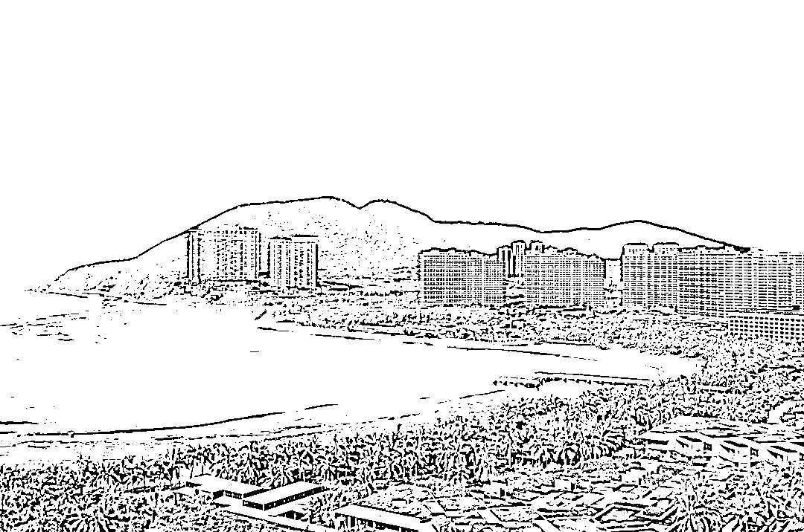

# 将花费 18 万？“一家 13 人滞留三亚高档酒店”当事人发声！三亚有酒店将退还多交房费

> 原文：[`mp.weixin.qq.com/s?__biz=MzIyMDYwMTk0Mw==&mid=2247542109&idx=6&sn=0890267dd29e227617e9eec8d69e9d8b&chksm=97cbee65a0bc6773c83fc013e9d3dfd7e8a742e68247dbdd62d3be5e0f247a81f0a988e69267&scene=27#wechat_redirect`](http://mp.weixin.qq.com/s?__biz=MzIyMDYwMTk0Mw==&mid=2247542109&idx=6&sn=0890267dd29e227617e9eec8d69e9d8b&chksm=97cbee65a0bc6773c83fc013e9d3dfd7e8a742e68247dbdd62d3be5e0f247a81f0a988e69267&scene=27#wechat_redirect)

突然而来的疫情让三亚旅游按下暂停键，同时造成 8 万多游客滞留，其中滞留在三亚酒店的游客约 2.5 万人。

针对滞留在酒店的游客，按国务院联防联控机制要求，游客在完成 7 天风险排查后，即 7 天内第 1、2、3、5、7 天核酸检测阴性，经评估后可离岛。

8 月 7 日，海南省旅游和文化广电体育厅副厅长刘成表示，对已接待滞留游客入住的酒店，8 月 6 日起 7 天内统一按原入住价格的五折续住，续住费用由入住游客承担。如游客选择不再续住原入住酒店，由其从所在区域酒店（公布不同类型酒店）名单内自行选择，8 月 6 日起 7 天内入住同房型价格按原定价的五折确定，更换酒店游客的转运工作由交通部门负责调度车辆保障。对酒店反映的五折价格不足以支撑成本等问题，由市、区两级旅文部门协商酒店给予适当补贴。

另外，据三亚发布消息，8 月 8 日 8:30 起，三亚 12345 热线平台特别开通旅游涉疫专席。旅游涉疫专席 24 小时全天候开通，游客可随时来电反映问题，热线将协调相关部门全力解决。旅游涉疫专席号码为：88032341、88037742。

**对话“一家 13 口滞留三亚”当事人：**

**“每顿饭 700 元一人”有误解**

8 月 7 日，一则“一家 13 人滞留三亚高档酒店”消息引发舆论关注，“一家 13 口滞留三亚 7 天将花 18 万？”的话题更是登上社交网站热搜榜。据中国新闻网报道，8 日记者联系到新闻当事人时，徐璐(化名)直呼传言吓人。

“花费 18 万元，太吓人了！”8 日，徐璐在电话里对记者说，其一家 13 人确是在三亚度假，7 月底从成都来三亚，期间一直住在文华东方酒店。原先计划 7 号回家，因为疫情改签到 6 号，结果航班取消滞留三亚。

徐璐说，续住的房费，酒店方确实是根据三亚市政府的要求给予了半价优惠，但“每顿饭 700 元一人的标准”是误解。酒店有不同的餐厅，住客可以选择不同的标准，“不是说我们每天必须每个人都要去吃 700 元一顿的餐”。

徐璐表示，“18 万”的舆论出现后，酒店与住客们进行了沟通交流，在房价和餐饮价格方面进行了进一步调整。“三亚的疫情来得很突然，大家都不容易，我们也希望和酒店一起，配合政府的防疫政策，让疫情快快结束，大家一起回到正常的生活”。

三亚文华东方酒店是三亚知名的豪华度假酒店，疫情发生前受到热捧，每晚房费高达数千元。

文华东方酒店市场传媒总监姜豆介绍，“18 万”舆论中提及到的 700 元一位的用餐费用，是酒店其中一个餐厅自助餐的费用，涉事的客人只在这个餐厅用过一次餐。

海南三亚亚龙湾美景（图文无关）。图片来源：摄图网-501143790

**有酒店价格涨幅超 3 倍**

据中新经纬报道，赵先生 8 月 6 日早离开了原本入住的位于三亚亚龙湾的酒店，前往三亚凤凰国际机场，当他得知航班无法按时起飞后，于当日 11 时 47 分左右，在机场附近一家名为海立坊精品酒店以 145 元的价格预订了一间景观大床房。

据赵先生回忆，该酒店在 6 日 14 时左右上调了价格。8 月 7 日晚携程平台显示，若入住赵先生的同款房型，需要花费 612 元，较赵先生入住时的价格涨幅超 3 倍。

赵先生透露，目前他仍能以涨价前的 145 元每晚的价格续住，但并不能享受到半价续住政策。“我在 8 月 7 日又续住了两晚，价格仍是 145 元每晚，至于为什么享受不了半价入住政策，老板说他没收到通知。不过据我了解，以涨价后的价格入住的游客是能享受半价入住政策的。”赵先生说。

7 日晚，中新经纬记者以消费者身份致电该酒店的工作人员，对方告知，“现在不能办理入住了，因为我们也不知道游客在三亚什么地方呆过。此前入住的乘客若续住统一收费 150 元每晚，这个价格已经是半价优惠过后的了。”该工作人员说。

**有酒店通知将退还**

**住客此前多支出的费用**

据红星新闻报道，潘女士一家于上周抵达三亚的亚龙湾游玩，当时三亚已有零星新增病例，但她和家人对三亚疫情持乐观态度，维持了旅游计划。但这周开始，三亚的新冠单日新增病例数由零星几例增至三位数。

潘女士告诉红星新闻记者，由于担心会被困在三亚，耽误孩子上学，一家人近日基本上都待在酒店，也没有堂食。此前，她们所住的酒店价格为 2600 元一晚，但 6 日晚酒店价格按照酒店门市价的半价进行调整，6 日实际支付住宿酒店费用为门市价 3000 元的一半 1500 元。

7 日晚，该酒店有住客在群内表示，已收到酒店消息，将退还住客此前多支出的费用。

潘女士告诉红星新闻，7 日晚，她收到酒店通知，酒店房价进行了调整，没有海景的房间一间 680 元一天，有海景的房间 780 元一天，她所住的海景房以后就是 780 元一天。另外酒店正挨个通知住客退款事宜。

来源：每日经济新闻综合中国新闻网、中新经纬、红星新闻等

](http://mp.weixin.qq.com/s?__biz=Mzg5ODAwNzA5Ng==&mid=2247488098&idx=3&sn=638c5dd62ca652e1a1f2fd5b8420b00f&chksm=c0687b35f71ff223bca5031da035e3ab56f77f3ecfe42e587322e6e0f1302dc4d3e3fb354f18&scene=21#wechat_redirect)

← 向右滑动与灰产圈互动交流 →

