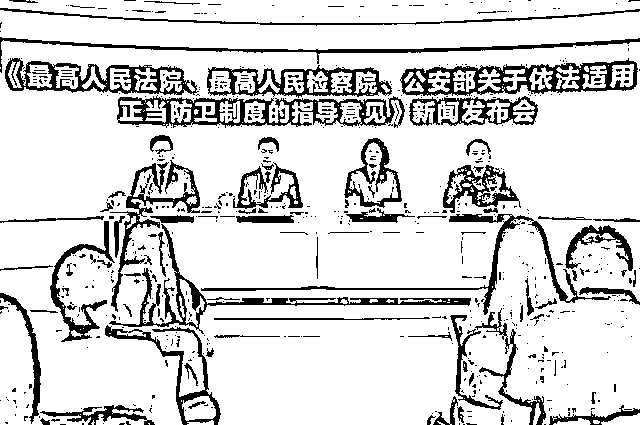

# 于欢结婚了，他感谢全国人民，“要不然可能还在监狱里待着”

> 原文：[`mp.weixin.qq.com/s?__biz=MzIyMDYwMTk0Mw==&mid=2247542109&idx=7&sn=053701f8e4451341d063ff3546c254b3&chksm=97cbee65a0bc6773d811260eff7e2c993ad55878f4b5facc76264aa0585842b6977ff0da47f1&scene=27#wechat_redirect`](http://mp.weixin.qq.com/s?__biz=MzIyMDYwMTk0Mw==&mid=2247542109&idx=7&sn=053701f8e4451341d063ff3546c254b3&chksm=97cbee65a0bc6773d811260eff7e2c993ad55878f4b5facc76264aa0585842b6977ff0da47f1&scene=27#wechat_redirect)

[`v.qq.com/iframe/preview.html?width=500&height=375&auto=0&vid=x33504qdpy8`](https://v.qq.com/iframe/preview.html?width=500&height=375&auto=0&vid=x33504qdpy8)

2022 年 8 月 5 日中午，28 岁的男孩于欢将在山东聊城冠县一家酒店举办结婚仪式，他的婚礼收到了众多全国各地网友的祝福。

5 日晨，于欢向极目新闻记者表示，他非常感谢网友一直以来对他的支持。

说到于欢，一定会和“辱母杀人案”联系起来。

2016 年 4 月 13 日，吴学占在苏银霞（于欢之母）已抵押的房子里，指使手下拉屎，将苏银霞按进马桶里，要求其还钱。

当日下午，苏银霞四次拨打 110 和市长热线，但并没有得到帮助。 

2016 年 4 月 14 日，由社会闲散人员组成的 10 多人催债队伍多次骚扰女企业家苏银霞的工厂，辱骂、殴打苏银霞。

苏银霞的儿子于欢目睹其母受辱，从工厂接待室的桌子上摸到一把水果刀乱捅，致使杜志浩等四名催债人员被捅伤。

其中，杜志浩因未及时就医导致失血性休克死亡，另外两人重伤，一人轻伤。

2017 年 2 月 17 日，山东省聊城市中级人民法院一审以故意伤害罪判处于欢无期徒刑。

因受害人家属和被告人于欢均不服一审判决，都提出上诉，山东省高级人民法院于 2017 年 3 月 24 日立案受理。

2017 年 6 月 23 日，山东省高级人民法院认定于欢属防卫过当，构成故意伤害罪，判处于欢有期徒刑 5 年。

2018 年 1 月 6 日，于欢故意伤害案入选 2017 年度人民法院十大刑事案件。

2018 年 1 月 18 日，于欢案二审主审法官、山东省高级人民法院吴靖在北京表示，通过二审开庭审理，最大限度地还原整个案件的事实情节，并在此基础上通盘考虑国法、人情，最终依法作出裁判。

2 月 1 日，案件入选“2017 年推动法治进程十大案件”。

2017 年 5 月 27 日，山东省高级人民法院开庭审理于欢故意伤害案，山东省人民检察院指派检察员出庭履行职务。

法庭审理结束后，最高人民检察院公诉厅负责人接受了记者采访时表示：

于欢案引发广泛舆论关注，始于媒体报道，体现了舆论对司法的监督。

检察机关高度重视和真诚欢迎新闻媒体对检察工作的监督，在今后的工作中将更加自觉地接受舆论监督，把舆论监督转化为加强和改进检察工作的动力，不断提高法律监督能力和水平。

这也从官方表态中说明了：本案确实与网友、与媒体的关注有关。

如果不是网友关注、媒体报道，于欢很大可能二审也是无期徒刑，因此他现在还在监狱服刑呢。

正是因为广大网友的关注，2020 年 11 月 18 日，于欢减刑出狱。

于欢案还与全国范围的“法不能向不法让步”，让正义“不委屈也可以求全”大形势有关。

公众关心正当防卫案，是因为一些个案暴露出的情形，让普通人的正义直觉受到冲击。

过去正当防卫案件屡屡引爆舆论，是故意伤害、防卫过当，还是正当防卫，专家学者和网络评论，争论非常激烈。

这种全面针对专业法律讨论背后，其实是公众深深的安全焦虑：普通人在面对压倒性的威胁的时候，如果无法成功脱身，那么在警察到来之前到底能做什么？

早前曾有数据分析了中国裁判文书网上 100 份以“正当防卫”为由要求轻判的二审（终审）刑事判决书，仅有 4 份被法院认定，其他 20 份为防卫过当，76 份为故意伤害罪。

正是因为包括于欢案在内的一系列案件影响，2020 年 9 月 3 日上午，最高法、最高检、公安部联合发布《关于依法适用正当防卫制度的指导意见》，一定程度上也可以称为“于欢法案”。

于欢感谢作为网友的我们在当年对他的支持与发声；我们也祝福作为当事人的于欢新婚幸福！

法治绝对不是想办法治人的工具，反而是民众自由、幸福、安全的保护伞。

来源：法律学堂  作者：王学堂

](http://mp.weixin.qq.com/s?__biz=Mzg5ODAwNzA5Ng==&mid=2247488098&idx=3&sn=638c5dd62ca652e1a1f2fd5b8420b00f&chksm=c0687b35f71ff223bca5031da035e3ab56f77f3ecfe42e587322e6e0f1302dc4d3e3fb354f18&scene=21#wechat_redirect)

← 向右滑动与灰产圈互动交流 →

