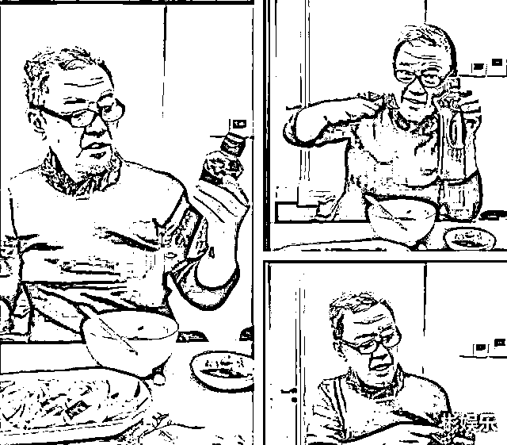
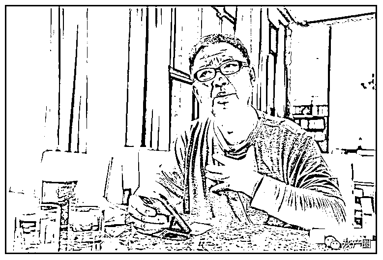
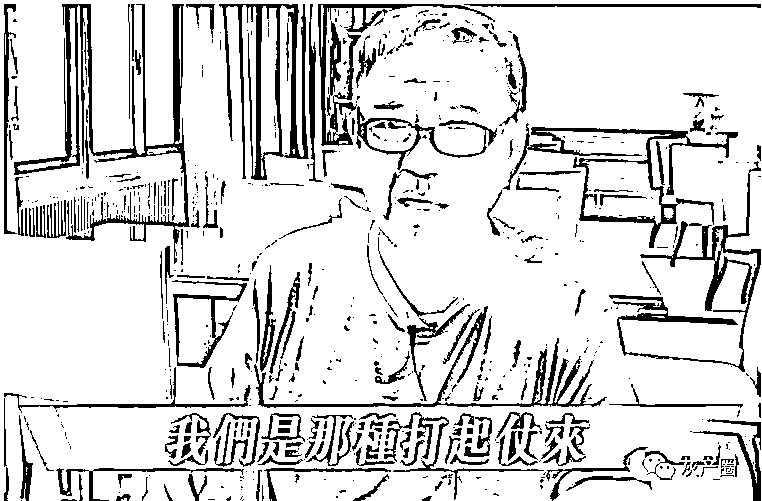
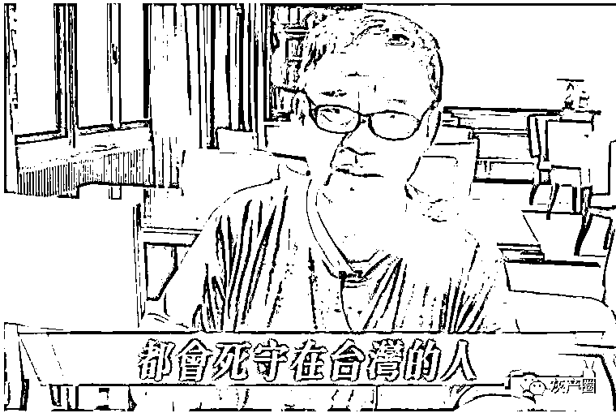
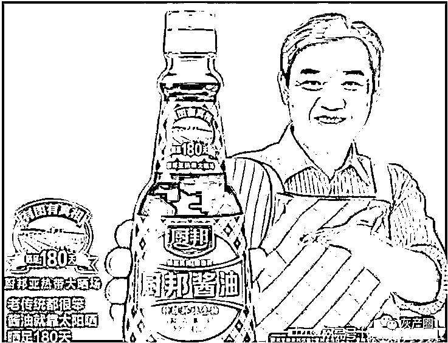
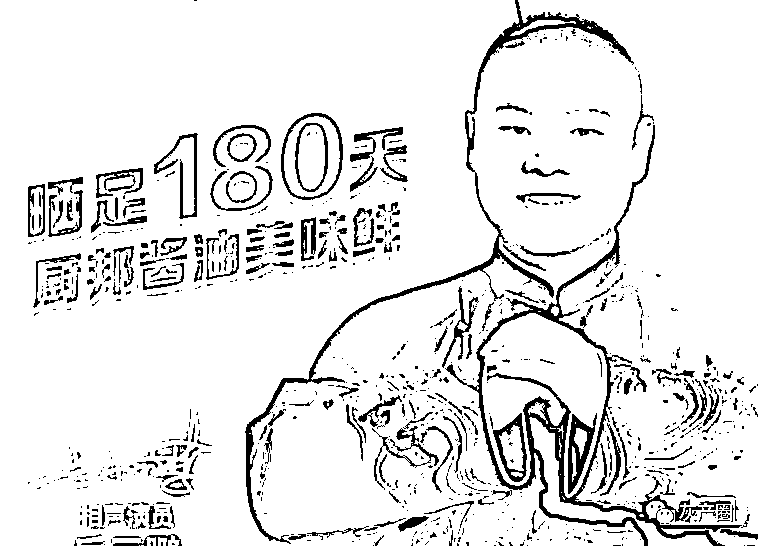
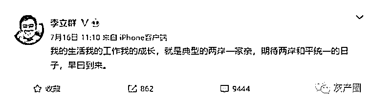
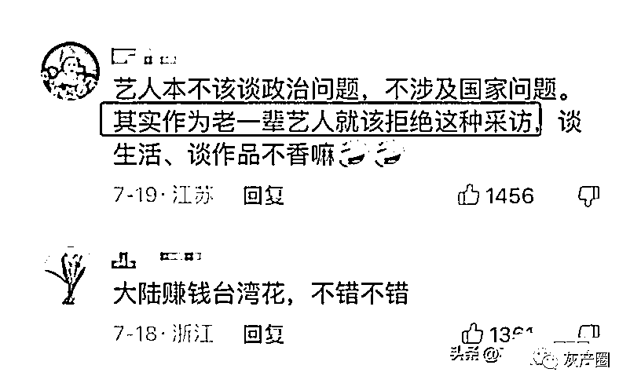

# 李立群表态死守宝岛，厨邦立马换代言人！

> 原文：[`mp.weixin.qq.com/s?__biz=MzIyMDYwMTk0Mw==&mid=2247542162&idx=2&sn=45ff93ac28a42c80fb589a0d5128f6f2&chksm=97cbeeaaa0bc67bc8692a28c6100985856a13950786c301987830b65258c6ea190fd52acd216&scene=27#wechat_redirect`](http://mp.weixin.qq.com/s?__biz=MzIyMDYwMTk0Mw==&mid=2247542162&idx=2&sn=45ff93ac28a42c80fb589a0d5128f6f2&chksm=97cbeeaaa0bc67bc8692a28c6100985856a13950786c301987830b65258c6ea190fd52acd216&scene=27#wechat_redirect)

**70 岁李立群晚节不保？发表“死守台湾”不当言论？**

****今年的 5 月初，因为疫情，69 岁的老戏骨李立群在上海经历了非常长时间的隔离，他通过短视频发布了一些自己被隔离的日常。****

****在视频中，李立群事无巨细，都会拿出来和网友们分享，就如同老熟人一般。****

****看得出来，李立群十分健谈，天南海北什么话题都能聊上几句。****

****因为视频风格比较讨人喜欢，聊天的内容也非常地接地气，所以在短时间积累了很多的内地粉丝，在我们国内人气暴涨。****

********

****李立群在上海期间，曾发过一条视频，说等待解封之后**就回台湾退休了。******

****当时的他，是被众人称为德艺双馨的老艺术家。****

****但是，在 7 月份解除隔离之后，李立群就从大陆回到了台湾。****

****回到台湾之后，他依旧每天更新视频，分享日常。****

****没过多久，李立群接受当地媒体的采访，在采访中，李立群毫不避讳大谈国事。****

****在接受台湾记者采访的时候，李立群竟然公开地表示，**即使打仗，自己也要死守宝岛！******

******其实事情经过是这样的：******

****当时，因为李立群在大陆非常受网友们欢迎，台湾网友们知道后酸了，于是纷纷吐槽，**说李立群是在刻意讨好大陆。******

********

****对此，李立群表示很无奈，他表示：**“我在（大陆）网络上走红，结果却被大家（台湾网友）群起围攻”。******

****为了向台湾网友证明，自己也是爱台湾的，**李立群情绪激动地表示**：**“我们是那种打起仗来，都会死守宝岛的人！”******

********

********

****然而，正是因为这句话，李立群在大陆网友心中的口碑一落千丈，很多网友吐槽李立群**是墙头草，是典型的两面派。******

****随后没多久，厨邦更是更换了代言人，从之前的李立群，换成了现在的岳云鹏！****

********

********

****内地网友愤愤表示说，**在上海的时候，李立群绝口不谈国事**，发日常拉近和内地网友的距离，****

****然而到了台湾之后，李立群因为受到当地网友的嘲讽，竟说出了伤害内地网友感情的话。说这是典型的精致利己主义****

****其实，李立群如果反复辩解，结果只可能是失去两边网友的支持，遭到两边网的抛弃。**** 

****后来，迫于舆论压力，李立群在内地社交平台发文解释：****

********

****然而，很多网友还是不理解不原谅，认为李立群身为明星，不应该接受这样的采访：****

********

****李立群 1952 年 5 月 2 日出生于台湾省新竹县，祖籍河南。****

****他的父亲是河南人，母亲是北京人，1949 年来到台湾。****

****李立群从小就说北京话，幼时家境清苦，最早住在新竹，后来才搬迁至台北市。****

****作为老戏骨，祖籍河南的李立群在内地拍摄了不少作品，也在内地生活了很多年，他对大陆应该是有一定的感情。****

********

******对于李立群事件，大家是怎么看待的呢？******

****来源：和美之音****

********

****](http://mp.weixin.qq.com/s?__biz=Mzg5ODAwNzA5Ng==&mid=2247488098&idx=3&sn=638c5dd62ca652e1a1f2fd5b8420b00f&chksm=c0687b35f71ff223bca5031da035e3ab56f77f3ecfe42e587322e6e0f1302dc4d3e3fb354f18&scene=21#wechat_redirect)****

****← 向右滑动与灰产圈互动交流 →****

********