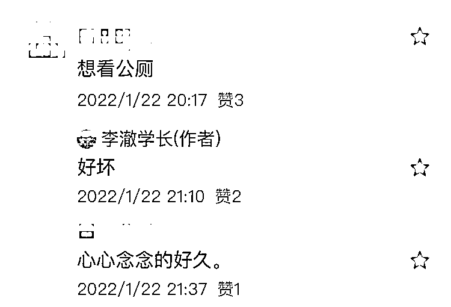

# 昔日男同的秘密交易地点——WC

> 原文：[`mp.weixin.qq.com/s?__biz=MzIyMDYwMTk0Mw==&mid=2247542162&idx=3&sn=7a34de8e1b991f493401d1c2ca09f192&chksm=97cbeeaaa0bc67bc0820e5b7868167daf382580bed3d59eca43ff1d0c62d8b3981c8c44de194&scene=27#wechat_redirect`](http://mp.weixin.qq.com/s?__biz=MzIyMDYwMTk0Mw==&mid=2247542162&idx=3&sn=7a34de8e1b991f493401d1c2ca09f192&chksm=97cbeeaaa0bc67bc0820e5b7868167daf382580bed3d59eca43ff1d0c62d8b3981c8c44de194&scene=27#wechat_redirect)

问大家一个问题。如果时间倒回 25 年，没有智能手机，没有同志软件，你去哪里找同类？再羞耻一点，没有独立居室，没有消费能力，你去哪里解决需求？

来，给一些提示，从经典同志电影里找答案。

国内的古早影片《东宫西宫》、高分影片《叔叔》；国外的《迷情站台》、去年大火的《风信子之恋》，都有相同的场景。

答案是——公厕。

不管是《东宫西宫》、《风信子之恋》里的危机抓捕，还是《叔叔》、《迷情站台》里的情欲暗涌，电影里都有关于公厕的表现。

《风信子之恋》剧照

大家对这一话题亦颇有兴趣。

如文章开头所言，在没有手机、软件、居室、钱的前互联网时代，公厕之于男同，有着特殊意义，它是男同们进行【临时性性活动】的主要场所。

为什么是公厕？

要说进行临时性的性活动，许多场所，像隐蔽的包厢、破落的工厂、草丛深处、乃至树桩后面，都是可以开展羞羞行为的地方。但若比较起来，没有一个地方能和公厕匹敌。公厕具备的数项特色，使它成为男同们满足需求的首选地点。

**首先，公厕的易得性高。**不管是在商场、车站、公园，这些地方的公厕都能被轻易认出来。不需要专门去某个地点，许多公厕的设置，都是在人群上下班的路途中。公厕能吸引大量潜在的性同伴，提供了与各种男人快速交欢的机会。人员流动最频繁、人际关系最陌生的公厕，又保障了参与者的隐私。

**第二，公厕内部的不可见性。**由于公厕里的隔间设置，公厕内部的活动能见度又很低。圈子里的人，能察觉出里面有同类正在进行性活动，然而圈外的人，即使路过，也猜不到里面的别样风光。公厕对圈里圈外设置了区隔。

**第三，易找借口。**公厕作为性约会地点最吸引人的原因之一，是因为它能为参与者的出现提供最简便的托词。如若遇到熟人，最合理的借口就是“我路过小便”。如果在同志酒吧或公共澡堂被人抓到，就没有这种方便的托辞可用。因此，对于极度担忧取向被曝光的男人，他们更偏好来公厕满足欲望。

**第四，刺激感。**公厕并不是 100%安全的，比如有被抓捕的风险。与冒险相伴的是刺激，刺激感会增强性体验的快感，即危险能产生催情春药式的效应。难怪有些痴迷公厕行为的男人直言：“除了公厕邂逅刺激游戏之外，他们再也不能在其他任何场合达到高 chao。”

在不同的地区，男同性恋进行性活动的公厕会有不同的叫法。比如国内有更加具体的指称：鸟洞。日本作家三岛由纪夫的《禁色》里，男同将寻求同伴满足的公厕叫“办事处”；西方部分地区对于进行男性性活动的公厕有更雅致的称呼：茶室。

《叔叔》剧照

有一本专门研究男同性恋在公厕里的性活动的书籍，美国社会学家洛德·汉弗莱斯的《茶室交易》。这本书在国内很少人知道，在国外，更多是作为有争议的学术研究伦理问题被提及。

洛德·汉弗莱斯为了研究男同性恋在公厕里的性活动，自己扮演成公厕里的男同，花了数年时间观察公厕里的同性性活动。

争议的原因有两点，其一是，汉弗莱斯声称自己没有参与公厕中的性活动，同时又不干扰他人的性互动，自己仅仅是观察。但后来有人质疑，他也参与其中的性活动（汉弗莱斯也是男同）。其二，他通过隐瞒身份的方式，获取了公厕里男同的社会背景，比如工作、婚姻、家庭住址等，以此涉嫌学术欺诈和隐私侵犯。

搁置研究伦理问题，《茶室交易》仍然记述了许多宝贵的材料，让我们对公厕的同性性行为一窥究竟。

**比如，公厕里的男同性性活动，Gang 交只占 1%，性接触绝大部分都是以口部-性器为主。**

**公厕里性活动的参与者有不同的角色类型：**

1，玩家，即直接从事性活动的人，分为口者和被口者。

2，把风者，负责看门外的动静。把风者通常站在公厕内接近门口或窗子的地方，以便于观察外面的行为。若有新人靠近公厕，把风者根据经验判断来者是否是圈内人，并用眼神、咳嗽声、跺脚声等暗号，告知厕内有正在进行性活动的男同，可以继续活动或立刻停止。

3，自慰者或窥淫者，这类人有同性性取向，但不直接参与性活动里。或是害怕疾病传播，或是害怕被捕，或者没有遇见对眼的同类，所以从观看别人性活动中得到兴奋和快感。

4，菜鸟，以刚出道的青少年为主。他们想要参与活动，但又惧怕。公厕里的性活动，以自愿为原则，旁人绝不会强迫这些青少年加入。甚至，由于青少年缺乏经验，遇到逮捕时缺乏随机应变的能力，其他参与者也拒绝他们加入。

5，牛郎：当进行完性活动后，会要求报酬。如果索价被拒绝，可能转变为暴徒，进行人身攻击，或以报警作威胁。

6，社会控制者：刑警队员、公园警察、其他公园雇员，主要负责逮捕公厕里的同性性活动参与者。《东宫西宫》里胡军扮演的警察小史就属于此类。

《叔叔》剧照

**除此之外，汉弗莱斯亦总结了公厕里的行为规则：**

1，避免交换生平资料。

2，留意未成年人，他们是危险的参与者。

3，绝对不要把你的意图强加到别人身上，不能强迫，也不给承诺。 

4，不要背后批评你的性伴侣，他可能是某人在同性恋上的导师。

5，永远不要说话不算数。

你可能想不到，上一代的许多男同，会对他们的性冒险空间——公厕，发展出强烈的依赖感。情感上，相较于公厕内的性伴侣，有些男人更依恋让他们寻求性爱的建筑物。

如《茶室交易》里一位口述者，在公厕拆除之后表述：“你知道去年圣诞节，在他们把那儿（公厕）拆除之后，我朋友做了什么吗？他拿了个花圈，喷上黑漆，把它放在雪地上，那个位置，就是他经常进行性活动的马桶位置......他真的是心碎了。”

可怜兮兮的。

公厕，这个旨在服务多数人的公共场所，同时在亚文化的圈层又滋润了少数人的利益。若从更高的意识形态层面讲，公厕里的性活动，有一定民主意味。因为所有男人，无论哪种民族、社会、教育和生理特征，在此都能完成性结合，因性而连成一起，彼此保护。

国内国外，都曾有过对公厕里的同性性行为的打击行为。国内曾是以流氓处置，至于国外，有的是因为同性性行为本身属于违法行为，有的则是以打击同性恋群体作为转移社会矛盾，比如《风信子之恋》。

这样的监管，不可能消灭所有的同性行为。相反，却会引起更多的社会问题，同性恋污名化、随意执法而引发的受贿、他人对同性恋人群的敲诈勒索等。

**就如金赛所言：真的把所有有过同性性行为的人从今日社会中全部消灭干净，人们也没有丝毫理由相信它的发生率会在下一代人中有任何实质性的降低。同性性行为一直是人类性活动的一个重要组成部分，这主要是因为，它是人类拥有多种能力的一种表现，而这样的多种能力正是人类的安身立命之本。**

这或许是对社会监管同性性行为的最好回应。

**想想看，社会付钱给警察，要他们花上好几个小时，半蹲或趴在屋顶，透过小洞窥探男人，真是病态。 **

来源：李澈学长，实测  作者：李澈

](http://mp.weixin.qq.com/s?__biz=Mzg5ODAwNzA5Ng==&mid=2247488098&idx=3&sn=638c5dd62ca652e1a1f2fd5b8420b00f&chksm=c0687b35f71ff223bca5031da035e3ab56f77f3ecfe42e587322e6e0f1302dc4d3e3fb354f18&scene=21#wechat_redirect)

← 向右滑动与灰产圈互动交流 →

