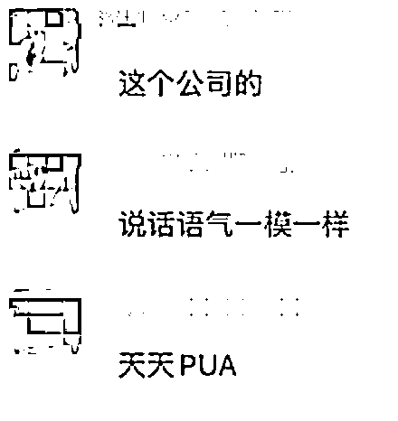
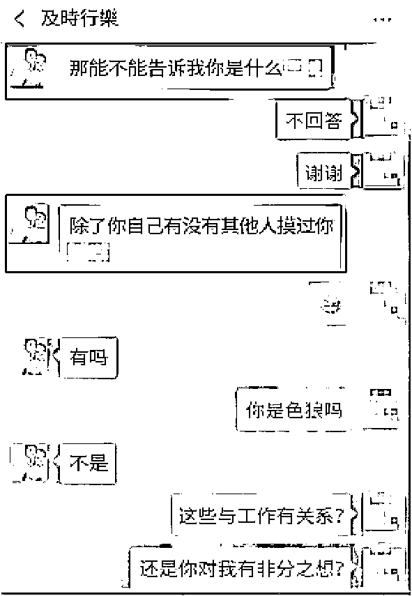
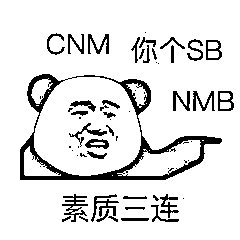

# HR 面试后，骚扰、PUA 求职女生，还想让对方当小三？？

> 原文：[`mp.weixin.qq.com/s?__biz=MzIyMDYwMTk0Mw==&mid=2247542162&idx=5&sn=3b194cdf5374c3798c799eac0ce014d2&chksm=97cbeeaaa0bc67bce760af534c1fa995e2499991bd43ec0cdd22ffff92ed83902d1a644623c0&scene=27#wechat_redirect`](http://mp.weixin.qq.com/s?__biz=MzIyMDYwMTk0Mw==&mid=2247542162&idx=5&sn=3b194cdf5374c3798c799eac0ce014d2&chksm=97cbeeaaa0bc67bce760af534c1fa995e2499991bd43ec0cdd22ffff92ed83902d1a644623c0&scene=27#wechat_redirect)

**前几天我在朋友圈发了这样一段话**

**这个 HR 太无耻了**

设计师面试完之后 

还 pua 想让她做小三

卧槽

还有群友知道这家公司，表示

一起来看看

**求职女生与 HR 饶某某聊天记录**👇

**哈哈哈** 

**最后骂的好**

（本文由中国反诈骗联盟排版

（本文由中国反诈骗联盟排版

**公司是这家，深圳的同行看过来**

（本文由中国反诈骗联盟排版

** 该公司招聘消息👇**

（本文由中国反诈骗联盟排版

（本文由中国反诈骗联盟排版

另外还有这家公司，也是这个人

（本文由中国反诈骗联盟排版

（本文由中国反诈骗联盟排版

同行都跑去 boss 上调侃了

（本文由中国反诈骗联盟排版

（本文由中国反诈骗联盟排版

（本文由中国反诈骗联盟排版

当然类似的案例还有很多

作为女性在职场求职

经常会遇到不怀好意的上司

小编在网上也经常看到网友爆料自己的

可怕的求职经历

（本文由中国反诈骗联盟排版

## 

来源@新京报

（本文由中国反诈骗联盟排版

这个就更恐怖了 

竟然直接给求职者发果照骚扰

## 

来源@首席内幕官

（本文由中国反诈骗联盟排版

还有女生面试一家公司，

HR 以公司节约开支为由问女生

“是否介意和 50 多岁的男董事长

出差住一个房间”的.......

（本文由中国反诈骗联盟排版

来源网络

（本文由中国反诈骗联盟排版

这家公司就更变态了

直接问求职者有多少双丝袜

小编觉得这已经构成了性骚扰

（本文由中国反诈骗联盟排版

（本文由中国反诈骗联盟排版

（本文由中国反诈骗联盟排版

（本文由中国反诈骗联盟排版

（本文由中国反诈骗联盟排版

好啦！最后一起来说说

面对此类职场骚扰

大家会如何应对？

评论区交给你们了~

（本文由中国反诈骗联盟排版

职场 PUA 不可怕， 

但是你要能说不。

来源：大 R 说安全，中国反诈骗联盟

](http://mp.weixin.qq.com/s?__biz=Mzg5ODAwNzA5Ng==&mid=2247488098&idx=3&sn=638c5dd62ca652e1a1f2fd5b8420b00f&chksm=c0687b35f71ff223bca5031da035e3ab56f77f3ecfe42e587322e6e0f1302dc4d3e3fb354f18&scene=21#wechat_redirect)

← 向右滑动与灰产圈互动交流 →

