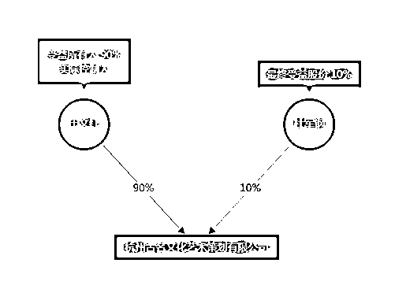

# 闷声发大财？杭州一家医美公司隐匿 47 亿收入，偷税 1.47 亿！曾被《焦点访谈》曝光，老板娘：很多人嫉妒我

> 原文：[`mp.weixin.qq.com/s?__biz=MzIyMDYwMTk0Mw==&mid=2247542162&idx=7&sn=a63997b98937edac8dbaa1b52b0d275e&chksm=97cbeeaaa0bc67bc5df688e0f5f3a77a1a515735851e8959753936a61e647356aaa66b90ca88&scene=27#wechat_redirect`](http://mp.weixin.qq.com/s?__biz=MzIyMDYwMTk0Mw==&mid=2247542162&idx=7&sn=a63997b98937edac8dbaa1b52b0d275e&chksm=97cbeeaaa0bc67bc5df688e0f5f3a77a1a515735851e8959753936a61e647356aaa66b90ca88&scene=27#wechat_redirect)

8 月 9 日下午，“杭州一医美公司偷逃税被罚 8800 多万”登上微博热搜。处罚事由显示，该公司分支机构利用个人银行账户收取服务款并隐匿收入超 47.55 亿元，未计入财务账。

消息一出，网友纷纷表示惊呆了，医美这么挣钱吗？

**隐匿 47 亿收入，偷税 1.47 亿**

据“信用中国”网站显示，近日，杭州古名文化艺术策划有限公司新增一则行政处罚。处罚事由显示，2017 年 1 月至 2021 年 11 月，该公司分支机构千和医疗美容诊所为客户提供医疗美容项目服务，利用个人银行账户收取服务款并隐匿收入超 47.55 亿元，未计入财务账。

在此期间，该公司通过账户中隐匿收入孳生的利息收入约为 2879.68 万元。处罚结果为，杭州市税务局对该公司隐匿收入少缴税款的行为定性为偷税，并对少缴的企业所得税约 1.47 亿元处百分之六十罚款，罚款金额合计约 8827.27 万元。

启信宝信息显示，杭州古名文化艺术策划有限公司成立于 2009 年 7 月，注册资本 500 万元，法定代表人为杜军钢，实际控制人为于文红，经营范围包括品牌管理、医疗美容服务等。

一家名为虞美人国际集团网站公开的资料显示，于文红是香港虞美人国际集团董事局主席。1993 年，于文红创办了虞美人形象设计工作室；2004 年，在香港成功创建了香港虞美人国际集团有限公司；2005 年，虞美人在全国发展的品牌形象合作店已经达到 150 多家；2010 年 2 月，杭州西子湖畔千和医疗美容诊所成立。

网站介绍称，目前虞美人已发展成为集五星级国际医疗美容诊所、品牌形象运营中心、医院管理、健康管理 、文化艺术策划等于一体的综合集团。

虞美人国际集团网站还显示，2018 年和 2019 年，于文红均受到美国前总统特朗普邀请，参加在海湖庄园举行的晚宴。

一家医美行业非头部企业，近 5 年时间隐匿收入超 47 亿，这个行业真这么赚钱？A 股也有多家涉足医美的企业，他们的经营状况如何？

从 2022 年上半年看，医美机构的日子并不好过，据朗姿股份、奥园美谷发布 2022 年半年度业绩预告可知，朗姿股份预计 2022 年上半年共实现扣非归母净利润 740-1020 万，同比减少 88.38%-91.57%；奥园美谷预计 2022 年上半年扣非归母净利润亏损 8000-10000 万，同比由盈转亏。

朗姿股份、奥园美谷都是通过收购医疗美容机构进入医美产业链中游进行医美领域布局的，其中，朗姿股份通过对米兰柏羽、晶肤医美、高一生等医疗美容机构的收购由女装行业跨界医美行业，奥园美谷则是通过对杭州维多利亚医美机构的收购由地产行业跨界医美行业。

朗姿股份在 2016 年开始便开始医美转型，根据公司 2021 年财报，旗下老医美机构仍是营收贡献的主力军，次新机构/新机构仍处于亏损状态。对于奥园美谷而言，公司医美业务核心子公司连天美在纳入并表范围的第二年，业绩出现大幅下降。公司公告显示，2022 年上半年，浙江连天美共实现净利润 2300 万元，归母净利润约 1265 万元，不及 2021 全年归母净利润的 30%。

**曾被央视《焦点访谈》曝光**

在虞美人国际集团网站上，于文红被称为“会长”，其身上的标签还包括“艺术面雕创始人”、“虞美人救助专项基金副主任委员”、“浙江省企业联合会、浙江省企业家协会、浙江省工业经济联合会第七届理事会常务理事”等。

值得注意的是，早在 2011 年 5 月 25 日，央视《焦点访谈》就曾以《面雕大师的真面目》节目，对于文红和千和医疗美容诊所进行曝光。虞美人集团创始人于文红号称“面雕大师”，亲自参与整形工作并收取高额费用，却致参与鼻子修复手术的消费者产生鼻子红肿等后遗症，记者却发现其实际并无任何资格从事医疗美容的相关行为。此外，千和医疗美容诊所和一般的美容医疗机构不同，只接待市场推广人员介绍来的客户。

两年后的 2013 年 8 月，浙江经视《消费能见度》节目也对千和医疗美容诊所和虞美人进行了报道。当时，自称是虞美人国际集团的咨询师推荐瓷娃娃美肤项目，报道中称，操作瓷娃娃美肤项目的医生是否具有相关资质？对于这个，咨询师的回答很暧昧。他们不仅不肯出示相关医师资格证件，咨询师甚至连医生的照片也不肯出示，甚至不愿透露主诊医生的相关信息。

2021 年 7 月，虞美人国际集团微信公号“美人说”曾发布一篇文章《走进于文红：我的脸就是我们企业的信用》，文章中，于文红回应了焦点访谈此前的报道。

于文红表示，她是被冤枉的，“当时这个行业很多人嫉妒我，整个行业的人把我送去了焦点访谈。”

文章还称，“于文红会长始终这样认为：企业一定要经历问题和风险，正因为虞美人能够解决问题，才能够长久的生存。”

来源：每日经济新闻综合自信用中国、钱江晚报、浙江在线等

](http://mp.weixin.qq.com/s?__biz=Mzg5ODAwNzA5Ng==&mid=2247488098&idx=3&sn=638c5dd62ca652e1a1f2fd5b8420b00f&chksm=c0687b35f71ff223bca5031da035e3ab56f77f3ecfe42e587322e6e0f1302dc4d3e3fb354f18&scene=21#wechat_redirect)

← 向右滑动与灰产圈互动交流 →

