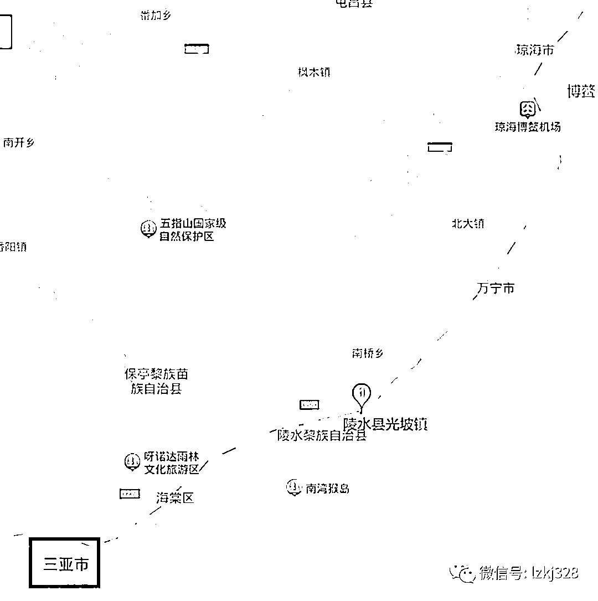
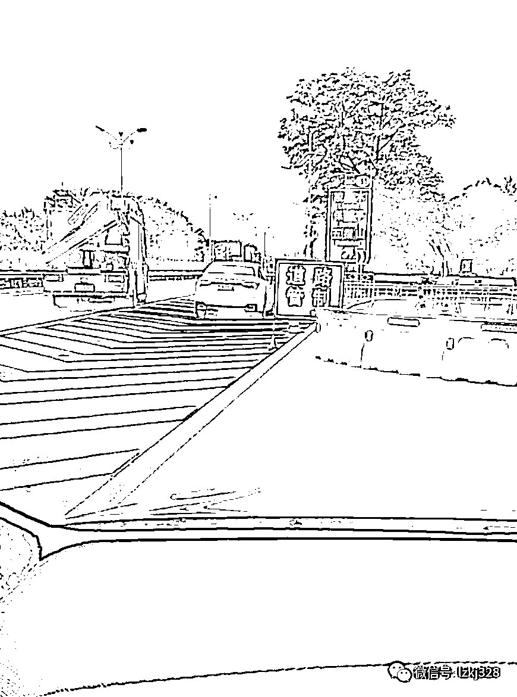
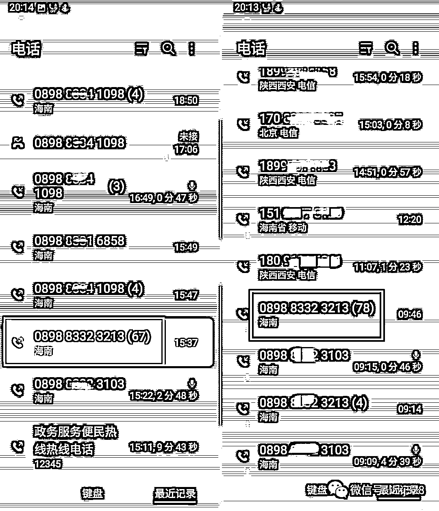
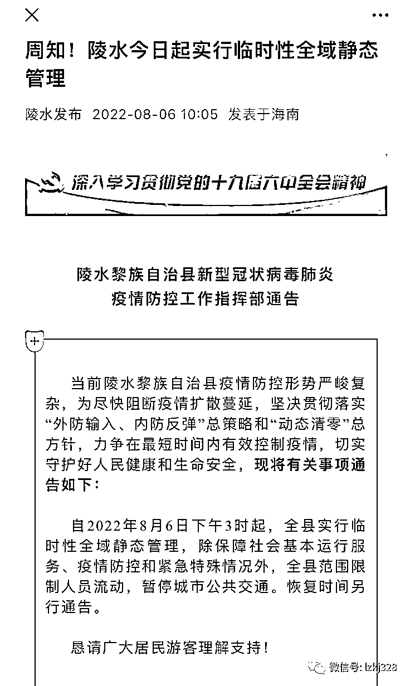
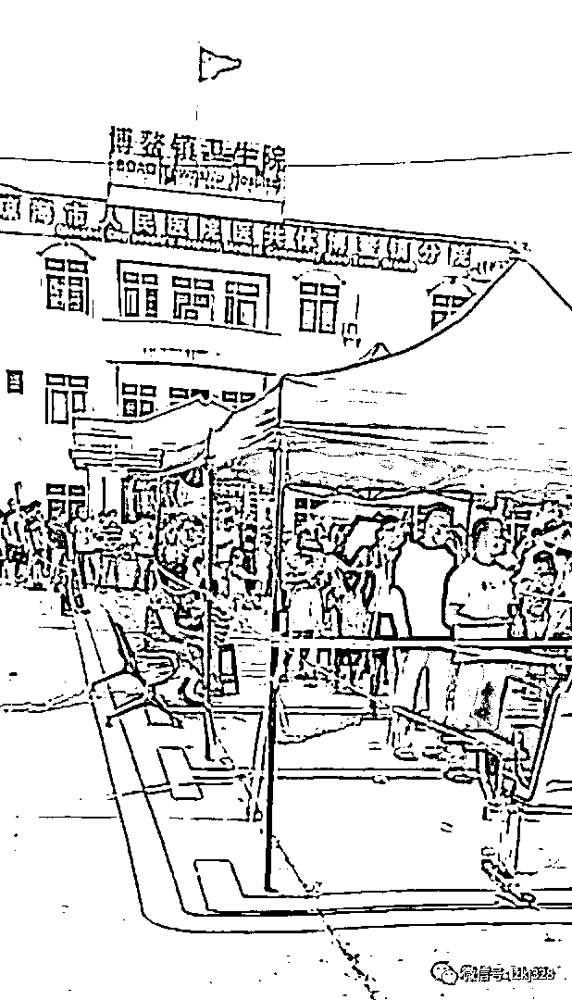
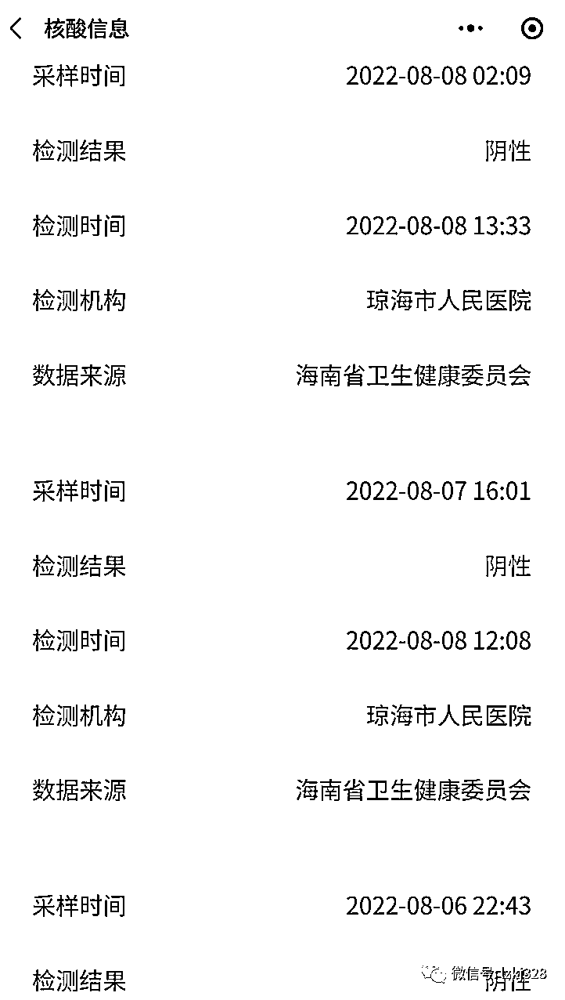
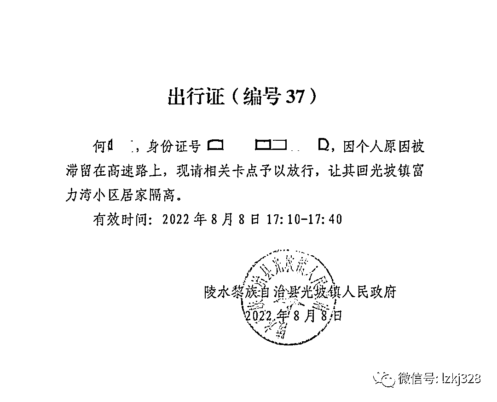
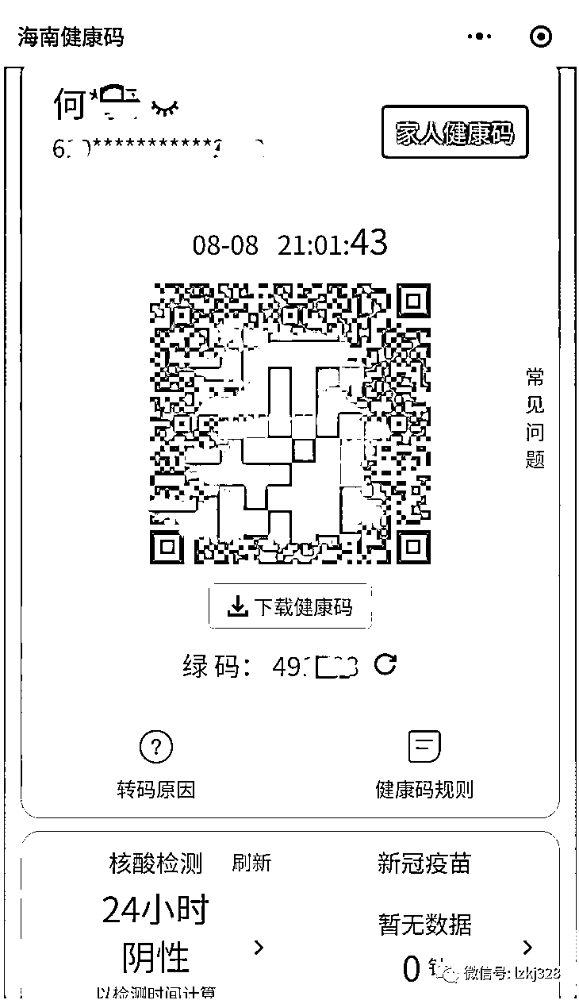
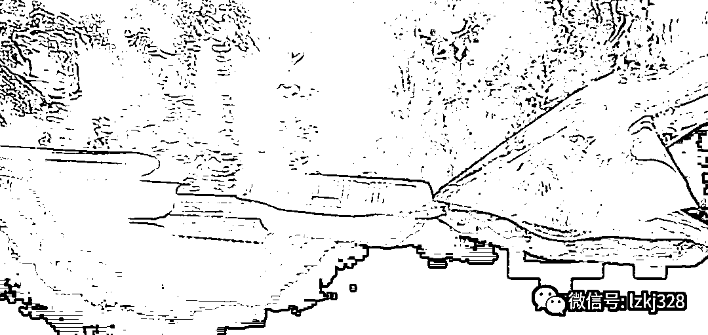

# 三亚疫情下，一家四口“漂”在高速路上 3 天 3 夜：打 200 多个电话暂无果

> 原文：[`mp.weixin.qq.com/s?__biz=MzIyMDYwMTk0Mw==&mid=2247542162&idx=8&sn=9afabde7f4da82e3a141ba11c77570bd&chksm=97cbeeaaa0bc67bc6c4b7a5c8382160f41f7479352bd2cd1f304e524aa494568807959ef1fbb&scene=27#wechat_redirect`](http://mp.weixin.qq.com/s?__biz=MzIyMDYwMTk0Mw==&mid=2247542162&idx=8&sn=9afabde7f4da82e3a141ba11c77570bd&chksm=97cbeeaaa0bc67bc6c4b7a5c8382160f41f7479352bd2cd1f304e524aa494568807959ef1fbb&scene=27#wechat_redirect)

直到 8 月 9 日凌晨，何先生一家四口仍然被拦在高速路口，不能回家。他们的房子就在几百米外的海边。为了凑够海南陵水县光坡镇要求的“连续三天阴性核酸证明”，他们已经在高速路上“漂流”了 3 天 3 夜。

陵水黎族自治县（简称陵水县）是一个东毗南海，南临三亚的县城。8 月 6 日 3 时 52 分，“三亚发布”发布紧急消息，自 6 日凌晨 6 时起，全市实行临时性全域静态管理，除保障社会基本运行服务、疫情防控和紧急特殊情况外，全市范围限制人员流动，暂停城市公共交通。恢复时间另行通告。

三亚市、陵水县、万宁市、博鳌、琼海市位置示意图。

当天午后，家住陵水县的何先生一家四口开车去更北部的万宁市给汽车充电，没想到下午返回时，被挡在高速出口。

陵水县光坡镇防疫人员要求，必须出示“连续三天阴性核酸证明”。因此，8 月 6 日至 8 月 8 日，何先生夫妻二人带着两个孩子奔波于陵水县、万宁市、博鳌镇、琼海市之间的高速路上。他们眼看着三亚的疫情紧张局势逐渐蔓延，临近几个县也陆续开始“静态管理”，封闭高速出口。

海南环岛高速陵水县光坡镇的出口被封堵。

8 日，一家四口终于全部完成了“连续三天阴性核酸证明”，并向光坡镇政府申请到了一张出行证。但他们回到光坡镇的高速出口，仍被禁止进入。执勤人员先是称“光人有证不行，车也要有通行证”，随后又称“只能户主一人进去，母子三人不能进”。

这 3 天，他们给各个部门打了 200 多个电话，始终无果。“漂”在高速公路上的这三天，他们没有换洗衣服。10 岁的儿子肚子饿，找卡口的执勤人员要来一份盒饭，和妹妹分了吃。

3 天来，何先生、王女士给各个部门打了“几百个电话”，均无果。

何先生说，如果 9 日他们还无法下高速回家，已经凑齐的“三天阴性核酸”结果就将作废，他们还要继续在高速上“漂流”，但汽车电量已无法支撑。

以下是何先生和他的妻子王女士的口述：

# 需要连续三天核酸证明

6 号中午，我们一家四口开车去买菜、给汽车充电，以为只是一趟平常的出门。没想到就再也回不去了。

我们是陕西西安人，5 年前在陵水县光坡镇的海边买了一套房子，本来是给老人养老的。但老人也不来住，所以放了暑假，我们就带着孩子来度假。我们是 7 月 21 日来的，这几天也没怎么敢出去玩，每天在家晚睡晚起。

8 月 6 日，我们上午 10 点多才起床，没注意到三亚封城的消息。中午 12 点吃完饭，听说三亚发生了疫情，我们有点担心，想着去买点菜，给车充电。去陵水县城买完菜，我们上了环岛高速，去东北方向的万宁市找充电桩。整个过程没有任何阻拦。

两个孩子，大儿子 10 岁，小女儿只有 4 岁，需要随时照顾，所以我们把两个孩子也带上了，但别的什么东西都没带。

我们开的是纯电动汽车。在万宁市神州半岛充完电后，我们的邻居说，“你们赶快回来，下午 3 点钟（陵水县）就开始静态管理了。”我问她“‘静态管理’是啥”，她告诉我，就是“不让出不让进”，因为“陵水县这边有确诊病例了”（注：6 日上午 10 点多，陵水县发布“实行临时性全域静态管理”的通告。据陵水发布 9 日凌晨报告，8 月以来，陵水县累计发现病例 39+27 例）。邻居跟我说的时候是 14:58，万宁市距离陵水县 45 公里车程，只剩下 2 分钟，我怎么也不可能赶得回去啊。

8 月 6 日上午，陵水县发布“实行临时性全域静态管理”通告。

说实话，当时我心理还比较松懈。我以为是“只进不出”。没想到回到陵水县，在红角岭互通入口，我们被路障拦住了。

我们开始打电话。先打了 12345，对方说让我们打当地政府电话；我们打给光坡镇，镇政府说“不是我们封堵的，是交警大队封堵的”；我们打给交警大队，交警大队说是防疫部门要求的；我们又打给防疫办，防疫办说，“疫情有点严重，没办法，现在就是封控状态”。我们又打了 110，110 指导我们从另一个出口下。

晚上，我们开车去了那个出口——那儿离我们家很近，只有几百米。去了发现，也被封堵了。我恳求他们，说带着两个孩子。他们说不行，说必须要有“三天连续的核酸检测报告”。但我并没有看到相关的防疫规定文件。

其实大概从 8 月 4 日的时候，这里就要求三天两检。我们都在 8 月 4 日做了核酸。5 日，我和两个孩子做了核酸，我老公没做。6 日出门的时候，我们本来是要在社区里做的，发现排了一公里长的队伍，就打算给车充完电回来再做。没想到回来就被堵在高速口了。

这个路口，200 米外就是陵水县第二人民医院，几百米外就是我们的房子。我们从傍晚 6 点多一直交涉到晚上 9 点多，执勤人员就是不让进去。没办法，我们只能开车往北，再到万宁市去做核酸。

为了凑齐连续三天的核酸结果，我们就带着孩子，开始在高速上“漂流”。

# 人和车都需要出行证

三亚的疫情明显有向周边蔓延的趋势。

6 日晚上 22:43，我们在万宁市做上了核酸。那里距离三亚市 120 公里，也已经全民核酸了，排着很长的队。后来，我看到群里有人发了截图，说万宁市增加了 8 个确诊。

我跟老公商量，如果明天结果出来，万宁市爆出更多病例，这里会不会也要静态管理？于是我们连夜开车，继续往北，到了琼海市博鳌镇。海南的环岛高速没有路卡和收费，这时还一路畅通。

7 日下午 2 点半，我们在博鳌镇排队，一直到 4 点才做上核酸。这时候，博鳌也开始全员核酸了，我们不敢留在博鳌，决定去琼海市区。

博鳌的医院，排起来数百米的核酸检测队列。

去年年底至今年 1 月，我们在老家西安也经历了全城的疫情。但海南的疫情跟我们经历的还真是不一样。我发现，这里的人防控意识没有我们内地人高，戴口罩不够严格，有的人天一热就露出鼻子，有的人还不停嚼着槟榔，不戴口罩。

我们在琼海市又过了一夜。为了让我老公早点凑够第三次核酸结果，8 日凌晨 2 点，我们又去琼海市人民医院，自费做了一次单管核酸。为了这三次核酸，我们辗转了陵水、万宁、博鳌、琼海四个地方。

这时候，琼海发布通知，琼海市也要实行静态管理了。从 6 日到 8 日，我们一路向北，看到三亚周边的几个县都纷纷“静态管理”了。8 日午后 1 点半，我老公的第三次核酸结果也出来了，都是阴性。我和孩子还去做了第四次核酸检测。我们心想，得赶紧回家。要是被封在琼海，这三天的辛苦不是都白搭了？

颠沛流离 3 天 3 夜，何先生得到了连续三天的核酸阴性结果。

到了博鳌互通高速入口的时候，高速已经封闭了。当地的 12345 说，现在都是地方管理，让我们向居住地政府申请出行证。博鳌关卡的人还提醒我们，“现在静态管理了，你们可得想好，出去了就肯定不能再回来了。”我说，没有关系，我现在是要回家。

下午 3 点，我们打电话给陵水县光坡镇政府，说明了情况。随后，工作人员用彩信给我发来了一份盖章的电子版出行证。

这张出行证显示“编号 37”，写着我老公的名字和身份证号，“因个人原因被滞留在高速路上，现请相关卡点予以放行，让其回光坡镇富力湾小区居家隔离”。还注明，有效时间是“8 月 8 日 17:10-17:40”。

8 月 8 日获取的《出行证》，只写了何先生的信息。

在电话里，工作人员还问了我一共几个人，我回答一家四口。他说去和物业核实，我也打电话跟物业打了招呼。物业管家很好，极力配合。可不知道为什么，开出来的出行证只写了我老公一个人的信息。当时我也不懂通行证和出行证有什么区别。

但博鳌互通高速口放行了，我们还是万分欣喜，以为这样就能回家了。我在朋友圈里发了个短视频，配文“结束游荡的日子，我们终于可以回家了！”有的朋友留言，还以为我们回到了陕西老家。

回到陵水县环岛高速红角岭互通入口，我们出示了绿码和连续三天的核酸阴性证明，执勤的交警还是不让我们出高速。我们给他们看了镇政府开具的出行证，还是不行。他们说，现在政策变了，“你们的车需要一个通行证”。

8 月 8 日晚上，何先生的绿码。

出行证上的确没写“车”。但既然写了“被滞留在高速路上”，我理解，不可能一个自然人，你去高速上跑或者遛弯，对不？肯定是开着车，或者坐着大巴之类的，怎么还需要单独的汽车通行证呢？

但他们不听我们的解释。

# 带娃在路上这三天

我都不想说，这三天三夜，我们是怎么过来的。

6 日晚上，我们把车停在博鳌亚洲湾的一个酒店停车场。我怕下车之后发生交叉感染，而且孩子们喜欢到处乱摸，就没让他们去住酒店。两个孩子在后排，我把座椅靠背放倒，给他们睡觉。我和老公就在前排座椅上窝着打盹。

出门的时候，我们什么都没带，没有被褥，孩子也哭闹。我老公被搞得心情烦躁，有时候就会去凶孩子。

在博鳌、琼海的时候，我们每天几乎所有时间都待在车里。琼海已经禁止堂食。每顿饭，我们都是先在手机上找饭馆，然后把车开到饭馆附近，再点外卖。然后打电话跟老板说，不用外卖员送，在门口递给我们。我们开车到很远的地方，打开后备厢，坐在路边吃。

孩子上厕所还可以随便，大人上厕所，我们就开车去找公共厕所。这些，都是为了不与社会面接触，尽量保证核酸阴性。

7 日那天，做完核酸，我们带孩子去海边踩沙滩。刚下完雨，我儿子跑了一身的泥，又在海边弄湿了衣裤。出来的时候，我们都没带换洗衣物，琼海的商场也都关门了。我就用自来水给他洗脏衣服。洗完之后的那天晚上，我们在车里打开空调，给他吹衣服。孩子光溜溜地坐在车上，我拿一个坐垫给他盖在身上。第二天上午衣服还没干，为了做核酸，孩子又穿上了湿衣服。

充电也是一直让我们担心的事。我一直提醒老公，一定要先保证车有电，我们才能动。我很害怕车真没电了，我们被撂到哪里，在这里人生地不熟的，现在疫情也没人来救，那可就惨了。

8 日晚上，我们又打了几十个电话，都是互相推脱，都说“在督办”。这些天，“督办”这个词我已经听烦了。

后来，路口执勤民警又说，出行证写的是我老公的姓名和身份证号，只能让户主一个人回家，我和孩子不能过去。那肯定不行呀，我老公也不放心。

我就按照之前发彩信的手机号，打给那个帮我开出行证的镇政府工作人员，问他能不能在出行证上再加 3 个人。他说开不了，我问为什么开不了，他说“就是开不了”。他说他不在单位了，让我打电话给镇政府。我觉得他好像不讲道理。

我几乎已经声泪俱下了，说我们已经游荡了三天三夜，还有孩子，我们现在就是为了回家，希望政府能看到我们。但他有些不情愿，说下午帮我们开那份出行证，后来“还被领导批评得不像样子”。他说再帮我问一下领导，但到现在都没回复。

我又给 12345 打电话，我说，如果你们怀疑我们是确诊病例，或者是密接，那可以把我们隔离起来，至少我带着孩子有落脚的地。我现在在外漂着，怎么办？我们还得保证自身安全，一下车感染了怎么办？我还得考虑去哪里续做核酸，考虑我的车还有没有电。

我在晚上 8:20 打的这个 12345 电话，打了 20 多分钟。现在又过去两个半小时了，也没有回复。

# 幸亏有交警送了盒饭

从琼海出发的时候，我是打算买点食物的。但为了赶时间，也想着凑够了三天核酸，马上就能回家了，就没买。

晚上，孩子们又渴又饿，我们没东西吃。3 天前买的水果和蔬菜，我们吃掉了两个火龙果，坏掉的生菜给扔了，现在只剩下几个玉米棒子。我儿子下车，到执勤民警那里，“叔叔，我饿了，能不能给我点东西吃？”民警给他一份盒饭，他拿回来，和妹妹分着吃了。

十岁的儿子问卡口民警要来盒饭充饥。

我在小区业主群里说了我们的遭遇。一个物业的热心大姐给我们送来了热水和八宝粥，越过栏杆递给了我们。

后来我看到一个领导模样的人，带一男一女来卡口检查工作，完了在那里拍照。我们就上去，说了我们的情况，以及这三天颠沛流离做核酸的遭遇。领导记下了我们的电话，说会帮忙反映一下，然后走了。

明明家就在几百米外的地方，却回不去。现在是晚上 11 点一刻，高速公路上除了执勤民警的警车，周围都是漆黑一片。海南这边的公路，两边都是荒郊野地，长满了树林。有邻居建议我们，不要管车了，找个地方，从小路走回家算了。但是我害怕虫子，这边还有蛇，我们带着孩子，我可不敢走树林的路。

这两天，海南白天的气温在 35 摄氏度左右，一会儿倾盆大雨，之后又是太阳暴晒，很闷。

今天（8 日）邻居告诉我们，台风马上又要来了（注：据海南媒体报道，8 月 8 日 14 时，南海热带低气压生成，可能于 9 日加强为今年第 7 号台风，热带风暴将于 10 日登陆海南岛东北部）。要是继续滞留在高速上，明后天下暴雨、刮台风，我们怎么办？

晚上 11 点半，又有一两位政府领导来这里视察工作，我们又去解释一番，但看样子是没有结果的。

夜深了，我和老公还在不停地给各个部门打电话。防控中心说让找镇政府，镇政府说着说着就把电话挂了，后来干脆不接了。

我们不知道该怎么办。明天（9 日）我们没地方可去。核酸如果不续做，前面连续三天的阴性结果就白做了。刚才我看新闻说，海口下午 7 点解除了静态管理，但我们肯定到不了那里。中间核酸断了的话，估计哪里都不让我们进去了。如果再找不到地方给车充电，我们更要陷入绝境。

**【最新消息】**当地政府的人、纪委都来过问了。

当事人何先生 9 日上午反馈：我们凌晨沿着郊区庄稼地里偷偷回来了，这边生态好，明知可能有蛇，田里到处能见到拳头大的田螺，随处乱窜的癞蛤蟆 吓得孩子们不停哇哇大叫，但我们顾不上了，我们怕了，心里恐慌的要命，只要往家的方向近一步至少有希望，总比这样等死强，不夸张的说，几天的遭遇，让人的恐惧到了极点，上百个电话，消极的应对，冷漠的回复让人经历了从希望到绝望……身边的救护车不停地从身边经过，突然觉得车里的人很幸福，至少有人安置。可能只有感染了病毒才会有人管你，像我们这样滞留想回家的人死都没人管  。昨天深夜娃醒了身上被蚊子咬的到处是包，车里又热又潮湿 刚睡着又惊醒 醒了又不停哭闹，我们情绪再次崩溃。前方红蓝交替闪烁的警灯让人心里感觉不到安全，更像是对我的嘲讽，让人感觉到身处法治社会面临绝境却又无处申诉的悲哀 ……  两种方案，无论是逃回家还是冲卡我都做了最坏的打算  如果冲卡了让他们来抓我吧，抓走我至少家里人安全了 。现在回到家里，想想一路的遭遇依然心悸，但好在回来了就能做核酸了，做完核酸就可以离开这个地方了。

来源：观象台，宾曰语云 作者：陈龙

](http://mp.weixin.qq.com/s?__biz=Mzg5ODAwNzA5Ng==&mid=2247488098&idx=3&sn=638c5dd62ca652e1a1f2fd5b8420b00f&chksm=c0687b35f71ff223bca5031da035e3ab56f77f3ecfe42e587322e6e0f1302dc4d3e3fb354f18&scene=21#wechat_redirect)

← 向右滑动与灰产圈互动交流 →

