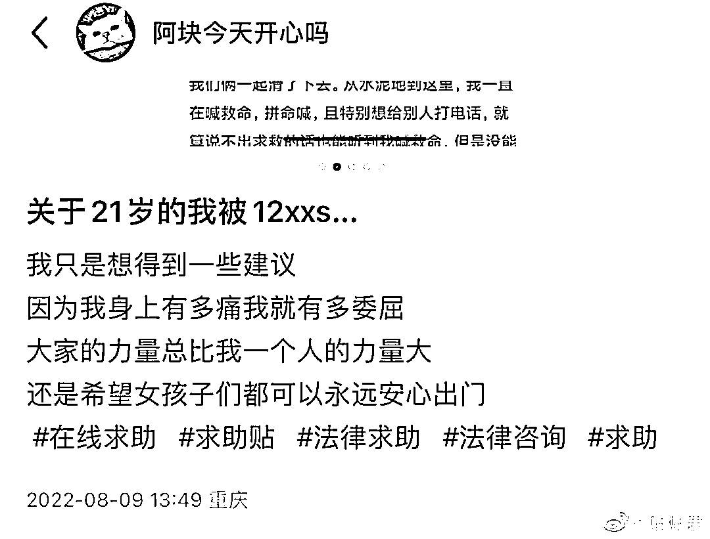
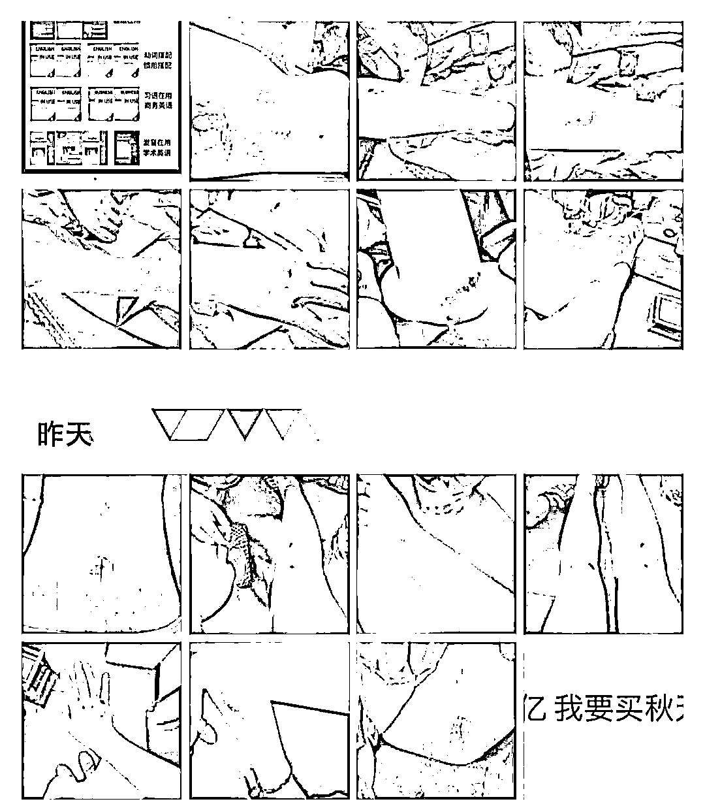
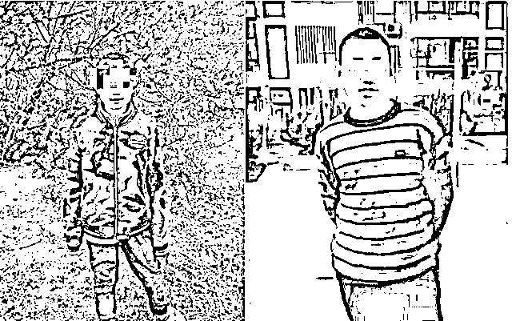
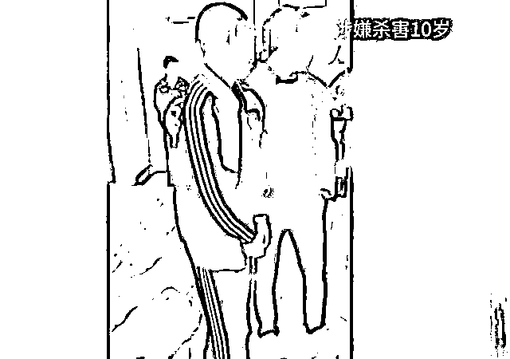
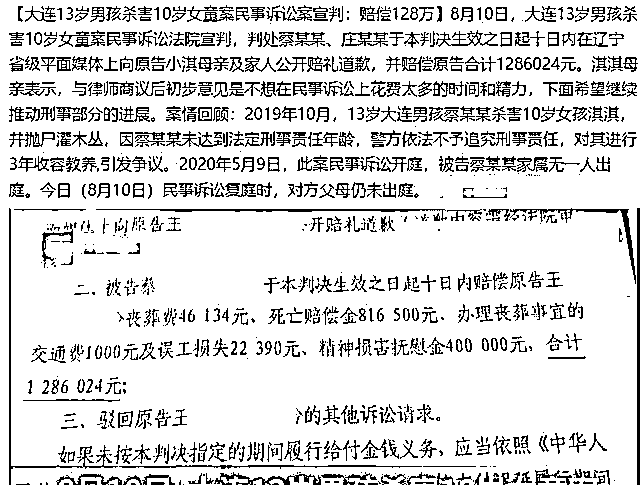
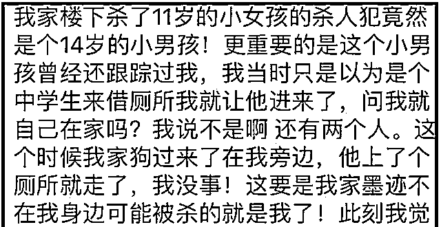
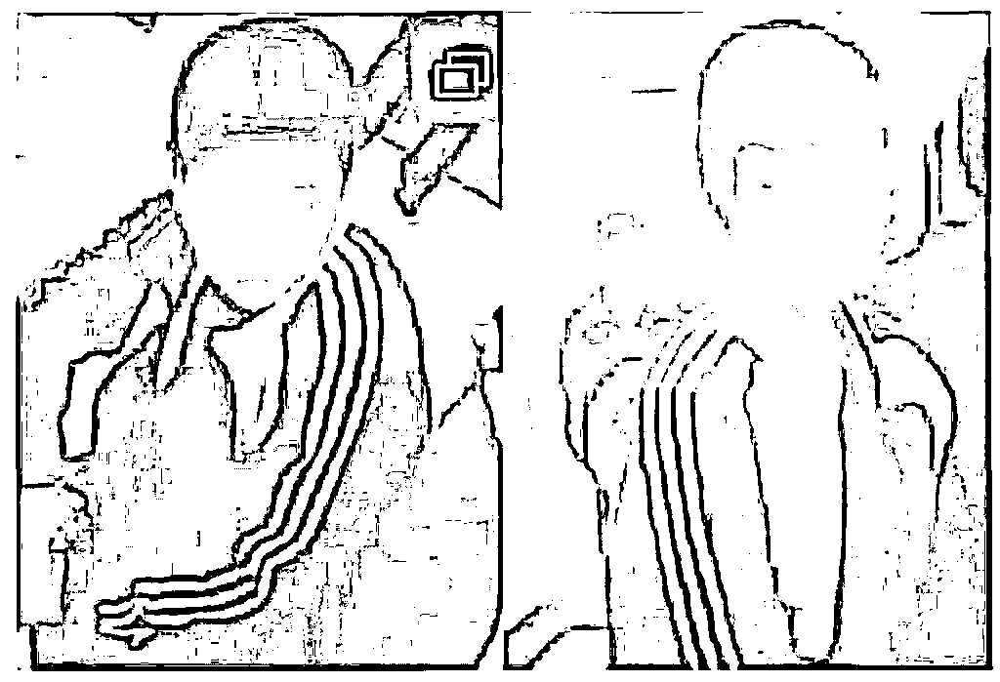
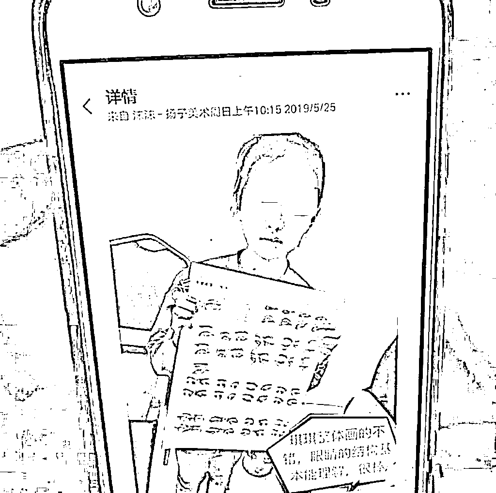
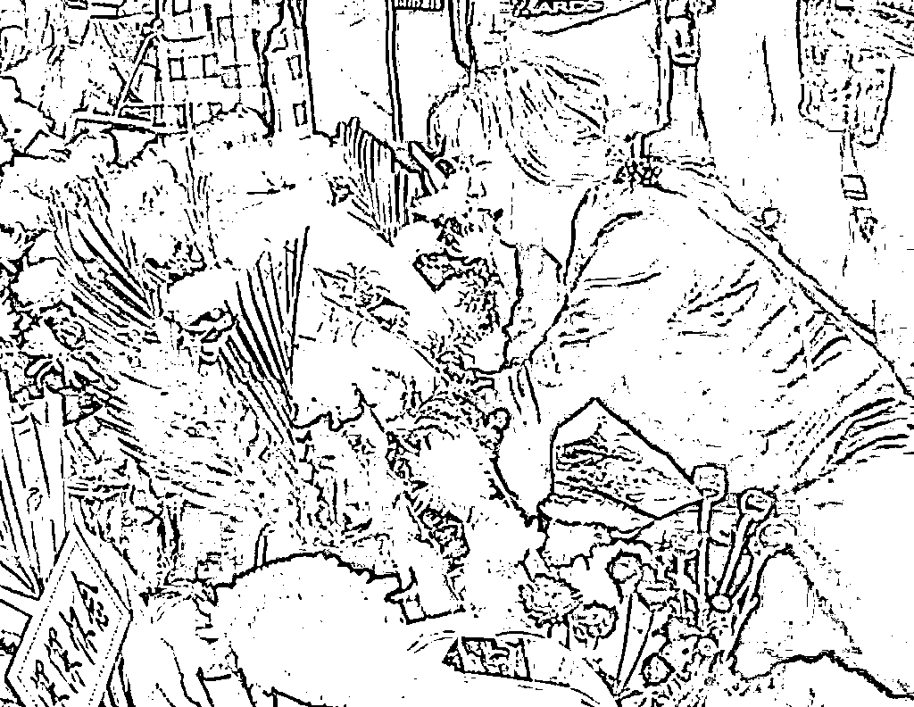

# “21 岁的我，被 12 岁小学生拖到草丛猥亵”

> 原文：[`mp.weixin.qq.com/s?__biz=MzIyMDYwMTk0Mw==&mid=2247542213&idx=1&sn=00d904b42af15f09ef530cdd573aec34&chksm=97cbeefda0bc67eb0fda2205c5e2ec5d0cad0a55b9e30eb4aeea1aa0f910a19dcb50f15786f4&scene=27#wechat_redirect`](http://mp.weixin.qq.com/s?__biz=MzIyMDYwMTk0Mw==&mid=2247542213&idx=1&sn=00d904b42af15f09ef530cdd573aec34&chksm=97cbeefda0bc67eb0fda2205c5e2ec5d0cad0a55b9e30eb4aeea1aa0f910a19dcb50f15786f4&scene=27#wechat_redirect)

今天，一位 21 岁女生今天发的贴，

称 8 月 7 号晚，她被一个**12 岁的小学生从后面勒住脖子拖到草丛强制猥亵**……

幸好女生大声呼喊被人发现才得救。

以下为女生发帖全文：

**关于 21 岁的我被一个 12 岁的小学生...** 

前天晚上(8.7)我从外面回家，大概十点多，刚走到家楼下，一双手从后面勒住了我的脖子。我的第一反应是:是不是哪个认识的人在开玩笑，是谁呢?但是我还没有反应出来是谁，他就开始把我拖着往前面走。关于那几秒，那四五米的路程，我的记忆都是空白的。

我反应过来不对劲，于是我就开始大喊救命。由于没有任何可以抓的地方，我没有可以用力的点，只有被他拖着走。而且我当时来大姨妈第一天，走回家的路上就已经觉得精疲力竭都快走不动路。

我家楼的另一头是山坡，种菜的那种地，那边完全没有任何路灯。我知道他想把我往那边拖，而且不知道想把我拖到哪，我不知道他要干嘛，是不是想杀我灭口，我不知道要干什么，会不会激怒他，不知道拖到黑的地方会发生什么事，我只能拼命喊救命。

中途我也想拿手机打电话，可大家都知道的，那种危急情况根本没有办法操控。而且他也想抢我的手机，但他拖着我，没有抢得走。快被拖到离开水泥地的地方我摔倒了，背着地，他就开始拉我的衣领，我就听到刺啦一声，衣服也坏了。

我都不知道他是怎么把我拖到田路边有草丛的地方。我只记得在那个路边很多草，是有个坡坡，我被弄倒在那个路边，他扑到我身上，然后我们俩一起滑了下去。从水泥地到这里，我一直在喊救命，拼命喊，且特别想给别人打电话，就算说不出求救的话也能听到我喊救命，但是没能但是没能完成。

滑到滑不动的地方，我也还在喊救命。他用手来掐我的脖子，我人都要懵了，我就想我要死了吗我要怎么办，我想到我掐他下面，我动手但是我不确定是不是掐到了。然后他开始想摸我的胸，我穿的连衣裙，然后他想亲我。他嘴凑上来的时候，我想现在我是不是能打一个电话。

终于，此刻坡坡对面有一个人回应我了。(这个坡滑到底就是另一栋楼，但是我没有滑到底)，是个三十岁左右的女人的声音，她问我怎么了 在哪里、是不是摔倒了。我说不是，然后那个人怕了就爬起来跑了。

我站起来，不敢爬上去，拿起手机给我朋友打了电话。(没有给家里面人打是因为我当时家里没有人，我婆婆家在旁边一栋楼，有我婆婆和哥哥。我打开电话第一个通话记录就是我的朋友，也是我最信赖的人，同时他离我很近，我爸爸在外地根本不可能跑过来帮我）。

我给他打了电话，响了两声，那两声的时间我都觉得漫长。通了我就说，救命….然后全程在喊他快点来。他三分多钟就赶到了，然后看到他出现在了坡上头，我才敢走了上去。

抱了抱我，然后在楼下查看了一下我的伤势。我的衣服袖子下面被撕烂了，穿了打底裤，可是内裤也磨破了。背上，手上还有腿上都是伤口。我们决定去医院，他要回家拿车钥匙，所以就牵着我去他家，走路上我们决定报警。

我用手机打了 110，但是一直都是让我们等待的提示音，没有接。我还在开玩笑说:要是别人真的遇到 s 人的事，可能已经 s 了。最后他用他的手机打了电话。之后的事就是等 JC，描述，看现场，回派出所。

在派出所等了大概二十几分钟，jc 带着人来了。因为我记得清楚是穿的一身深蓝色的衣服，和我差不多高，短发。抓来的那个人也是。

他也承认。更让我无法接受的是，我本来以为是个十五六的人，结果他 12 岁、小学生。最后 ic 给我的结果是，他 12，没办法负刑事责任，所以当天晚上就在派出所，对他进行教育，还说尽量把他逐出我们这个小镇，说赔偿会问他父母，不赔得我自己去起诉。

jc 的说辞是他的父母本就不愿意管他，上次也好像发生了类似的事情，父母不 

讲理，也许他们不想再处理这个事情。当时我也是想去医院，签了属实(对事

情经过的简要描述记录)就走了。

后续的事情到现在还没有，但是肯定不会止于此，我不太知道我到底能怎么办？希望大家能给我一点建议和帮助。

**重点：** 

**这位 12 岁的小学生因未满十四岁犯罪，不负刑事责任，只能教育。**

**他的父母本就不愿意管他，因为之前也发生了类似的事情......**

这让我想起了 3 年前那位大连 13 岁男孩，强奸并杀害 10 岁女孩事件，男孩家长至今没有道歉。

这事件彻底掀翻了我对世界的认知。

**回顾：13 岁男孩在家侵犯 10 岁女孩遭反抗，残忍将其杀害。**

大连公安 2019 年 10 月 20 日 19 时许，公安机关接到报警，沙河口区发生一起故意杀人案，受害者某某（女，10 岁）被害身亡。接警后，市公安局经连夜工作，于当日 23 时许，在走访调查中发现蔡某某（男，2006 年 1 月出生，13 岁）具有重大作案嫌疑。到案后，蔡某某如实供述其杀害某某的事实。

据了解，淇淇（化名）10 岁，事发当天下午去美术班补课，补课的地方离淇淇家开的水果店并不远，走路也就十来分钟。淇淇 15：00 放学，按理说最多 15：30 就能到家。

但是，家里人却一直不见淇淇踪影，打电话问学校，学校的回答是“放学就回去了”随后家里人在小区展开搜寻，通过小区监控，看到淇淇 15：15 左右就已经进入小区，但是就是没能找到淇淇。

搜寻无果的淇淇父母只好报警求助警方，警方赶到后展开搜寻，最后在小区灌木丛中找到了淇淇尸体，可爱的淇淇身中多刀，被人杀害了。

随着警方深入调查，很快锁定犯罪嫌疑人，同小区的 13 岁初中生蔡某某，别看蔡某某年龄还小，他发育得早，身高 170cm 还多，体重 140 斤，看起来和成年人无异，而且心智成熟。

在审讯室里，蔡某某面无惧色像讲述故事一样交代了自己的作案过程。 

原来当天，蔡某某遇到放学回家的淇淇，之后花言巧语把淇淇骗到蔡某某家。在蔡某某家，蔡某某想侵犯淇淇，没想到遭到淇淇强烈反抗，对他又抓又挠。这就激怒了蔡某某，他拿起来家里菜刀，几分钟之内对着淇淇就是几刀，直到淇淇没有了反抗能力，一动不动。

蔡某某看着昏死过后的淇淇，生怕被别人知道自己的罪行，通过一番查看，趁无人注意的时候，把淇淇尸体扔到自家对面的树丛中。

等到淇淇父母在小区寻找淇淇的时候，蔡某某更是表现得异常淡定，数次走到淇淇父母面前，向淇淇爸爸问道：“淇淇去哪了，找到了没有。”

当淇淇的尸体被发现时，蔡某某围观在人群中问道“真死了啊，谁干的，太凶残了”，随后还跑到阳台拍视频发朋友圈“这些警察水平真差，这么显眼的地方，花了这么久才找到”，之后更是向同学炫耀说**“如果是我干的，我不会坐****牢，我才 13 岁”。**

法院宣判："不予追究蔡某某刑事责任，只是对其进行 3 年收容教育。” 

正如蔡某某所言，2020 年 8 月 10 日法院宣判：赔偿 128 万余元，判处蔡某某及其监护人十日内通过媒体向淇淇及其家人赔礼道歉，对蔡某某进行三年收容教育”仅此而已。

据了解，蔡某某家人自命案发生后一直到法院宣判前，连个赔礼道歉都没有，

法庭上也没有一人到庭，可谓是冷漠至极。 

而据蔡某某同小区居民反映，蔡某某曾数次跟踪同小区的成年女性，曾有一次假装去别人家上厕所，打听别人家是否还有其他人，后来因为看到人家家里养的大狗才离开。

还有一次对同小区的一个小姑娘动手动脚，小姑娘家长报警后，蔡某某父母还不承认，说是别人诬陷蔡某某。

案件曝光后，网友持续关注，等一个“结局”，最后，结局确实等到了，但是这样的结局可能并不是绝大部分人所期待的结局。

按照知乎网友@诚言 SIR 的话说：

**这位蔡姓男孩会在收容 3 年后重返社会。也就是会在明年......**

不，也许他在“表现良好”，提早放出来也不是不可能。

这时，他还没到 18 岁，改名字会比较方便。

父母可以带他去公安局换个名字，买张动车票，换个地方生活。

他的母亲庄某某，应该那时已经不再售卖海参等水产干货了，我也不知道她会干什么。

也许还是会换个地方卖东西。 

他的父亲，也许还会换个地方，继续维持烧烤摊，亦或是干些别的维持生计。

这些都不重要，在大连，他们没有什么可以留恋的。

法律不会限制他们一家三口的自由，所以他们可以买张动车票，想去哪就去哪，离开大连，去北京，去上海，去河南，去河北。

去哪都行，只要不在大连。 

那时，蔡某某的身高应该已经不止 1 米 7 了，他还在发育，他的身体会变得更加高大，更加强壮。

换个学校读书，是个不错的选择。

或者不读书，直接开始工作。

他不喜欢读书，3 年前在初二的时候就不喜欢，上过托管班，但只去了一个月。蔡某某"在班里的成绩不是倒数第一，就倒数第二。 

所以明年后，他应该不会继续读书。

也许是帮她母亲卖东西，也许是父亲重操旧业，置办起烧烤摊，蔡某某做工。 

每天可以进货，在烧烤摊帮忙，兴许还可以上手烤一烤食物。

烟熏火烤，人来人往。

**竹签很尖，要小心，拿在手里，对着要害会扎死人的。** 

熟悉烧烤摊的客人，会发现他平常不怎么说话，只是眼睛经常直勾勾地看着人。

看得人心里发毛。

如果他不小心得罪客人，开口，往往也多是推卸责任。

**3 年前他就喜欢推卸责任。**

那时，女孩的尸体被发现位置，离蔡某某家不远，他说了句“我把擦过血的纸扔那块了。”

不是他，真的不是他，别怀疑他。也许但是他的心里就是这么想的。

不知道你们有没有打过架。

我的经验不多，都是小学时和别人闹的，但是看过一些成年人打架。

一般一拳，两拳，如果对方“毫无还手之力”，那么占优的一方就不会再打，**因**

**为心里敬畏，害怕后果。**

但是大连的那个蔡姓男孩，捅了小女孩 7 刀。

不是 1 刀，2 刀，而是 7 刀。

3 年后，快要 18 岁的他，终于可以过“正常人”的生活了。

只要他锻炼，人瘦一点，换个发型，没有太多人可以看得出来。

一般人认为他肯定无法找到工作，没有企业敢要他。

但是他的档案会被封存，非司法机关办案需要，**任何单位和个人都不能查询。**

**兴许，他能在某个公司找到工作。**

如果找不到，就还是在父亲的烧烤摊帮忙好了。

他依然不善言辞，显得“很冷静”。

**3 年前的那个下午，他就是如此“冷静”的。**

捅了小琪 7 刀，抛尸草丛中，蔡某某还能假装路过小琪父母的水果店。

“小琪去哪儿了。”他的问题，很冰冷。

一个半小时后，他又碰上小琪的父亲，再次开口。

“你们女儿找到了没?”

3 年前的那个下午，蔡某某手握着刀，捅死了小琪。

随即处理尸体，抛尸，然后装作无事地到死者父母店铺闲逛。

晚上，警察发现尸体，他还能从容不迫地在班级群里撇清自己，最后说自己“虚岁 14”。

**你很难说，一头嗜血的狼，不吃肉三年，之后有一天会转而吃素。**

**狼，就是狼。**

2004 年，黑龙江有位 13 岁的少年，叫赵力宝。

他强奸了同村 14 岁女孩，被警察抓，因为未到法定刑事责任年龄，被释放。

法律宽容了他，就跟现在宽容蔡某某一样。

1 年后，有前科的赵力宝再次冲到那个同村女孩家里，当着她的面，19 刀捅死她的母亲，跑走了。

**被公安局抓到后，他依然未成年，被判劳教 1 年 6 个月。**

2019 年，蔡某某 7 刀捅死 10 岁的小琪，被判劳教 3 年。

**如果不出意外，蔡姓男孩会在收容明年重返社会。** 

虽然没到 18 岁，但是他的身体已经很壮实了，跟一个 20 多岁的成年人相差无

几，甚至还要更加强壮。

深夜，如果有女生落单，独自走在路上。

烧烤摊这时正好闲来无事，可以暂时离开。

我不知道他在那时的社会，会做出什么事。

我只知道，3 年后的蔡某某，那个沾满鲜血的男孩。

**力气更大了。**

**而对于今天这位发求助帖的那位女生，如果当时没被人发现，这位 12 岁的小学生能做出什么事来，我想大家都清楚。**

来源：不惑先生，作者：尸哥

<mp-common-profile class="js_uneditable custom_select_card mp_profile_iframe" data-pluginname="mpprofile" data-id="Mzg5ODAwNzA5Ng==" data-headimg="http://mmbiz.qpic.cn/mmbiz_png/etCUIjLXeVfJummveNSv8kxdRcFibhbcgKPAntvgzcz72zYFmSccibcXbbrvQsFqetponqnx87xGIGe3duUOerpg/0?wx_fmt=png" data-nickname="灰产圈社群" data-alias="huichanquanshequn" data-signature="「灰产圈高端社群」官方服务号，创始人灰产哥，始创于 2017，致力于做最接地气的互联网高端创业社群。" data-from="0" data-is_biz_ban="0">      </mp-common-profile>