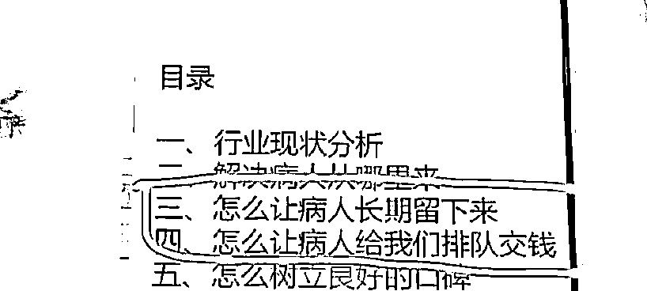
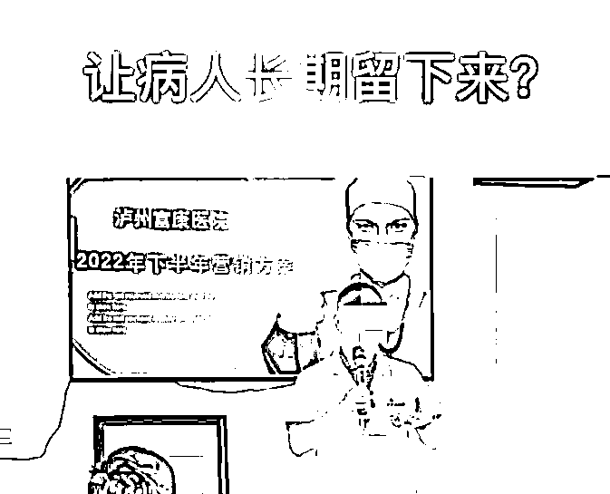
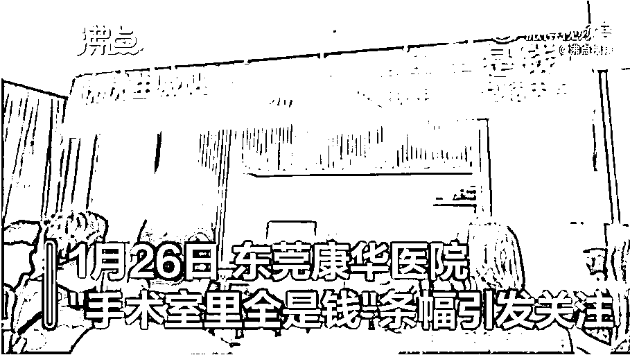

# 呵呵，“怎么让病人长期留下来”居然是医院的营销方案！

> 原文：[`mp.weixin.qq.com/s?__biz=MzIyMDYwMTk0Mw==&mid=2247542213&idx=3&sn=70131d1235707fa20b55c160f37567a9&chksm=97cbeefda0bc67ebba3de4555c080a847fc91a1faa604dc34c8e4a7632c592c358cb5c872b01&scene=27#wechat_redirect`](http://mp.weixin.qq.com/s?__biz=MzIyMDYwMTk0Mw==&mid=2247542213&idx=3&sn=70131d1235707fa20b55c160f37567a9&chksm=97cbeefda0bc67ebba3de4555c080a847fc91a1faa604dc34c8e4a7632c592c358cb5c872b01&scene=27#wechat_redirect)

8 月 9 日，有视频在社交媒体平台热传：四川泸州富康医院疑似内部培训资料出现“怎么让病人给我们排队交钱”、“怎么让病人长期留下来”等字样，随即引发广泛争议。

[`mp.weixin.qq.com/mp/readtemplate?t=pages/video_player_tmpl&action=mpvideo&auto=0&vid=wxv_2523947230890868738`](https://mp.weixin.qq.com/mp/readtemplate?t=pages/video_player_tmpl&action=mpvideo&auto=0&vid=wxv_2523947230890868738)

泸州市卫健委相关工作人员回应上游新闻记者表示，涉事的泸州富康医院具有相应的资质和证照，目前卫健部门已成立调查组前往现场调查。

▲四川泸州富康医院内部培训 PPT 出现“怎么让病人给我们排队交钱”等字样，引发广泛争议。图片来源/视频截图

网传视频显示，泸州富康医院在该院 2022 年营销方案探讨会议中，一则 PPT 中出现了“怎么让病人长期留下来”“怎么让病人给我们排队交钱”等字样。

8 月 9 日，泸州富康医院一名工作人员对上游新闻记者表示，网传视频中的 PPT 及文字内容属实，但讲述主要是围绕“作为民营医院如何提高服务质量”展开，“当时我们开会的内容，和你们看到的文字内容是两回事。”该工作人员说，“怎么让病人长期留下来”指的是提高医疗服务质量和服务意识，这样一来病人痊愈之后再患病就会再到该医院就诊，“让病人有一种家的感觉”。“怎么让病人（给我们）排队交钱”，指的是许多优秀的三甲医院因为医疗服务过硬，都有病人慕名前去排长队看病的情况，要提高医疗服务质量，争取赢得病人良好的口碑。

▲医院工作人员解释称，“让病人长期留下来”指的是提高医疗服务质量和服务意识，让出院的病人今后患病会再选择到该医院就诊。图片来源/视频截图 

富康医院工作人员还解释称，网传的 PPT 由新员工负责制作，对 PPT 的制作不熟练，因此造成了词不达意的情况，“开会的时候我们没有发现有什么问题，后来看到图片被发到社交平台再配上引导性文字后，我们才意识到这些内容可能引起误解。”

工商资料显示，泸州富康医院成立于 2017 年，是一家民营资本控股医院。

8 月 9 日中午，泸州市卫健委相关处室工作人员回应记者表示，富康医院的资质不存在问题，对于网传内容的具体情况，已成立调查组前往现场调查。

**烟语君语：**网友评论，当下医院究竟是个啥情况（不论公立还是私立），经常往医院跑的病人及其家属最清楚。不客气的说，有些医院，有些医生，就是“白衣天使，魔鬼手段”。他们眼里都是铜臭，只认得钱，不认得病人。

自古以来，医者，以悬壶济世、解救苍生、医者父母心为职业追求。唐代医圣孙思邈说：......医人不得恃己所长，专心经略财物，但作救苦之心，于冥运道中，自感多福者耳。又不得以彼富贵，处以珍贵之药，令彼难求，自眩功能，谅非忠恕之道。

古代的药店门口写着：**但愿世上无疾苦，宁可架上药生尘**。现在的药房门口写着：会员积分，买十赠二，消费 58 送 15 个鸡蛋。走进药店，销售人员会主动向你推销满一百减二十的优惠活动，即使你点名购买药品，还会向你推荐几种关联药品。

医生从来不是商人，他们不能为钱财，只为救死扶伤。晚清时期，浙江有位老先生范文甫，执医四十余年，救了无数病人，是中国近代著名的医学家。从他父亲开始，他们家医治病人就非常体恤病人，别人家收 6 毛的费用，他们家只收 4 毛 6；有人看不起病，他不但免费为其治病，还送人参。有一年春节，范文甫为自己的医药店写了一副对联：**但愿人常健；何妨我独贫**。除此之外，范文甫还为自己的书斋写了一副对联：**何必我千秋不老；但求人百病不生。**

记得以前去医院，听过两位老人在感慨：现在病人好多，医生专家太赚钱了，可即便如此，他们还是嫌少，定业绩，做考核，一心想赚钱。10 块钱能看好的病，可能要让你花 100 块钱；一星期能治好的病，得让你住院一个月……

如今，医院不实行以药养医了，有发明了小病大检查、小病大治疗的策略，简单的感冒，动辄就是几百元的检查费，对有医保的患者，规定住几天就要办理一次出院住院手续。尽管有了职工医保、农村医保，很多人还是看不起病啊！

此次医院内部培训出现了“怎么让病人长期留下来”“怎么让病人给我们排队交钱”等字样，医院工作人员的解释是，新员工内容制作不熟练造成的词不达意，但却在“开会的时候我们没有发现有什么问题，”，很多网友的看法是，什么“词不达意”，不过是真实内通的意外泄露罢了。

来源：烟语法明，宾曰语云

<mp-common-profile class="js_uneditable custom_select_card mp_profile_iframe" data-pluginname="mpprofile" data-id="Mzg5ODAwNzA5Ng==" data-headimg="http://mmbiz.qpic.cn/mmbiz_png/etCUIjLXeVfJummveNSv8kxdRcFibhbcgKPAntvgzcz72zYFmSccibcXbbrvQsFqetponqnx87xGIGe3duUOerpg/0?wx_fmt=png" data-nickname="灰产圈社群" data-alias="huichanquanshequn" data-signature="「灰产圈高端社群」官方服务号，创始人灰产哥，始创于 2017，致力于做最接地气的互联网高端创业社群。" data-from="2" data-is_biz_ban="0">      </mp-common-profile>