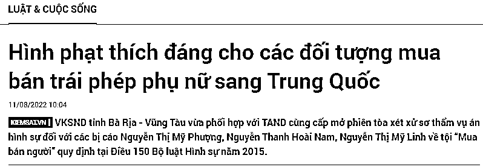

# 一组织越南新娘到中国骗婚的人贩子团伙被端，多人获刑。什么？为刺激旅游，有人提议在越南岘港开设“红灯区”

> 原文：[`mp.weixin.qq.com/s?__biz=MzIyMDYwMTk0Mw==&mid=2247542213&idx=6&sn=56a52b3ff12892123ef2776ffca28763&chksm=97cbeefda0bc67eb22d1755eaad40f4977d50e1485f8b74efab37f3fe256f67693d038616ce7&scene=27#wechat_redirect`](http://mp.weixin.qq.com/s?__biz=MzIyMDYwMTk0Mw==&mid=2247542213&idx=6&sn=56a52b3ff12892123ef2776ffca28763&chksm=97cbeefda0bc67eb22d1755eaad40f4977d50e1485f8b74efab37f3fe256f67693d038616ce7&scene=27#wechat_redirect)

8 月 11 日，越南头顿省人民法院审理了一起“贩卖人口”案件，案件的被告人为：阮美芳  (Nguyễn Thị Mỹ Phượng，2000 年生)、阮美玲(Nguyễn Thị Mỹ Linh，1997 年生) 和 阮青怀南(Nguyễn Thanh Hoài Nam ，1989 年生）。

**近 10 名越南女孩被带到中国实施“骗婚”**

根据起诉书，2019 年至 2021 年， 阮美芳前后一共组织了大约 10 名越南女孩到中国，并将这些女孩“卖”给想娶妻的中国男子，以从中获利。

具体来说，2019 年， 阮美芳通过 Facebook 与胡志明市两位具体信息不明的人士成为好友，他们正在招募愿意嫁去中国的越南女孩。 阮美芳与这两人沟通并达成共识，如果她可以将一名越南女孩带到中国结婚，她就可获得 9000 万越南盾的报酬。

之后， 阮美芳联系了 PTTQ 女士和 NTTM 女士，并向她们表示，她可以带她们去中国结婚，结婚大约一个星期后，她可以协助她们再逃回越南，完成这一切后，她们每人能获得 6000 万越南盾的报酬，Q 女士和 M 女士同意了这个交易。

根据阮美芳的指示，Q 女士和 M 女士乘坐大巴到胡志明市，然后乘飞机到达河内，之后就有人带着她们走陆路到了中国。当她们到中国后，M 女士很快就和一中国男子结婚了，阮美芳也因此获得到了 5000 万越南盾。之后，M 女士通过 zalo 与阮美芳联系要求返回越南，阮美芳想等承诺的 9000 万越南盾到账了再安排其回去，但 M 女士不同意，于是阮美芳花了 3500 万越南盾将 M 女士带回越南，最终阮美芳获益 1500 万越南盾。

而到中国的 Q 女士被安排嫁给了一个中国河南省的男子，但对方却没有按照约定给阮美芳报酬，于是阮美芳也没有再管 Q 女士。2020 年 3 月，Q 女士自己寻求帮助逃回了越南。

接下来，在 2020 年，阮美芳遇到了 Bình（嫁到中国的越南人），得知 Bình 正在招揽越南女孩到中国结婚，阮美芳主动和她协商，最终 Bình 表示，如果阮美芳能把越南女孩带到中国结婚，她将支付给阮美芳 1.1 亿越南盾/人。

之后，阮美芳联系了 4 个在头顿市 KTV 工作的女性朋友，向她们表示，到中国结婚她们的家人可以获得 8000 万越南盾。还向她们承诺，等她们拿到钱，就会帮助她们逃回越南。

2020 年 9 月左右，一行人到了高平省，Bình 安排了人来接她们，然后她们通过偷渡的方式到了中国。接下来，Bình 派车将这些女孩接到了她在中国的家中，然后开始为这群女孩子物色合适的对象。

Bình 通过结婚的方式“卖”掉了两个女孩，按照承诺给了阮美芳 2.2 亿越南盾。阮美芳用这笔钱支付了这两个女孩一路上的花销，并给了她们的家人一笔钱，而阮美芳总共从中获利了 8000 万越南盾。

对于另外两位找不到合适中国男人的女孩，阮美芳自己想办法找到了合适的人，然后将剩下的两个女孩以 1.1 亿越南盾/人的价格“卖”了出去。阮美芳随后将 7000 万越南盾转给了女孩们的家人。当她将这 4 名越南女孩成功的“嫁”给中国男人后，阮美芳总共获得了 1.05 亿越南盾的报酬。

2021 年 2 月，阮美芳又认识了一个叫 ABin（阮美玲的男朋友，在中国）的人，她和 ABin 协商，她可以将越南女孩带到中国结婚只要给她一定的报酬。之后，阮美芳又引诱了两个女孩，然后将她们带到中国交给了 ABin。ABin 卖掉了这两个女孩，将 1.1 亿越南盾转给了阮美芳，拿到钱后阮美芳向这两个女孩的家属转了一些钱，并从中受益 2500 万越南盾。这两名女孩中有一名女孩因非法居留被中国警方逮捕。

到 2021 年 3 月，趁着自己还待在中国，阮美芳又打电话和她的男朋友阮青怀南商量，要他去头顿接两名女子，然后带她们到中国结婚，以牟利。

值得注意的是，在她们“卖”这些越南女孩给中国男子结婚的时候，不少中国男子因为害怕被越南女孩欺骗，会要求女孩签署承诺书，承诺书的主要内容为：女孩是自愿嫁到中国，如果逃离需返还全部彩礼。她们如果不签这个承诺书有些中国男子是不会买越南新娘的，因此很多时候阮美芳一行人会诱导女孩们签署承诺书。

**人贩子获刑**

在法庭上，阮美芳对自己的罪行供认不讳，至于被告人阮美玲，虽然她在调查机构供认有帮助 ABin 向阮美芳汇款，但在法庭上，阮美玲坚持说她只按要求汇了款，但不知道这笔钱是做什么用的。

头顿省人民检察院表示，被告人的犯罪行为对社会危害极大，直接侵害民众的权利和尊严，对国民健康造成非常恶劣的影响。被告人均为成年人，具有法律和社会意识，深知婚姻中介骗取越南妇女将越南妇女非法运送到中国，转卖给中国男子为妻的行为是不合法的，却知法犯法。被告阮美芳在案件中发挥了主导作用，将被告阮青怀南带入了犯罪道路。而被告人阮美玲与对象 ABin 同住，也从上述人口贩卖案中受益。

经审议，法院最终决定判处被告人阮美芳有期徒刑 14 年，阮美玲有期徒刑 8 年，阮青怀南有期徒刑 8 年。

**越南男子用绳子勒住 3 岁男童的脖子并将其关进冰柜，理由竟如此荒诞...**

8 月 14 日，越南河南省警方表示，正在对涉嫌谋杀一名 3 岁男童的犯罪嫌疑人 Nguyễn Trường Giang（25 岁）进行调查。

据嫌疑人的初步证词，8 月 13 日下午， N.H.Đ（3 岁，嫌疑人 Giang 房东家的孩子）去 Giang 开的奶茶店玩。男童Đ在 Giang 的店里一边吃东西一边玩，还多次问 Giang：“你在干什么，过来陪我玩啊。”

由于Đ问了很多问题，Giang 觉得有些心烦，就用一跟杆子敲了Đ的头，并说道：“我告诉过你你可以自己玩，不要老是来打扰我。”

Đ从椅子上摔了下来，头撞在地板上，于是他开始大声哭喊着要妈妈。Giang 哄不好他，只好用手捂住他的嘴，并掐住了他的脖子。大约一分钟后，Đ停止了哭泣，静静的躺在地上，所以 Giang 放开了他的手。

之后，Giang 跑到店门口去看有没有人发现小男孩在哭，结果躺在里面的Đ开始喊道：“爷爷、妈妈，有人打我。”

见此，怕Đ的家人看到这个情况要求赔偿，Giang 对Đ起了杀心。Giang 拿绳子捆住Đ的脖子，然后把他抱起来放到纸箱里，再放进冰柜中。Giang 还拿了一袋冰块放在纸箱上，再关上了冰柜门。然后，Giang 锁上奶茶店的玻璃门，关闭卷帘门，骑着摩托车走了。

大约 30 分钟后，没有找到孩子的Đ的祖父，查看了家里的监控摄像头，看到Đ去了 Giang 的奶茶店。但是当Đ的祖父打电话询问时，Giang 说他不知道，之后再问便不再接电话。

情急之下，Đ的家人暴力破开店门，走进店内寻找，然后发现了被关在冰柜里的Đ。家人立即将Đ送到了急诊室。

8 月 13 日 22 时 30 分左右，Giang 在河内被捕。

据河内儿童医院消息，8 月 13 日晚，该单位接诊了一名从河南省儿童医院转院的三岁男孩，诊断为呼吸衰竭、体温过低、颈部外伤。接诊后，医生立即进行了紧急处理，并进行了一系列的检查以确定颅骨和颈椎的损伤情况，创伤专家和神经外科专家也进行了会诊。目前，该男童已脱离危险，身体状况也逐渐稳定了下来。

# **什么？为刺激旅游，有人提议在越南岘港开设“红灯区”**

#### 

越南岘港市信息和通信部 8 月 15 日表示，该部门刚刚发布了一项行政罚款 750 万越南盾的决定，并强制删除了名为 LDT 的 Facebook 帐户上发布的虚假侵权信息。 

此前，7 月 24 日，一个名为 LDT 的个人 Facebook 账号发布了一篇标题为《岘港提议开设“红灯区”以刺激旅游需求》的文章，并附带有敏感图片。

这信息一经发布就引发了舆论轰动，对岘港市政府的旅游发展政策产生了不好的影响，也影响了岘港建设友好、安全、好客目的地的旅游形象。

关于这篇文章，岘港市旅游部门证实，目前尚无开设“红灯区”以刺激旅游需求的建议。具体来说，岘港市旅游局表示，在过去一段时间的旅游发展规划方案和到 2030 年的旅游发展导向项目中，都没有任何在岘港设立“红灯区”的提议。

岘港市信息和通信部称，LDT 账号的文章内容不真实，不仅误导了读者，还对岘港市的旅游发展规划产生了不好影响。警方调查和核实后，LDT 账号的所有人也承认，上述发帖不规范、不正确、未经核实。

最终，根据越南的相关法律法规，岘港市信息和通信部发布决定，对 LDT 账号的所有人处以 750 万越南盾的行政罚款，并要求其删除侵权信息。

来源：阿龙闯荡记

<mp-common-profile class="js_uneditable custom_select_card mp_profile_iframe" data-pluginname="mpprofile" data-id="Mzg5ODAwNzA5Ng==" data-headimg="http://mmbiz.qpic.cn/mmbiz_png/etCUIjLXeVfJummveNSv8kxdRcFibhbcgKPAntvgzcz72zYFmSccibcXbbrvQsFqetponqnx87xGIGe3duUOerpg/0?wx_fmt=png" data-nickname="灰产圈社群" data-alias="huichanquanshequn" data-signature="「灰产圈高端社群」官方服务号，创始人灰产哥，始创于 2017，致力于做最接地气的互联网高端创业社群。" data-from="2" data-is_biz_ban="0">     </mp-common-profile>