# 女生穿和服上街被抓，依的什么法？

> 原文：[`mp.weixin.qq.com/s?__biz=MzIyMDYwMTk0Mw==&mid=2247542213&idx=7&sn=d24415d26cf4bc4d4840f47eeba61d48&chksm=97cbeefda0bc67eb7d239302976c5d7ea3ec463a2f80c5f8850af11449d7c5d5a460a936ca8e&scene=27#wechat_redirect`](http://mp.weixin.qq.com/s?__biz=MzIyMDYwMTk0Mw==&mid=2247542213&idx=7&sn=d24415d26cf4bc4d4840f47eeba61d48&chksm=97cbeefda0bc67eb7d239302976c5d7ea3ec463a2f80c5f8850af11449d7c5d5a460a936ca8e&scene=27#wechat_redirect)

一女生穿和服上街拍照，被警察带走了。理由是：涉嫌寻衅滋事。

[`mp.weixin.qq.com/mp/readtemplate?t=pages/video_player_tmpl&action=mpvideo&auto=0&vid=wxv_2532194842010189824`](https://mp.weixin.qq.com/mp/readtemplate?t=pages/video_player_tmpl&action=mpvideo&auto=0&vid=wxv_2532194842010189824)

女生：“我们今天来拍照的。” 

执法者：“如果你穿汉服来，我绝对不会这样说，是吧，但是你穿和服，作为中国人来说，（咆哮）你是中国人！你是中国人吗？” 

女生：“我想请问你可以这样大声给我吼吗？” 

执法者：“可以！” 

女生：“为什么？” 

执法者：“现在，如果你们不配合……” 

女生：“我想有什么理由呢？” 

执法者：“涉嫌寻衅滋事，好吧！” 

女生：“我就穿一个衣服。” 

执法者：“那跟我们回去好吧！” 

另一个执法者：“带起来！” 

另一个执法者：“走！”

IP 属地四川的知名汽车博主“奶油花卷君”今天上午发微博称：在日式风情街穿和服涉嫌寻衅滋事被抓，然后把人家衣服没收了，我无法理解这是执的哪门子法，我也不理解这是伤害了哪门子的民族感情。我就想问，耽误人家时间也就算了，能不能把衣服还给人家？ 

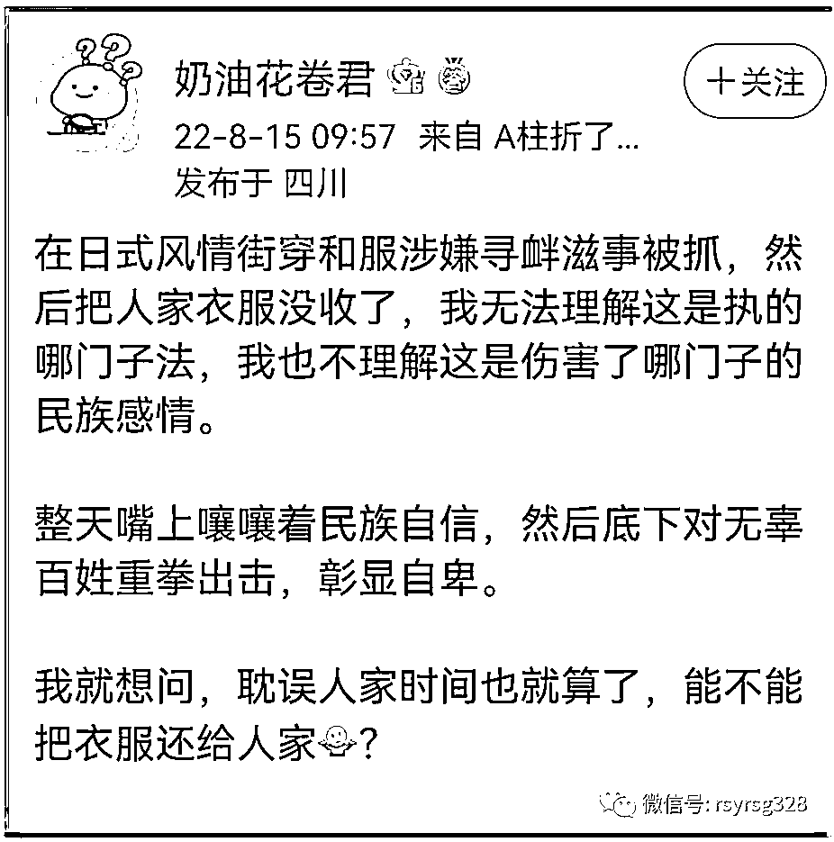

这是网友曝出的现场抓人细节，网友说当时警员又是咆哮又是撕衣的。

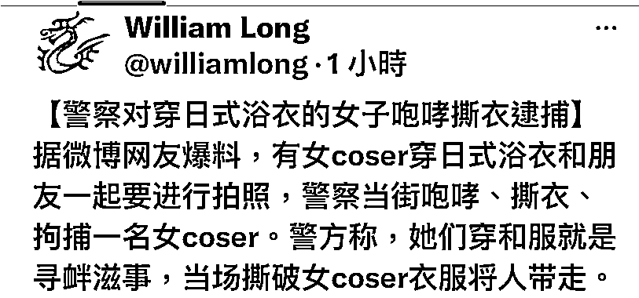

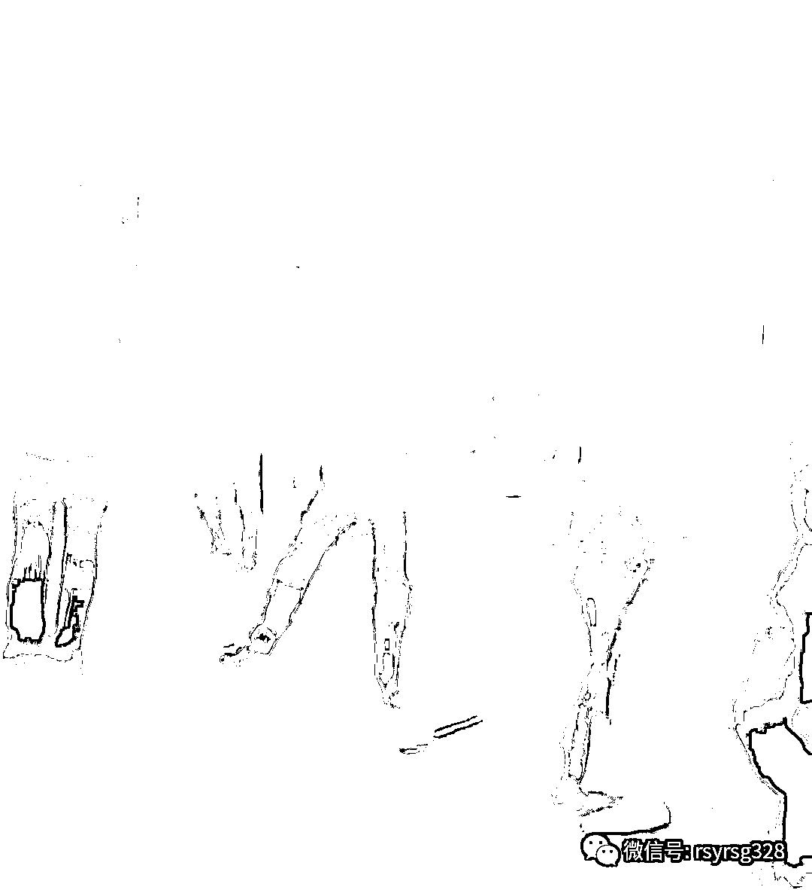

当事女生的闺蜜则就这事写出了日记，说是原本去拍浴衣 COS 的，

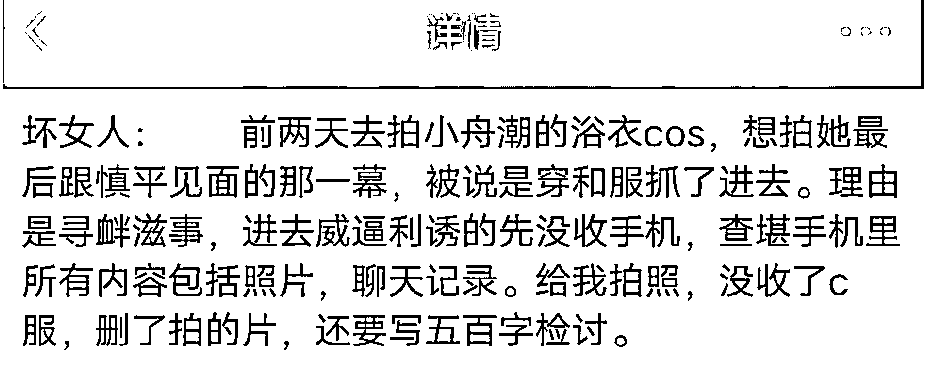

这个网友于是提出了一系列的疑问。

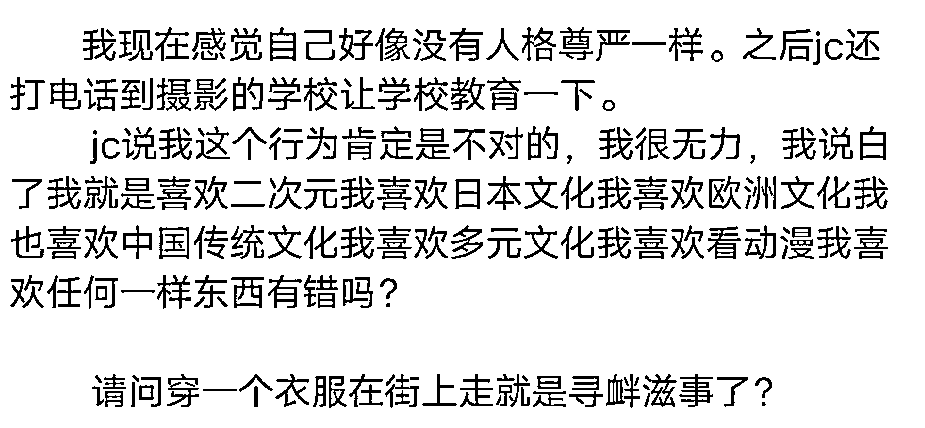

最后这个网友用一句诗结束了整篇文章。 

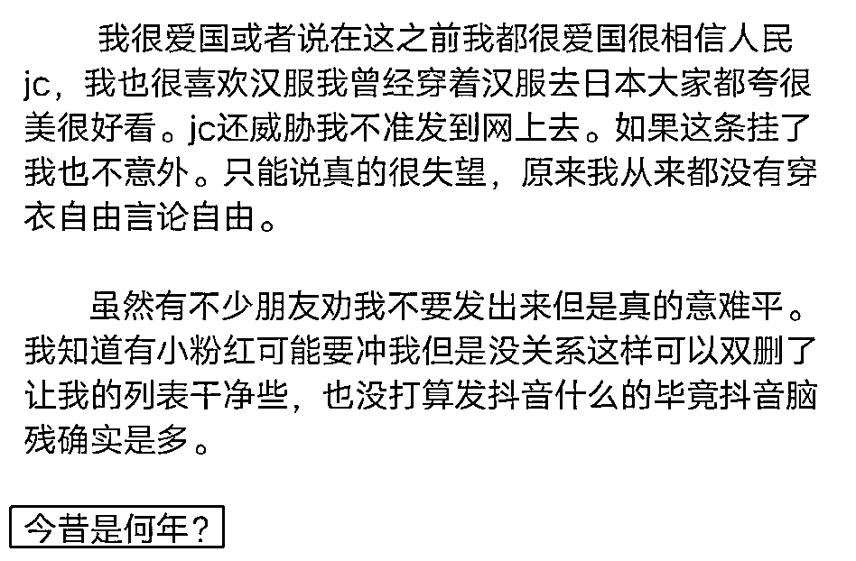

看了这个日志后，不少网友表示一头雾水，不知道小舟潮的浴衣 COS 是怎么一回事，于是有网友在热心科普了。

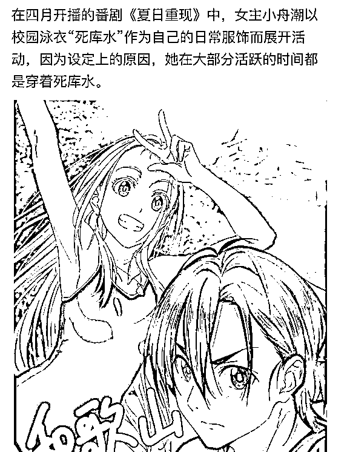

有网友进一步科普，所谓的死库水大概是这样的画风。

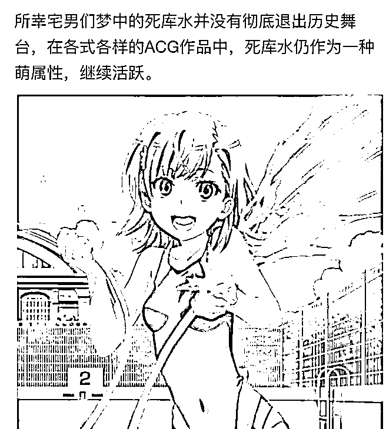

还有网友则不走寻常路，他们在京东上找到了大量卖 COS 浴衣的地方，比如这家。 

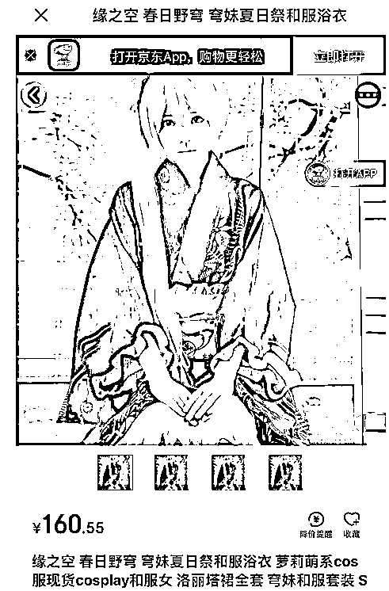

这些浴衣服装都是用来 COS 的。

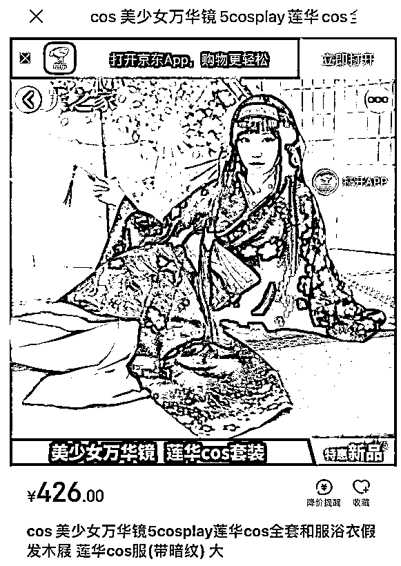

这样一来，网友们就看出问题了，如果说浴衣 COS 是违法寻滋的，那么为什么这些浴衣还在京东上卖呢？ 

和服不能穿，中国古代的衣服也不能穿。 

之前媒体曾报道，去年 9 月 18 日，江苏苏州，多名年轻男女身穿明朝服饰，在日式风情的淮海街拍视频遭阻拦。此前曾有大量游客穿和服到此拍照打卡。视频中，工作人员称，拍视频会影响附近的居民。21 日，高新区管委会工作人员表示，当时有七八人拍照，围观者较多影响交通。管理人员为了交通安全，将他们劝离。衣着合规不会拦阻，有关部门正在了解情况，届时会有处理。

对此，有网友不理解：穿个服饰影响居民？那里的居民是日本人吗？

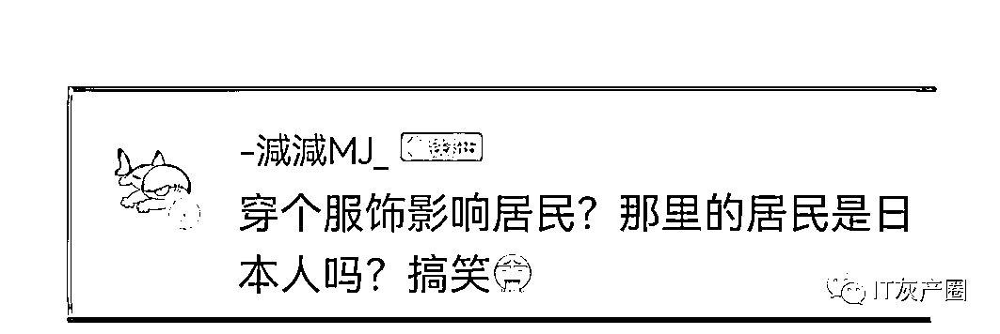

也有网友质疑：中国人在自己国家领土上穿汉服不合规？那请问在你们苏州日租界什么才是合规的服饰？和服吗？

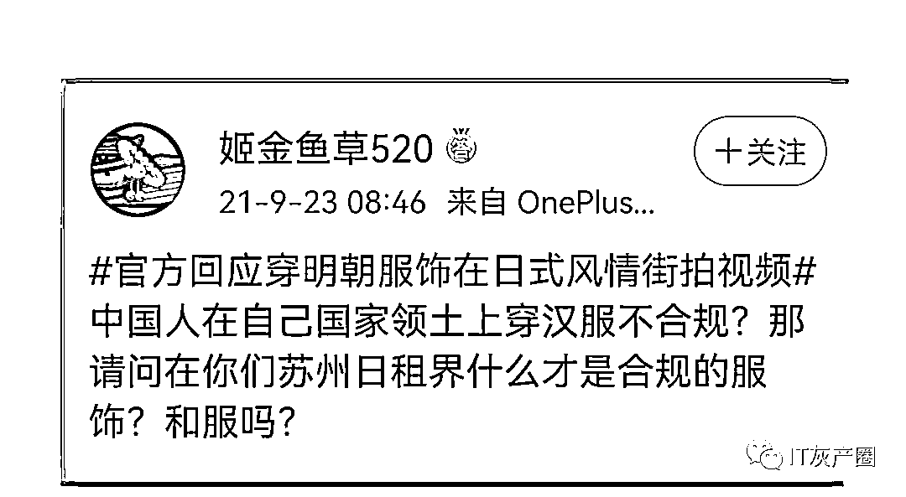

截止目前为止，还没有任何一个法条说，在大街上穿明朝衣服和 COS 浴衣是违反法规法令的，那么这样的执法便于法无据了，是不是该向网友们作出一个令人信服的公开说明呢。

否则，网友们是很难心服口服的，只会觉得属于自己的自由空间越来越小，很多爱好也被限制，直至消失不见。

我想，这应该不是大多数人想看到的未来样子。

来源：法眼法语（ID:rsyrsg328)综合自有晖即写  作者：小晖、新浪微博、宾曰语云

<mp-common-profile class="js_uneditable custom_select_card mp_profile_iframe" data-pluginname="mpprofile" data-id="Mzg5ODAwNzA5Ng==" data-headimg="http://mmbiz.qpic.cn/mmbiz_png/etCUIjLXeVfJummveNSv8kxdRcFibhbcgKPAntvgzcz72zYFmSccibcXbbrvQsFqetponqnx87xGIGe3duUOerpg/0?wx_fmt=png" data-nickname="灰产圈社群" data-alias="huichanquanshequn" data-signature="「灰产圈高端社群」官方服务号，创始人灰产哥，始创于 2017，致力于做最接地气的互联网高端创业社群。" data-from="2" data-is_biz_ban="0">     </mp-common-profile>