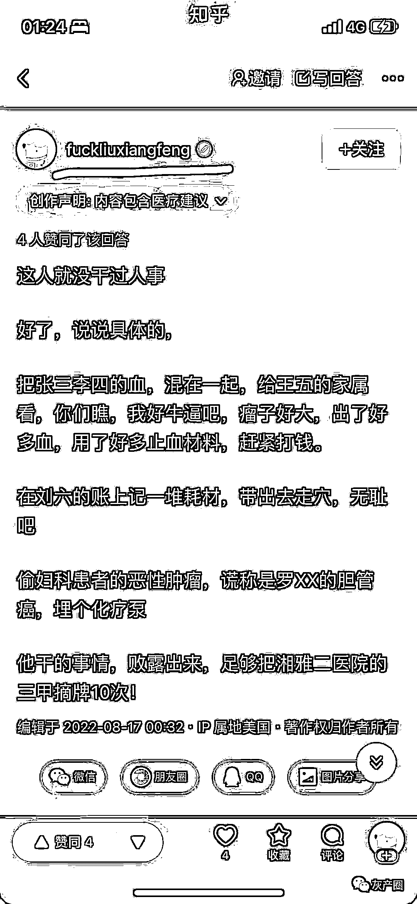

# "没想到一个医生能黑心到这种地步"，湘雅医院回应

> 原文：[`mp.weixin.qq.com/s?__biz=MzIyMDYwMTk0Mw==&mid=2247542315&idx=1&sn=31cc1c136ad642deaaf47a6d28773ffc&chksm=97cbed13a0bc64056897395c1dc9a2ed21bb022e773d9a7ab121443b9f4dc4a6ccbd23a06782&scene=27#wechat_redirect`](http://mp.weixin.qq.com/s?__biz=MzIyMDYwMTk0Mw==&mid=2247542315&idx=1&sn=31cc1c136ad642deaaf47a6d28773ffc&chksm=97cbed13a0bc64056897395c1dc9a2ed21bb022e773d9a7ab121443b9f4dc4a6ccbd23a06782&scene=27#wechat_redirect)

@中南大学湘雅二医院官方微博 8 月 18 日发布《关于网传我院刘翔峰有关问题的情况说明》。近期，网络上出现反映我院刘翔峰相关问题的信息。医院对此高度重视，迅速成立调查组，并于 8 月 16 日停止刘翔峰工作以配合调查。初步调查发现，刘翔峰在医疗过程中存在不规范行为。经医院研究，**决定免去刘翔峰湖南省创伤急救中心副主任职务，停止其处方权及手术权限。**医院将对刘翔峰有关问题线索展开进一步调查，根据调查结果做出相应处理，并及时向社会公布。

医院对违规违纪行为零容忍，将在全院范围内开展医德医风专项教育，持续规范医疗行为，为人民群众提供安全有效的医疗服务。

医院对存在的问题深表歉意，感谢社会各界监督。

此前，有网友爆料称，湘雅二医院存在严重的医疗作风问题。比如，找他看病，只要稍微有点异物倾向，不管是不是肿瘤，一律按肿瘤处理，先做化疗。再比如，机器人做不完全性肠梗阻，开进去找不到梗阻段，就把正常肠管切下来给家属看。

据东方网·纵相视频此前报道，昨天（8 月 17 日），网友反映中南大学湘雅二医院一医生医疗作风有问题，引起广泛关注。今天，东方网·纵相视频致电湘雅二院医疗作风建设办公室了解到，该医生已停职，正在接受调查。湖南省卫生健康委员会信访办工作人员表示，相关部门已对该名医生进行调查，调查结果“到时候会有一个交代”。

[`v.qq.com/iframe/preview.html?width=500&height=375&auto=0&vid=o3352xzqatj`](https://v.qq.com/iframe/preview.html?width=500&height=375&auto=0&vid=o3352xzqatj)

网友爆料截图

[`v.qq.com/iframe/preview.html?width=500&height=375&auto=0&vid=n3244idj3qq`](https://v.qq.com/iframe/preview.html?width=500&height=375&auto=0&vid=n3244idj3qq)

来源：观察者网

   

