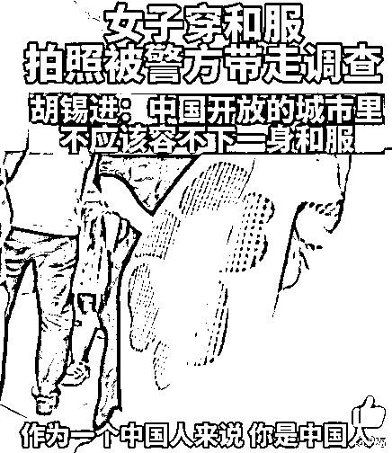

# “苏州女孩穿和服被拘”传到日本，日本人竟如此评论…

> 原文：[`mp.weixin.qq.com/s?__biz=MzIyMDYwMTk0Mw==&mid=2247542315&idx=2&sn=f0fd3f31a04413602ed2c70999fa303e&chksm=97cbed13a0bc64054c66e757a3a54c0b75a9b12e62d7c9e6330fd376f64f14afe2ced2e86226&scene=27#wechat_redirect`](http://mp.weixin.qq.com/s?__biz=MzIyMDYwMTk0Mw==&mid=2247542315&idx=2&sn=f0fd3f31a04413602ed2c70999fa303e&chksm=97cbed13a0bc64054c66e757a3a54c0b75a9b12e62d7c9e6330fd376f64f14afe2ced2e86226&scene=27#wechat_redirect)

这两天，因为“和服”一事，网友们又吵翻天了。

8 月 10 日，一位女 coser 身穿和服走在苏州淮海街上，**被警察以寻衅滋事为由带走。**

**视频：**[**在中国穿和服是“寻衅滋事”吗？（视频）**](http://mp.weixin.qq.com/s?__biz=MzIyMDYwMTk0Mw==&mid=2247542213&idx=7&sn=d24415d26cf4bc4d4840f47eeba61d48&chksm=97cbeefda0bc67eb7d239302976c5d7ea3ec463a2f80c5f8850af11449d7c5d5a460a936ca8e&scene=21#wechat_redirect)

后来该女孩在警局被“盘查”了 5 个小时，写下书面检查并被没收和服后，凌晨 1 点才被放回…

以往全国各地因为穿和服遭受争议，甚至被要求换衣服、起争执并不少。

但这还是网上第一次，**真的有人被警方“按上罪名”带走…**

而且女孩拍照的地方是苏州淮海街是日式风情街，这是苏州在日资企业集中的区域刻意打造的日本商业街。

整条街道遍布日本料理店，日本元素丰富，是苏州这座包容的城市**“中日友好”的象征。**

但在视频中，女孩却在人群的围观下，被警察推搡着粗暴带走。

这件事瞬间在网络上引发热议，有网友支持当事警察，说**“女孩穿和服伤害了民族感情。”**

****

**也有人觉得这太过分了：**“怎么穿个和服也犯罪了？”****

****

****“以后西服也别穿了吧！”****

********

****“警察明显是在滥用职权！”****

****

******目前，**这件事已经传到了日本，被共同社报道后引发广泛关注****

****

****不少网友对此发表评论：****

**“日本和服源于中国，禁穿和服不就是在否定本国历史吗？”**

**“既然和服被禁了，那日本动漫，日料也禁了吧”**

**“穿西服的也应该被抓起来，中国人都穿着汉服生活吧!”**

**……**

****

****“ ****据说日本的和服就源于中国古代的吴服吧？****

****这不就是在抵制日本的同时，否定了本国历史吗****

****如果因为不能原谅日本而禁止穿和服的话，那么漫画和日本料理是不是也要禁呢？****

****或者，那些从日本又重新传回中国的汉字也应该被禁，这能办到吗？****”****

****

****“浴衣不可以穿的话，日料也应该被禁吧？”****

****

****“****穿西服可以，浴衣就不行?****

****真是可悲。****”****

****

****“额……本来‘浴衣’就像它的名字一样，是日本人洗澡时穿的衣服，也就是内衣。****

****槽点真多。”****

****

****“这不就相当于日本抵制西服的那个时代吗？****

****都什么年代了（笑）”****

****

****“可怕，那穿西服也应该被抓吧。**** 

****所有中国人都穿着汉服生活吧!”****

****

****“既然（在中国）穿浴衣会被逮捕，那么（在日本）穿着旗袍的妈妈桑们也有寻衅滋事嫌疑吧。我觉得（穿衣服）不过是一种时尚 。”****

****

****“如果报道说在唐人街有穿着旗袍的日本人被抓走，中国人会怎么想呢?”****

****

****“因为穿着浴衣而被扣上了违反公共秩序的帽子，和全裸同等对待？？这是一个什么样国家!”****

****

****“明明只是日本风情街，穿着和服 cosplay 而已。这样的话（中国）的日本风情街也取缔好了!”****

****

****就因为穿浴衣而被歧视。那么日本人去中国旅行、留学、移居也会被排挤吧。****

****（在中国）只要带有日本文化的东西都会被抵制。”****

**确实，**和服的根是源于中国。****

**根据历史记载，在日本奈良时代，正值中国盛唐时期即公元 8 世纪，中国对日本经济和文化生活的影响最为重大，日本派出大批学者、僧侣到中国学习，这些遣唐使者把唐代文化艺术、律令制度都带回日本。**

****

**同时，中国古代吴越地区的宽袖、叠襟式长衫流传到了日本，成为上流社会正式场合的礼服，特别是朝廷的正规制服。**

**在此后的历史变迁中，虽然和服不断改良，但是，万变不离其宗，**和服的基本要素始终没有脱离吴服的定格。****

****

**因为这个原由，日本人也称和服为“吴服（ごふく）”或“唐衣”，和服乃是西方人对吴服的称谓。**

**虽然现代日本人也接受了这个和服这个称谓，但很多卖和服的商店，至今仍然还是写着**“吴服”**。**

****

**所以，“和服”虽然被视为日本的文化符号，但却起源于中国，**它所彰显的，是中国文化对日本的辐射和影响。 ****

****怎么看待：动漫、吃日料呢？****

**早在 2018 年，共青团中央就曾发文指出，看日漫、吃日料、喜欢优秀的日本文化等行为，完全不是“精日”，这是个人的合法权利，是完全正常的现象。**

****

**“精日”，带有明显狂热的二战日本军国主义的特征，将自己对别国的兴趣建立在对自身国家和民族的亵渎和侮辱上，这已然远远超出“兴趣”“爱好”的范畴。**

**欣赏国外的优秀文化不妨碍我们去热爱自己的国家。**

****

****试想：****

****如果有人在日本、在美国因穿汉服被当地警方带走，国人听闻后会有怎样的反应？****

**来源：和美之音**

**   **

****