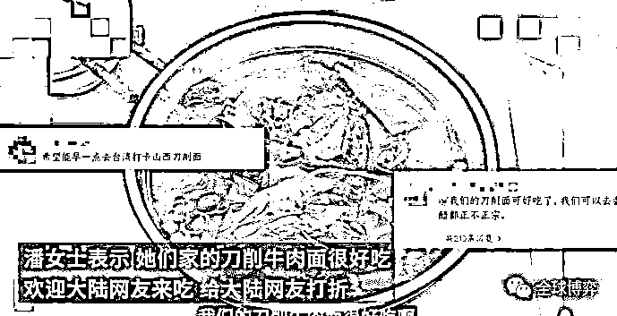

# 重大历史时刻！正式更名为台湾省！

> 原文：[`mp.weixin.qq.com/s?__biz=MzIyMDYwMTk0Mw==&mid=2247542315&idx=3&sn=20893fcdf3295ae15c3750c9780a2b7f&chksm=97cbed13a0bc640523a37ddeced5c103b0a43528fdf361d6c8028f61d3b28a0d161bbc7d4bf5&scene=27#wechat_redirect`](http://mp.weixin.qq.com/s?__biz=MzIyMDYwMTk0Mw==&mid=2247542315&idx=3&sn=20893fcdf3295ae15c3750c9780a2b7f&chksm=97cbed13a0bc640523a37ddeced5c103b0a43528fdf361d6c8028f61d3b28a0d161bbc7d4bf5&scene=27#wechat_redirect)

**中华台北更名为台湾省！**地图都已更新。 

**只有一个中国！重大历史时刻！中华台北正式更名为台湾省！地图已更新！包括苹果地图！**

百度地图

不只是更名，原地图上的中海线也已经全部取消，现在只有外海线！

高德地图

苹果自带地图

台湾在百度百科上的标注：台湾（Taiwan），简称“台”，是中华人民共和国省级行政区，省会台北，位于中国大陆东南海域，东临太平洋，西隔台湾海峡与福建省相望，南界巴士海峡与菲律宾群岛相对。

早前在 8 月 7 日，外交部发言人华春莹在“推特”上发帖：

**“百度地图上显示在台北有 38 家山东饺子馆和 67 家山西面馆，味觉不会骗人。台湾是中国的一部分，失散多年的孩子终会回家！”**

而最近，还有网友在台湾省地图上搜索到了山西刀削面，导致该店备受网友关注而火上热搜，很多网友都表示想去尝一尝。

据刀削面老板称，自己的祖籍是山东的，师傅是山西的，并且称大陆网友来吃，还可以打折。

此外网友在台湾省地图上搜索“山东水饺”，单在台北就搜到了 30 多家山东水饺店！

网友评论：这大概就是乡愁的味道吧～

同时，也有不少网友留言台湾地图上还有很多很多的山东美食，可不只有水饺哦。

通过搜索台湾省地图发现，除了山东饺子馆外，还有山东韭菜盒子、山东鸡蛋灌饼、山东烧鸡、山东馒头、山东桃酥、山东杠子头、山东葱油饼、山东牛肉面、山东鲜汤包、山东麻油等等以山东命名的餐饮店铺。

网友：**台湾和大陆口味一致，是乡愁的味道没错了！**

其实不止山东、山西美食，台湾省地图里四川麻辣火锅、柳州螺蛳粉、沙县小吃等等，来自全国各地的美食都有。

川菜

广东粥

此外还有北京烤鸭、兰州拉面、桂林米粉、东北酸菜锅、石龙叉烧包、惠州东坡菜、顺德大盘鸡等等。

味觉不会欺骗我们，**我们都有一个“中国胃”！**

**你有在台湾省发现自己家乡的美食吗？欢迎来评论区讨论~**

虽然有网友称，目前只有国内 IP 的地图已将台湾省更名，但是很明显，**这已经是在历史上迈出了重大一步。**

**相信在不久的将来，我们都可以凭身份证去台湾省旅游。**

来源：全球博弈

   

