# 医疗崩溃！日本 14 家医院发鲜红色警告：能救的也救不了…

> 原文：[`mp.weixin.qq.com/s?__biz=MzIyMDYwMTk0Mw==&mid=2247542315&idx=5&sn=b985b9070fa22d47508e2d6480b917cc&chksm=97cbed13a0bc6405888a4ac7c7271a6b4f95aee1aa01a5afa0ac3c97a44d133b221884c353e7&scene=27#wechat_redirect`](http://mp.weixin.qq.com/s?__biz=MzIyMDYwMTk0Mw==&mid=2247542315&idx=5&sn=b985b9070fa22d47508e2d6480b917cc&chksm=97cbed13a0bc6405888a4ac7c7271a6b4f95aee1aa01a5afa0ac3c97a44d133b221884c353e7&scene=27#wechat_redirect)

日本近日第七波新冠疫情大爆发，新增病例多次登顶全球最多，形势已经危急到火烧眉毛的程度。

综合《赫芬顿邮报》日文版、日本广播协会（NHK）等媒体 16 日报道，日本京都府内 14 家接收新冠重症患者的医疗机构，日前在各自官网主页联名发布了背景色为“鲜红色”的共同声明，**警告此轮疫情已达“灾难级别”，医疗体制正陷入崩溃。**报道称，四张红色声明并排形成了强烈的视觉冲击，危机感扑面而来。

声明强调，现在已经没有一家医院可以立刻接收病人，呼吁民众务必做好个人防护并及时接种全程疫苗，切勿将新冠肺炎单纯视作感冒。 

文中痛心疾首道：“如今即便是事故受伤、脑中风乃至心脏病等患者都很难入院，我们救不了本来能救下的生命。”

“‘灾难级’感染扩大导致医疗崩溃。京都 14 个医疗机构发鲜红色声明‘能救的命救不了’”

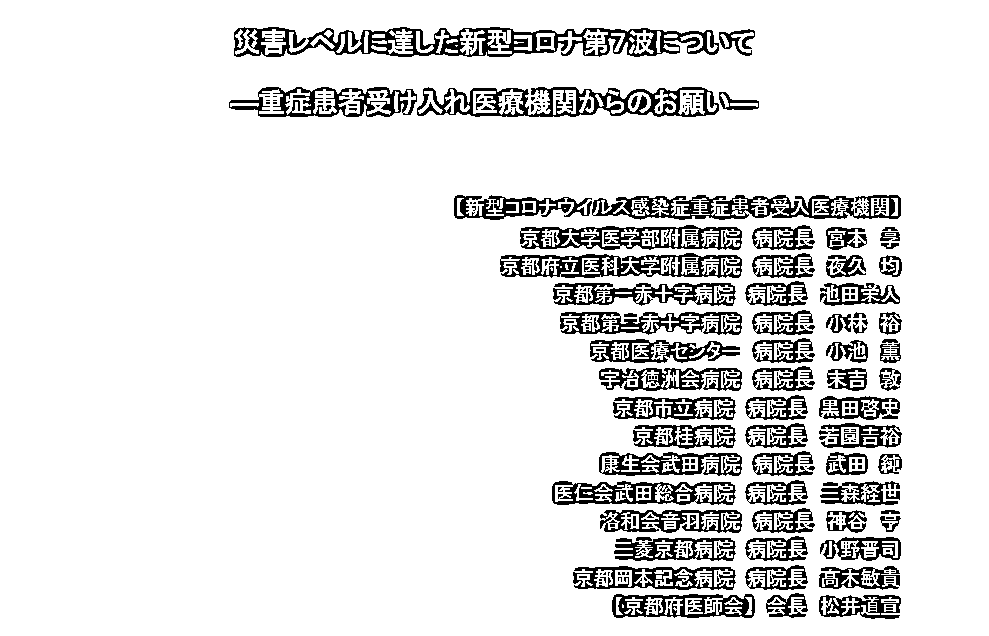

联名声明节选

据《赫芬顿邮报》日文版报道，15 日，京都大学医学部附属医院等 14 家京都府内接收新冠重症患者的医疗机构，在各自的官网首页显眼处发表联合声明，警告第七波新冠疫情蔓延已达“灾害级别”，医疗系统正在陷入崩溃。

报道称，这份声明共 4 页，背景全部为鲜红色，用极强的视觉冲击力以展示强烈的危机感。

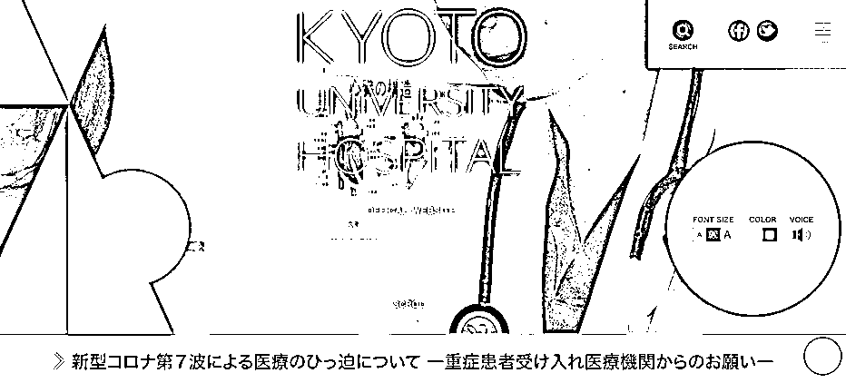

京都大学医学部附属医院官网首页

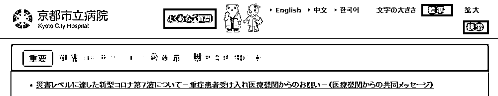

京都市立医院官网首页

这些医疗机构表示，今年夏天是日本新冠疫情发生三年来第一个“不受出行限制”的夏天，当下旅游和各项活动都已恢复如常，城市里到处都人满为患。表面上看，人们的日常生活似乎正在恢复，但实际上背后的病毒传播已经到了“灾难程度”。

声明称，京都府内为新冠患者准备的病床实际已达饱和状态，现下没有一家医院能立即接收病人，整个急救医疗系统已经到了崩溃时刻。而只要未来新冠感染者的数量不减少，这种情况还将进一步恶化，“如今即便是事故受伤、脑中风乃至心脏病等患者都很难入院，本来可以挽救的生命也变得无法挽救。”

声明还称，日本政府“不设行动限制”不代表没有感染的风险，人群聚集的地方依旧有很高的感染风险。文中着重写道，新冠肺炎绝不是“单纯的感冒”，尤其是如今全球主要流行的新冠 BA.5 变异株的感染能力非常强，即便是轻症患者也可能出现高烧等令人痛苦的症状，而且还可能引发多种后遗症，这些情况在年轻人身上尤为频发。

声明最后呼吁日本民众避免不必要不紧急的外出，务必在交谈中正确配戴医用口罩，即便是在冷气房里也要注意适当通风换气。此外，文中特地强调为防止重症化和感染扩散，要求民众尤其是年轻人及时接种第三针疫苗。

17 日，相关报道在日本推特上成为热搜话题，评论区中不少日本网友表示声明中说的都是实情，用惨痛的亲身经历呼吁人们务必重视个人防护保护自己，**“（感染后）身体的疲惫一直无法消除，还有味觉障碍，明明打了 3 次疫苗，真的不是普通的感冒。”**

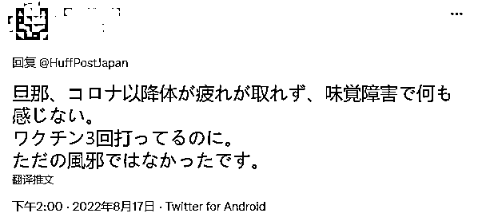

“不被感染是我们个人能做的最好的措施。”

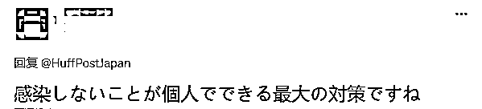

还有诸多日本网友则在评论区怒斥批评日本政府的防疫态度，“逼得医院都这么说了，政府太不负责了！”、“这难道不是优先经济而搁置防疫的后果吗？”

“对于医疗机构发出的‘鲜红色声明’，厚生劳动省及其专家、政府将如何回应呢？能否承认当下政策实施的不顺，带着务实的想法成立新的专家组织，随机应变呢？从第一线医疗机构的声明中可以清楚看出，目前的各项措施已经失效了，继续推行下去是在犯罪。”

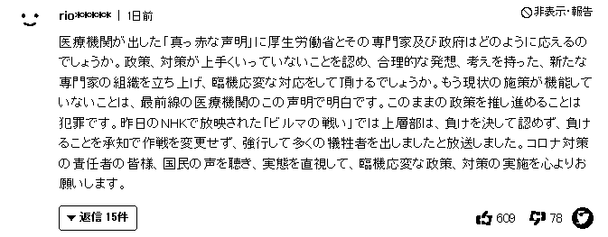

更令一些日本网友愤怒的是，就在国内疫情失控的当下，日本首相岸田文雄却在度假打高尔夫球，“现在是打高尔夫的时候吗？”

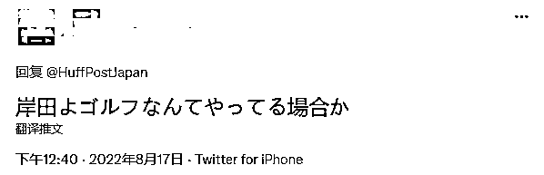

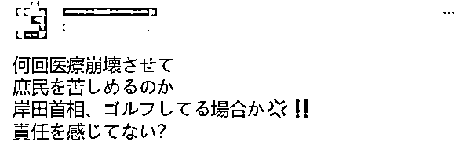

据日本广播协会（NHK）报道，截至当地时间 17 日 18 时 30 分，日本新增新冠肺炎确诊病例 231499 例，新增死亡病例 286 例。截至目前，日本累计确诊新冠肺炎病例 16209461 例，累计死亡 36002 例。

世界卫生组织 11 日数据显示，日本单周（8 月 1 日至 7 日）新增确诊病例连续三周全球最多。同一周的全球感染人数为 698 万人，日本占到 21%。

据时事通信社 16 日报道，在目前的第七波新冠疫情期间，日本新冠死亡病例激增。报道称，随着奥密克戎 BA.5 变异株持续肆虐，日本最近单日新增死亡病例几乎每天都在 200 例以上，接近第六波疫情年初席卷日本时的水平。

国立感染症研究所的胁田隆字所长分析，死亡人数的增加，直接原因主要是病床使用率上升，以及医疗从业人员感染后住院楼封闭，导致感染者不能及时得到医疗救护。

昭和大学医学部的二木芳人客座教授更直言：“政府把经济活动放在第一位，实际上是放任感染扩大”、“医疗崩溃导致死亡人数增加，近 1 至 2 周死者持续增加的可能性很高。”

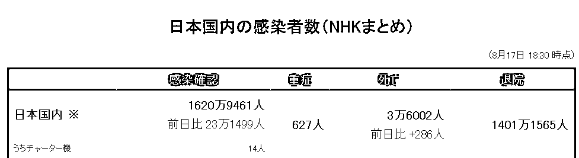

另据《每日新闻》报道，日本厚生劳动省 15 日发布消息称，截止至 8 月 10 日，日本全国现有居家疗养新冠患者 154 万 4096 人，已连续 4 周刷新历史最高纪录。负责自家疗养健康观察的保健所业务变得更加紧迫，这也导致不断出现居家死亡的不幸案例。

从各都道府县情况来看，东京都现有居家疗养新冠患者最多，已达到 17 万 8700 人，其次是大阪府有 14 万 7373 人，爱知县有 10 万 9746 人。另外，还没有确定疗养地点、正处于“协调中”的新冠患者有 33 万 750 人，其中需要住院治疗但仍未确定接收住院的有 2269 人。

随着疫情迅速蔓延，日本医疗系统负担暴增，很多患者无法及时送医。东京消防厅 10 日表示，有新冠感染者等待约 36 小时才被救护车送医。

据日本总务省最新公布的数据，在 8 月 8 日至 14 日的一周里，全国的“救急搬送困难”事件（即连续被 3 家医院拒绝接收，或救护车接到病人后 30 分钟内未送到医院进行治疗）一共达到 6747 件，这一数字是新冠疫情前同期的 6 倍，并已经连续 3 周打破历史最高纪录。

日本广播协会（NHK）报道还提到，“救急搬送困难”事件中，因疑似感染新冠被拒绝的有 2836 件。

文中举例称，一名感染后居家休养的高龄女性，因摔倒导致腰部骨折被救护车送往医院，但她遭到了 20 多家医疗机构的入院拒绝，费了好大劲才终于得以住进了离家 40 公里远的医院。

最近在兵库县尼崎市更有一名男子车祸送医，途中其新冠抗原测试呈阳性，医院拒绝收治。救护人员最后以该男子“情况稳定伤势不重”为由，在征得对方同意后，将其送回了事故现场。

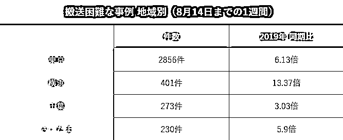

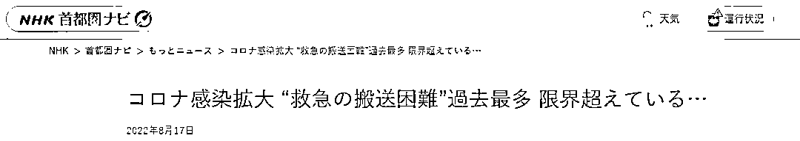

NHK：“新冠感染扩大‘救急搬运困难’超过历史最高限度……”

雪上加霜的是，多地病床紧张等情况还在持续发生，全国范围的病床使用率都呈持续上升趋势。

截止至 8 月 10 日，有 38 个都府县的新冠病床使用率超过 50%。其中，神奈川县的病床使用率更高达 98%，爱知县为 83%、静冈县为 79%、大阪为 69.4%、东京都为 59.9%。

据 NHK 最新报道，为应对暴增的感染情况，17 日日本厚生劳动省召开了专家会议，决定解禁网络销售新型冠状病毒抗原检测试剂盒，预计最快于本月内开始销售。

来源：观察者网

   

