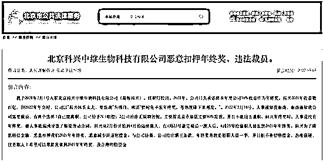

# 科兴大裁员？疫苗之王，“变脸”了

> 原文：[`mp.weixin.qq.com/s?__biz=MzIyMDYwMTk0Mw==&mid=2247542363&idx=3&sn=d9ddb3f63fa6cc57f2472d7927e7d266&chksm=97cbed63a0bc6475ee452e16f6d6b992d911f0af7bcb20afb05dffc8444dd7c5152a1c3125e0&scene=27#wechat_redirect`](http://mp.weixin.qq.com/s?__biz=MzIyMDYwMTk0Mw==&mid=2247542363&idx=3&sn=d9ddb3f63fa6cc57f2472d7927e7d266&chksm=97cbed63a0bc6475ee452e16f6d6b992d911f0af7bcb20afb05dffc8444dd7c5152a1c3125e0&scene=27#wechat_redirect)

大赚一把，之后呢？

****“********印钞机********”天花板****

疫情以来，至少诞生了三个暴富神话——

****口罩，疫苗，核酸检测。****

我曾看到，作为制作口罩核心原料的熔喷布，在短短 3 个月内价格暴涨 20 多倍，从疫情前 2 万元/吨涨到 40 多万元/吨，甚至一度突破 50 万元/吨。那时候，来自全国各地的商人，开着货车，提着一袋一袋的现金来到江苏扬中，守在工厂门口，来提货。

我也曾看到，在核酸检测的拉升下，很多企业的利润以一年几倍甚至几十倍增长。最夸张的企业，一个季度赚的钱，是它过去十年总和的 15 倍。

但我们似乎很少看到，疫苗行业的暴利场景。根据国家卫健委发布的数据，早在 2022 年 5 月初，国内接种的新冠病毒疫苗已经超过 33.5 亿剂次。另外，据牛津大学 Our World in Data 统计，截至 5 月 6 日，全球累计报告接种新冠病毒疫苗已经超过 116.45 亿剂次。

可以想象，这些数字背后，是一个庞大的市场。****那么，这个行业到底赚了多少钱？****

这个问题，我们可以从代表性企业的财报中寻找答案。从国内来看，我们接种的新冠疫苗主要有五个品牌：

国药中生北京公司的新冠灭活疫苗、北京科兴中维新冠病毒灭活疫苗、国药中生武汉所新冠灭活疫苗、智飞生物重组新冠疫苗（CHO 细胞）、天津康希诺腺病毒载体疫苗。

就拿科兴生物来说，根据财务报告，2021 年——

****它实现了****194 亿美元（1280 亿元）的营收，增长了 37 倍；实现了 145 亿美元（956 亿元）净利润，增长了 78 倍。****

这是什么概念？一年赚 956 亿元，平均每天赚 2.6 亿元。这个赚钱能力，已经超过了同期的中石油和中石化，是招商银行的 2.5 倍——

****国内房地产行业前十名，加起来的利润都没它高。****

更夸张的是，这样算下来，科兴生物去年的净利率（净利润/营收）达到 75%。要知道，目前全球市值最高的企业苹果，去年的净利率不到 30%，哪怕是“A 股之王”贵州茅台，净利率也只有 50%左右。

换句话说，****科兴生物的净利率，是茅台的****1.5 倍，是苹果的近 3 倍。****

一年一度的《财富》中国 500 强榜单上，科兴生物更是以接近 92%的数据拿下净资产收益率（ROE）的冠军。

这个暴利程度，着实吓人。让科兴生物暴富的，正是新冠疫苗。它是 WHO 认证的第七款疫苗，供给全球 70 余个国家使用。

要知道，2015 年—2019 年，科兴生物的净利润加起来才 1.36 亿美元。也就是说——

****科兴生物****2021 年一年的净利润，是这五年利润总和的 106 倍。****

看来，这年头疫苗才是真正的印钞机天花板。

****赚钱以后，开始裁员？****

暴利背后，很多问题开始慢慢显露。

今年 5 月，根据中新经纬等媒体的报道，科兴旗下北京科兴中维公司被指“恶意扣押年终奖，违法裁员”。

在北京市公共法律服务网站上，有疑似科兴员工的网友留言——

*自己于 2021 年 2 月 1 号入职科兴，任职灯检岗。2021 年，公司口头承诺将本年度公司 10%收益作为年终奖。科兴 2021 年收益数百亿，但 2022 年年会时，公司以“科兴风头太大，要低调”为借口，承诺“暂时先不发年终奖，等热度降下来再发”。*

结果，到了 2022 年 2 月 18 日，人事通知其公司需要裁员，有两个选择——

*一是自己提离职，公司给予 N+1 赔偿；二是无限期放假，工资按北京市最低工资 80%发放，并且不能出去兼职。*

一石激起千层浪。这个消息引来更多网友的吐槽。有自称是科兴中维员工的网友称——

*从 2022 年 2 月份到 4 月份，科兴中维已经裁掉了 70%的员工。*

▲图源网络

这不禁让人疑惑，年赚近千亿的疫苗巨头，至于如此抠门？

更早些时候，一则“北京科兴进军房地产”的消息在网上流传，天眼查资料显示，一家名为益道置业的公司成立于 2021 年 10 月 13 日，注册资本为 7.7 亿元，法定代表人为尹卫东，经营范围包括房地产开发经营等。而尹卫东，正是科兴生物董事长。

舆论汹涌而至，搞得北京科兴连忙发布公告，宣布注销房地产公司，并表示科兴现在没有，将来也不会进入房地产行业，坚定聚焦生物医药领域。

大裁员、疑似进军房地产都让科兴面临不小的质疑，但在我看来，****科兴真正的担忧，或许来自靓丽业绩的不可持续。****

疫情进入第三个年头，绝大多数人都已经打了疫苗。牛津大学 Our World in Data 统计显示，截至今年 8 月 11 日，全球累计报告接种新冠病毒疫苗已经达到 124.4 亿剂次，接种率 67.4%。

在中国，根据国家卫健委的数据，截至今年 8 月 14 日，我国累计报告接种新冠病毒疫苗约 34.2 亿剂次，****累计报告新冠疫苗第一剂次接种覆盖率为****92.1%，全程接种率为 89.7%，加强免疫接种率为 71.7%。****

有国际机构预测，到 2023 年以后，疫苗的需求就可能会出现大幅下降。趋势已经显现，疫苗巨头 BioNTech，第二季度营收环比下降了近 50%。

同样，根据海关统计数据，****2022 年前 6 个月，中国人用疫苗的出口总额只有 51.8 亿元人民币，跌幅高达 95%。****

加上越来越多竞争对手的入局，科兴生物恐怕很难再有年赚近千亿的传奇。

****研发********投入不到****1%****

疫情以来，有一个疑问长久盘旋在国人脑海——

****疫苗接种费用，谁在承担？****

因为自新冠疫苗接种以来，我国一直实施新冠疫苗全民免费的接种策略。正如我们刚才说的，截至 8 月 14 日，我国累计报告接种新冠病毒疫苗已经达到 34.2 亿剂次，这笔费用可不是小数目。

我查了一下，这个问题，国家医保局给出过答案。根据医保局的数据，时至今日我国的疫苗费用已经超过 1200 亿元——

****由医保基金和财政共同分担。****

表面上看我们没有花钱，****但医保和财政的钱，归根结底还是来自纳税人和每一个民众。****

从科兴生物的财报来看，它家新冠疫苗的销售分布里，疫苗出口的销售收入在 2021 年占到总收入的 43.74%，在 2020 年这一比重仅为 28.43%。

换句话说，科兴生物的新冠疫苗收入，大头还是来自国内。

****那么，赚了数百亿的科兴生物，做了啥？****

根据钛媒体的梳理，截至 2021 年底，北京科兴账上有 116 亿美元现金。在支出方面，科兴生物 2021 年的销售、一般和行政费用为 5.91 亿美元。而研发费用只有——

****1.55 亿美元********，占营收比例不足****1%。****

而且，这些研发费用还是花在 Sabin 株脊髓灰质炎灭活疫苗和新冠疫苗上的总和。

这个研发投入什么概念呢？从国内来看，同样是 2021 年，几大疫苗企业的研发投入占营收比例是——

****康希诺****21.05%，康泰生物 20.22%********，********沃森生物****21.77%********。****

哪怕是智飞生物都有 2.66%，但要知道，智飞生物主要的营收来自代理，其代理的默沙东 4/9 价 HPV 疫苗，贡献了全部产品货值的 80%。

再看国外，这个差距就更明显了——

按照罗氏制药的研发投入（161 亿美元，占比 23%）来看，科兴生物——

****研发费用是人家的****1/103，研发投入占比是人家的 1/23。****

作为一家医药科技企业，一年赚了上千亿，拿着国家和人民的信任票，科兴生物似乎并没有想要发力医药创新的想法？

****要知道，中国的医药行业，在世界上依旧处于弱势地位。****

尽管有着 14 亿人口的超级市场，但如今的全球前十大医药公司，看不到中国企业的身影。如今的全球药品研发格局里，美国遥遥领先，日本、欧盟紧随其后，中国在更后面艰难攀爬。

****医药行业，是非常需要耐心和定力的。****拿疫苗来说，前期研发成本奇高，设备与生产场地的投资巨大，时间漫长，风险不确定。只有进入后期量产阶段，才有可能大幅降低成本。

****但如果不持续投入研发，就会****“一步落后，步步落后”，到最后就被人卡脖子。****

科兴自己，就曾吃过这个亏，2003 年非典、2009 年 H1N1，科兴都是比较早投入研发的，但刚有点成果，疫情都结束了。

如何保证研发的持续性，进而保证收入的持续性，是科兴必须要考虑的问题。目前全球疫苗市场主要被英国葛兰素史克、美国默沙东、美国辉瑞和法国赛诺菲几个巨头占据，但究其根源，背后都是长久的研发积淀和投入。例如辉瑞，成立于 1849 年，已经有 170 多年的历史。

****尾声****

缩小和世界医药巨头的差距，当然不是一蹴而就的事情。

创新研发也不是一件容易的事，美国有 3000 多家制药企业，但有能力做创新药的不足 100 家，其他的 2900 多家都是做仿制药。

但无论是对企业还是医药行业来说，要想真正进入世界第一梯队，都得不断投入，构建属于自己的护城河。这方面，我们做得还不够。

****一个残酷的现实是，国内所有医药企业研发费用之和，可能还不如国外一家医药巨头企业的研发投入。****

新冠疫情终将结束，这些印钞机般的暴利，也终将一去不复返。但短暂的暴富背后，有些东西值得深思。

疫情期间，全球 99%的人群收入减少，1.6 亿人陷入贫困。而在疫苗等领域，这些企业赚取了以往数十倍甚至数百倍的利润。****拿着这些钱，他们想的似乎不是乘胜追击加大研发，进一步走向产业链的上游，而是卸磨杀驴式的裁员，或者瞄向下一个风口。****

疫情带来的宝贵窗口期，就这样被浪费了。如果高科技企业都只是想着“捞一笔就走”，那就太悲哀了。

这种短视下的狂欢，注定了我们还有很多弯路要走。还是那句老话——

****种一棵树，最好的时间是十年前，其次是现在。****

来源：观点 作者：迷人的 X 博士

← 向右滑动与灰产圈互动交流 →

