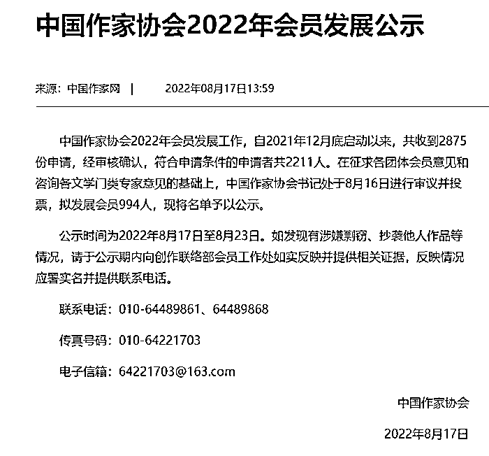
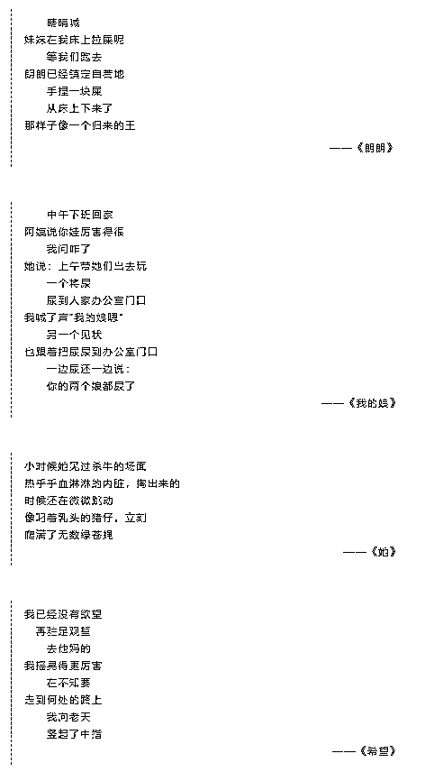
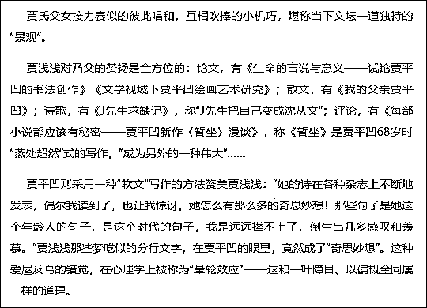
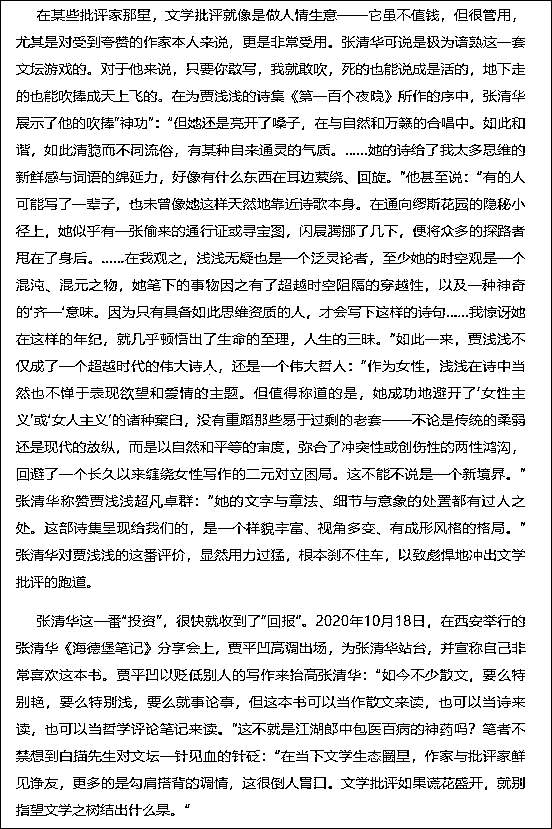
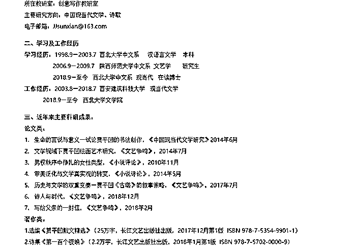

# 贾平凹女儿拟入作协，曾被批"诗坛乱象"

> 原文：[`mp.weixin.qq.com/s?__biz=MzIyMDYwMTk0Mw==&mid=2247542363&idx=5&sn=74ed4107641db47ec83f009dcaf3b546&chksm=97cbed63a0bc6475f63721de55d33bdc187e02158fdbf41043a4adafb63a8d167c9b399fc7ff&scene=27#wechat_redirect`](http://mp.weixin.qq.com/s?__biz=MzIyMDYwMTk0Mw==&mid=2247542363&idx=5&sn=74ed4107641db47ec83f009dcaf3b546&chksm=97cbed63a0bc6475f63721de55d33bdc187e02158fdbf41043a4adafb63a8d167c9b399fc7ff&scene=27#wechat_redirect)

近日，有媒体发现，此前因诗歌文风引发争议的陕西著名作家贾平凹的女儿贾浅浅，出现在中国作家协会公示 2022 年拟发展会员名单中。

8 月 17 日，中国作家协会公示 2022 年拟发展会员名单，在 994 位拟发展会员中，包括电视剧《觉醒年代》编剧及同名小说作者龙平平、知名导演贾樟柯、徐浩峰、著名剧作家刘和平，以及网络文学作家郑怡(笔名关心则乱)、孟醒(言归正传)、任禾(会说话的肘子)等。

中国作家协会 2022 年会员发展公示。来源：网页截图

据北青报梳理，陕西著名作家贾平凹的女儿贾浅浅也出现在名单当中。1979 年出生的贾浅浅，于 2018 年初出版个人自选诗集《第一百个夜晚》，书中集结多年来创作的优秀诗歌中的 130 余篇；2020 年 3 月，诗歌集《椰子里的内陆湖》出版。

去年年初，一篇名为《唐小林：贾浅浅爆红，突显诗坛乱象》的文章爆红，也将诗人贾浅浅与其父亲贾平凹推上热搜。

去年 1 月 28 日，微信公号“文学自由谈”发布了一篇名为《唐小林：贾浅浅爆红，突显诗坛乱象》的文章。

作者唐小林批评贾浅浅诗歌是“回车键分行写作”，“这种白开水似的‘浅浅体’诗歌，最显著的特点就是把无聊当有趣，把废话分成行——仿佛是一路狂按回车键的产物。”

文章称，贾浅浅诗歌性质“变态、污秽、猥琐、平庸”，“与其说是在写诗，倒不如说是在以诗歌的名义大肆糟蹋和亵渎诗歌。其文字的污染性、传染性和破坏性，无疑是对当代诗歌罕见的荼毒”。文章举例曾经获奖的《朗朗》等诗：

文章举例曾经获奖的《朗朗》等诗  《唐小林：贾浅浅爆红，突显诗坛乱象》文章截图

作者在文中批评“贾氏父女接力赛似的彼此唱和，互相吹捧”，并质疑贾浅浅获得奖项的公正性，称“（2017 年）12 月 26 日，贾浅浅获得第二届陕西青年文学奖诗歌大奖.......此次文学奖的主办单位是《延河》杂志社和陕西省青年文学协会。吊诡的是，《延河》杂志的主编，恰恰就是贾浅浅的父亲贾平凹，而贾浅浅自己则是陕西省青年文学协会的副主席。由此看来，此项大奖的‘裁判员’和‘运动员’都出自同一家——难道贾氏父女真的是为了文学，而举贤不避亲？”

作者在文中批评称，“贾氏父女接力赛似的彼此唱和，互相吹捧”

此外，该文章指称，“这种‘浅浅体’诗歌，之所以受到追捧以至突然爆红，是因为有无数看不见的手在翻云覆雨、兴风作浪......在某些批评家那里，文学批评就像是做人情生意”。

作者称，“在为贾浅浅的诗集《第一百个夜晚》所作的序中，张清华展示了他的吹捧‘神功’”，随后，“在西安举行的张清华《海德堡笔记》分享会上，贾平凹高调出场，为张清华站台”。

文章认为，“在某些批评家那里，文学批评就像是做人情生意”

这篇批评文章随后很快点燃舆论场，网友们纷纷开始讨论何为诗歌之美、诗歌中出现“屎尿屁”是否合适、甚至开始在网上发起“浅浅体”的模仿大赛，“浅浅体”风格再加上“贾平凹之女”的标签，让事件进一步发酵。据统计，“贾平凹女儿发表的诗歌引质疑”微博话题阅读数已达 6 亿。

但在对“浅浅体”批评之外，也有不少作家、学者和网友提出了相反意见，他们认为，对于诗歌，可以有很多主观的评价标准，但评价标准宜“就诗论诗”，不要先因身份而预设立场，如果只是摘取诗歌中的片段和字词加以非议，更像是“为黑而黑”。

还有人指出，贾浅浅的诗歌并非全然是上述文章中提到的风格，比如这首《椰子》——

有些海水被系在了椰子里

成为安静的内陆湖

它拒绝参与时光的扎染

像古文中的宾语前置

你只能垂手站立

仰望于它

澎湃新闻联系上文章作者唐小林，他表示关注到了网上言论，但不方便发表个人意见，希望文学的交给文学，让读者自己去评判。而贾浅浅、贾平凹方没有作出回应。

在《椰子里的内陆湖》一书中，对贾浅浅的介绍是“西北大学文学院副教授，文学博士，鲁迅文学院第 32 届高研班学员，参加第 35 届青春诗会，陕西省青年文学协会副主席。”

来源：西北大学官网截图

记者在西北大学官网查询发现，贾浅浅的主要研究方向为中国现当代文学、诗歌，其曾在西北大学中文系读本科，陕西师范大学中文系读研究生，后为西北大学中文系博士。2018 年 9 月至今在西北大学文学院工作。

官网还介绍了贾浅浅近年来主要的科研成果，包括选编《贾平凹散文精选》和诗集《第一百个夜晚》，以及课题项目《贾平凹书画与文学艺术精神关联性研究》，论文《生命的言说与意义—试论贾平凹的书法创作》《文学视域下贾平凹绘画艺术研究》等。

来源：观察者网综合

← 向右滑动与灰产圈互动交流 →

