# 上海一男子偷走一盆市价 10 万的天价多肉，然后把它养死了…

> 原文：[`mp.weixin.qq.com/s?__biz=MzIyMDYwMTk0Mw==&mid=2247542363&idx=6&sn=8e33ae19581060321a3736483b5ee433&chksm=97cbed63a0bc6475e36de12f31c3f6fa4cf85bdc16e38da263513731b9db229c56b3460b4834&scene=27#wechat_redirect`](http://mp.weixin.qq.com/s?__biz=MzIyMDYwMTk0Mw==&mid=2247542363&idx=6&sn=8e33ae19581060321a3736483b5ee433&chksm=97cbed63a0bc6475e36de12f31c3f6fa4cf85bdc16e38da263513731b9db229c56b3460b4834&scene=27#wechat_redirect)

前两天看到一则新闻 

可算是惊到我们了

**啥东西啊，一盆肉要十万块？**

**什么肉这么贵**

我高低要进来看一眼！！

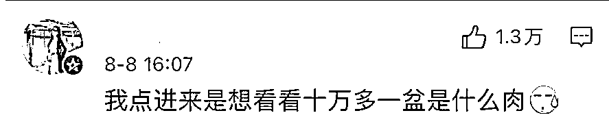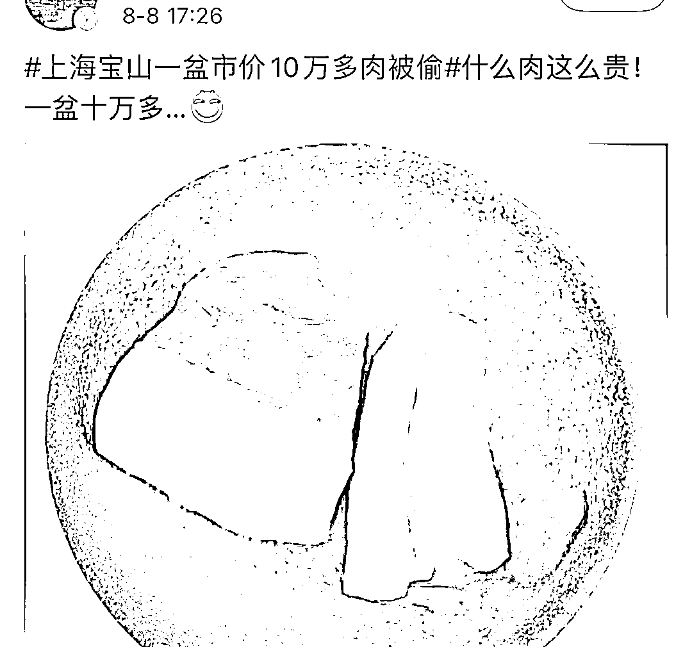

再仔细看一眼

哦，原来是多肉啊…

但是一盆植物也要十多万吗

真是我们见识浅薄了啊

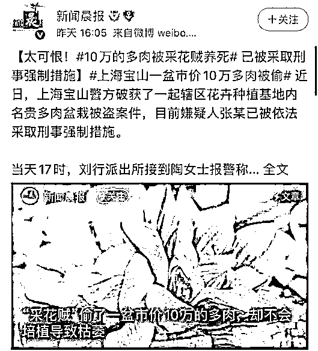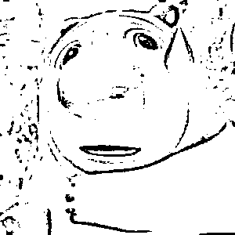

**宝山一男子偷走十万元多肉**

应该很多朋友都养过多肉吧

比较容易活，适合手残人们的尿性

而且特别容易移栽成活

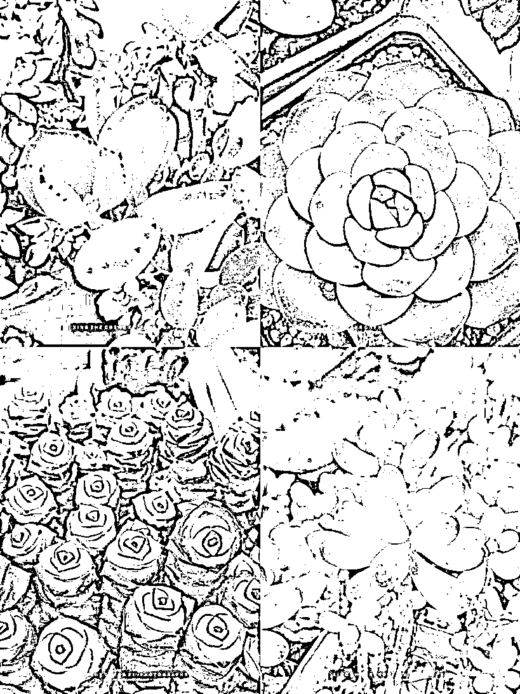

但是十万块的多肉

可就是知识盲区了…

最近，上海宝山一男子

在花卉苗木基地的花店

偷走多盆名贵多肉和招财树

而其中一盆市价 10 万元

就是它👇👇

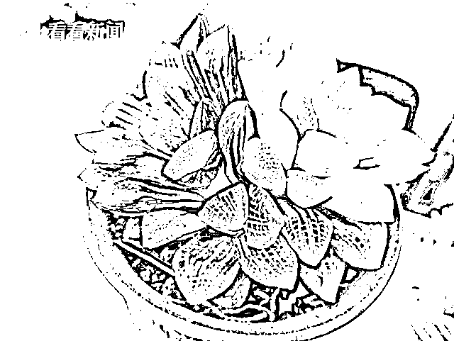

张某说自己没事的时候

就经常去那里购买植物

有次见对面的花店无人看管

就起了贼心悄悄走进该花店

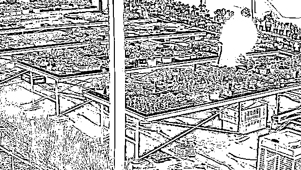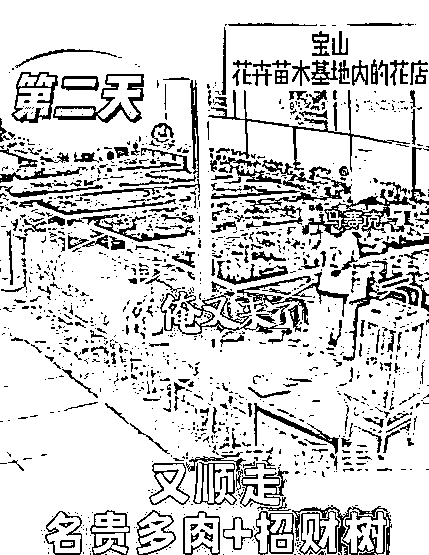

看到一盆十分漂亮的多肉

就把这盆多肉拿回车上了

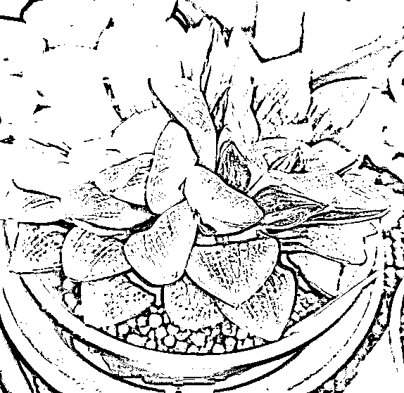

而被偷的多肉品类

属于**寿锦中的万华镜锦**

其中一株 20 公分双头母本

无论是大小还是品相都极其罕有

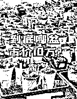

**上海一男子偷了盆多肉，市价竟高达 10 万元？**

 **[`v.qq.com/iframe/preview.html?width=500&height=375&auto=0&vid=e3351s04omp`](https://v.qq.com/iframe/preview.html?width=500&height=375&auto=0&vid=e3351s04omp)

&amp;amp;amp;amp;amp;amp;amp;amp;amp;amp;amp;amp;amp;amp;amp;amp;amp;amp;amp;amp;amp;amp;amp;amp;amp;amp;amp;amp;amp;amp;amp;amp;amp;amp;amp;amp;amp;amp;amp;amp;amp;amp;amp;amp;amp;amp;amp;amp;amp;amp;amp;amp;amp;amp;amp;amp;amp;amp;amp;amp;amp;amp;amp;amp;amp;amp;amp;amp;amp;amp;nbsp;&amp;amp;amp;amp;amp;amp;amp;amp;amp;amp;amp;amp;amp;amp;amp;amp;amp;amp;amp;amp;amp;amp;amp;amp;amp;amp;amp;amp;amp;amp;amp;amp;amp;amp;amp;amp;amp;amp;amp;amp;amp;amp;amp;amp;amp;amp;amp;amp;amp;amp;amp;amp;amp;amp;amp;amp;lt;mpchecktext contenteditable=&amp;amp;amp;amp;amp;amp;amp;amp;amp;amp;amp;amp;amp;amp;amp;amp;amp;amp;amp;amp;amp;amp;amp;amp;amp;amp;amp;amp;amp;amp;amp;amp;amp;amp;amp;amp;amp;amp;amp;amp;amp;amp;amp;amp;amp;quot;false&amp;amp;amp;amp;amp;amp;amp;amp;amp;amp;amp;amp;amp;amp;amp;amp;amp;amp;amp;amp;amp;amp;amp;amp;amp;amp;amp;amp;amp;amp;amp;amp;amp;amp;amp;amp;amp;amp;amp;amp;amp;amp;amp;amp;amp;quot; id=&amp;amp;amp;amp;amp;amp;amp;amp;amp;amp;amp;amp;amp;amp;amp;amp;amp;amp;amp;amp;amp;amp;amp;amp;amp;amp;amp;amp;amp;amp;amp;amp;amp;amp;amp;amp;amp;amp;amp;amp;amp;amp;amp;amp;amp;quot;1660921363498_0.673959932125513&amp;amp;amp;amp;amp;amp;amp;amp;amp;amp;amp;amp;amp;amp;amp;amp;amp;amp;amp;amp;amp;amp;amp;amp;amp;amp;amp;amp;amp;amp;amp;amp;amp;amp;amp;amp;amp;amp;amp;amp;amp;amp;amp;amp;amp;quot;&amp;amp;amp;amp;amp;amp;amp;amp;amp;amp;amp;amp;amp;amp;amp;amp;amp;amp;amp;amp;amp;amp;amp;amp;amp;amp;amp;amp;amp;amp;amp;amp;amp;amp;amp;amp;amp;amp;amp;amp;amp;amp;amp;amp;amp;amp;amp;amp;amp;amp;amp;amp;amp;amp;amp;amp;gt;&amp;amp;amp;amp;amp;amp;amp;amp;amp;amp;amp;amp;amp;amp;amp;amp;amp;amp;amp;amp;amp;amp;amp;amp;amp;amp;amp;amp;amp;amp;amp;amp;amp;amp;amp;amp;amp;amp;amp;amp;amp;amp;amp;amp;amp;amp;amp;amp;amp;amp;amp;amp;amp;amp;amp;amp;lt;/mpchecktext&amp;amp;amp;amp;amp;amp;amp;amp;amp;amp;amp;amp;amp;amp;amp;amp;amp;amp;amp;amp;amp;amp;amp;amp;amp;amp;amp;amp;amp;amp;amp;amp;amp;amp;amp;amp;amp;amp;amp;amp;amp;amp;amp;amp;amp;amp;amp;amp;amp;amp;amp;amp;amp;amp;amp;amp;gt;**

**视频来源：上观新闻**

****十万一盆的多肉长啥样啊？****

**当然，也有一些网友疑惑**

**多肉要这么贵？？**

**我的妈呀，这已经是奢侈品了吧…**

**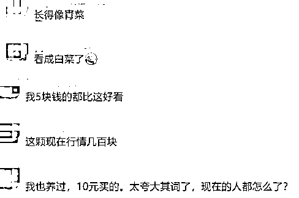**

**在网上搜了下**

**原来好点的多肉都这么贵的吗**

**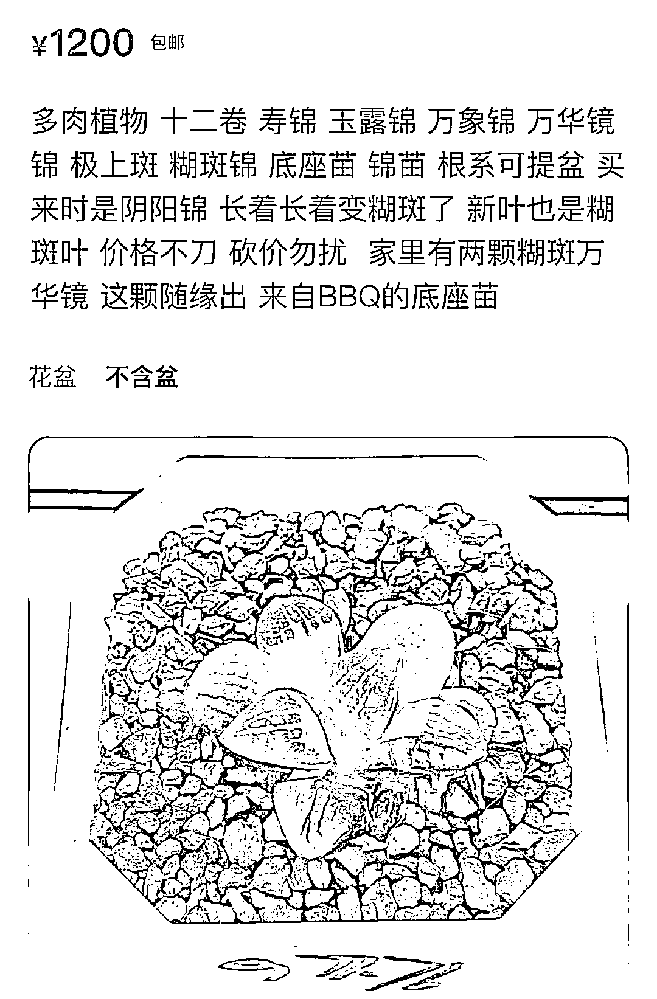****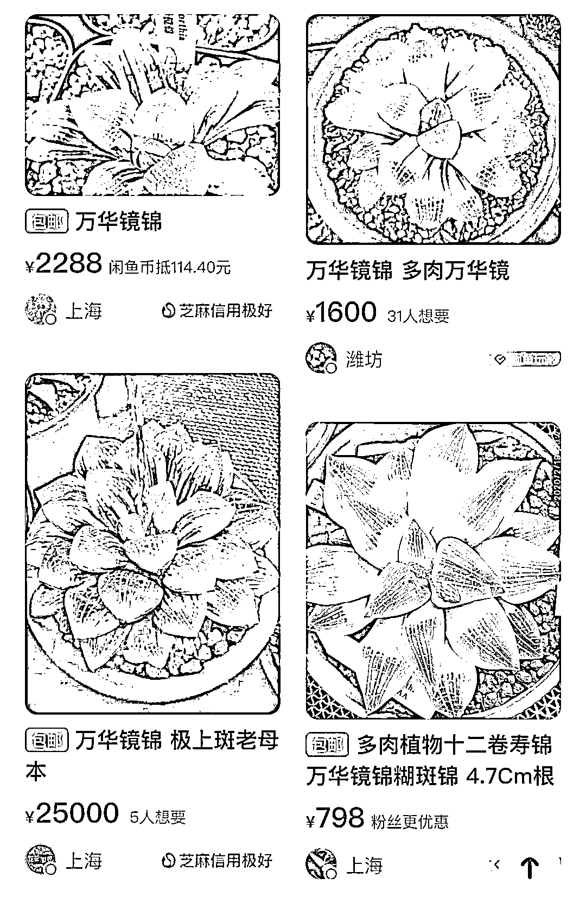**

**我记忆里都是**

**10 块一盆的那种…**

**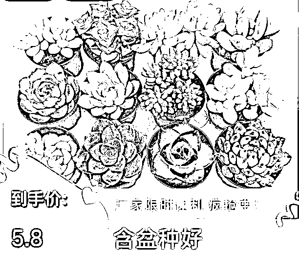******

**不过贵的看着**

**就很不一样啊哈哈哈**

**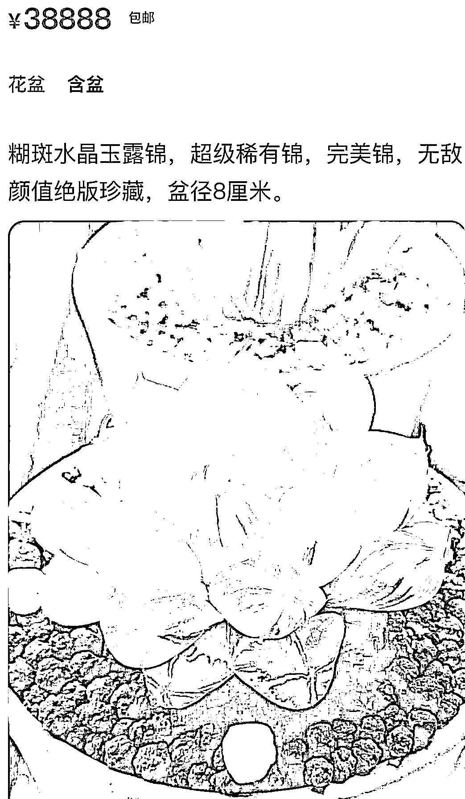****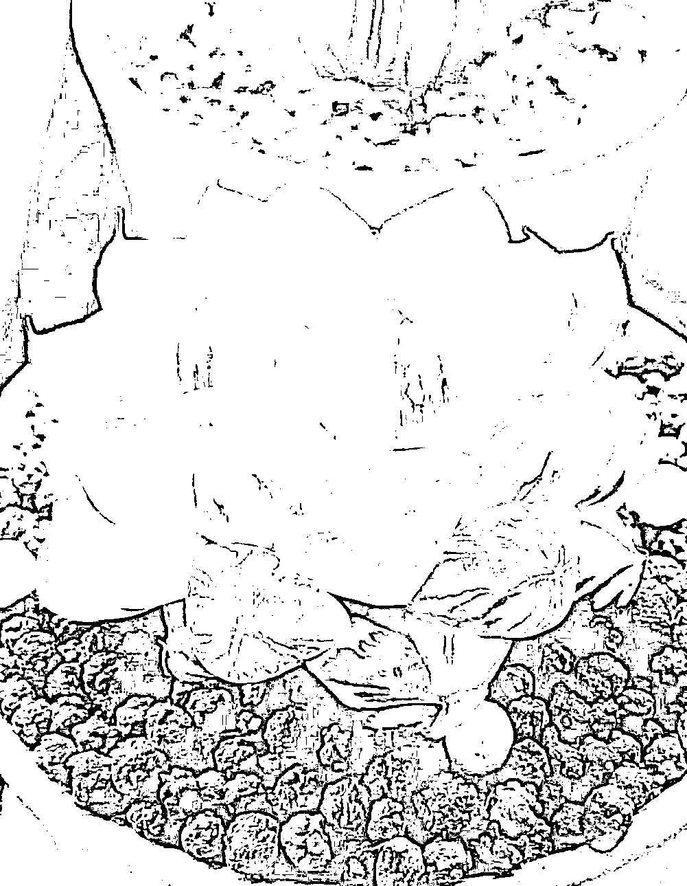**

**隔行如隔山啊**

**评论区有懂的朋友科普**

**听君一席话**

**如听一席话**

**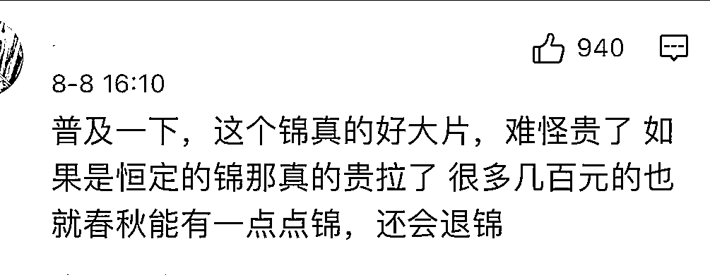****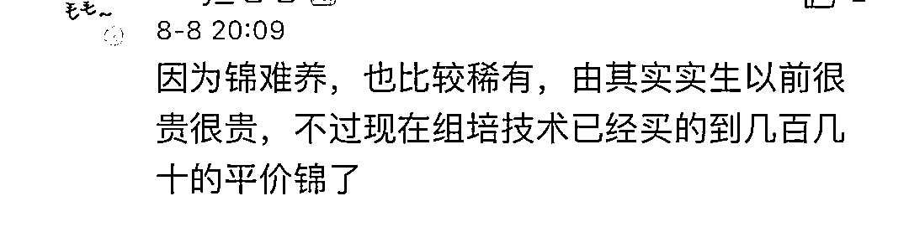**

**对多肉的价格**

**反正我是一个都看不懂**

**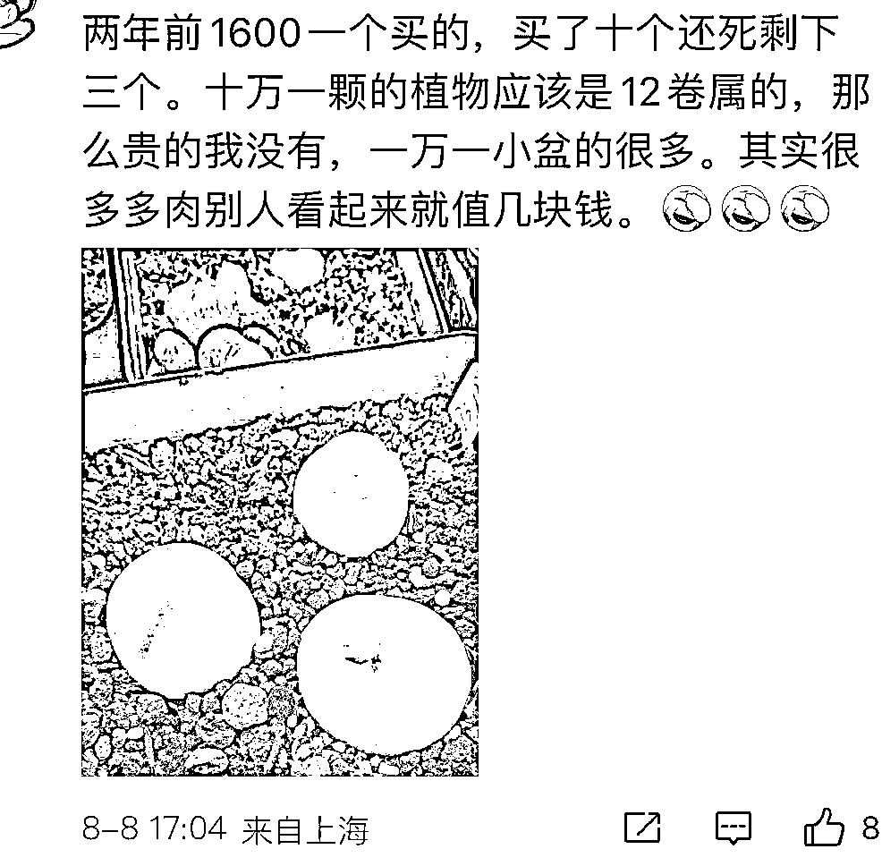**

**什么锦？什么挂？什么斑…**

**注定跟这 10 多万的多肉无缘**

**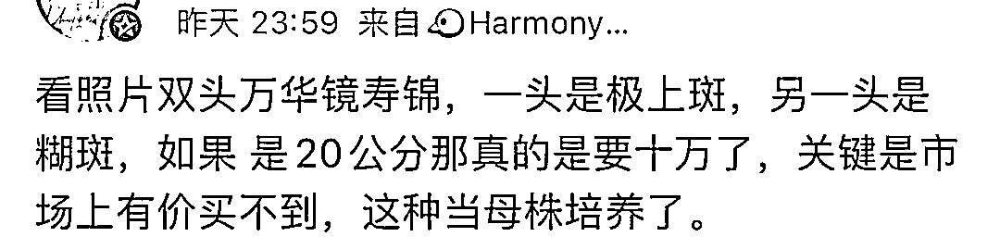****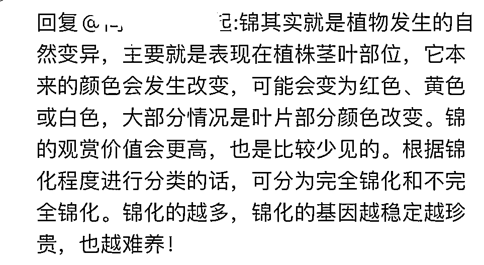******

**而由于嫌疑人偷回家又不会养**

**这盆多肉已枯萎无法救活**

**还真是，本来那么好看**

**现在变得像一把青菜…**

**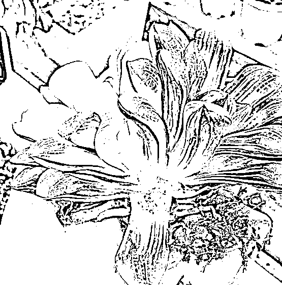**

**目前，涉事男子**

**已被依法采取刑事强制措施**

**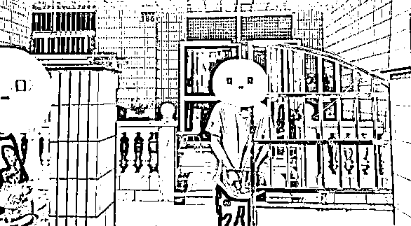**

**无论价格高低，偷盗肯定不对**

**你觉得好看自己买啊！**

**还开车，条件不差吧？？**

**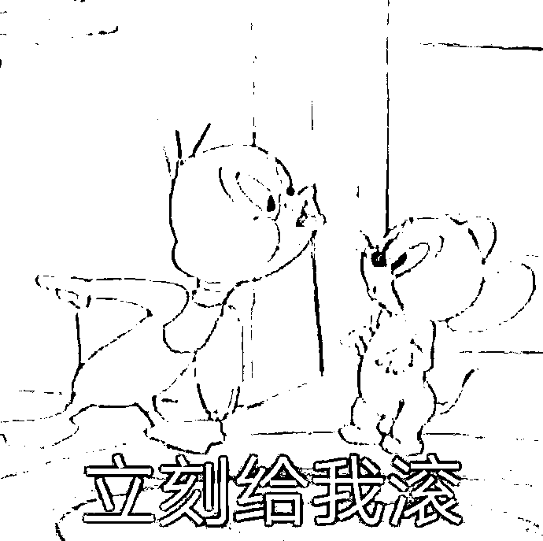**

**一偷偷个 10w 的锦**

**这抓到直接 GG 了呀**

**不过，这也是活该**

**好好的欣赏就欣赏**

**非要偷回家占为己有？**

****

 **来源:脊梁 in 上海 SH**

********

**← 向右滑动与灰产圈互动交流 →**

****