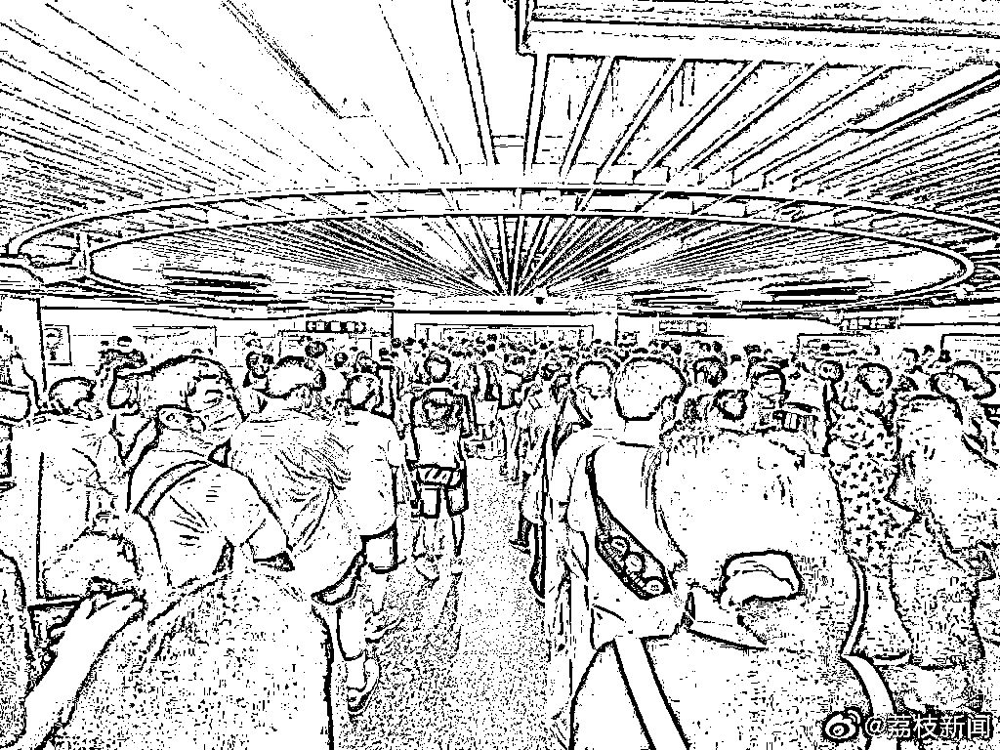
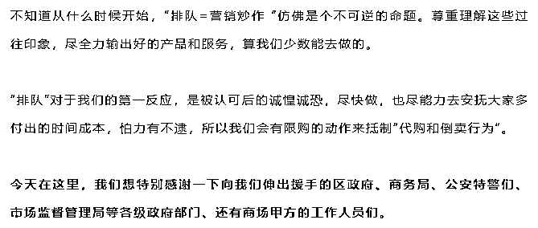

# 凌晨 4 点排队，黄牛代购 200 元一杯？茶颜回应！

> 原文：[`mp.weixin.qq.com/s?__biz=MzIyMDYwMTk0Mw==&mid=2247542363&idx=7&sn=b4893648a675ee8a5c34740e765faf76&chksm=97cbed63a0bc6475ba10b408d2903ff1129f15ae6a57ffec8a117d236397072e6274b31323c0&scene=27#wechat_redirect`](http://mp.weixin.qq.com/s?__biz=MzIyMDYwMTk0Mw==&mid=2247542363&idx=7&sn=b4893648a675ee8a5c34740e765faf76&chksm=97cbed63a0bc6475ba10b408d2903ff1129f15ae6a57ffec8a117d236397072e6274b31323c0&scene=27#wechat_redirect)

8 月 18 日

**茶颜悦色南京店两店同开**

开业当天两店都十分火爆

有大量的人在现场排队

奶茶 " 一杯难求 "

▲ 茶颜悦色门店前排起了长队  图源：江宁公安在线官方微博

▲ 图源：荔枝新闻

8 月 18 日

与奶茶店茶颜悦色相关的多个话题

冲上热搜榜

据江苏省广播电视总台荔枝新闻报道

一大早店面还没开门

门口已排起长队

**有人凌晨 4 点半就开始排队**

该奶茶店所在的商场表示

南京茶颜悦色于当日早上 9 点开业

**因人流量过大造成拥堵**

**大约半小时后暂停营业**

商场内的其他店铺仍正常营业中

▲ 南京茶颜悦色 IFCX 店宣布售罄 图源：紫牛新闻

据红星新闻消息

另一门店所在的景枫中心商场

客服人员表示，目前暂未接到关店通知

**中午时分仍有大量市民**

**顶着酷暑排队购买**

**“现在到店排队，至少需要排 4 个小时以上。”**

********

此外

部分交易平台挂出该奶茶代购代排服务

**代购价格集中在 200-300 上下**

至高可达 680 元

南京市市场监管局回应

**黄牛代购属违法行为，如遇可拨 110 报警**

闲鱼 APP 截图

稍早前，江宁公安在线官方微博发布通知称，“目前我区景枫商场新开业饮品店排队人员仍然较多，目前人员排队已至商场外。江宁警方已抽调警力协助商场维护秩序。户外炎热，排队人多，警方诚挚建议广大市民今日不要再来排队。**排队喝的水可以买很多杯饮品了。**”

▲ 江宁公安在线官方微博截图

江苏省消保委公众号也发文称，“当天（18 日）上午，南京消费发布提醒市民，**避免购买二手奶茶，气温炎热，放置时间较长，奶茶极易滋生细菌**，食品安全无小事！”

此次进驻南京是茶颜悦色

在湖南省外开拓的第三个市场

其此前已先后在武汉、重庆开店

今早，茶颜悦色官微表示 

**尊重理解这些过往印象**

**尽全力输出好的产品和服务**

**会有限购的动作来抵制“代购和倒卖行为“**

▲ 图源：茶颜悦色官方微信 

茶颜悦色工作人员表示

**不提倡去黄牛那里购买**

**坚决抵制这类危害市场秩序的行为**

**未来南京会开 5 家店**

**希望消费者理性消费**

▲ 营业告示牌 图源：茶颜悦色

根据网友 18 日发布的信息显示

茶颜悦色南京首店现场也有提示称

**拒绝购买倒卖奶茶**

“倒卖奶茶有风险，不要去花冤枉钱

错峰过来买奶茶，现喝安全又划算”

**对此，你怎么看？**

来源：综合荔枝新闻、扬子晚报·紫牛新闻、@江宁公安在线、@茶颜悦色、红星新闻等

← 向右滑动与灰产圈互动交流 →

