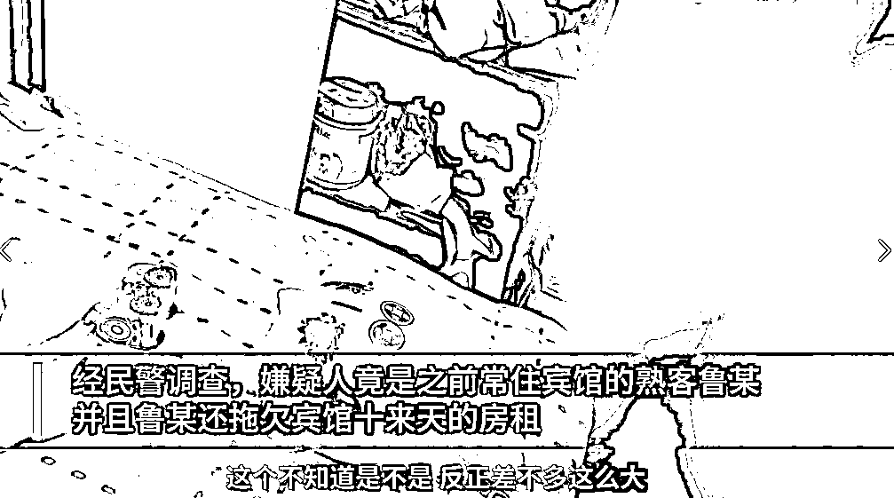
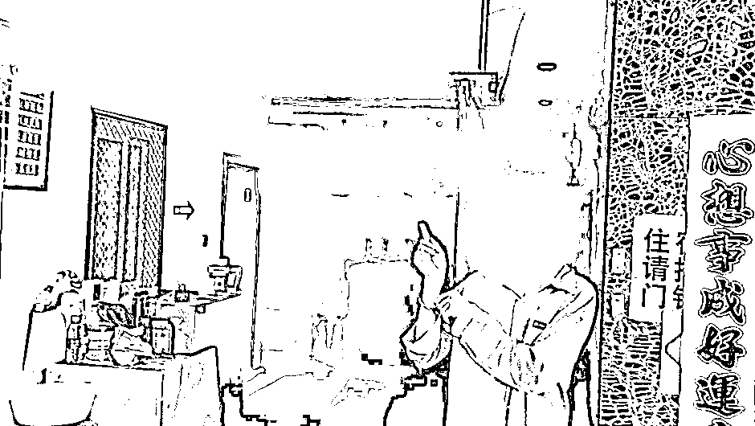
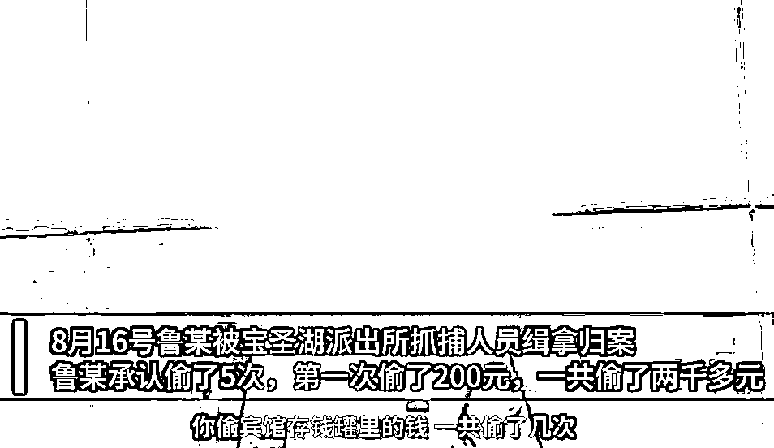
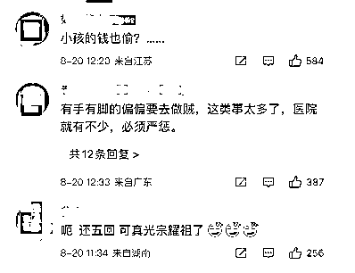
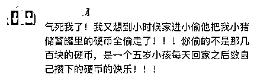
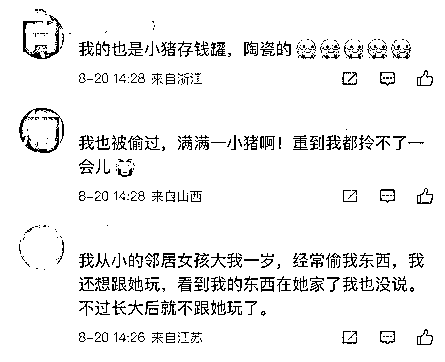
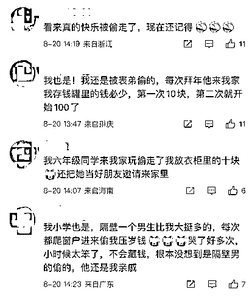
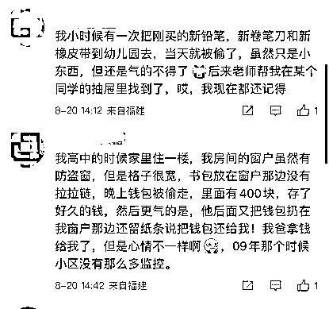
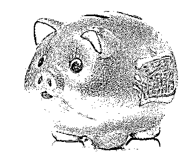

# 可耻！男子 5 次偷 1 岁孩子存钱罐

> 原文：[`mp.weixin.qq.com/s?__biz=MzIyMDYwMTk0Mw==&mid=2247542436&idx=3&sn=60afd5df4e9de80d62d99205992ab6d9&chksm=97cbed9ca0bc648a8e8e7933edbf91fb598aea31e83617bb0e193b5c7a4aa9ea272b1ee9d711&scene=27#wechat_redirect`](http://mp.weixin.qq.com/s?__biz=MzIyMDYwMTk0Mw==&mid=2247542436&idx=3&sn=60afd5df4e9de80d62d99205992ab6d9&chksm=97cbed9ca0bc648a8e8e7933edbf91fb598aea31e83617bb0e193b5c7a4aa9ea272b1ee9d711&scene=27#wechat_redirect)

“我震惊了，万万没想到。” 

[`mp.weixin.qq.com/mp/readtemplate?t=pages/video_player_tmpl&action=mpvideo&auto=0&vid=wxv_2539845138253234178`](https://mp.weixin.qq.com/mp/readtemplate?t=pages/video_player_tmpl&action=mpvideo&auto=0&vid=wxv_2539845138253234178)

近日在重庆

一宾馆老板娘报警称 

自己 1 岁孩子存钱罐里的钱

被人偷走了

经民警调查

小偷是老板娘宾馆里的常客

并且已经拖欠宾馆十来天房租

该男子被抓后

承认自己一共偷窃了五次

第一次偷了两百

五次一共偷了两千多元

看来偷窃金额也是越来越多

民警问他为什么

不一次性把钱拿完

嫌疑人说

根本没有想过一次性都拿走

够他上网吧就行

网友调侃：

自己连一岁的小孩子都不如

一岁小孩子的存钱罐

已经有了那么多钱

第一次偷了两百没有被发现 

后面就越偷越多

如果这次老板娘没有发现

相信这名嫌疑人还会继续行窃

还有网友表示：

真的太丢人了

连一岁孩子的钱都偷

更是激起了部分网友的

回忆杀：
他偷的不是钱 

而是小孩子的快乐

评论下面 

无数人跟帖回复

回忆小时候也有过类似的经历

其实 

小孩子对钱又有什么概念呢

就像网友说的

真正被偷走的

是童年的快乐

小时候每到过年

就把零钱塞进存钱罐

有纸币也有钢镚

然后再把存钱罐藏起来

时不时地翻出来看看钱有没有少

就这样

存钱罐陪伴了大家整个童年

是大部分八零九零后的记忆 

家家户户的

谁当年还没有一只小金猪呢

你小时候的存钱罐

长啥样？

来源：央视网综合新华社、@平安渝北

